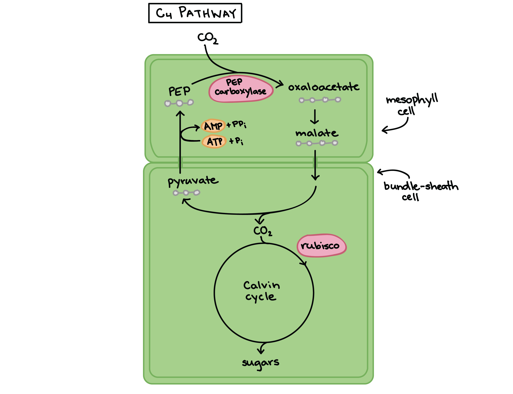
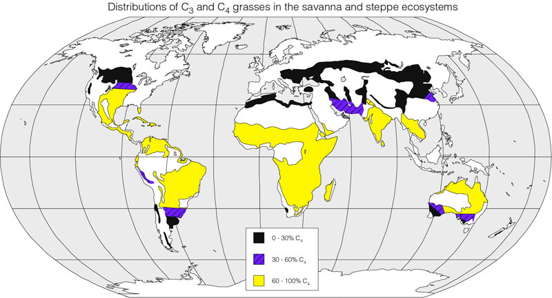
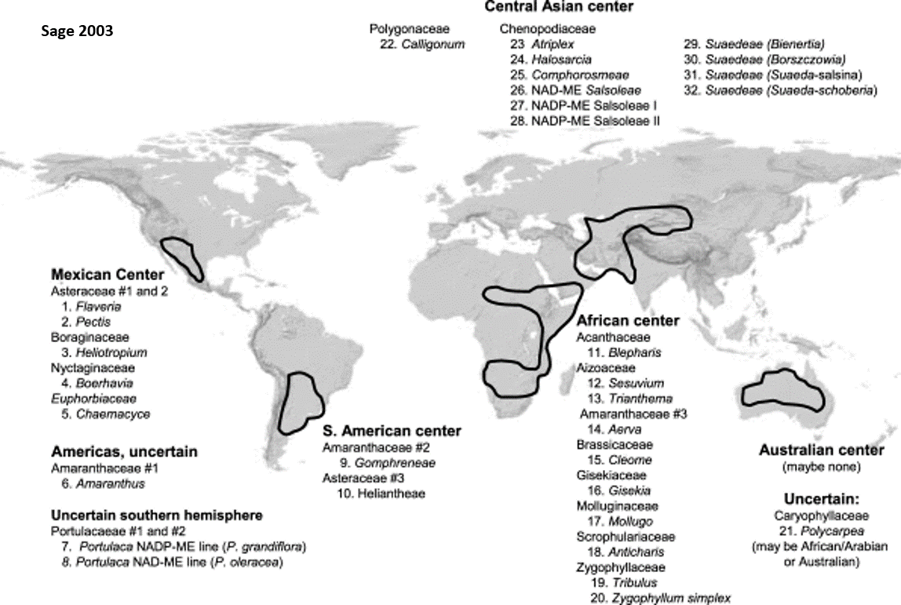
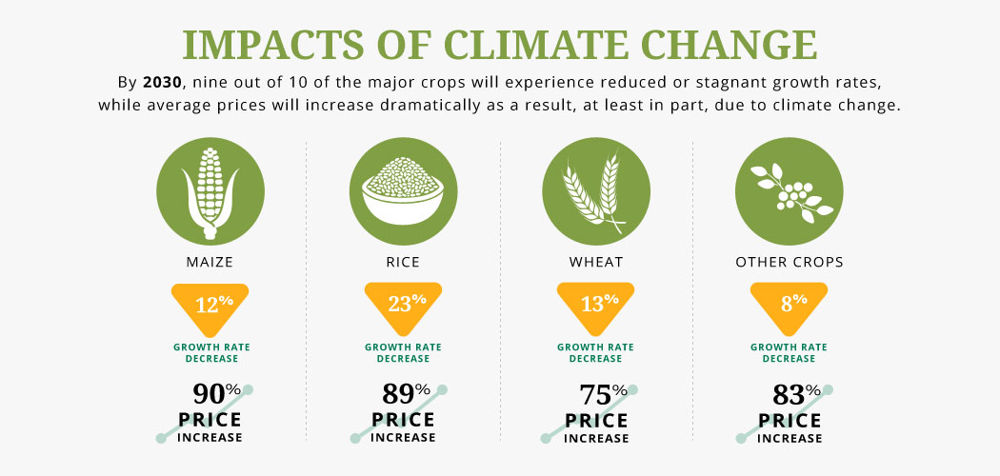

## Evolution of C4 photosynthesis

 
 
 
 

* **Calvin cycle moved to *Bundle Sheath Cells* surrounding leaf veins**
    * chloroplasts now present

 
 

* **BSC cells are less permeable to gases**
    * what does this mean for photorespiration?

## 

## C4 plants concentrate CO~2~ around Rubisco *spatially*

 
 
 

* **C4 mechanism separates Calvin cycle from high O~2~**

 

* **New enzyme, phosphoenolpyruvate carboxlylase (PEPC)**
    * fixes CO~2~ to PEP (no affinity for O~2~)
    * new 4C malate pumped to bundle sheath cells
    * malate broken down to release CO~2~

 

* **Hyper efficient with use of CO~2~**
    * How does this impact stomata behavior?

## C4 is turbo-charged from of photosynthesis

 

* **Most productive C4 plants have rates ~50% higher than C3 plants**
    + evolved independently ~70 times

 
    
* **Of ~435,000 plant species, only 2% are C4**
    + 3 of top 10 crop plants are C4
    + extremely rare in trees (1 family)
    
 

* **C4 plants still account for 25% of productivity**

## Why is C4 photosynthesis not dominant?

 
 
 
 

* **Regeneration of PEP expensive (ATP)**
    + in addition to ATP needed for Calvin cycle
 
 
 
* **Where is needed ATP generated?**

 

* **Where should C4 plants live**
    * efficiency vs dehydration
    

##

 In hot conditions, the benefits of reduced photorespiration likely exceed the ATP cost of moving CO~2~ from the mesophyll cell to the bundle-sheath cell 

## C4 photosynthesis: Evolved many times

## Why are there no C4 trees?

## 

<!-- ## Evolution of CAM photosynthesis (C4 pathway w/out BSC) -->
<!-- 
 -->

<!--  -->

<!-- ## CAM concentrates CO~2~ around Rubisco *temporally* -->
<!-- 
 -->
<!--   -->
<!--   -->
<!--   -->

<!-- 
 -->

<!-- * **Stomata open at night only** -->

<!--   -->

<!-- * **4C compounds produced in large quantities** -->
<!--     + stored when Rubisco is inactive -->

<!--   -->

<!-- * **C4 vs CAM** -->
<!--     * substitute BSC for "night shift" -->

<!-- 
 -->

<!--  -->

<!-- ## Yes we CAM!! -->
<!-- 
 -->
<!--   -->
<!--   -->
<!--   -->

<!--  -->

<!-- 
 -->
<!-- * **CAM evolved independently several times** -->
<!--     + ~16,000 species -->

<!--   -->

<!-- * **Exist in arid environments or habitats** -->
<!--     * cacti -->
<!--     * epiphytes -->

<!--   -->

<!-- * **Are CAM plants fast or slow growing?** -->
<!-- 
 -->

<!-- ## C3 vs C4 vs CAM: Know advantages/disadvantages of each -->
<!-- 
 -->

<!--  -->

## Why does this matter to you...

 
 

* **C4 plants are economically important**
    * corn, sugarcane, sorghum & switchgrass

 

* **So are C3 crops**
    * beans, rice, wheat, potatoes (temperate crops)

 

* **Global water use is set to triple by 2050**
    * 70%  to the agriculture sector
    * 50% transpired through stomatal pores

##

## Can science TUNE photosynthesis?

 
 
 
 

Although it is unrealistic to expect an engineering solution to entirely eliminate the wastes of photorespiration indicated above, the scale of these wastes indicates that even a marginal improvement could translate to significant gains in productivity and crop value Walker et al. 2016

iciency of photorespiration could be improved in a way that reduces total loss by only 5%, the result would be an additional 68 million bushels of soybean and 23 million bushels of wheat annually under current atmospheric conditions. These additional bushels of soybean and wheat would have a value of almost $540 million

* **↑ efficiency of Rubisco in crops**

 

* **Redesign to mask photorespiration**

 

* **Turning C3 crops to C4...**
    * https://c4rice.com/

