## Atmospheric CO~2~ varies across geologic time

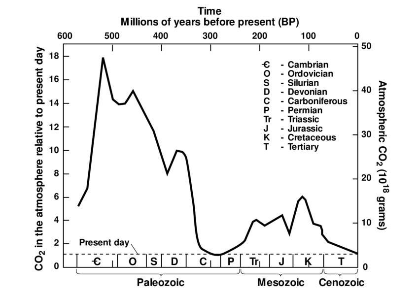

* **CO~2~ ranged 180 - 4000 ppm in last 500 million years**

 

* **The photorespiration problem was not as bad 500mya when life comes on to land**
    + the drawdown of CO~2~ starting when land plants evolve is pretty clear

 

* **Large decline in CO~2~ last 30 million years**

 

* **O~2~ levels started increasing (from 10%) starting 500 mya**
    + What does this mean for the current efficiency of C3 photosynthesis?

## New photosynthetic pathways evolved recently (~30 mya)

 

* **Rubisco has existed for billions of years**
    + evolved when O~2~ was negligible in the atmosphere
    + mutations have yet to produce a superior version of the enzyme for the environment to select

 

* **Plants can do nothing about CO~2~ nor 0~2~ concentrations in the air**

 

* **C3 plants keep stomata open during the data, allowing gas exchange, while losing H~2~0**
    + balance of CO~2~ in, H~2~O out is poor due to rubisco

 

**Alternative solution 1: Compartmentalize rubisco and concentrate CO~2~**
 
**Alternate solution 2: Open stomata at night when evaporative water loss is lower**

<!-- 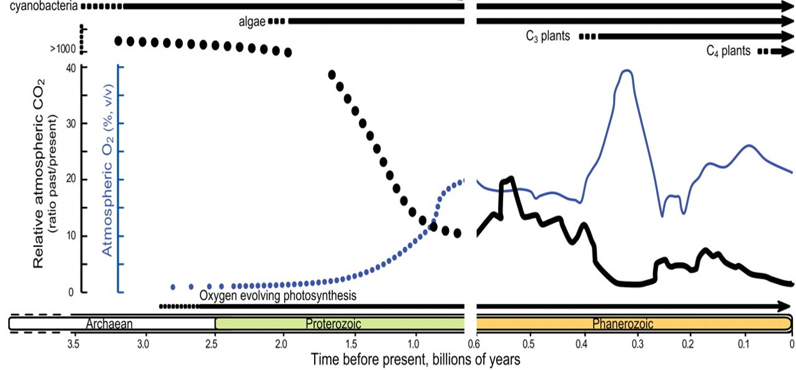 -->

## Evolution of C4 photosynthesis

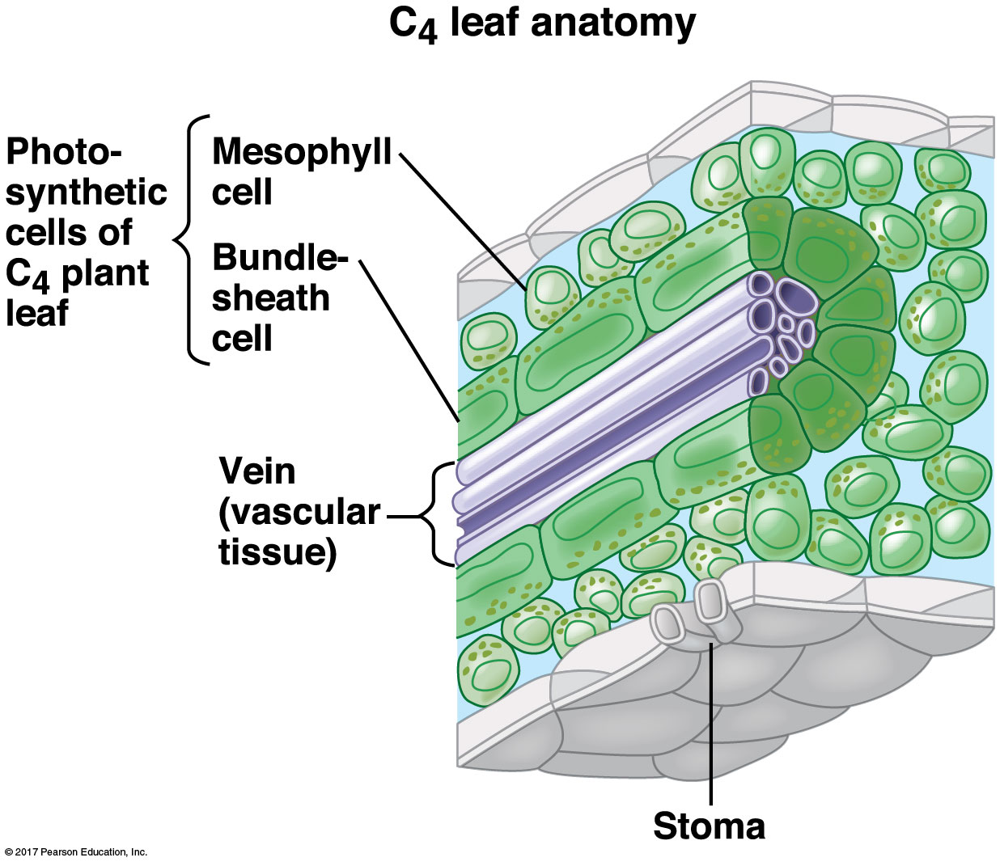

* **Calvin cycle moved to *Bundle Sheath Cells* surrounding leaf veins**
    * some chloroplasts moved inside bundle sheath cells
    * **Brainstorm**: How/When would mutations/genes be involved?

 

* **BSC cells are less permeable to gases**
    * what does this mean for photorespiration?

 

* **Ring cell arrangement = Kranz Anatomy**
    + bundle sheath cells surround veins
    + mesophyll cells surround bundle sheath cells

## 

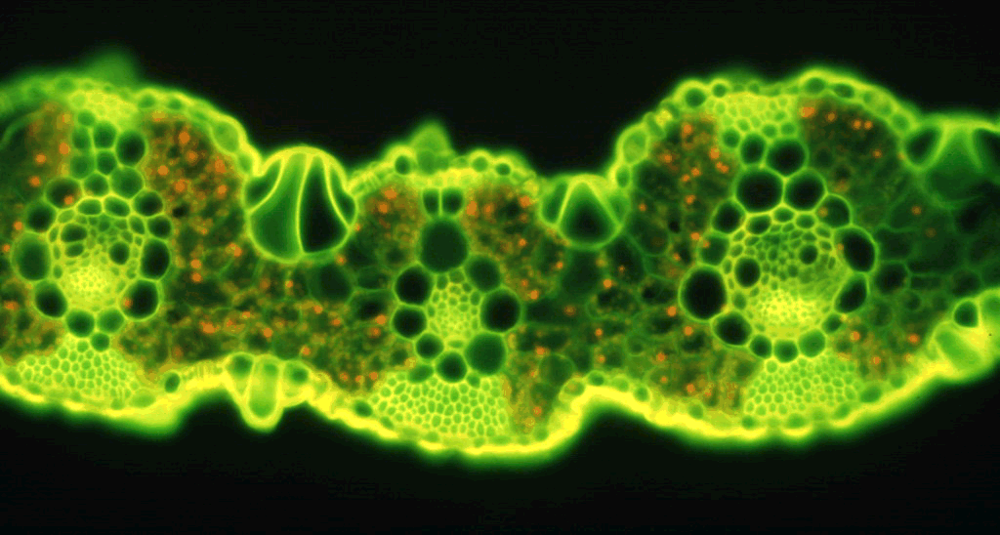

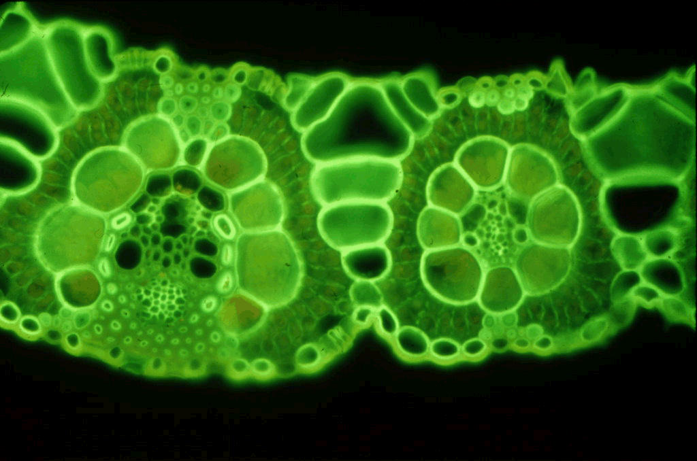

## C4 plants concentrate CO~2~ around Rubisco *spatially*

* **New C4 pathway separates Calvin cycle from high O~2~**

 

* **C4 pathway: New enzyme, phosphoenolpyruvate carboxlylase (PEPC) fixes CO~2~ to PEP (0 affinity for O~2~) to make malate (4C)**
    + C4 pathway occurs in mesophyll cell chloroplasts
    + malate sent to bundle sheath cells via plasmodesmata

 

* **Malate broken down to release CO~2~ inside bundle sheath cells**
    + C3 pathway in bundle sheath cell chloroplasts
    + Calvin cycle (C3) runs with only CO~2 present

 

* **Hyper efficient with use of CO~2~**
    * BRAINSTORM: How does this impact stomatal behavior?

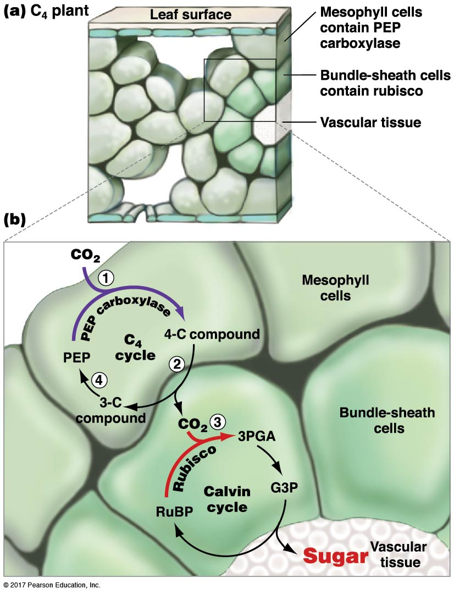

## C4 is a turbo-charged form of photosynthesis

 
 
 

* **Most productive C4 plants have rates ~50% higher than C3 plants**
    + C4 evolved independently ~70 times

 
    
* **~435,000 plant species, only *2%* are C4**
    + 3 of top 10 crop plants are C4
    + extremely rare in trees (1 family)
    
 

* **C4 plants still account for 25% of productivity**
    

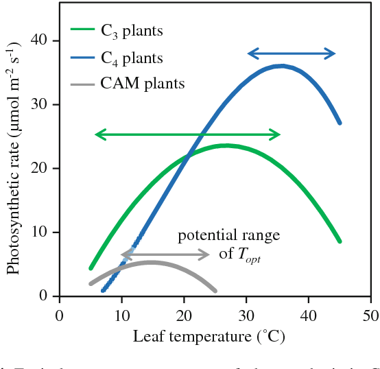

## Why is C4 photosynthesis not dominant?

 
 
 

* **Regeneration of PEP expensive (ATP)**
    + in addition to ATP needed for Calvin cycle
 
 
 
* **Where is needed ATP generated?**
    + high light requirements also means hotter/drier

 

* **Where should C4 plants live??**
    + efficiency vs dehydration for stomata
    + should be able to outcompete C3 plants

<!--   -->

<!-- * **Brainstorm: Why is C4 non-existent in trees?** -->
    

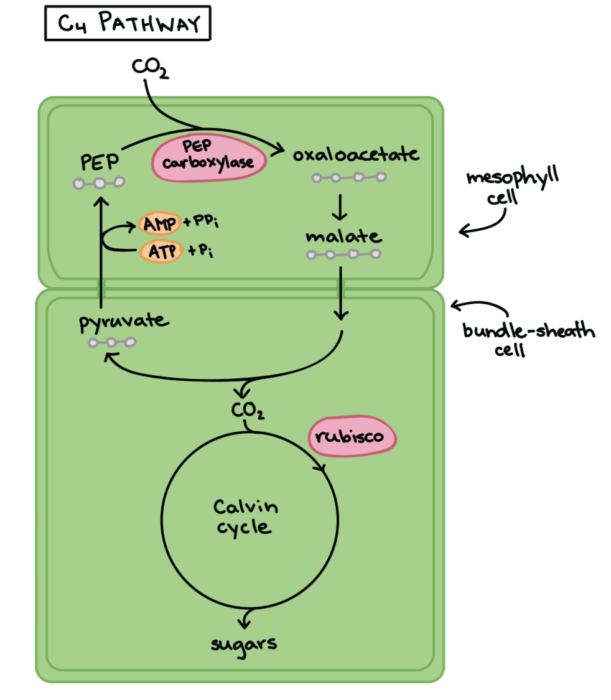

##
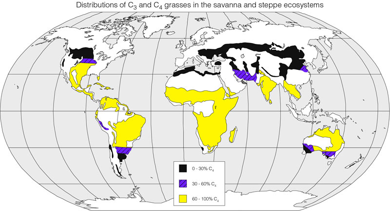

 In hot conditions, the benefits of reduced photorespiration likely exceed the ATP cost of moving CO~2~ from the mesophyll cell to the bundle-sheath cell 

## C4 photosynthesis: Evolved independently 60-70 times

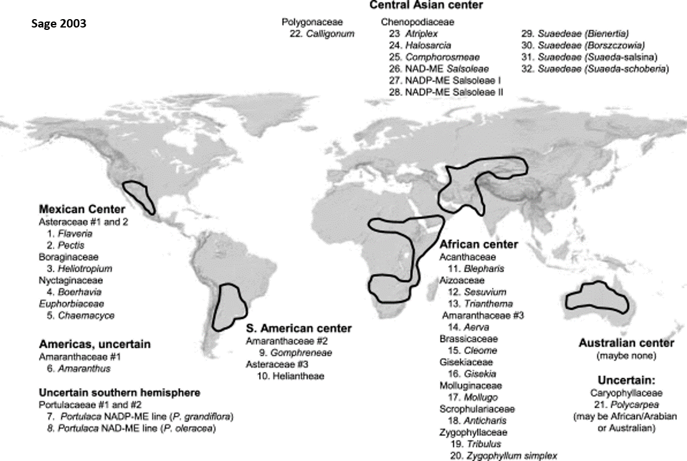

## C4 vs C3 vs principles of evolution

 
 

* **Recruitment of enzymes into new functions**

 

* **Massive shifts in distribution of parts**
    + proteins and organelles

 

* **Anatomical modifications to cell structure**
    + vein structure

 

* **Predict: In what type of plants would this most likely occur?**

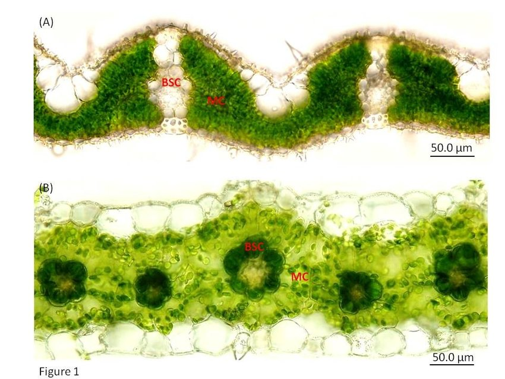

## Why are there virtually no C4 trees?

 

* **Is it difficult for trees to transition from C4&rarr;C4?**
    + long generation times

 

* **Why do C4 shrubs not evolve into C4 trees?**
    + they should have improved growth...

 

* **Was shade a problem?**
    + some Hawaiian C4 trees live in understory

 

* **C4 plants seem to have an issue growing tall**
    + ATP requirements of larger plants...

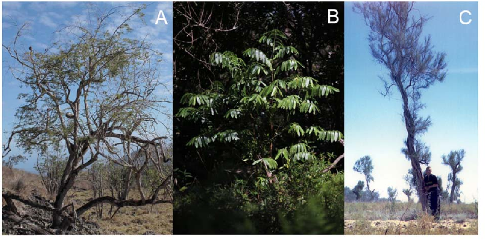

## Why C4 matters to you: Water-use-efficiency

 

* **Climate change impacts photosynthesis:**
    + &uarr; CO~2~
    + &uarr; temperatures
    + variable precipitation
    + variations in humidity

 

* **C4 plants can make the same amount of sugars as C3, with less water usage**
    + *more CO~2~ assimilated per molecule of water loss*
    + ability to keep stomata closed more often
    
 

* **C3 & C4 plants should both benefit from extra CO~2~**
    + only works in C3 if enough H~2~0

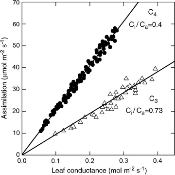

## Why C4 matters to you: Crops

 
 
 

* **C4 plants are economically important**
    * corn, sugarcane, sorghum & switchgrass

 

* **So are C3 crops**
    * beans, rice, wheat, potatoes (temperate crops)

 

* **Global water use is set to triple by 2050**
    * 70%  to the agriculture sector
    * 50% transpired through stomata

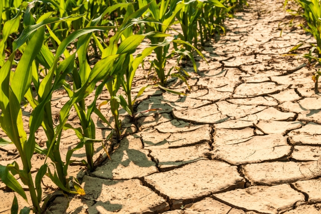

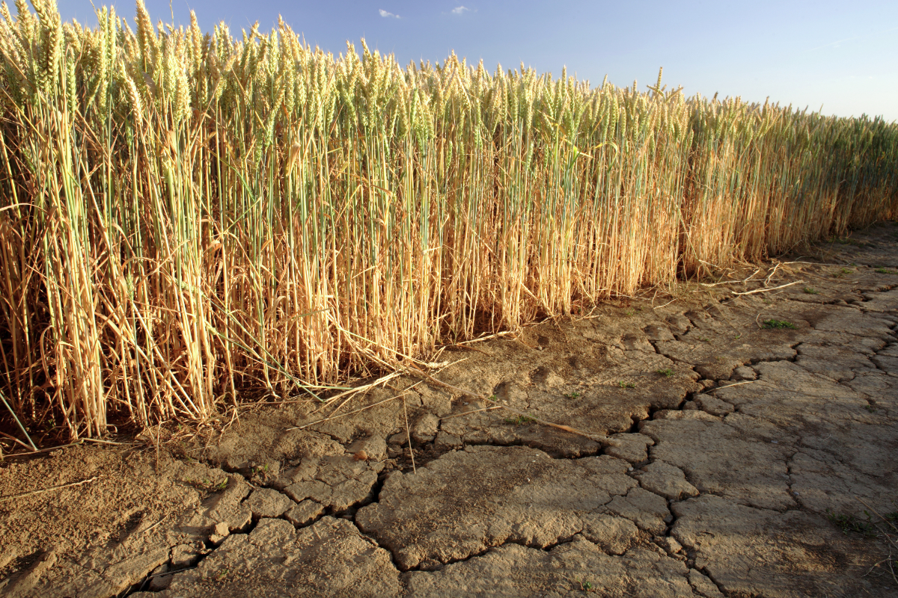

## Evolution of CAM photosynthesis (C4 pathway w/out BSC)

 

**Crassulacean acid metabolism (CAM) is an adatpation that improves conservation of water while still allowing photosynthesis**

 

**Metabolic pathway almost identical to C4 pathway but without structural modifications**

 

**Malate created from PEP and CO~2~, simply allowed to accumulate**

 

**Difference is with stomatal behavior**

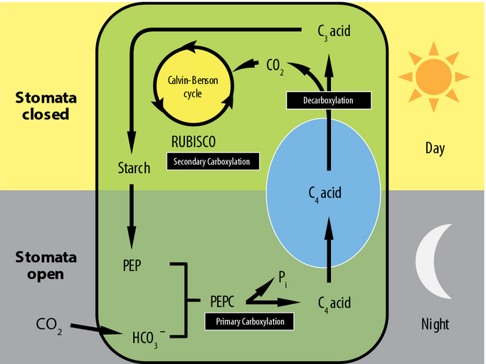

## CAM concentrates CO~2~ around Rubisco *temporally*

* **Stomata open at night only**
    + malate produced in large quantities
        + CO~2~ (stomata) + PEP
    + malate stored when Rubisco is inactive

 

* **C4 vs CAM = substitute function of bundle sheath cell (C4) for "night shift"**
 
  
 
* **Calvin cycle needs ATP, NADPH from light reactions but they are not stable enough to be stored for 'night shift'**

 

* **Stomata close during day (no CO~2~, O~2~ in) but stored malate (night shift) is broken down to release CO~2~**

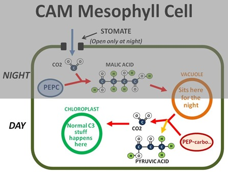

## Yes we CAM!!

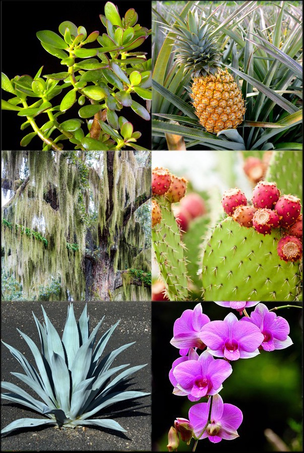

* **CAM evolved independently several times**
    + ~16,000 species

 

* **Exist in arid environments or habitats**
    * cacti
    * epiphytes

 

* **CAM is not very efficient, released CO~2~ is used up within first few hours of daylight**
    + survival (harsher environments) over productivity

 

* **Are CAM plants fast or slow growing?**
 
* **Should CAM plants have many or few stomata?**

## C3 vs C4 vs CAM: Know advantages/disadvantages of each

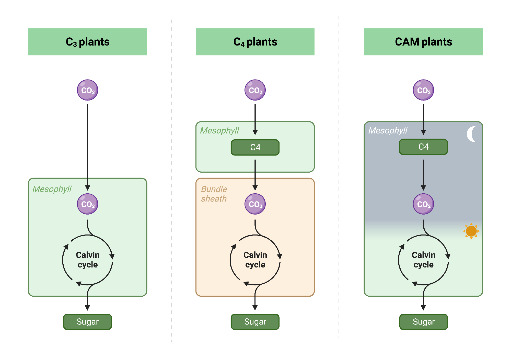

## 

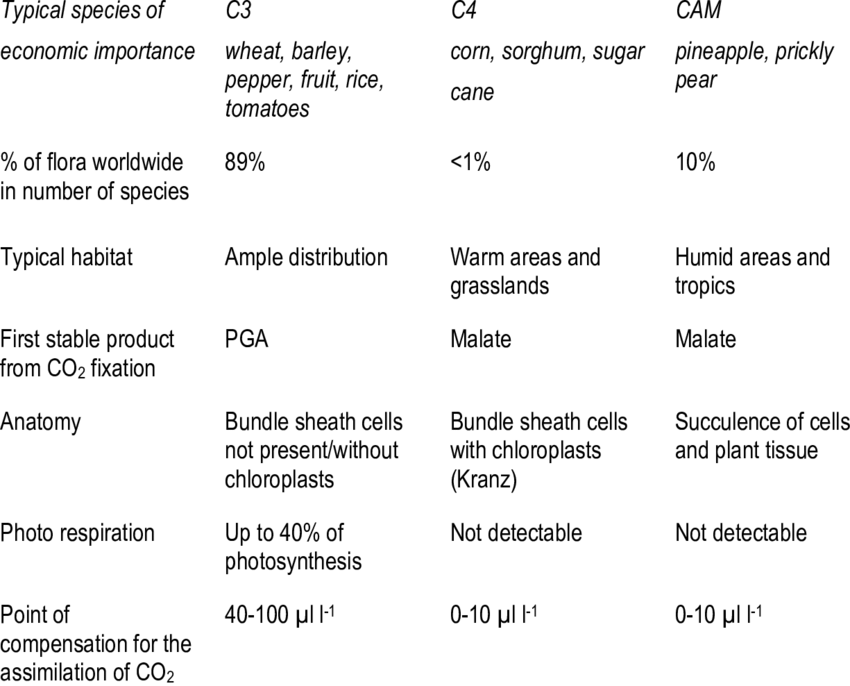
