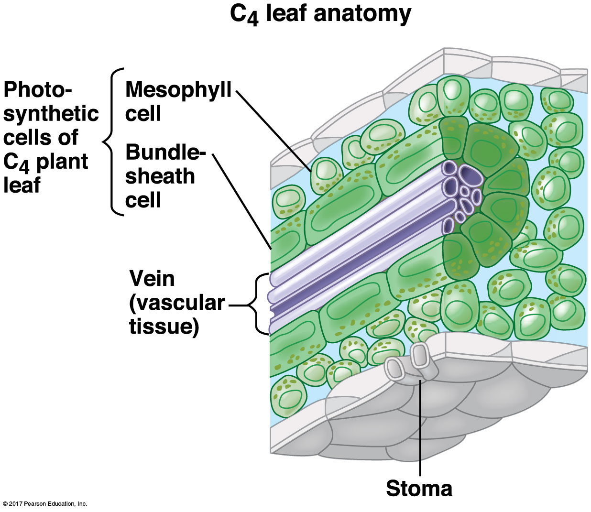

## Atmospheric CO~2~ varies across geologic time

 

* **CO~2~ ranged 180 - 4000 ppm in last 500 million years**

 

* **CO~2~ changes impact living things via photosynthesis**
    + primary source of energy in food chain
    + large evolutionary selection pressure

 

* **Large decline in CO~2~ last 30 million years**

 

* **What does this mean for the current efficiency of C3 photosynthesis?**

## New pathways evolved ~30 MYA

## 

## Evolution of C4 photosynthesis

 
 
 
 

* **Calvin cycle moved to *Bundle Sheath Cells* surrounding leaf veins**
    * chloroplasts now present

 
 

* **BSC cells are less permeable to gases**
    * what does this mean for photorespiration?

## C4 plants concentrate CO~2~ around Rubisco *spatially*

 
 

* **C4 mechanism separates Calvin cycle from high O~2~**
    + 2 compartments

 

* **New enzyme, phosphoenolpyruvate carboxlylase (PEPC)**
    * fixes CO~2~ to PEP (no affinity for O~2~)
    * new 4C malate pumped to bundle sheath cells
    * malate broken down to release CO~2~

 

* **Hyper efficient with use of CO~2~**
    * How does this impact stomata behavior?

## C4 is turbo-charged from of photosynthesis

 
 
 

* **Most productive C4 plants have rates ~50% higher than C3 plants**
    + evolved independently ~70 times

 
    
* **~435,000 plant species, only *2%* are C4**
    + 3 of top 10 crop plants are C4
    + extremely rare in trees (1 family)
    
 

* **C4 plants still account for 25% of productivity**

## Why is C4 photosynthesis not dominant?

 
 
 
 

* **Regeneration of PEP expensive (ATP)**
    + in addition to ATP needed for Calvin cycle
 
 
 
* **Where is needed ATP generated?**

 

* **Where should C4 plants live**
    * efficiency vs dehydration
    

##

 In hot conditions, the benefits of reduced photorespiration likely exceed the ATP cost of moving CO~2~ from the mesophyll cell to the bundle-sheath cell 

## C4 photosynthesis: Evolved independently 60-70 times

## C4 vs C3 vs principles of evolution

 
 

* **Recruitment of enzymes into new functions**

 

* **Massive shifts in distribution of parts**
    + proteins and organelles

 

* **Anatomical modifications to cell structure**
    + vein structure

 

* **Predict: In what type of plants would this most likely occur?**

## Why are there virtually no C4 trees?

 

* **Is it difficult for trees to transition from C4&rarr;C4?**
    + long generation times

 

* **Why do C4 shrubs not evolve into C4 trees?**
    + they should have improved growth...

 

* **Was shade a problem?**
    + some Hawaiian C4 trees live in understory

 

* **C4 plants seem to have an issue growing tall...**

## Why C4 matters to you: Water-use-efficiency

 

* **Climate change impacts photosynthesis:**
    + &uarr; CO~2~
    + &uarr; temperatures
    + variable precipitation
    + variations in humidity

 

* **C4 plants can make the same amount of sugars as C3, with less water usage**
    + *more CO~2~ assimilated per molecule of water loss*
    + ability to keep stomata closed more often
    
 

* **C3 & C4 plants should both benefit from extra CO~2~**
    + only works in C3 if enough H~2~0

## Why C4 matters to you: Crops

 
 
 

* **C4 plants are economically important**
    * corn, sugarcane, sorghum & switchgrass

 

* **So are C3 crops**
    * beans, rice, wheat, potatoes (temperate crops)

 

* **Global water use is set to triple by 2050**
    * 70%  to the agriculture sector
    * 50% transpired through stomata

##

## Can science TUNE photosynthesis?

 
 

* **Eliminating photorespirtion is unrealistic** 
    + can we *tweak* Rubisco?
    
 

* **Small improvement = huge gains in crop yield**

 

* **5% reduction = extra 68 million bushels of soybean**
    + 23 million bushels of wheat       
    + $540 million value (Walker et al. 2016)

## Can science TUNE photosynthesis?

## Genome work on C4 plants already underway

<!-- ## Special Topics lecture: C4 rice project -->
<!-- 
 -->

<!--  -->

<!-- ## Evolution of CAM photosynthesis (C4 pathway w/out BSC) -->
<!-- 
 -->

<!--  -->

<!-- ## CAM concentrates CO~2~ around Rubisco *temporally* -->
<!-- 
 -->
<!--   -->
<!--   -->
<!--   -->

<!-- 
 -->

<!-- * **Stomata open at night only** -->

<!--   -->

<!-- * **4C compounds produced in large quantities** -->
<!--     + stored when Rubisco is inactive -->

<!--   -->

<!-- * **C4 vs CAM** -->
<!--     * substitute BSC for "night shift" -->

<!-- 
 -->

<!--  -->

<!-- ## Yes we CAM!! -->
<!-- 
 -->
<!--   -->
<!--   -->
<!--   -->

<!--  -->

<!-- 
 -->
<!-- * **CAM evolved independently several times** -->
<!--     + ~16,000 species -->

<!--   -->

<!-- * **Exist in arid environments or habitats** -->
<!--     * cacti -->
<!--     * epiphytes -->

<!--   -->

<!-- * **Are CAM plants fast or slow growing?** -->
<!-- 
 -->

<!-- ## C3 vs C4 vs CAM: Know advantages/disadvantages of each -->
<!-- 
 -->

<!--  -->