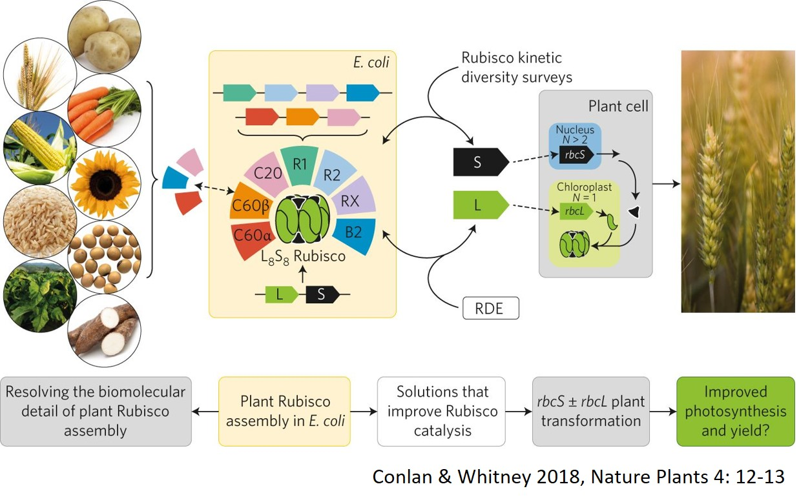
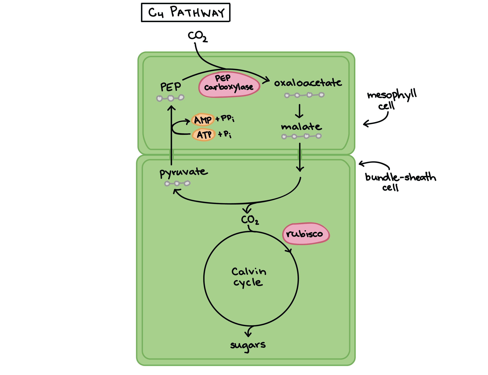

## Why Bioengineer Photosynthesis?

- **Growing global population and climate change threaten food security**
    + there is limited land to grow more groups

 

- **C3 crops (e.g., rice, wheat, soybean) are limited by photorespiration, inefficient carbon fixation, and inefficient water use**
    + all made worse under climate change factors (heat and drought)

 
 

- **Improving photosynthesis is a promising strategy for increasing crop yield and resilience**
    + Bioengineering photosynthesis is a frontier for sustainable agriculture

<!-- ## Can science TUNE photosynthesis? -->
<!-- 
 -->

<!--  -->

## The Problem with C3 Photosynthesis: Review

- **Rubisco, the key enzyme, can bind O~2~ instead of CO~2~, especially under heat and drought**
    + leads to *photorespiration* – a wasteful process that reduces yield
    + forces stomata to be open more = more water loss
    + reduces carbon fixation

 

- **C3 plants lack mechanisms to concentrate CO~2~ around Rubisco**

 

* **Eliminating photorespiration as a process is unrealistic** 
    + but can we *tweak* Rubisco or other processes?

## Why Bioengineer Photosynthesis?

 
 

* **Any improvement = huge gains in crop yield**

 

* **5% reduction in photorespiration = **
    + extra 68 million bushels of soybean
    + extra 23 million bushels of wheat       
    + $540 million value (Walker et al. 2016)
 
 
 
* **C3 crops can lose 10-40% of yield due to water related stress**
    + water is transpired at a rate of hundreds of molecules per one CO~2~ fixed
    

## Approaches to Photosynthesis Engineering are Complex

 

**1-Photorespiration produces a toxic byproduct called *glycolate*, which wastes energy to detoxify**
 
*Engineeer new metabolic pathways (from bacteria or algae) into the plant's chloroplasts to quickly recycle glycolate into useful products*

 

**2-Rubisco has a higher affinity for O~2~ than CO~2~ and is also slow**
 
*Modify Rubisco’s structure or assemble Rubisco from cyanobacteria or algae that have better kinetic properties*

 

**3-The dilemma of stomatal behavior limits photosynthesis**
 
*Introduce PEPC and nocturnal CO~2~ fixation pathways (via CAM pathway)*

 

**4-The messy structure of C3 leaf anatomy is inefficient in supplying light and CO~2~**
 
*Alter regulatory genes for mesophyll density, vein spacing, intercellular air space, or stomatal distribution*
 
*Alter regulatory genes that control Kranz anatomy (C4) and express C4 enzymes in the right cell types*

## Is C4 Photosynthesis the Cure?

 

- **C4 plants (e.g., maize, sugarcane) spatially separate CO~2~ fixation and the Calvin cycle**

 

- **CO~2~ is first fixed in mesophyll cells (via PEPC), then shuttled to bundle sheath cells where the Calvin cycle occurs**
    + reduces photorespiration and increases efficiency (CO~2~ released, O2 kept out)
    + especially in hot, dry environments.

 

- **C4 plants can have up to 50% higher photosynthetic rates under high light, heat, and drought compared to C3 plants**
    + use about half as much water to fix the same amount of carbon

## The C4 Rice Project

 

- **C4 rice is a flagship project, with potential for higher yields and reduced water use**
    + https://c4rice.com/

 

- **Goal: Introduce C4 traits into rice (a C3 crop) to increase photosynthetic efficiency**
    + Focus areas: installing Kranz anatomy, expressing C4 enzymes
    + Challenges: complex genetic regulation and developmental changes

 

- **Understanding photosynthetic anatomy and genetics is key to the next breakthroughs**

## It is time for a .....

**Understanding photosynthetic anatomy and genetics is key to the next breakthroughs.**

