## Poisonous and Allergy Plants

## Cultural History of Poisonous Plants

 

* **Identifying poisonous plants accompanies finding edible plants in ancient foraging societies**
    + utilized to capture prey
    + 'toxic' from Greek 'toxikon' = arrow poison
    
 

* **Ebers Papyrus list plant toxins known to Egyptians**
    + agents of war
    + capital punishment
      
 

* **Renaissance age in Europe was full of renowned 'poisoner's who rose to power**

 

* **Thousands of plants known to contain poisons**
    + many in our backyards!
    

## Poisonous Plants in the Wild: Curare

* **Curare is arrow poison used by S. American tribes**
    + causes quick paralysis
    
 

* **Over 70 species, from different tribes,used to make curare**
    
 

* **Blocks nerve impulses at the junction of nerve and muscle**
    + turbocurarine eventually isolated
    + used in surgery because effects reversible

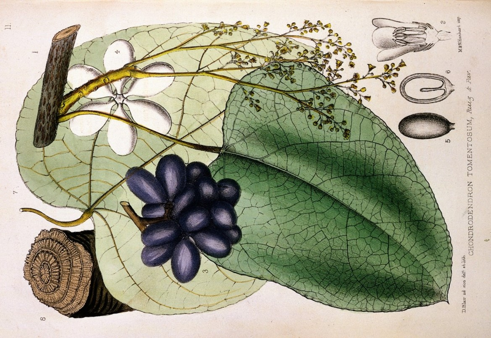

## Curare: How to make a poison dart

https://www.youtube.com/watch?v=uzpXZX39Eb4
    
## Backyard Poisonous Plants 

* **Many common landscape plants are poisonous or fatal!**
    + often to children
    
 

* **Oleander has more then 50 toxic compounds**
    + planted in CA & southern states
    + hot dogs roasted on sticks can be fatal

 

* **Yews (*Taxus* spp.) can lead to respiratory or cardiac failure**
    + grown as hedges
    
 

* **Rhododendron/Azaleas have poisonous leaves**
    + tea made from leaves, flowers, pollen can be deadly
    + Delaware Indians used tea as suicide potion
    + blocks nervous regulation of heart
    

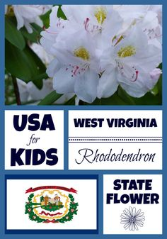

## Backyard Poisonous Plants: Ricin

* **Spruge family (*Euphorbiaceae*) contains poison milky sap**
    + Poinsettia, crown of thorns, pencil tree cactus

 

* **Castor bean (*Ricin communis*) has deadly toxic seeds**
    + ingestion of 1 seed can kill a child
    
 

* **Toxic protein *ricin* inhibits protein synthesis in the intestinal wall**
    + causes clumping of red blood cells
    + symptoms are nasty
    + symptoms do not develope for hours or days!
    + most deadly natural poison known
    
  
 
* **Poison cigarette in Breaking Bad**
    

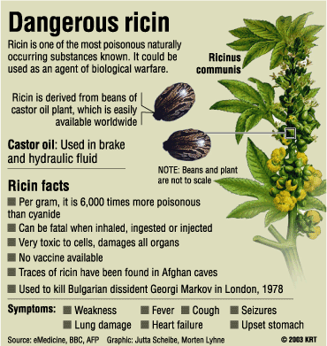

## Poisonous Plants to Livestock

 

* **Numerous plants poisonous to sheep and cattle**
    + can be passed to humans (milk)

 

* **White snakeroot impacted settlements west of Appalachian mtns**
    + all plant parts contain toxic alcohol tremetol
    + cattle ingestion lead to 'trembles'
    + human who drink milk had similar symptoms
    + blocks breakdown of lactic acid in liver
    
 

* **Milk vetches (locoweeds) toxic to horse, sheep, goats & cattle**
    + widespread in western US
    + contain alkaloids that impact CNS
    + lead to paralysis

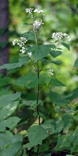

## Plants that Cause Mechanical Injury

 

* **Plants can puncture with spines, thorns, prickles, burrs or hairs**

 

* **In cacti, spins are modified leaves!**
   + wards off animal predation
   + can be barbed or not barbed

 

* **Some plants have 'stinging hairs' that also inject chemical irritants**
    + Stinging nettle family
    + hollow hairs like syringe
    + strangely also edible
    

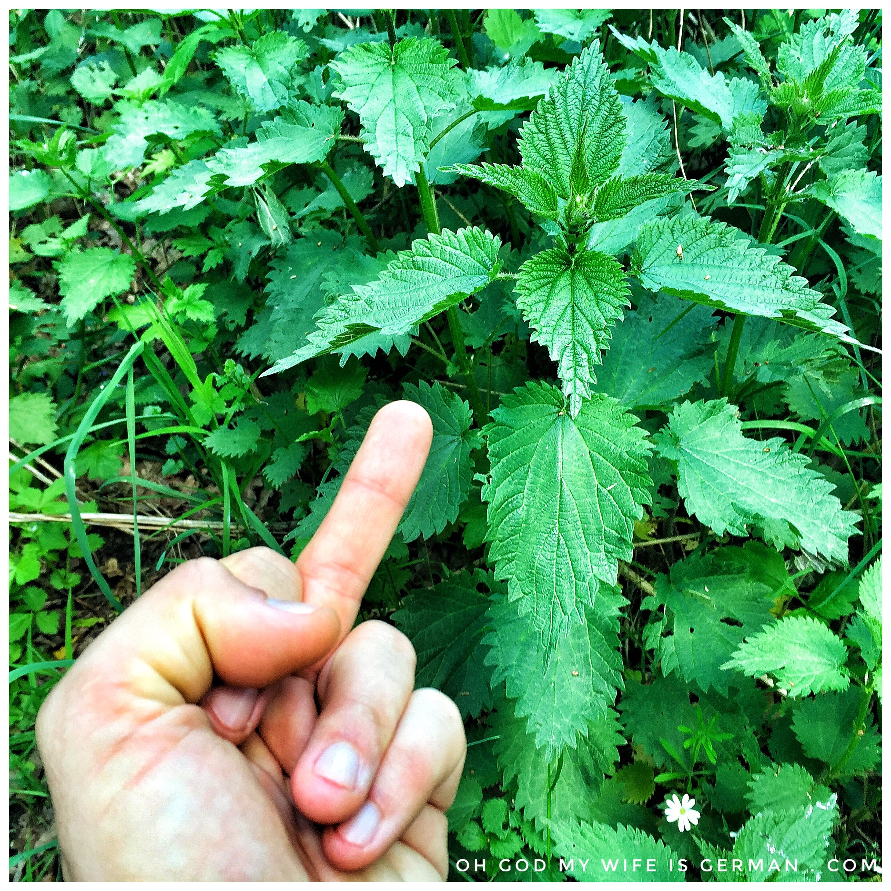
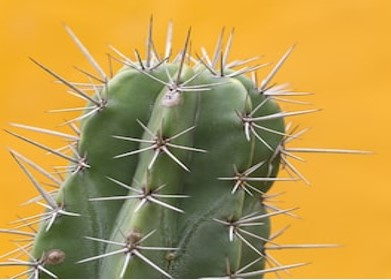
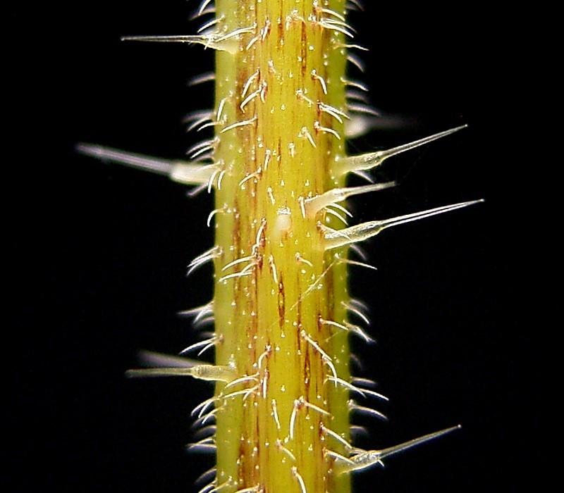

## Insecticides from Plants

* **Review: plants produce many secondary compounds**
    + many reduce palatability for insects
    
 

* **Pest chemical defenses: bitter, toxic or alter life cycle **
    + these 'poisons' can be harnessed by humans
    
 

* **Pyrethrum = made from *Chrysanthemum* flower**
    + nerve poison for household insects
    + common in flea medications
    + may bioaccumulate in streams

 

* **Rotenone = roots from tropical legumes**
    + nervous system paralysis in fish
    + used by indigenous peoples to catch fish
    + common garden insecticide

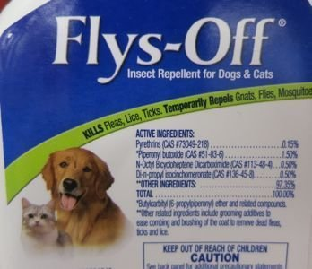

## Allergy Plants

 

* **Certain plants or plant parts are capable of causing allergic conditions to sensitive individuals**

 

* **Reactions considered hypersensitive reactions**
    + immune systems differentiates 'non-self'
    + produce immune response
  
 
  
* **Multiple pathways for allergies**
    + respiratory from pollen
    + skins reactions to oils/resins
    + food allergies

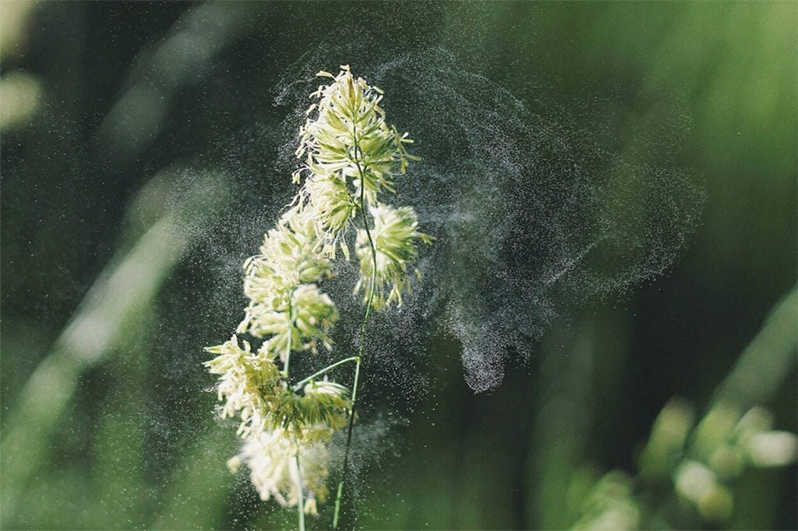

## Respiratory Allergies: Hay Fever Plants

 

* **~20% of humans suffer significant allergies**
    + hay fever and asthma most common

 

* **Hay fever: respiratory reactions to pollen**
    + mild symptoms but long lasting
    + 17 million visits to physician each year

 

* **Plants causing hay fever are wind-pollinated**
    + abundant amounts of small pollen
    
     
   
* **Glycoproteins, allergenic pollen proteins**
    + proteins trigger growth of pollen tube
    + trigger immune response in humans
    

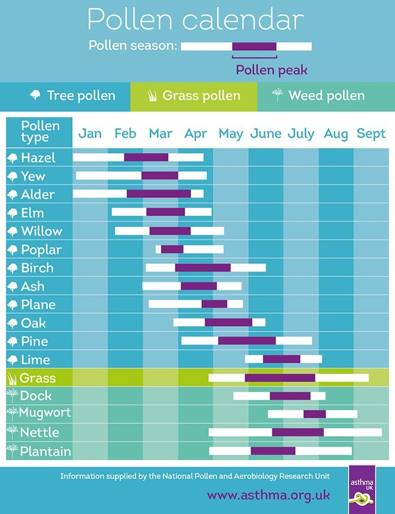

## Respiratory Allergies: Ragweed

 
 

* **Ragweed, *Ambrosia* spp, most notorious hay fever plant**
    + annual or perennial herbs
    + name means "food of the gods"

 

* **1,000's of small flowers release 1 billion pollen grains**
    + release August - September
    + may be longer in southern states
    + 1 million tons of pollen each year

 

* **Invasive and spreading in Europe**
    + introduced on grain shipments after WW1
    

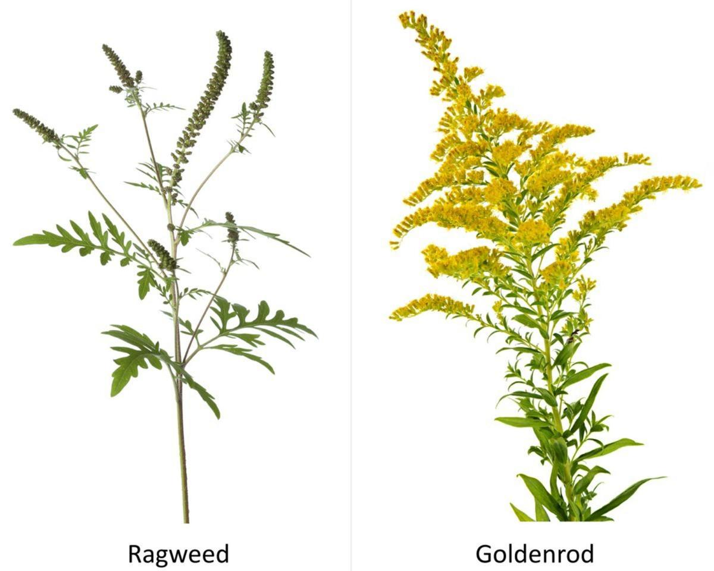

## Climate Change and Hay Fever Plants

 

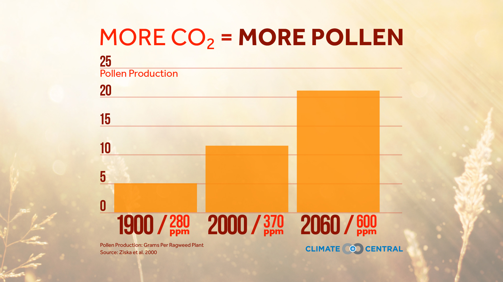

* **Increasing temperatures alter growing seasons for plants**
    + spring-flowering plants most sensitive

 

* **May trigger earlier starts to pollen season**
    + may also increase pollen amounts

 

* **Elevated CO~2~ experiments show increase growth of ragweed**
    + higher pollen production
    + study found increase in allergenic proteins
    + later frost dates increase ragweed season

## Contact Dermatitis

* **Allergic reaction of skin to something touched**
    + delayed hypersensitivity

 

* **Poison ivy, *Toxicodendron readicans*, cashew family**
    + widespread in US & Canada
    + leaves alternate w/ 3 leaflets
    + leaf margins show several forms
    + 1 of every 2 people allergic

 

* **Poison oak & sumac less widespread**

 

* **Urushiol, a resin, is allergen**
    + slight bruising of leafs releases resin
    + binds to skin proteins rapidly

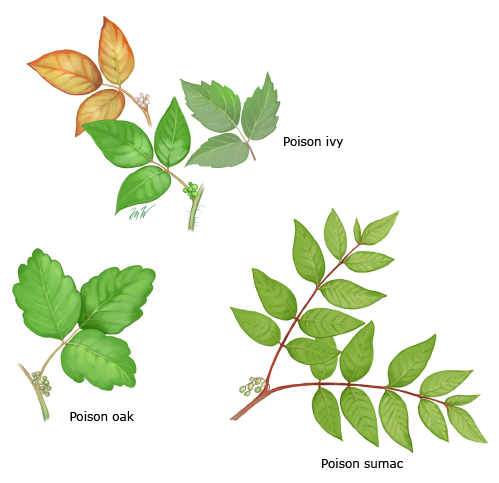

## Food Allergies

* **~4% of US population suffers from food allergies**
    + greatest in children under 3
    + 100's of foods cause reactions
    
 
 
* **Symptoms are wide-ranging**
    + diagnosis difficult

 

* **Peanut most important allergen as most commonly involved in anaphylaxis**
   + food packages indicate common allergens
   
 

* **Can GMO's have hidden allergens?**
    + soybean w/ gene from Brazil nut
    + StarLink corn
    

## Latex Allergies

* **Latex is a milky exudate produced by many plants**
    + hydrocarbons, alkaloids, resins, terpenes

 

    
* **Natural source of rubber, Hevea brasiliensis**
    + hydrocarbons w/ elastic properites

 

    
* **Natural rubber latex found in gloves, tubing & medical supplies**
    + 70% of rubber synthetic but natural superior

 

* **~4% of population allergic to latex**
    + symptoms from hives to inflammation
    + companies focus on low-allergen latex

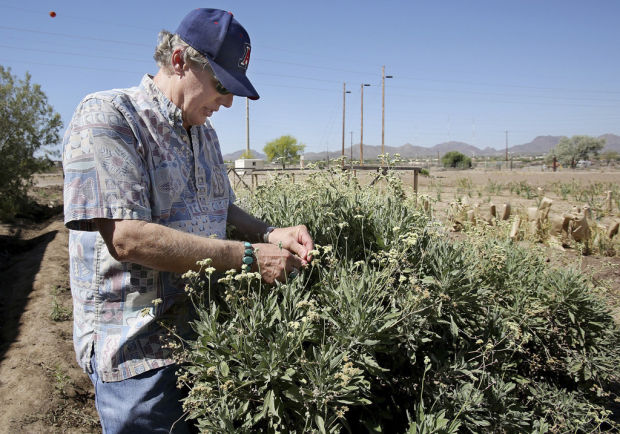

