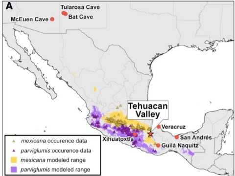

## *Homo sapiens* have been around for 300,000 years

 
 

* **Survived mostly as foragers or hunter-gatherers**
    + thorough knowledge of local botany
    
 

* **10,000 years ago: foraging to farming**
    
 

* **Agriculture arose in several places**

 

* **Farming = basis of advanced civilizations**
    + old and new worlds
    
## Foraging Societies

 

* **Foragers gather food provided by nature**
    + still practiced by indigenous cultures
    + https://youtu.be/Pro6X_Kc5wA
    
 

* **Selected for bipedalism in the *Homo* genus?**
    + or brain size increases?

 

* **Does NOT imply a vegetarian diet**
    + Arctic Inuits = only meat
    + Hadza of Tanzania = vegetarian
    + !Kung of S. Africa = plants, eggs, fish, meat

## How Native Americans are fighting a food crisis

https://gather.film/

## Early Foragers

 

* **Fossil evidence reveals the diets of early foragers**
    + charred seeds & preserved fruits
    + bones, shells & feathers

 
    
* **Coprolites: fossilized poop!**
    + pollen forensics

 

* **Tool remains and cave drawings reveal meat diet**

 

* **17,000 years ago: Wadi-Kubbaaniya in Nile Valley**
    + 25 plant species
    + tubers of grasses with high starch
    + plants needed to be 'processed'

## Modern Foragers

 

* **Evidence from key modern foraging societies**
    + !Kung from tropical African savannas
    + most studied remaining gatherer communities

 

* **10,000 years of foraging history**
    + continuing today
    
* **!Kung forage over 100 species of plants and 50 animal species**
    + 2355 kilocalories a day
    + 96 grams of protein
    + adequate vitamins and minerals
 
  
 
* **Dedicated division of labor along gender lines**
    + foraging = 2.5 days a week

## Paleo Diet (Caveman's diet)

* **Recent diet trend returning to foraging past**
    + similar to hunter-gatherer periods

 
    
* **No dairy, refined grains or sugars or legumes**
    + no available for past foragers
    
 

* **Eat large quantities of meats, fruits, nuts, root vegetables and honey**
    + human body 'adapted' for this diet

    

* **Based on the fallacy that humans bodies have not evolved**
    + lactase gene now 'stays on' passed infancy
    + assumes one kind of forager diet

## Agriculture: Revolution of Evolution?

 
 

* **Archaeology shows plant cultivation started 10,000 years ago**
 
 
 
* **Agriculture flourished in Near East, Far East and Mesoamererica for thousands of years**

 

* **Question: Why the switch?**
    + a brilliant sage saw the power of seeds?
    + was the transition a revolution?
    + did a gradual cultural evolution take place?
    + was it climate related?
    

## European Stone Age

 

* **Farming spread from Near East**
    + first to Turkey, Greece and Bulgaria
    + ~7500 years ago farming spread to rest of Europe
    
 
 
* **DNA from ancient European foragers compared to earliest farmers**
    + 15,000 - 4,300 years ago
    + *not related*!!!
    
 

* **DNA also compared to modern Europeans**
    + modern Europeans related to farmers, not foragers
    + first farmers were immigrants, that spread agriculture
    

## Theory of Latitudinal Spread (Jared Diamond)

* **Theory of development & spread of agriculture**
    + certain areas of the world & not it others
    + 0.7 miles per year
    
 
 
* **East-West orientation in Eurasia**
    + crops & livestock outward from fertile crescent
    
 

* **North-South orientation in Americas**
    + crops from Mexico to US (.5 miles/year)
    + llama spread Peru to Ecuador (.2 miles/year)

 

* **Direction of domestication interacts with climate!**
    

## Global Population tied to Agriculture

## Early Sites of Agriculture (Far East ~11,500 years ago)

## The Near East: Fertile Crescent

 
 

* **Iran, Iran, Turkey, Syria, Lebanon and Israel**
    + some of the oldest sites of agriculture

## The Near East: Fertile Crescent

 

* **Iran, Iran, Turkey, Syria, Lebanon and Israel**
    + some of the oldest sites of agriculture
    
 

* **Animals domesticated first**
    + sheep, cattle and goats

 

* **Jarmo site: 24 houses with ~150 people**
    + 9,000 years ago
    + domesticated grains + foraging

 

* **Fun fact: Cats domesticated 4,000 years ago**
    + evidence from C4 plants!

## The Far East: Yellow and Yangtze River Valleys

 

* **Rice cultivation began 11,500 years ago**
    + farming then spread up- and down streams

 

* **Domestication of millet, hemp, pigs, cattle & poultry after rice**

 

* **Silkworm domestication 5,000 years ago**
    + 354 genes differ between domestic & wild

 

* **Horse domestication 5,000 years ago**
    + Batai from plains of Central Asia
    

## The New World: Mexico and Peru

* **Timing of plant domestication matches Fertile Crescent and Far East**

 

* **Domestication of plants dominant**
    + squash, corn, peppers, beans, avocado & potatoes

 

* **Fewer animals domesticated**
    + dogs, turkeys, alpacas & guinea pigs
    
 

* **Archaeology points to Peru for farming origins**

 

* **Corn domestication in central Mexico**
    + 5,000 years ago (found in caves)
    + arrived in US ~2,000 years ago

## Characteristics of Domesticated Plants

 

* **Domesticated plants genetically distinct**
    + artificial vs natural selection

 

* **Wild plants: selection pressures from the environment**
    + traits have 'survival value'

 

* **Domesticated plants: traits are breed to suit human needs**
    + not always advantageous
    
 

* **Example: Ensheating husks or non-shattering heads in corn and wheat**

## Centers of Plant Domestication

 
 

* **Vavilov (Russian botanist) proposed 8 centers of crop domestication**
    + highest diversity = origin
    + wild strains key for genetic diversity
    
 

* **Trading & migration expanded range of crops**

 

* **Some crops do better in new areas**
    + most of US crops are not native
    + coffee native to Ethiopia

