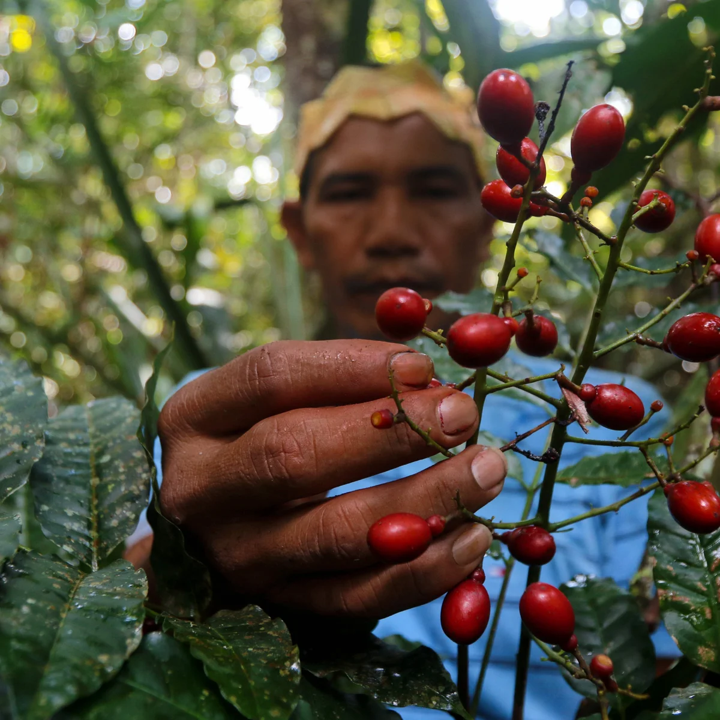
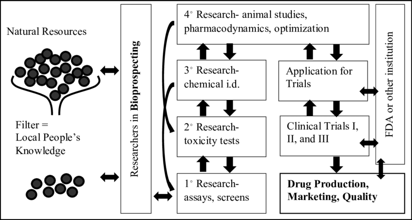

## What is Bioprospecting?

* **Exploration of biodiversity, especially in plants, fungi, and microbes, to discover novel compounds or genetic materials that may benefit medicine, agriculture, or industry**
    + intersects ethnobotany, natural product chemistry, and pharmaceutical research

 

* **Process often builds on traditional ecological knowledge (TEK), passed down through generations in Indigenous and local communities.**

 

* **Deep link between cultural knowledge and scientific breakthrough raise ethical questions about ownership and benefit sharing**

## Why Focus on Plants?

* **Plants produce an array of secondary metabolites — chemical compounds not essential for growth/survival**
    + used for defense, attraction, or competition

 

* **Key compounds include: alkaloids, terpenoids, and phenolics, many of which have bioactive properties useful in human health**

 

* **An estimated 25–50% of modern pharmaceuticals are derived directly or indirectly from plant compounds**
    + pain relief → morphine (poppy), aspirin (willow bark)
    + cardiovascular health → digoxin (foxglove)
    + infectious disease → quinine for antimalarial
    + respiratory → ephedrine (ephedra) in asthma and cold medications

## From Forest to Pharmacy

* **The drug discovery process involves many steps: identifying candidate species, extracting compounds, laboratory screening for bioactivity, chemical modification, and clinical testing**
    + bioprospecting is only the first step

 

* **Only a tiny fraction of natural compounds screened ever become marketable drugs — the process is time-consuming, expensive, and high-risk.**
    + development can take 10–15 years and cost over $1 billion.)

 

* **Synthetic biology and combinatorial chemistry are modern tools that complement natural product discovery**

## Ethical Questions in Bioprospecting

* **Who owns the rights to plants or knowledge used in drug development? Local communities, nation-states, or corporations?**
    + What if a community shares its knowledge, but doesn’t benefit when it’s commercialized?
    
 

* **The Nagoya Protocol (2010) promotes fair and equitable sharing of benefits arising from genetic resources.**
    + decolonizing science and including Indigenous voices is vital in biodiversity governance
    
 

* **Access and Benefit Sharing (ABS) agreements are intended to ensure Indigenous knowledge is recognized and compensated — but enforcement is uneven**

## Biopiracy – When Things Go Wrong

 

* **Biopiracy is the unauthorized use of biological resources or traditional knowledge without consent or compensation — often involving patents**

 

* **Legal and ethical debates arise when indigenous knowledge is used without consent, benefit-sharing, or acknowledgment**
    + economic value extracted from plants can bypass those who protected or used them sustainably for generations

 

* **Ethical dimension: Who owns nature? Who owns knowledge?**

## Its Time For A.....

