## Angiosperms flowers: The big picture

* **Sites of sexual reproduction**
    + *double fertilization* unique to angiosperms

 

* **Event leading to flowering are complex**
    + hormones
    + biological clocks
    + temperature
    + photoperiod

 

* **Flower production is coordinated with the environment**
    + necessary for pollinators to be present

 

* **Dispersal of seeds is the avenue of plant distributions**

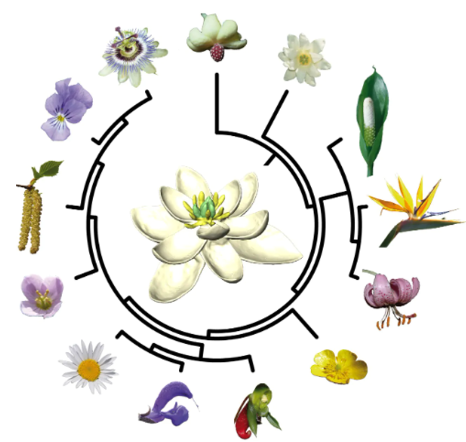

## Angiosperm reproduction: Flowers

* **Flower is a modified stem for reproduction**
    + 4 types of modified leaves
    + grouped in *whorls* (outer &rarr; inner)

 

* **Sepals: leaves at base which enclose flower**
    + enclose/shield the developing flower bud from damage, drying out, or herbivory before it opens

 

* **Petals: colored leaves to attract pollinators**
    + *corolla* = all petals together
    
 

* **Two types of fertile organs, stamen and carpel**
    + Stamen - male reproductive organ
    + Carpel - female reproductive organ
    

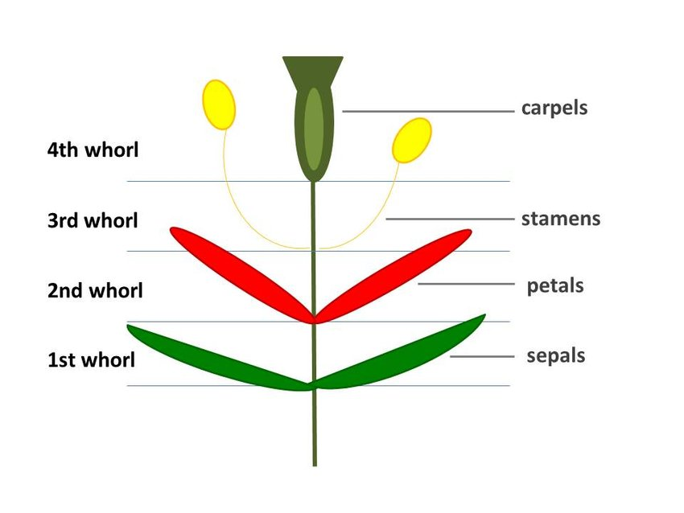

## 

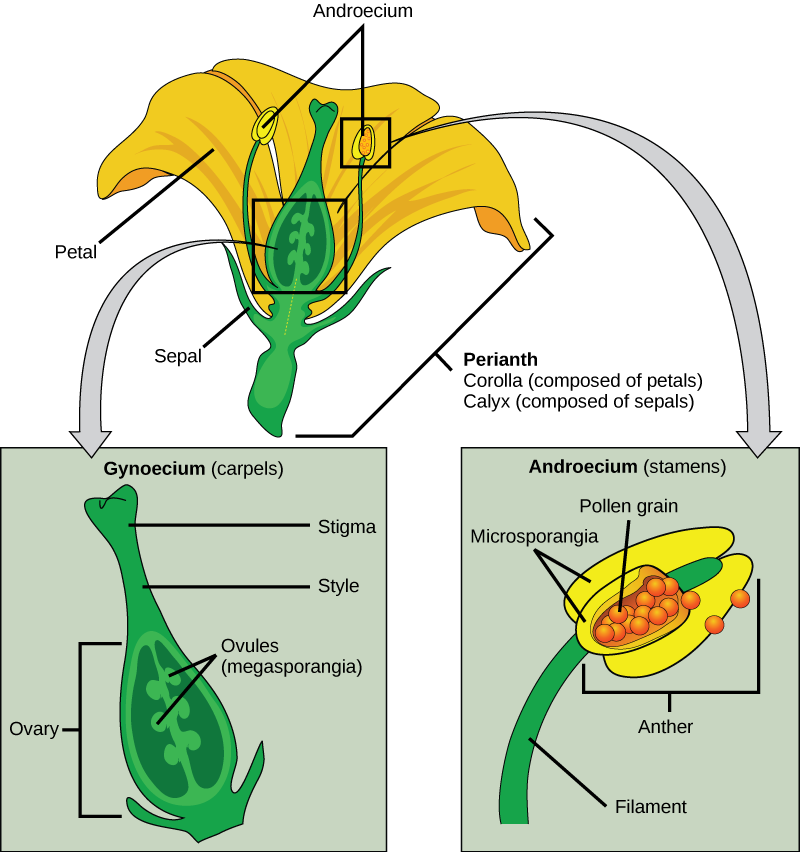

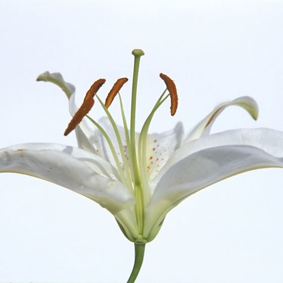

## Flowers - Male structures = *Stamen*

* **Whorl composed of *stamens* **
    + 1 stamen = anther + filament
    
     

* **Anther: where pollen produced**
    + each anther has 4 chambers
    + 1,000 - 100,000 pollen grains/anther

 
    
* **Filament: stalk that holds the anther**

 

* **Pollen: produce male gametophyte w/ sperm**
    + 15-200um
    + generally oval or spherical 

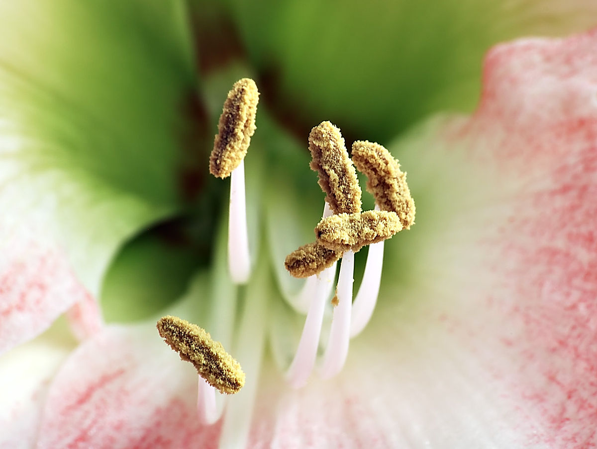

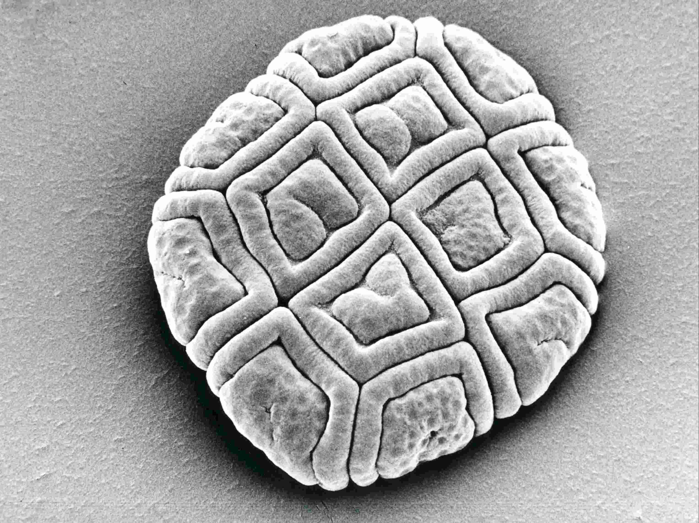

## Flowers - Female structures = *Carpel*

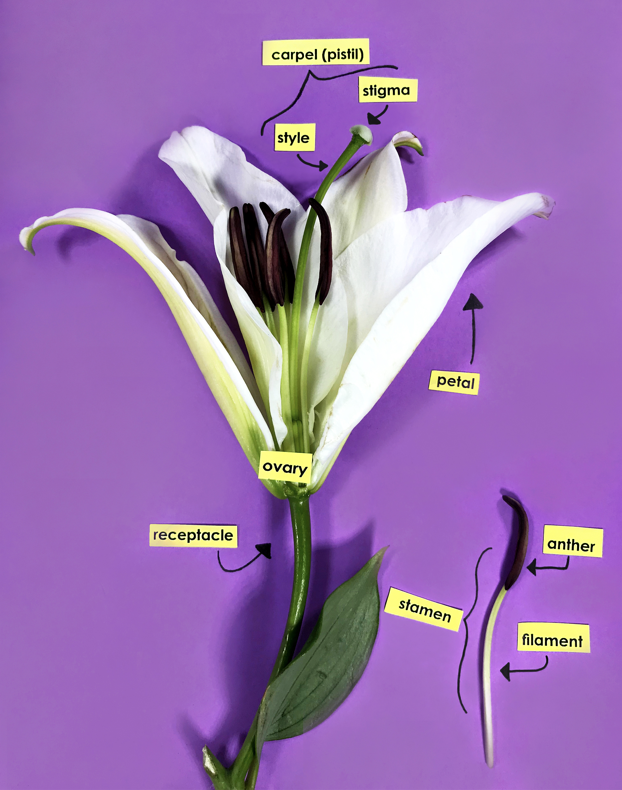

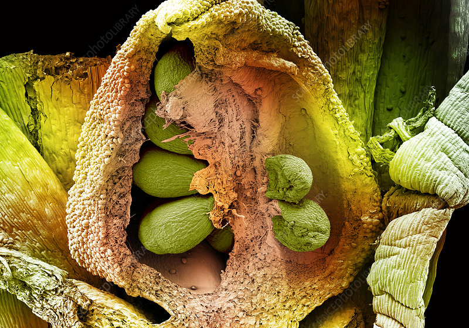

* **Whorl composed of *carpels* **
    + middle of flower
    + 1 &rarr; many carpels
    
 

* **Stigma: receives pollen**
    + sticky
    
 

* **Style: leads from stigma to ovary**
    + where pollen tube forms
    
 

* **Ovary: contains ovules**
    + ovules contain female gametophyte w/ egg
    + 1 &rarr; many

## Flowers - Female structures - *Carpel*

 

* **Pistil refers to 1 complete visible unit**
    + carpels can be separate or fused

 

* **Complexity leads to diverse flowers**
    + also leads to diverse fruits
    
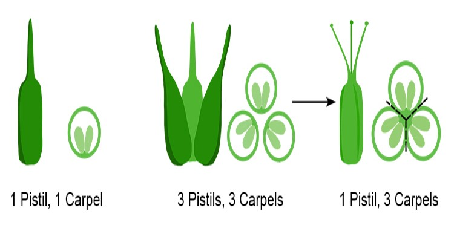

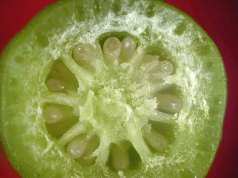

## Variation in flower structure

 
 
 

* **Complete flower: all four whorls**
* **Incomplete flower: missing at least one whorl**

 

* **Perfect flower: both stamens and carpels**
* **Imperfect flower: missing one or the other**

 

<!-- * **One plant w/ male & female flowers = moneocious** -->
<!-- * **If male & female flowers on separate plants = dioecious** -->

<!--   -->

* **Regular flower = radial symmetry**
* **Irregular flower = bilateral symmetry**

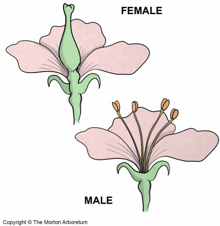

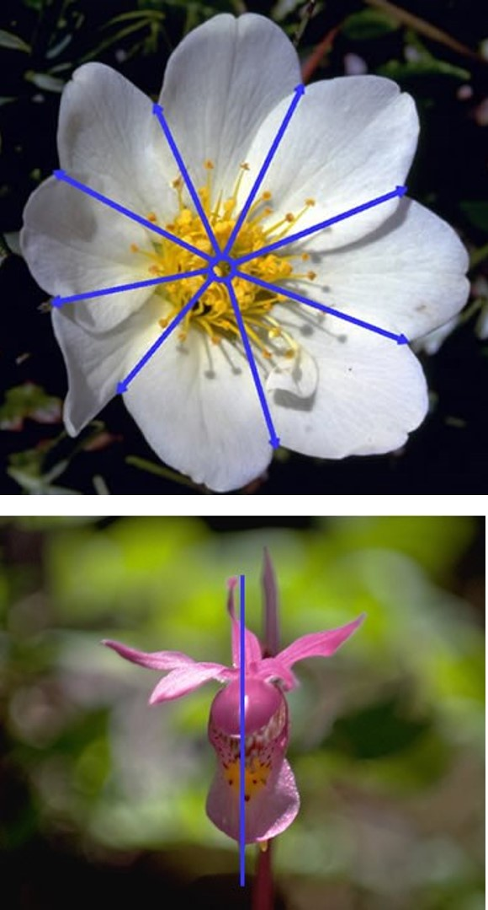

## When to flower? Arabidpopsis has many known pathways

 
 
 

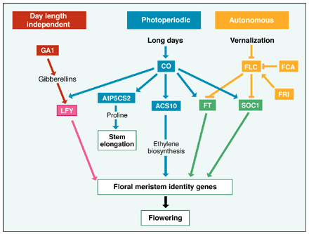

* **Photoperiod: day length triggers flowering genes**
    + photoreceptor pigments on leaves
    
 

* **Vernalization: prolonged cold induces flowering**

 

* **Internal hormonal signals**
    + inhibition or induction of flowering
    + independent of environment

 

* **Why so many?**

## Flowering in marijuana

 
 
 

* **Flowering periods triggered by photoperiodism**
    + 6hrs or more of darkness
    + vegetative growth synced w/ summer daylight

 

* **Longer darkness induces hormonal change**
    + triggered by 2 photocrome pigments
    + PR (660-700nm) & PFR (760-800nm)
    + darkness switches PFR to PR
    + tipping point of PFR:PR ratio

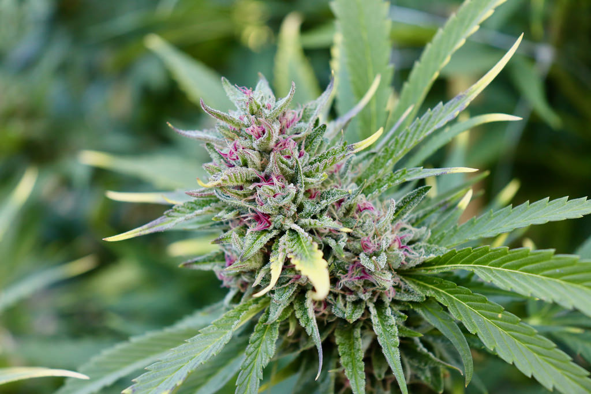

## Pollination

* **Sex cells must travel from one plant to another**
    + sexual partners may be widely scattered

 

* **Seed plants: pollen carried by wind, insects & birds**
    + inevitable pollen loss
    + may also require nectar production

 

* **Pollination = transfer of pollen from anther to stigma**
    + not fertilization!
    
 

* **Some flowering plants can self-pollinate**
    + stamen & carpel mature @ same time
    + large genetic consequences
    + but...no nectar necessary
    
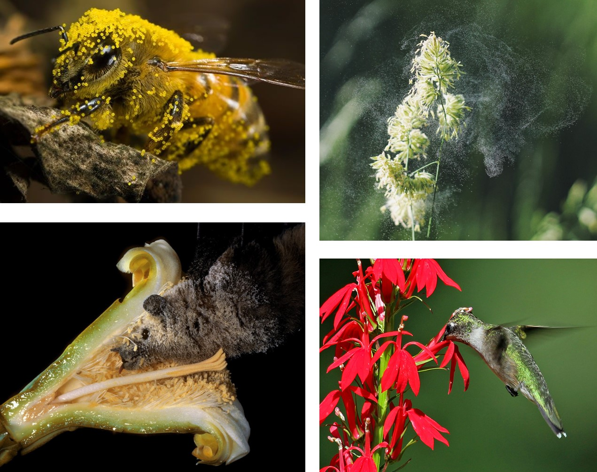

## Mechanisms against self-pollination

 

* **Most flowers have both male & female structures**
    + only ~5% of angiosperms are *diecious* (single sex)

 

* **Pollen and the ovary mature at different times**

 

* **Physical flower features that prevent self-pollination**
    + styles length relative to the stamens = *heterostyly*

 

* **Biochemical blockers to reject closely related pollen**
    + e.g. enzymatic destruction of RNA
    + chemical tests (proteins) on pollen tube

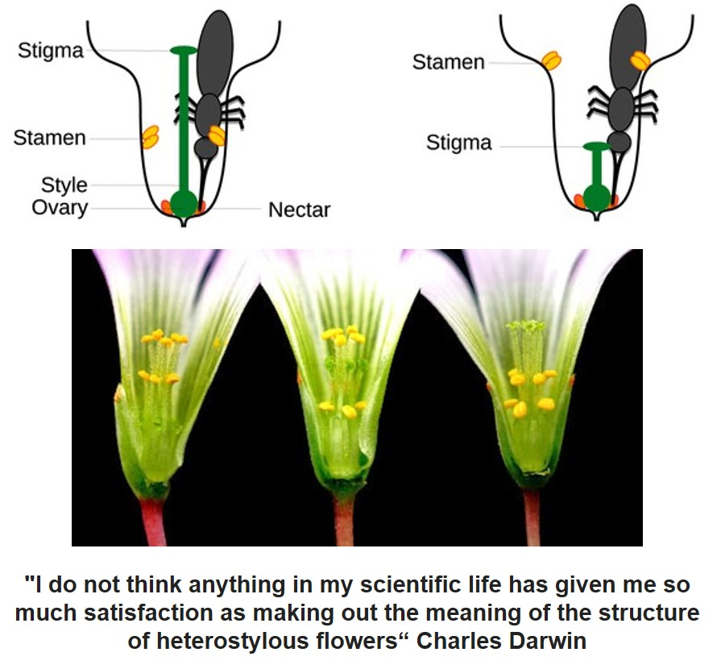

## Evolution of flower color and smell

**Attraction traits shift with pollinator type**

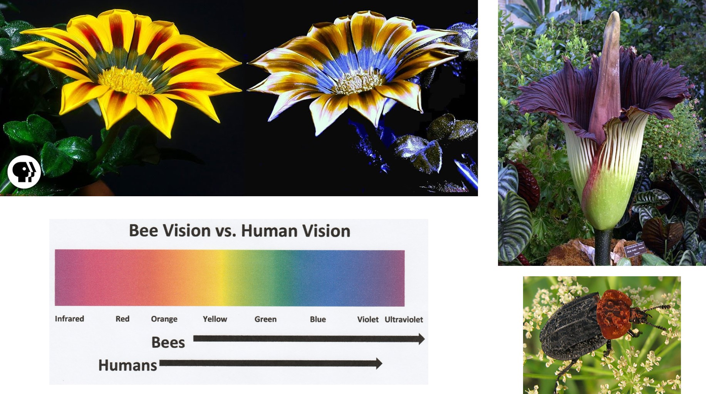

## Alternation of generations: Where is the gametophyte?

* **Male: microspore inside pollen grain**
    + microgametophyte = max 3 cells
    + generative cell &rarr; mitosis &rarr; 2 sperm
    + vegetative cell makes pollen tube

 

* **Female: 7 cell embryo sac, inside ovule**
    + ovule = tiny 'pre-seed'
        + contains protective coat
    + tiny doorway for pollen tube to enter
    + megagametophyte = 1 egg, 2 helper cells, a central cell that becomes the food (*endosperm*) after fertilization
    + central cell has two nuclei!

 

* **Internal fertilization = pollen grain lands on stigma, cells grow pollen tube to ovule, sperm relased down tube to female gametophyte**

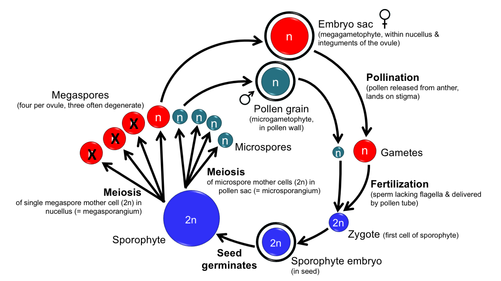

## 

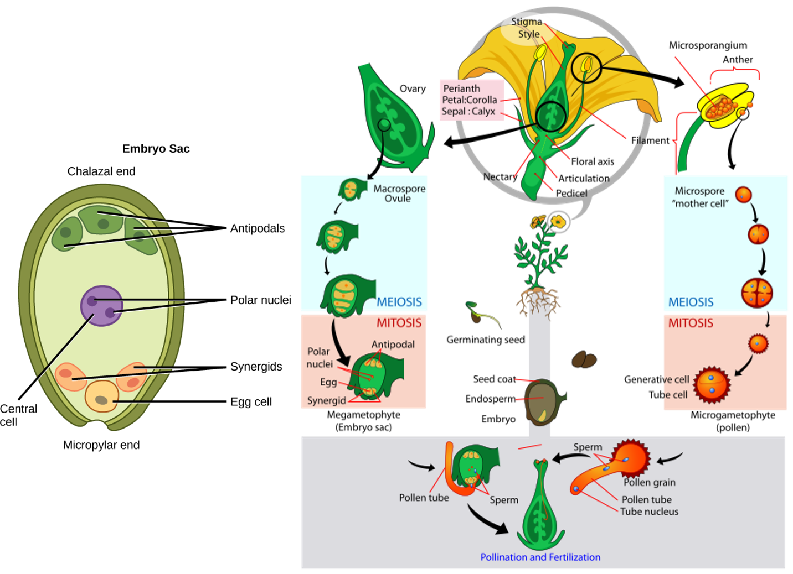

## Angiosperm reproduction: double fertilization

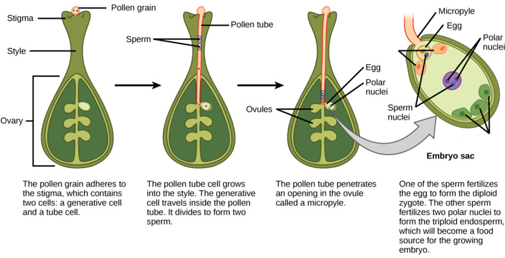

## Comparing seed plant reproduction

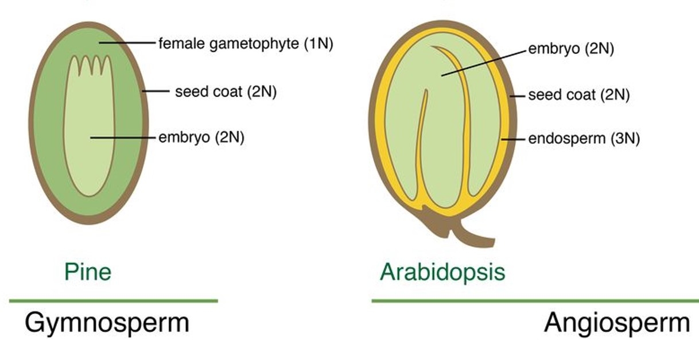

## Fruits develop from ovaries

 
 
 

* **Ovule develop into seeds**

 

* **Stigma, style, sepals & petals wither away**

 

* **3 layers develop during growth**
    + exocarp = outer skin
    + mesocarp = flesh
    + endocarp = stone, pit or thin inner layer
    
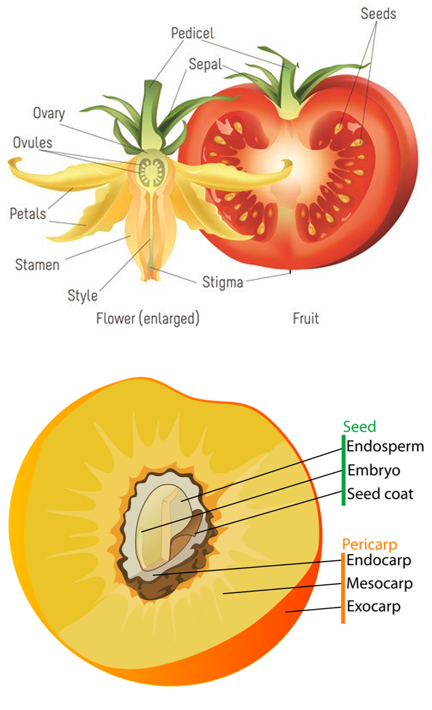

## Type of *pistils/carpels* determines fruit type    

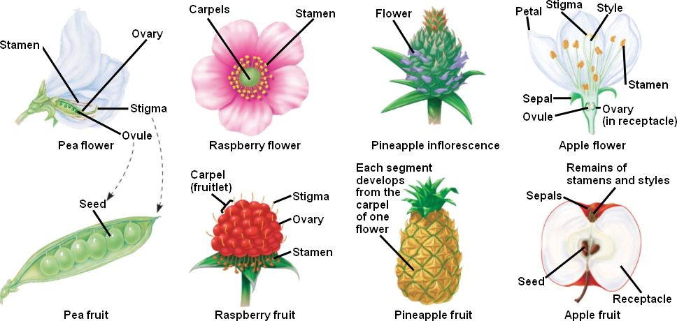

## Fruits/Seeds as agents of dispersal

 

* **Seeds capable of long-distance dispersal**
    + pros: promotes sexual reproduction
    + cons: diverse landing sites

 

* **1 plant = 1,000s of seeds (possible)**
    + each a genetic experiment
    + significant cost to plant

 

* **Fruits/seeds by wind = light, wings or parachutes**
* **Fruits/seeds by water = buoyant & anti-rot**
* **Mechanisms to stick to animals**
* **Edible but not digested**

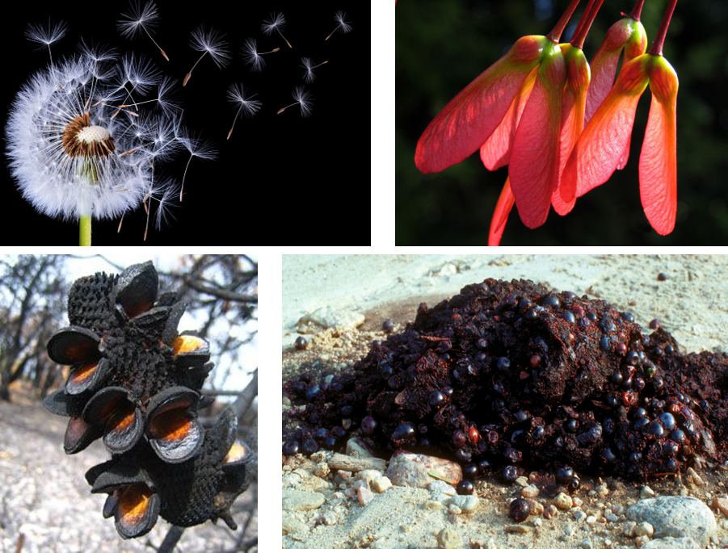