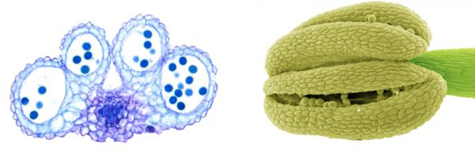
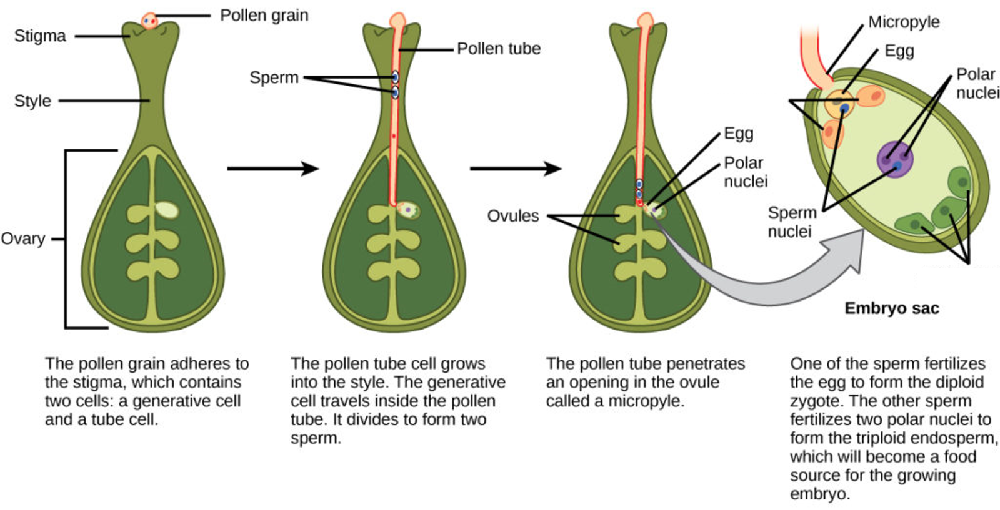

## Angiosperms flowers: The big picture

* **Sites of sexual reproduction**
    + double fertilization

 

* **Event leading to flowering are complex**
    + hormones
    + biological clocks
    + temperature
    + photoperiod

 

* **Flower production is coordinated with the environment**
    + necessary for pollination

 

* **Dispersal of seeds is the avenue of plant distributions**

## Angiosperm reproduction: Flowers

 

* **Flower is a modified stem for reproduction**
    + 4 types of modified leaves
    + groped in *whorls* (outer &rarr; inner)

 

* **Sepals: leaves at base which enclose flower**
    + *calyx* = all sepals together

 

* **Petals: colored leaves to attract pollinators**
    + *corolla* = all petals together
    
 

* **Two types of fertile organs to make spores**
    + *androcieum*  = male whorl
    + *gynociem* = female whorl
    

## 

## Flowers - Male structures - *androcieum*

 

* **Whorl composed of *stamens* **
    + anther + stalk
    + 
    
     

* **Anther: where pollen produced**
    + each anther has 4 chambers

 
    
* **Filament: stalk that holds the anther**

## Flowers - Female structures - *gynociem*

 

* **Whorl composed of *carpels* **
    + middle of flower
    + 1 &rarr; many carpels
    
 

* **Stigma: receives pollen**
    + sticky
 

* **Style: leads from stigma to ovary**
    + where pollen tube forms
 

* **Ovary: contains ovules**
    + *ovules becomes seeds*
    + 1 &rarr; many

## Flowers - Female structures - *gynociem*

 

* **Pistil also refers to 1 unit**
    + carpels can be separate or fused

 

* **Complexity leads to diverse flowers**
    + also leads to diverse fruits
    

## Variation in flower strucutre

 

* **Complete flower: all four whorls**
* **Incomplete flower: missing at least one whorl**

 

* **Perfect flower: both stamens and pistils**
* **Imperfect flower: missing one or the other**

 

* **One plant w/ male & female flowers = moneocious**
* **If male & female flowers on separate plants = dioecious**

 

* **Regular flower = radial symmetry (rose)**
* **Irregular flower has bilateral symmetry (iris)**

## When to flower? Arabidpopsis has many known pathways

 
 
 

* **Photoperiod: long days trigger flowering genes**
    + photoreceptor pigments
    
 

* **Vernalization: prolonged cold induces flowering**

 

* **GA hormone: internal hormonal signals**
    + independent of environemnt

 

* **Why so many?**

## Flowering in marijuana

 
 
 

* **Flowering periods triggered by photoperiodism**
    + 6hrs or more of darkness
    + vegetative growth synced w/ summer daylight

 

* **Longer darkness cause hormonal change**
    + triggered by 2 photocrome pigments
    + PR (660-700nm) & PFR (760-800nm)
    + darkness switches PFR to PR
    + tipping point of PFR:PR

## Pollination

* **Sex cells must travel from one plant to another**
    + sexual partners may be widely scattered

 

* **Seed plants: pollen carried by wind, insects & birds**
    + inevitable pollen loss
    + may also require nectar production

 

* **Pollination = transfer of pollen from anther to stigma**
    + not fertilization!
    
 

* **Some flowering plants can self-pollinate**
    + stamen & anther mature @ same time
    + large genetic consequences
    + no nectar necessary
    

## Mechanisnms against self-pollination

 

* **Many flowers have both male & female structures**
    + hermaphrodism

 

* **Pollen and the ovary mature at different times**

 

* **Physical flower features that prevent self-pollination**
    + styles length relative to the stamens = *heterostyly*

 

* **Biochemical blockers to reject closely related pollen**
    + e.g. enzymatic destruction of RNA
    + chemical tests (proteins) on pollen tube

## Evolution of flower color and smell

## Alternation of generations: Where is the gametophyte?

 
 

* **Male: microspore inside pollen grain**
    + microgametophyte = max 3 cells
    + generative cell &rarr; mitosis &rarr; 2 sperm
    + vegetative cell makes pollen tube

 

* **Female: 7 cell embryo sac, inside ovule**
    + megaspore develops into megagametophyte
    + mitosis 3x
    + one cell has 2 nuclei
    + one cell = egg
    

## 

## Angiosperm reproduction: double fertilization

## Comparing seed plant reproduction

## Fruits develop from ovaries

 
 
 

* **Ovule develop into seeds**

 

* **Stigma, style, sepals & petals wither away**

 

* **3 layers develop during growth**
    + exocarp = outer skin
    + mesocarp = flesh
    + endocarp = stone, pit or thin inner layer
    

## Type of *gynociem* determines fruit type    

## Seeds as agents of dispersal

 

* **Seeds capable of long-distance dispersal**
    + pros: promotes sexual reproduction
    + cons: diverse landing sites

 

* **1 plant = 1,000s of seeds (possible)**
    + each a genetic experiment
    + significant cost to plant

 

* **Fruits/seeds by wind = light, wings or parachutes**
* **Fruits/seeds by water = buoyant & anti-rot**
* **Mechanisms to stick to animals**
* **Edible but not digested**

