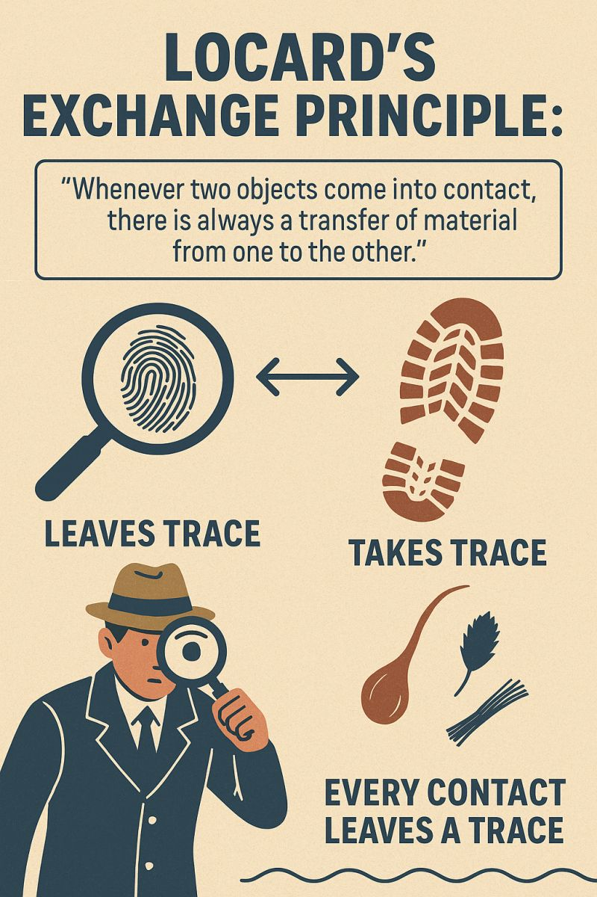

## What is Forensic Botany? 

 

- **Application of plant science to criminal and civil investigations**
    + Palynology: study of pollen and spores
    + Dendrochronology: tree-ring dating
    + Diatom analysis: aquatic forensic evidence

 

- **Interdisciplinary field drawing from botany, ecology, law enforcement**

 

- **Why Plants Matter in Forensics...**
    + *Provide evidence of movement, time, or location of crime*
    + Complement DNA, fingerprints, and traditional evidence
    + Versatile, especially in outdoor scenes or missing person cases 

## Locard’s Exchange Principle

- **“Every contact leaves a trace” – foundational forensic concept**

 

- **Botanical evidence at the scene:** Plants, pollen, seeds, and soil samples found at a crime scene can be linked to a suspect if they are also found on the suspect's clothing, shoes, or vehicle. 

 

- **Botanical evidence on the suspect:**Conversely, plant material from the crime scene might be found on a suspect, indicating their presence at the location

 

- **Establishing links:** This exchange of botanical evidence can be crucial in linking a suspect to a crime scene or victim, especially when other forms of evidence are scarce. 
    

## Types of Botanical Evidence

 

- **Macroscopic: Leaves, twigs, seeds, fruits, bark, wood**
    + Examples: Identifying a specific type of leaf found on a suspect's clothing, analyzing plant material in a victim's stomach to determine time of death, or presence of a plant species to link a suspect to a crime scene. 
    
 

- **Microscopic: Pollen, spores, diatoms, plant hairs (trichomes)**
    + Examples: dentifying the species of a pollen grain found on clothing or examining diatom assemblages to determine if a victim drowned in a specific body of water
    
 

- **Each type tells a different story – location, season, transfer**

 

- **Macroscopic and microscopic analyses often complement each other, providing a more comprehensive understanding of the plant evidence**

## Types of Botanical Evidence

## Botanical Evidence Basics: Macroscopic

- **Look for unusual plant fragments at crime scenes -  injuries (broken branches), or foreign species**
    + can links suspects with crime scenes
    + experimenting with how long leaves on a broken branch take to wilt = timing

 

- **Use ecology (flowering times, growth cycles etc.) of plants growing in/around body**
    + can determine timing of death (e.g. season)

 

- **Plant identification can be crucial for determining if poisoning has occurred**
    + stomach contents, surrounding plants

 

- **Seeds, burrs, and plant fragments adhere to shoes, tires, hair can reconstruct movement of people, vehicles, or bodies**
    

## Botanical Evidence Basics: Palynology

* **Pollen & Spores - Pollen is unique by species, geographically distinct, and resists decay**
    + can be carried by wind, water, or animals, traveling far from their source
    + individual grains of pollen from different species can look like soccer balls, sponges, padded cushions, or coffee beans
    + surfaces are covered with intricate identifiable geometric patterns

 
 

* **By examining pollen found at a crime scene or on a suspect, investigators can:**
    + potentially link individuals or objects to specific locations
    + determine the time of year a crime occurred
    + reconstruct events related to the crime
    

## Palynology in Drug Trafficking

- **In two different marijuana seizures in California and Texas, pollen analysis revealed a unique sagebrush pollen marker**
    + sagebrush species was known to grow in only a few isolated regions of Mexico            + pinpointed the likely area where the marijuana was cultivated

 

- **A truck carrying cocaine was seized at the Canadian border after attempting to enter from Detroit. Pollen analysis of the truck's air filter revealed a pattern of pollen grains indicating the shipment originated in California and took a circuitous route across the United States instead of a direct path to Canada**

 

- **Pollen analysis also has helped CBP trace the routes of marijuana and cocaine bundles that wash up onshore along the coasts of Florida and Texas**
    + samples were loaded with fern spores, more than would be typical of an area where fern plants grow
    + There are only a few areas that have that many ferns and one of them is Fern Gully, a winding, scenic stretch of road in Jamaica
    
## Botanical Evidence Basics: Diatoms and Aquatic Evidence 

 

- **Diatoms are microscopic organisms that can be inhaled with water into the lungs**
    + If the individual was alive when they entered the water, diatoms will be found in the lungs and may circulate to other organs
    + If the person was already dead, diatoms are less likely to be found

 

- **Comparing the types and quantities of diatoms in a victim's body with samples from potential drowning locations (like lakes, rivers, or oceans) can help establish where the drowning occurred**

 

- **Diatoms can also be transferred to clothing, footwear, or other personal items, potentially linking a suspect to a crime scene or a specific water source**

## Botanical Evidence Basics: Dendrochronology & Growth Clues

 

- **Tree rings are used to date wood**
    + determine the age of wooden objects found at a crime scene
    + growth over time around buried objects indicates timeline of burial
    + climate records support or dispute timeline claims 

 

- **Certain plants bloom or fruit in predictable seasonal windows**
    + presence of specific plant structures can narrow time of crime
    + ueful in matching or challenging suspect alibis

## Botanical Evidence Basics: Plant-Based Toxins and Injuries 

- **Plants can cause injury or death: - Ricin from castor bean - Digitalis from foxglove - Coniine from hemlock**
    + Socrates who was sentenced to drink hemlock
    + Abraham Lincoln's mother due to white snakeroot 
    + Juan Ponce de León died after being wounded by an arrow poisoned with the manchineel tree's sap

 

- **Plant toxins can be used to prove a crime, such as homicide or theft, or to establish the cause of death in poisoning cases** 

 

- **Forensic scientists use analytical techniques to identify and quantify plant toxins in biological samples (e.g., blood, urine, stomach contents)**

    

## Botanical Evidence Basics: Modern Technologies 

- **Stable Isotope Analysis - Measuring ratios of isotopes (C, N, O) in plants reflects regional climate or water and soil composition**
    +can identify the source of illicit drugs or trace the origins of plants involved

 

- **Example - Local climate controls stomatal openings. When stomata are forced to close (drought) they stop discriminating against heavy isotope (13C)**
    + Samples become more enriched in 13C compared to same species in an different climate

## Its Time For A.........

