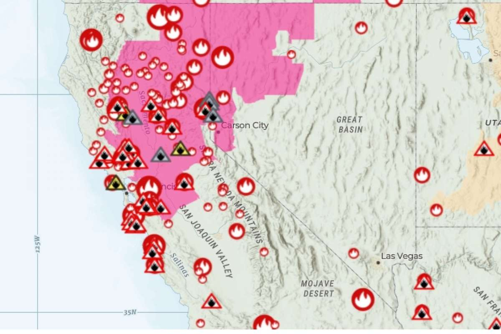

## Plant Biotechnology timeline

 
 

* **Humans have manipulated genes since the ‘dawn of civilization’**
    + populous and developing countries
    + regions far removed from human reach

 

* **Svalbard, in the high-arctic, 30% &#8593; greenness**
    + concurrent with &#8593; in summer temperature from 2.9 to 4.7C
    
 

* **What is the role of plants in global change?**
    + question is a matter of scale

## Leaf area index: What it means to be greener

## Why are plants producing more leaf area?

 
 
 
 

* **Humans dump ~40 billion tons of CO~2~ into atmosphere**
    + EACH YEAR

 

* **Atmospheric CO~2~ is a greenhouse gas**
    + &#8593; CO~2~ = &#8593; trapped heat = &#8593; surface temperatures
    
  

* **Plants fix CO~2~ from the atmosphere via Rubisco**

## Greenhouse gases make the earth warm

## A carbon *imbalance* exists between surfaces and air

## Plants represent a large carbon sink

## The role of vegetation change

 
 
 

* **Ability to immediately fix carbon from atmosphere**
    + photosynthesis - respiration
    + keeping pace with human emissions?

 

* **Sequestrating carbon in wood**
    + prevents fast cycling of carbon
    
  

* **Transpiration adds H~2~O into atmosphere**
    + power greenhouse gas
    

## Plant carbon uptake is multi-layered

## Vegetation change is not new!

## Global plant C sink: Photosynthesis

## Just plant tons of trees, problem solved...

 
 
 

* **Are all trees carbon vacuums?**
    + fast growing trees don't live as long
    + fast growing trees drain more water
    + fast growing trees create less dense wood

 

* **Farmland to forests: can we eat?**
    
  

* **Are all forests equal?**
    + forest plantation = rain forest?
    

## How sustainable is the  CO~2~ fertilization effect

## Global plant C sink: Nutrient limitation

  
## Global plant C sink: Climate warming

## Global plant C sink: Climate warming

 
 

* **Plants like higher temperatures to a degree**
    + faster rate of photosynthesis (limited)
    + most plants not operating at T~opt~

 

* **Rubisco cheats more at high temperatures**

 

* **Dependent on stomatal behavior**

 

* **Warming may also mean &#8595; precipitation**

## Global plant C sink: Respiration

    
## Climate change is altering precipation regimes

## Key questions: How plastic are plants?

 

* **Phenotypic plasticity: allows individuals to respond to change within their lifetime**
    + acclimation (lifetime) vs adaptation (generations)

 

* **Can plants change physiology to match new conditions?**
    + can optimums be adjusted? 

 

* **Why might northern species struggle in warmer temperatures?**

 

* **Why might plants struggle in new precipitation regime**

## Climate changes are just part of global change

 

* **Lots of other stresses on plant communities**
    + impact sustainability of greening earth
    
 

* **Habit degradation from human activities**

 

* **Total habitat loss**
    + agricultural conversion
    + urban growth

 

* **Higher rates of exotic species invasions**

## Is the earth still getting greener?

 

* **Greening since 1980's reduced warming ~0.2C**

 

* **New science suggests browning trend**
    + greening trend stalling or reversing

 

* **Related to less moisture in the air**
    + higher VPD from climate warming

 

* **Why would drier air impact plant growth negatively?**

 

* **Plant carbon sink does not fix global carbon imbalance**

