## The Leaf Economic Spectrum (LES)

* **The LES is a global framework describing a continuum of leaf traits from "fast" to "slow" strategies.**
    + “Fast” traits = cheap construction, rapid photosynthetic returns, short lifespan
    + “Slow” traits = expensive to make, durable, long-lived, conservative in resource use

 

* **It captures a trade-off between rapid resource acquisition and long-term survival**

 

* **The landmark paper synthesized global data from over 2,500 species across 175 sites to reveal consistent trade-offs among key leaf traits — lifespan, photosynthetic capacity, nitrogen content, and leaf thickness**
    + It established the LES as a unifying axis of variation in plant ecology

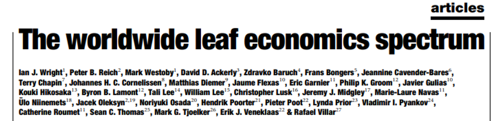

## What are functional traits?

* **Morphological, physiological, or phenological features measurable at the individual level**

 

* **Influence how an organism acquires resources, grows, reproduces, and survives in its environment**
    + most traits should be *subject* to natural selection
    + variation of a trait within an organism can also exist (plasticity)

 
 

* **Traits are often quantifiable and comparable across species**

 

* **Central to trait-based ecology, which uses traits instead of taxonomy to explain ecological patterns.**

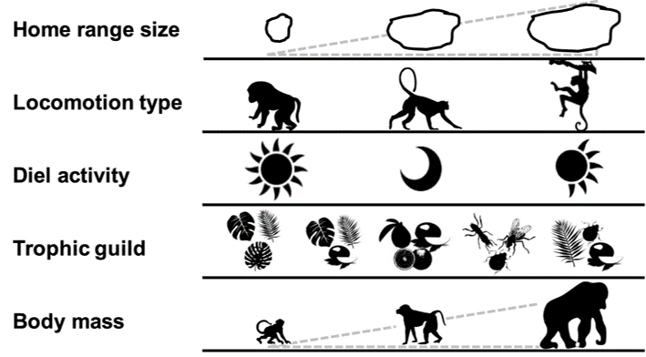

## 

**What are the main plant functional traits?**

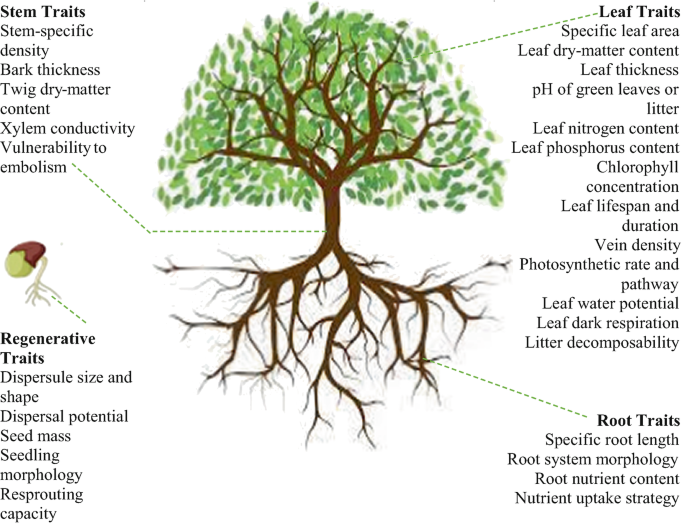

## LES: The Story of 4 Traits

 

* **Function of a leaf can be explored across key traits**
1. Leaf thickness
2. Nitrogen content
4. Leaf lifespan 
3. Photosynthetic rate (umols CO~2~ m^-2^ s^-1^)

 

* **Traits are responsible for fixing carbon that contributes to growth, reproduction and survival**
    + total gain (lifespan), not instantaneous

 

* **Interplay between physiology, morphology and chemistry**

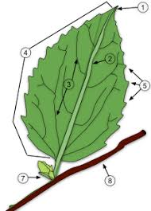

## Why does the LES matter?

* **Functional traits are comparable and predictive, more than species identity alone**

 

* **LES traits correlate with ecological strategies:**
    + Pioneer species (fast-return) dominate disturbed or high-light environments.
    + Climax species (slow-return) dominate resource-limited, stable environments.

 
 

* **Helps explain how plants partition resources across environments**
    + sun vs. shade
    + dry vs. wet
    + nutrient-rich vs. poor

## Leaf Thickness = Leaf Mass / Leaf Area (LMA)

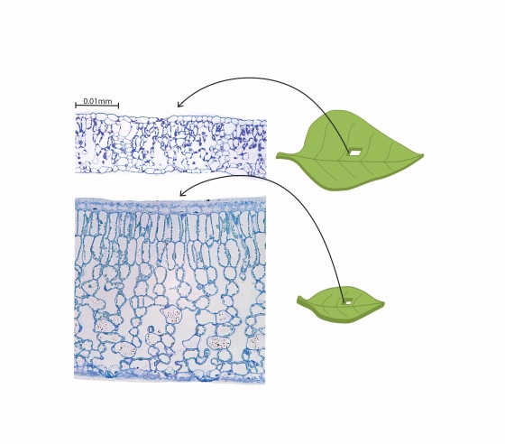

* **Leaf mass represents investment into construction**
    + photosynthetic machinery, water supply, etc. 
    

* **Surface area vital in leaf making**
    + area exposed to light
    + drives photosynthesis & evaporative water loss

 

* **Variation in components of trait super variable**        
    + large vs small area (magnolia vs spruce)
    + thin vs thick
    + across and within species
    +  14 to 1,500 g m^2^
    
 

* **?Why should every leaf not have large area?**
    + water loss, defense, mechanical support
    + environmental pressures

## Leaves need a lot of nitrogen (N)...

 

* **Vital structural and functional component of leaves:**
    + proteins, nucleic acids, ATP
    + co-enzymes NADP^+^, 
    + pigments 
    + 0.2 to 6.4% of total leaf mass

 

* **The greatest sink for nitrogen is Rubisco**
    + 20-30% of leaf nitrogen

 

* **Nitrogen needed for leaf persistence**
    + structural proteins in cell walls
    + herbivore defenses (secondary compounds)
    
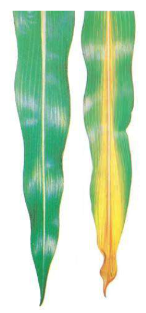

## Leaf Lifespan is more than just evergreen or deciduous

* **Leaf lifespan (LL) varies from few weeks to 25 years**
    + 0.9 to 288 months
    
 

* **Resources determine investment into leaf construction**
    + high resources = deciduous habitats
    + low resources = evergreen habitats
    
 

* **Photosynthesis decreases with leaf age**
    + photosynthetic machinery slowly breaks down

 

* **Trait strategy: ROI - return on investment...**
    + When to start over?
    + How much to/can invest in construction?

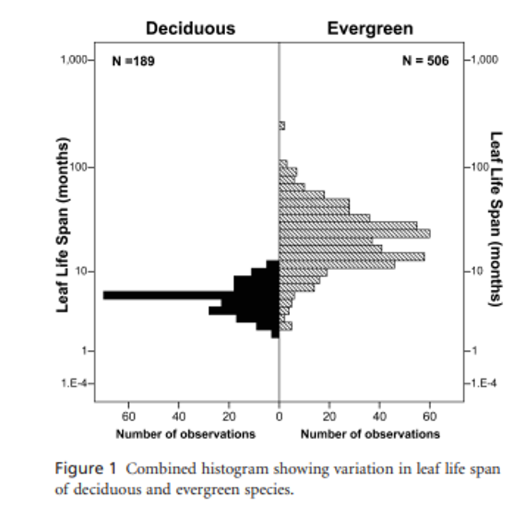

## What rate of photosynthesis can plants achieve?

 

* **You know the different pathways...**

 

* **You know that leaves need lots of ingredients**

 

* **Rates of photosynthesis vary dramatically**
    + ferns = 1 umols m^-2^ sec^-1^
    + wheat = 25 umols m^-2^ sec^-1^
    + both ferns and wheat use C3 pathway
    + often rates differ within a tree canopy
    
 

* **Why are rates so different?**
    

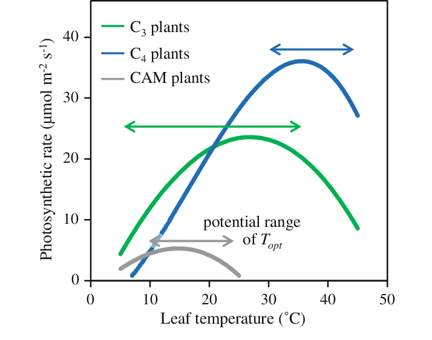

## Correlations among LES traits shared across plants

 
 

* **Vascular plants display patterns in relationships between LES traits**
    + all over the world
    + every habitat

 
 

* **Patterns are multi-dimensional**
    + LL vs LMA vs N vs Photo

 
 
 
 

**Example: A simple relationship between N and photosynthesis would ignore leaf lifespan**

 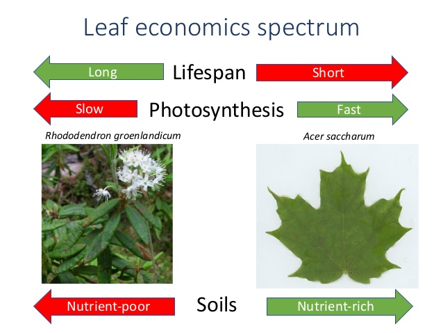
 
## Economic theory applied to plants

 
 

* **Leaf economics = revenues and expenditures per unit investment (ROI)**

 

* **Traits vary together and trade-off between acquiring and conserving resources**

 

## Leaf Economic Spectrum (Wright et al. 2003)

 

**Is the total ROI different between fast and slow return leaves over the leaf lifespan???**

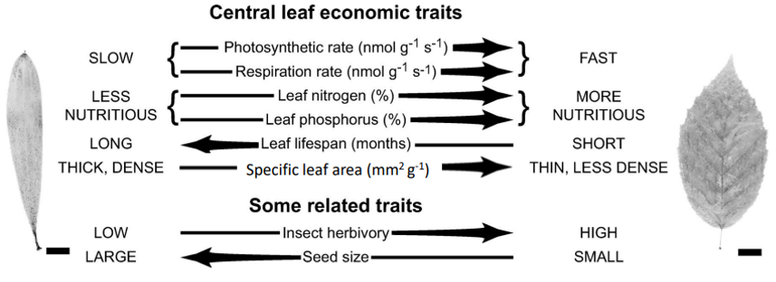

<!--  -->

## Leaf nitrogen and thickness negatively correlated

 
 

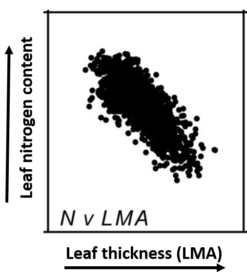

* **Increases in leaf N = optimized function**
    + N for Rubisco, chlorophyll
    + N for defense compounds

 

* **If N is high, why build expensive thick leaves?**
    + fast R.O.I.

 

* **Low leaf N  = reduced function**
    + more invested in structural components (↑ thick)
    + slow R.O.I, durability higher
    

## Leaf Thickness and Leaf Lifespan Postively Correlated

 

* **Thickness reflects mass cost of deploying new leaf area**
    + thin leaves = cheaper
    + thin leaves if... R.O.I is fast
    
 

* **Leaf lifespan represents the duration of photosynthetic revenue**
    + the 'return' of R.O.I

 

* **Thin leaves = short leaf life span**
* **Thick leaves = long leaf life span**

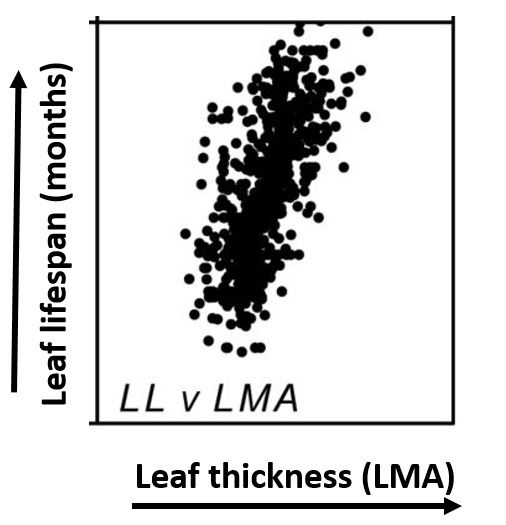
 
## These Relationships Regulate Photosynthesis

* **Decrease in LMA =  Increase in photosynthesis rates**
    + usually high N but short lived
    + fast R.O.I

 

* **Long leaf lifespans = low photosynthesis rates**
    + usually thick leaf with low N
    + slow R.O.I

 

* **Environment plays a role:**
    + high N leaves are yummy to herbivores
    + leaf lifespan decreases during drought

 

* **Is this the same for all leaves on a plant?**

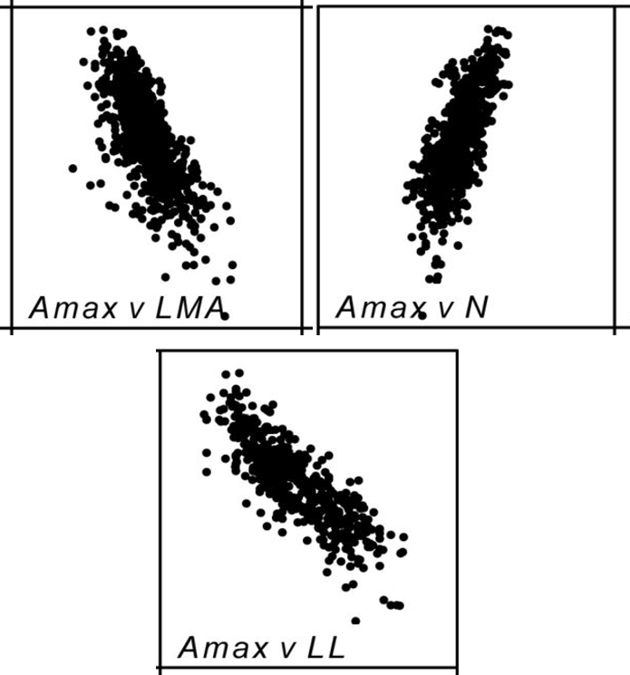

<!-- ## Trait relationships vary with climate -->
<!-- 
 -->

<!-- * **Leaf lifespan shorter at sites of lower rainfall** -->
<!--     + duration of R.O.I reduced -->

<!-- 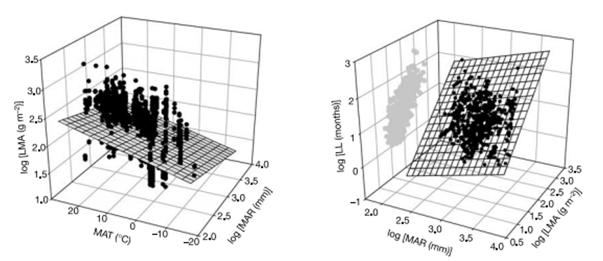 -->

<!-- ## LES in plant ecology -->
<!-- 
 -->

<!-- Plant species adapted to resource-rich environments and able to compete well under nutrient rich conditions are often less defended against natural enemies.  -->

<!-- Nitrogen disease hypothesis: Higher nutrient content of the plant material following nitrogen fertilization should promote disease.  -->
<!-- Host dilution hypothesis: Many pathogens are dependent on the availability and density of host plants. -->

<!-- At high plant diversity the abundance of each host plant is in average lower than in species poor communities, which is suggested to be the underlying mechanism of observed negative diversity-disease relationships. -->

<!-- 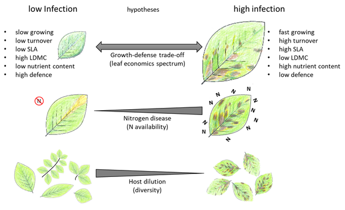 -->

## Do Similar Trait Realtionships Exist for Whole Plants?

**Strategies for plant fitness also exist on a spectrum**

1. Seed production: coconut to orchid seed
2. Height: few cm to 115m
3. Woody to non-woody
4. Thick to thin leaves
5. Leaf area: fingernail to car hood
6. Leaf nitrogen investment across the canopy

 

* **Balances leaf construction costs against growth potential**

 

* **Size of whole plants and their parts**

 

* **Constrains evolution and qualifies plants for given environments**

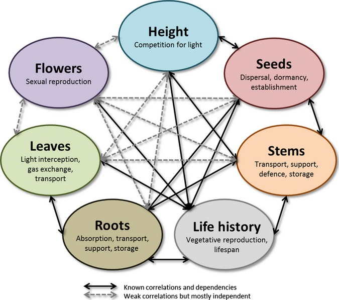

## Global Spectrum of Plant Form and Function (Diaz 2016)

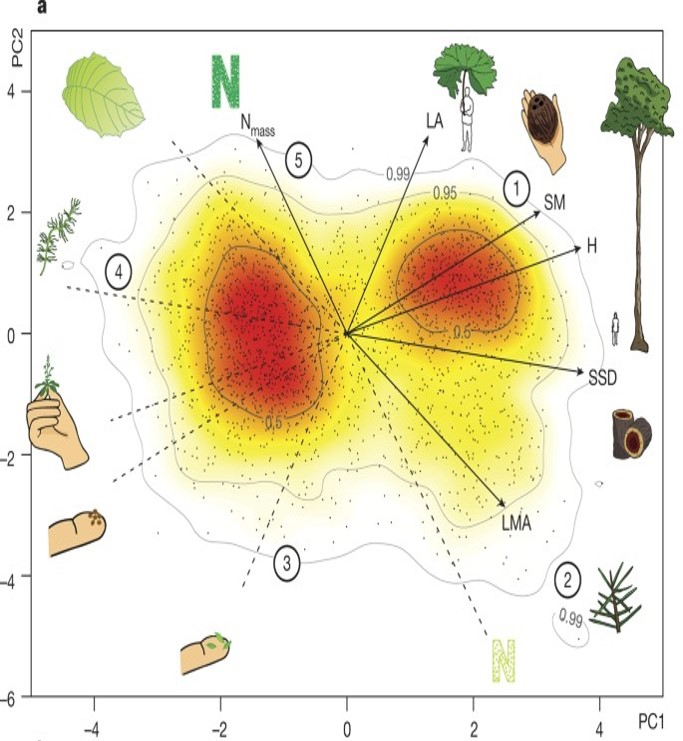

## Is the LES (THEORY) Perfect?

**2,500 = <1% of total described plant species. Some plant groups are underrepresented**

 
**Campany et al. 2021 - Epiphytic ferns show no relationships between N and LMA (orange circles)**

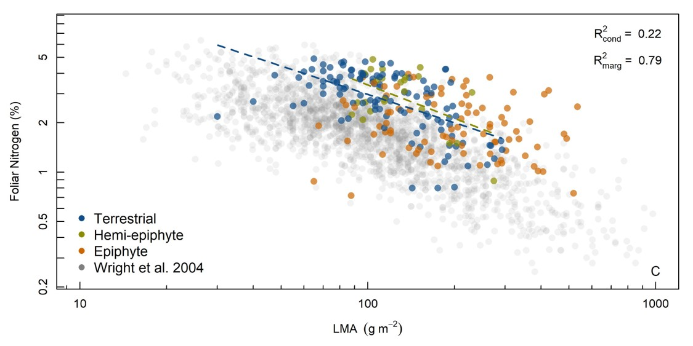

