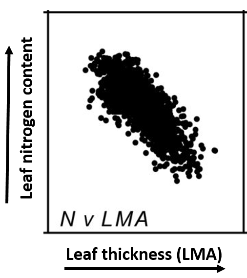

## The story of 4 traits

* **Function of a leaf can be explored across 4 key traits**
1. Specific leaf mass (thickness)
2. Nitrogen content
3. Photosynthetic rate
4. Leaf lifespan 

 

* **Responsible for fixing carbon that contributes to growth, reproduction and survival**
    + total gain, not instantaneous

 

* **Interplay between physiology, morphology, chemistry and investment**

## Leaf thickness = investment in construction 

* **Surface area typically rules in leaf making**
    + area exposed to light

 

* **However, variation in this simple plan is amazing striking**        
    + large vs small area (magnolia vs spruce)
    + thin vs thick
    + across and within species
    +  14 to 1,500 g m^2^
    
 

* **Why should every leaf not have large area?**
    + water loss, defense, mechanical support
    + environmental pressures

## Leaves really need nitrogen...

* **Vital structural and functional component of leaves:**
    + proteins, nucleic acids, ATP
    + co-enzymes NADP^+^, 
    + pigments 
    + 0.2 to 6.4%

 

* **The greatest sink for nitrogen is Rubisco**
    + 20-30% of leaf nitrogen

 

* **Nitrogen needed for leaf persistence**
    + structural proteins
    + herbivore defenses
    

## What rate of photosynthesis can plants achieve?

* **You know the different pathways...*

 

* **You know that leaves need lots of ingredients**

 

* **Rates of photosynthesis vary dramatically**
    + ferns = 1 umols m^-2^ sec^-1^
    + wheat = 25 umols m^-2^ sec^-1^
    + both ferns and wheat use C3 pathway
    
 

* **Why are rates so different?**
    + often differ within a canopy
    

## Leaf lifespan is more than just evergreen or deciduous

* **Leaf lifespan (LL) varies from few weeks to 25 years**
    + 0.9 to 288 months
    
 

* **Photosynthesis decreases with leaf age**
    + continually gets worse
    + when to start over?

 

* **Resources determine investment into leaf construction**
    + high resources = deciduous habitats
    + low resources = evergreen habitats

## Correlations among leaf traits shared across plants

* **Species of vascular plants display patterns in relationships between traits
    + all over the world
    + every habitat
    
* **Traits are multi-dimensional**
    + LL vs LMA vs N

 

* **For example, plants with low photosynthesis rates have long leaf lifespans**

 

* **The question becomes what causes this common pattern of co-variation?**
 
 
 

 
## Economic theory applied to plants

leaf economics are quantified in
terms of revenues and expenditures per unit investment

collection of traits that vary together and act as a trade-off between acquiring and conserving resources.

## 

## Leaf Economic Spectrum (Wright et al. 2003)

This spectrum runs
from species with potential for quick returns on investments of
nutrients and dry mass in leaves to species with a slower potential
rate of return. At the quick-return end are species with high leaf
nutrient concentrations, high rates of photosynthesis and respiration, short leaf lifetimes and low dry-mass investment per leaf area.
At the slow-return end are species with long leaf lifetimes, expensive
high-LMA leaf construction, low nutrient concentrations, and low
rates of photosynthesis and respiration.

## Leaf nitrogen and leaf thickness

## Leaf lifespan and leaf thickness

 LMA reflecting the dry-mass cost of deploying new
leaf area,

LL representing the duration over which photosynthetic revenue is returned

LL increased with LMA across all species

 
## These relationships regulate photosynthesis

a tenfold decrease in LMA, for example,
coincided with a 21-fold increase in photosynthetic capacity

low LMA, high A mass and generally faster turnover of

 high
A mass requires high N mass, and the combination of high LMA and
high N mass may increase vulnerability to herbivory

## Unpacking the spectrum: Fast vs Slow

## Trait realtionships vary with climate

## LES in plant ecology

Plant species adapted to resource-rich environments and able to compete well under nutrient rich conditions are often less defended against natural enemies. 

Nitrogen disease hypothesis: Higher nutrient content of the plant material following nitrogen fertilization should promote disease. 
Host dilution hypothesis: Many pathogens are dependent on the availability and density of host plants.

At high plant diversity the abundance of each host plant is in average lower than in species poor communities, which is suggested to be the underlying mechanism of observed negative diversity-disease relationships.

## Do trait realtionships exists beyond the leaf?

Strategies for plant fitness also exist on a spectrum

1. Seed production: coconut to orchid seed
2. Mycorrhiza relationships
3. Plant height - short to tall

Besides leaf economics, many activities such as seed production,
root economics and relations with mycorrhizas are undoubtedly
important for plant fitness.

## The global spectrum of plant form and function

