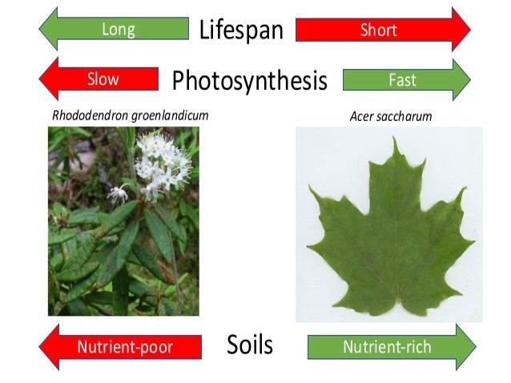
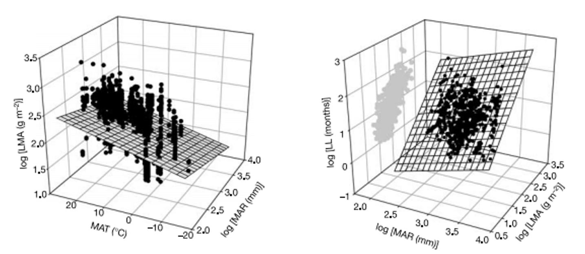

## The story of 4 traits

 

* **Function of a leaf can be explored across key traits**
1. Specific leaf mass (thickness)
2. Nitrogen content
4. Leaf lifespan 
3. Photosynthetic rate (umols CO^2^ m^-2^ s^-1^)

 

* **Responsible for fixing carbon that contributes to growth, reproduction and survival**
    + total gain, not instantaneous

 

* **Interplay between physiology, morphology and chemistry**

## Leaf thickness = leaf mass / leaf area (LMA)

* **Surface area typically rules in leaf making**
    + area exposed to light

 

* **However, variation in this simple plan is amazing striking**        
    + large vs small area (magnolia vs spruce)
    + thin vs thick
    + across and within species
    +  14 to 1,500 g m^2^
    
 

* **Why should every leaf not have large area?**
    + water loss, defense, mechanical support
    + environmental pressures

## Leaves really need nitrogen (N)...

* **Vital structural and functional component of leaves:**
    + proteins, nucleic acids, ATP
    + co-enzymes NADP^+^, 
    + pigments 
    + 0.2 to 6.4% of leaf mass

 

* **The greatest sink for nitrogen is Rubisco**
    + 20-30% of leaf nitrogen

 

* **Nitrogen needed for leaf persistence**
    + structural proteins
    + herbivore defenses
    

## Leaf lifespan is more than just evergreen or deciduous

 

* **Leaf lifespan (LL) varies from few weeks to 25 years**
    + 0.9 to 288 months
    
 

* **Resources determine investment into leaf construction**
    + high resources = deciduous habitats
    + low resources = evergreen habitats
    
 

* **Photosynthesis decreases with leaf age**
    + continually gets worse
    + when to start over?

## What rate of photosynthesis can plants achieve?

 

* **You know the different pathways...**

 

* **You know that leaves need lots of ingredients**

 

* **Rates of photosynthesis vary dramatically**
    + ferns = 1 umols m^-2^ sec^-1^
    + wheat = 25 umols m^-2^ sec^-1^
    + both ferns and wheat use C3 pathway
    + often differ within a canopy
    
 

* **Why are rates so different?**
    

## Correlations among leaf traits shared across plants

 
 

* **Vascular plants display patterns in relationships between traits**
    + all over the world
    + every habitat

 

* **Traits are multi-dimensional**
    + LL vs LMA vs N vs Photo

 
 
 
## Economic theory applied to plants

 
 

* **Leaf economics = revenues and expenditures per unit investment (ROI)**

 

* **Traits vary together and trade-off between acquiring and conserving resources**

 

## Leaf Economic Spectrum (Wright et al. 2003)

## Leaf nitrogen and leaf thickness

 

* **Increases in leaf N = optimized function**
    + N for Rubisco, chlorophyll
    + N for defense compounds

 

* **If N is high, why build expensive thick leaves?**
    + fast R.O.I.

 

* **Low leaf N  = reduced function**
    + more invested in leaf mass (thick)
    + slow R.O.I
    + why?
    

## Leaf thickness and leaf lifespan

 

* **Thickness reflects mass cost of deploying new leaf area**
    + thin leaves = cheaper
    + thin leaves if... R.O.I is fast
    
 

* **Leaf Lifespan represents the duration of photosynthetic revenue**
    + the 'return' of R.O.I

 

* **Thin leaves = short leaf life span**
* **Thick leaves = long leaf life span**

 
## These relationships regulate photosynthesis

* **Decrease in LMA =  Increase in photosynthesis rates**
    + usually high N but short lived
    + fast R.O.I

 

* **Long leaf lifespans = low photosynthesis rates**
    + usually thick leaf with low N
    + slow R.O.I

 

* **Environment plays a role:**
    + high N leaves are yummy to bugs
    + Leaf lifespan shorter whe rainfall lower

 

* **Is this the same for all leaves on a plant?**

<!-- ## Trait relationships vary with climate -->
<!-- 
 -->

<!-- * **Leaf lifespan shorter at sites of lower rainfall** -->
<!--     + duration of R.O.I reduced -->

<!--  -->

<!-- ## LES in plant ecology -->
<!-- 
 -->

<!-- Plant species adapted to resource-rich environments and able to compete well under nutrient rich conditions are often less defended against natural enemies.  -->

<!-- Nitrogen disease hypothesis: Higher nutrient content of the plant material following nitrogen fertilization should promote disease.  -->
<!-- Host dilution hypothesis: Many pathogens are dependent on the availability and density of host plants. -->

<!-- At high plant diversity the abundance of each host plant is in average lower than in species poor communities, which is suggested to be the underlying mechanism of observed negative diversity-disease relationships. -->

<!--  -->

## Do similar trait realtionships exist for whole plants?

**Strategies for plant fitness also exist on a spectrum**

1. Seed production: coconut to orchid seed
2. Height: few cm to 115m
3. woody to non-woody
4. thick to thin leaves
5. leaf area: fingernail to car hood
6. Leaf nitrogen investment

 

* **Balances leaf construction costs against growth potential**

 

* **Size of whole plants and their parts**

 

* **Constrains evolution and qualifies plans for given environments**

## Global spectrum of plant form and function (Diaz 2016)

