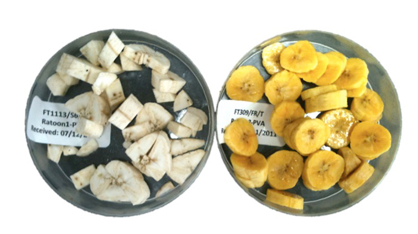

## Humans have manipulated plants since the ‘dawn of civilization’

 

* **Ancient Biotechnology (pre 1800)**
    + domestication of crops
    + yeast for fermentation and leavened bread
    + molds to saccharify rice

 

* **Classical Biotechnology (1800-1945)**
    + crossbreeding of cotton (100 of varieties)
    + first corn hybrid invented, then commercialized
    + Haber Bosch process

 

* **Modern Biotechnology (1945 - present)**
    + first genetically enginereed plant (1981) 
    + pest-resistant corn (B~t~) produced
    + 1993 GM foods declared 'not dangerous"
    + UN endoreses biotech crops
    + epigenetic cotton (not flowering restriction)
    + disease resistant rice

 

* **Identify promising traits and breed or engineer it into a valuable crop plant**

 

* **Intent the same for traditional plant breeding**

 

* **Introduce herbicide resistance into wheat variety with large grain size**
* **Bred large grain size into a variety with herbicide resistance**

 

* **Speed matters! Current biotechnology works much faster**

## Cell and Tissue Culture

## Molecular Plant Breeding

## Transgenic Plants

##

## Herbicide Resistance 

## Against the Grain

## Insect Resistance

## Bt Corn

## Bt Corn Contreversy

## The Promise of Golden Rice

## Other GM Foods

## Disease Resistance

## GM plants for Bioremediation

## GM Trees

## Regulation and Saftery concerns

## Gene Editing: CRISPR/Cas9

## Cons of genetic engineering

* **Herbicide-resistance or insect-resistance genes could spread**
    + from  engineered crops to wild relatives
    + create weeds that are difficult to control

* **Does the USDA require sufficient precautions to prevent the spread of genes from engineered plants to their wild relatives?**

 

* **Bioengineered products could wipe out the major exports of developing nations**
    + bacterium under development to produces vanilla flavoring
    + could eliminate markets for Madagascar vanilla beans

4. Biological control may solve the problem, cheaper and more effectively, as shown with the work on the cassava mealybug by Dr. Hans Herren, winner of the 1995 World Food Prize

## Pros of genetic engineering

Almost 100 million people are expected to be added to the world's population each year for the next 30 years
a. some believe that without biotechnology, we won't be able to increase the availability of affordable basic food.