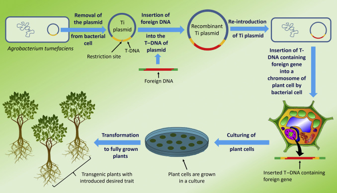

## Humans have manipulated plants since the ‘dawn of civilization’

* **Ancient Biotechnology (pre 1800)**
    + domestication of crops
    + yeast for fermentation and leavened bread
    + molds to saccharify rice

 
 
 

* **Classical Biotechnology (1800-1945)**
    + crossbreeding of cotton (100 of varieties)
    + first corn hybrid invented, then commercialized
    + Haber Bosch process

* **Modern Biotechnology (1945 - present)**
    + first genetically engineered plant (1981) 
    + pest-resistant corn (B~t~) produced
    + 1993 GM foods declared 'not dangerous"
    + UN endorses biotech crops
    + epigenetic cotton (not flowering restriction)
    + disease resistant rice

## Intent Behind Plant Biotechnology

 

* **Identify promising traits and breed/engineer into crop plants**

 

* **Intent the same for traditional plant breeding**

 

* **Introduce herbicide resistance into wheat variety with large grain size**
* **Bred large grain size into a variety with herbicide resistance**

 

* **Speed matters! Current biotechnology works faster**

## Cell and Tissue Culture

 
 
 

* **Growing plants from single cells has major applications**
    + 'clones'

 

* **Viruses are less common in stem tissues...**

 

* **Rates of mutations appear greater in cell cultures**
    + study: 13 unique traits from 240 tomato plantlets
    + avenue to test for resistance

 
   
    
## Molecular Plant Breeding

 

* **Artificial selection (Mendel) can produce a desired trait**
    + but takes many generations
    + traits like resistance are not 'visible'
 
  
 
* **Marker-assisted selection: screening seedlings for DNA sequence**
    + large fruit size
    + disease resistance

 

* **Are possible because of the &#8593; # of plant genomes**
    + gene editing and genetic engineering

## Transgenic Plants

* **Molecular biology allows breeders to harness the 'Central Dogma"**
    + DNA instructions turned into useful products

 

* **Genetic engineering allows transfer of genes across species**
    + *transgenic plants*
    + not possible with traditional breeding

 

* **Foreign genes inserted with Ti plasmid**
    + useful in dicots

 

* **75% of processed foods in US contain ingredients from GM plants**

<!-- ## -->

<!--  -->

## Herbicide Resistance 

 
 
 

* **Weed control is key for increasing crop yield**
    + competition for light, water & nutrients
    + chemical herbicides are widespread

 

* **Sustainable no-till agriculture needs herbicides**

 

* **Bacterial gene with glyphosate resistance introduced to various crop plants**
    + allows use of 1 broad spectrum herbicide
    + 88% of transgenic crops = herbicide resistance

## Against the Grain

## Insect Resistance

 

* **Bacillus thuringiensis = soil bacterium that produces proteins with insecticide properties**
    + >1,000 strains isolated
    + 200 different proteins

 

* **Bt crops commercially planted in 1996**
    + corn, cotton & potatoes
    + >60% of US corn now express Bt toxins

 

* **Bt crops are believed to save 50-70% of costs of insecticides**
    + also avoids indirect environmental damage
    + Bt toxins not harmful to animals

## Bt Corn Controversy

## The Promise of Golden Rice

## Other GM Foods

 

**Soybean that produces less unsaturated fats (cholesterol)**

 

**Bananas with enhanced Vitamin A and iron**

 

**Granny Smith and Golden Delicious apples that do not brown when cut**

 

**Potatoes that produce low acrylmaide (cancer causing in rats) when fried**

 

**Alfalfa with lower lignin; easier to digest as animal feed**

 

**Corn that is drought-resistant (approved in 2011)**

## Disease Resistance

* **Viral genes have been inserted into various plants**
    + viral coat proteins turned off
    + mechanism unknown
 
  
 
* **Stone fruits are susceptible to plum pox virus**
    + 2010 USDA approved transgenic resistant plum
 
  
 
* **Blight resistant potatoes to Phytophtora now developed**
    + genes from S. American variety into red skin taters

 

* **Research underway to engineer blight resistance in wheat**

## GM Plants for Bioremediation

 
 
 
 
  

* **Plants engineered to accumulate heavy metals**
    + or breakdown various toxic compounds
 
  
 
* **Tobacco, birch, poplar, rice, Indian mustard**
 
  
 
* **None are approved but could process pollutants 100x faster**

## Frost resistant *Eucalyptus* for paper, pulp and biofuels

## Regulation and Saftey concerns

 
* **USDA, EPA and FDA involved in approval of GM crops**
    + transgenic plants with Bt must be approved by EPA

  
 
* **Is GM technology just an extension of traditional selection?**

  
 
* **Do we really know the impacts of transferring genes?**
    + some countries only use GM crops from animal feed
 
   
  
* **Could the altered organism pass genes to the wild?**

  
 
* **What happens when weeds become resistant to glyphosate?**
    + 38 already have (2014)

## Gene Editing: CRISPR/Cas9

<!-- ## Cons of genetic engineering -->
<!-- 
 -->

<!-- * **Herbicide-resistance or insect-resistance genes could spread** -->
<!--     + from  engineered crops to wild relatives -->
<!--     + create weeds that are difficult to control -->

<!-- * **Does the USDA require sufficient precautions to prevent the spread of genes from engineered plants to their wild relatives?** -->

<!--   -->

<!-- * **Bioengineered products could wipe out the major exports of developing nations** -->
<!--     + bacterium under development to produces vanilla flavoring -->
<!--     + could eliminate markets for Madagascar vanilla beans -->

<!-- 4. Biological control may solve the problem, cheaper and more effectively, as shown with the work on the cassava mealybug by Dr. Hans Herren, winner of the 1995 World Food Prize -->

<!-- ## Pros of genetic engineering -->
<!-- 
 -->

<!-- Almost 100 million people are expected to be added to the world's population each year for the next 30 years -->
<!-- a. some believe that without biotechnology, we won't be able to increase the availability of affordable basic food. -->