```{r setup, include=FALSE}
knitr::opts_chunk$set(echo = FALSE)
```

## Histories of Plants in Medicine
<hr>
<br/>

<div style="float: left; width: 55%;">

* **Earilest known medical document by Sumerians**
    + 4,000 years ago in Mesopotamia

<br/>

* **Herbal medicines were prevalent in ancient Egypt**
    + mandrake for pain, garlic for heart
    + remedies 'published' in Ebers Papyrus

<br/>

* **Ancient Chinese reveal herbal remedies**
    + Pun-tsao (1600) thousands of herbal remedies

<br/>

* **Aztecs gifted Badianus manuscript to king of Spain**
    + herbal remedies for 100 afflictions

 </div>


## Ancient Greeks are the Foundation of Western Medicine
<hr>
<br/>

<div style="float: left; width: 64%;">

* **Greek physician, Hippocrates, Father of Medicine**
    + believed diseases had *natural* causes
    + used various herbal remedies
    + works used for 1500 years!

<br/>

* **Dioscorides, Roman military physician, wrote 'De Materia Medica'**
    + 600 species of plants with medicinal value
    + recorded while on 'military travel'

<br/>

* **Herbal remedies by Greeks/Romans have been kept and lost**
    + willow bark tea = precursor to asprin
    + *Ferula* used for contraception but collected to extinction

 </div>
 
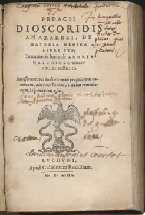

## Age of Herbals: Doctrine of Signatures
<hr>
<br/>

<div style="float: right; width: 55%;">

* **Renaissance age (1500) & printing press created a revival of herbalism**
    + 4 German 'Fathers of Botany'
    + Gerard, "The herbal of general history of plants"

<br/>

* **Publishings included medicinal uses & superstitions**
    + Culpepper, "The complete herbal" included astrology
 
 <br/>
 
* **Doctrine of Signatures: herbs resembling various parts of the body can be used to treat ailments of those body parts**
    + juice of bloodwort treats blood disorders
    + lobed liverwort treats liver complaints

 </div>
 
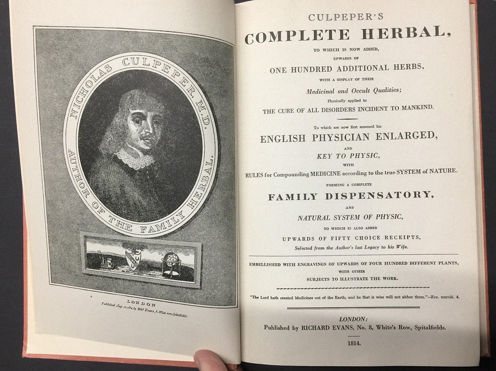

## 

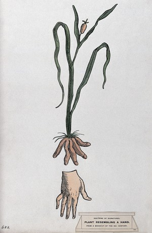

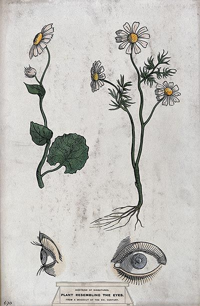

<!-- 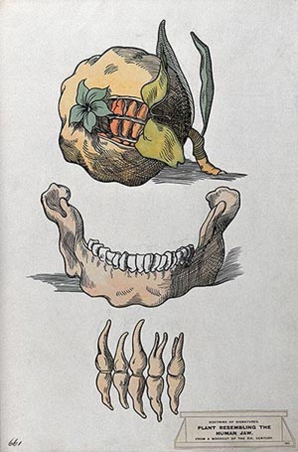 -->

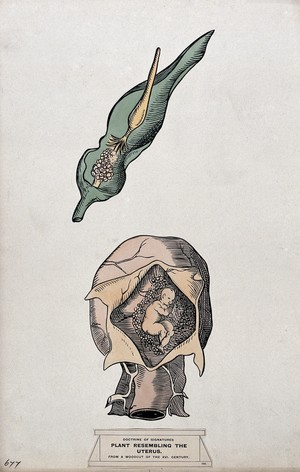

## Modern Prescription Drugs
<hr>

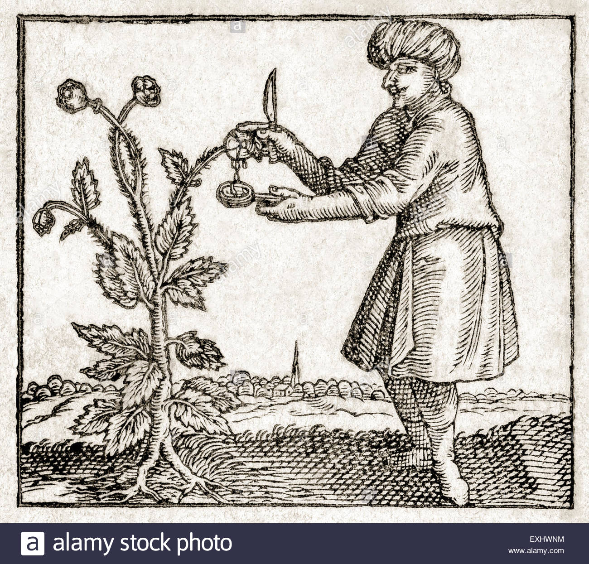

<div style="float: left; width: 58%;">

* **Herbalism diminished in recent centuries, but remedies still were effective**
    + remedies became 'prescriptions' by physicians
    + William Withering, 1775, foxglove for heart failure
    + new standard for pharmaceutical industry

<br/>

* **Purifying active extracts started in 19^th^ century**
    + morphine from poppy in 1806
    + synthetic drugs based on natural products ~1850s
    
<br/>

* **Salicyclic acid (many plants) synthesized for pain relief**
    + led to development of aspirin

<br/>

* **25% of prescriptions today contain plant-derived active ingredients**
    + research still investigating new active compounds
    + e.g. studying ingredients in Native America remedies

 </div> 
 
## Herbal Medicine Today
<hr>

<div style="float: left; width: 64%;">

* **Rural populations still rely on herbal medicine**
    + China, India, S. America & Africa
    + projected to reach $1.3 Billion by 2023

<br/>

* **Modern Chinese medicine combines herbal, acupuncture & Western medicine**
    + unique health care from 1 billion people
    + thousands of medicinal herbs

<br/>

* **Modern Indian culture believe in traditional medicine**
    + manufactured pharmaceuticals too expensive
    + reliance on indigenous cures

<br/>

* **Rainforests are hubs of medical potential, but are decreasing**
    + loss of tribal herbal practices

 </div>
 
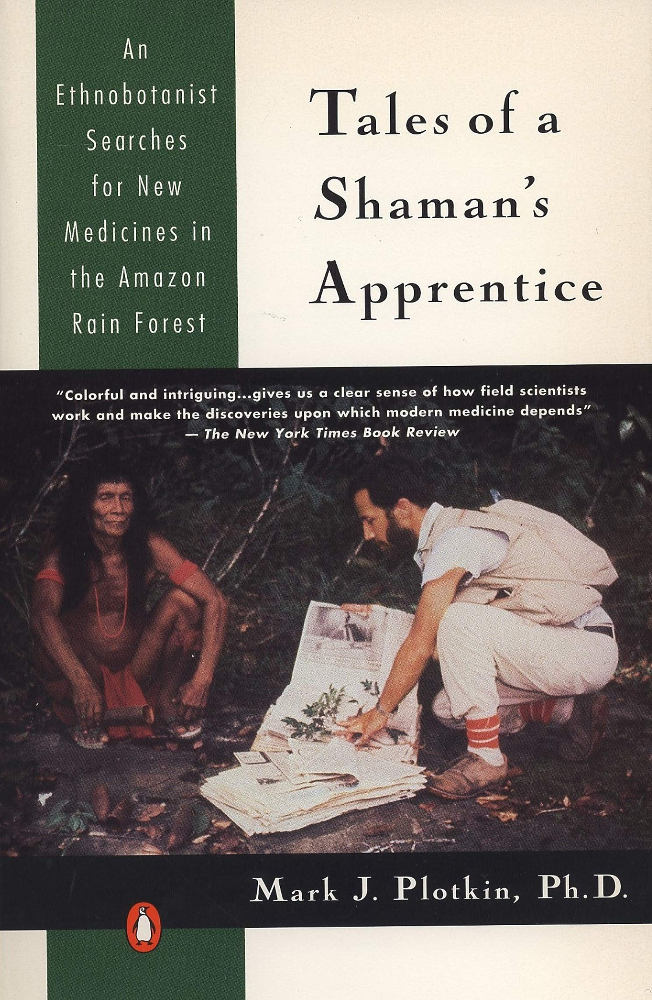

## Active Principals in Plants
<hr>
<br/>
<br/>
<br/>

<div style="float: right; width: 60%;">

* **Medicine value tied to chemical compounds**
    + manufactured by biochemical pathways

<br/>

* **Compounds called 'secondary products' as they do not directly impact metabolism**
    + alkaloids, glycosides, terpenes & phenolics

<br/>

* **Herbivore defense, inhibit fungal or bacteria pathogens**

 </div>
 
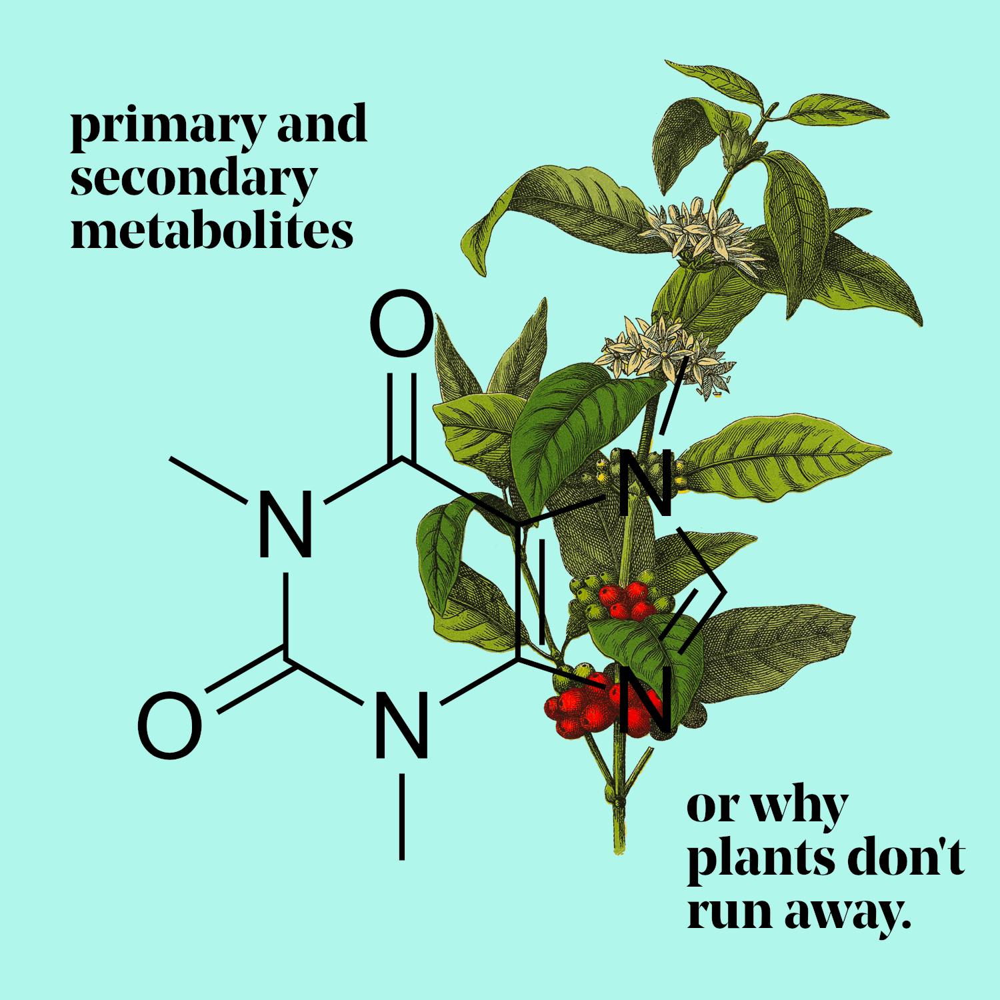

## Alkaloids and Glycosides
<hr>
<br/>

<div style="float: right; width: 55%;">

* **Alkaloids: diverse compounds found in dicots**
    + contain nitrogen
    + bitter
    + impact animal nervous systems
    + medicinal, poisonous, hallucinogenic
    + caffeine, nicotine, cocaine, morphine, quinine

<br/>

* **Glycosides: widespread compounds with glucose**
    + cyanogenic or cardioactive glycosides, saponins
    + steroid molecules as active component
    + treat heart failure
    + precursors for sex hormones
    + can be very toxic
    
 </div>
 
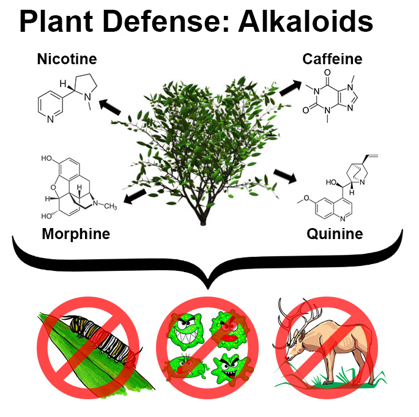

## Medicinal Plants: Foxglove
<hr>
<br/>

<div style="float: left; width: 70%;">

* **Foxglove (*digitalis purpurea*) bienneial in snapdragon family**
    + lawn ornamental
    + 30 different glycosides
    + can be very toxic

<br/>

* **Millions of USA heart patients rely on *digitalis* as primary treatment**

<br/>

* **In 1775, British physician learned of a folk remedy for dropsy**
    + bloating due to fluid accumulation: congestive heart failure
    + digitalis tea became treatment
    + slows heart rate, increase strength of heartbeat
    
</div>
  
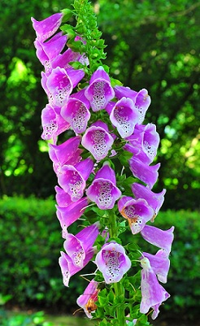

##

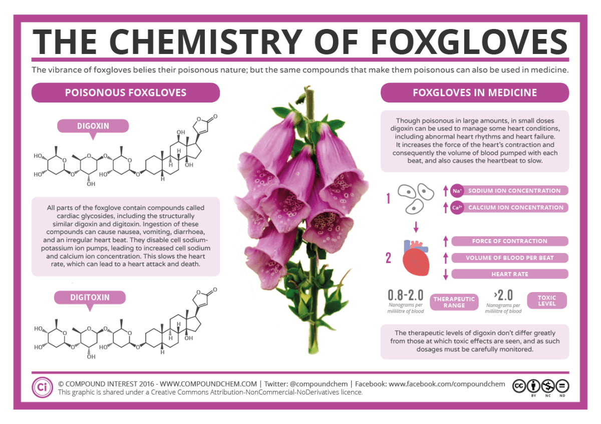

## Medicinal Plants: Willow to Aspirin
<hr
<br/>
<br/>

<div style="float: left; width: 60%;">

* **Willow tree bark used for pain reduction in many cultures**
    + ancient Greeks and Native Americans
    + reduces fever and chills

<br/>

* **Evolution of aspirin began with willow bark experiments in England**
    + 1828, salicin isolated as active ingredient
    + salicin derivatives occur in many species

<br/>

* **BAYER focused on acetylsalicylic acid from *Spirea*  plant**
    + less digestive issues
    + renamed to *aspirin*

</div>

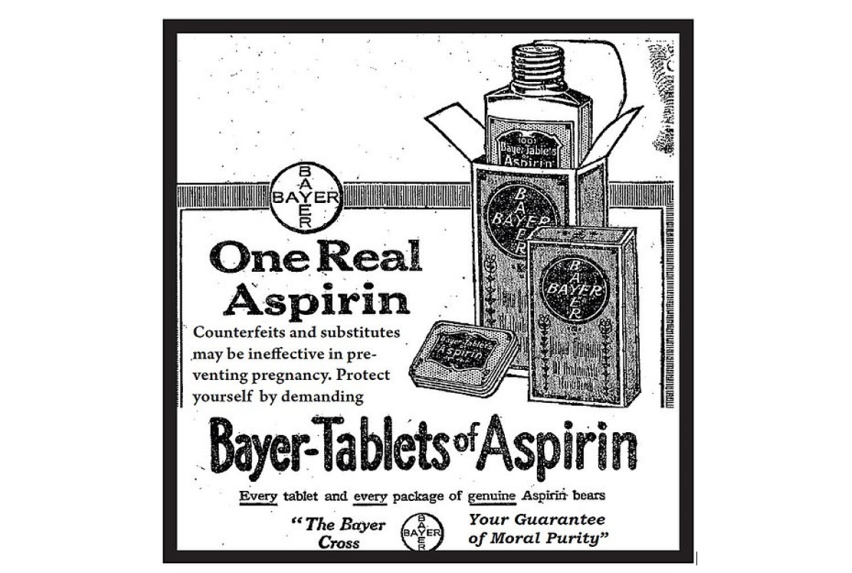

## Medicinal Plants: Fever Bark Tree
<hr>
<br/>

<div style="float: left; width: 59%;">

* **Malaria is one of the worlds most prevalent diseases**
    + 200 million infections each year
    + records of malaria date back to ancient Egyptians
    + female *Anopheles* mosquite w/ *Plasmodium* parasite
  
 <br/>   

* **Fever bark tree was first treatment for malaria**
    + native to east slopes of Andes mtns
    + belongs to coffee family
    + used by Incas to treat fever, then malaria
 
<br/>
  
* **Trade developed for powdered bark**
    + 2lbs to treat one person
    + *quinine* was isolated before over-exploitation
    + now: synthetic cholroquinine

</div>

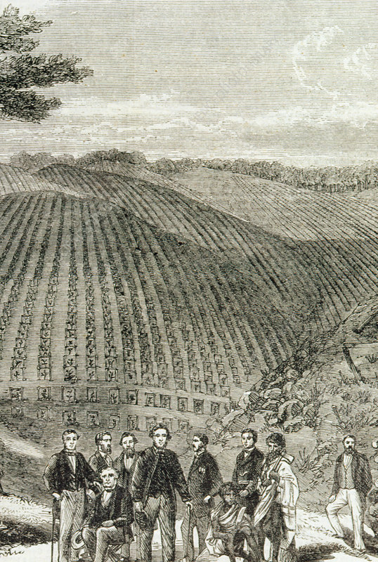

<!-- ## Medicinal Plants: French Lilca -->
<!-- <hr> -->

<!--  -->

## Medicinal Plants: Ephedra
<hr>

* **Ephedrine is a plant alkaloid produced by genu *Ephedra* **
    + only one genus in the family of gymnosperms
    + native to Americas, Europe, Asia & Africa

<br/>

* **Long cultural history as a herbal medicine**
    + decongestant and respiratory ailments

<br/>

* **Ephedrine still found in modern drugs**
    + relaxes bronchial muscles
    + CNS stimulant

<br/>

* **Large scale abuse of herbal *Ephedra* products**
    + herbal ecstasy, similar to amphetamines
    + activates thermogenesis, calorie burning
    + supplements illegal, medications ?

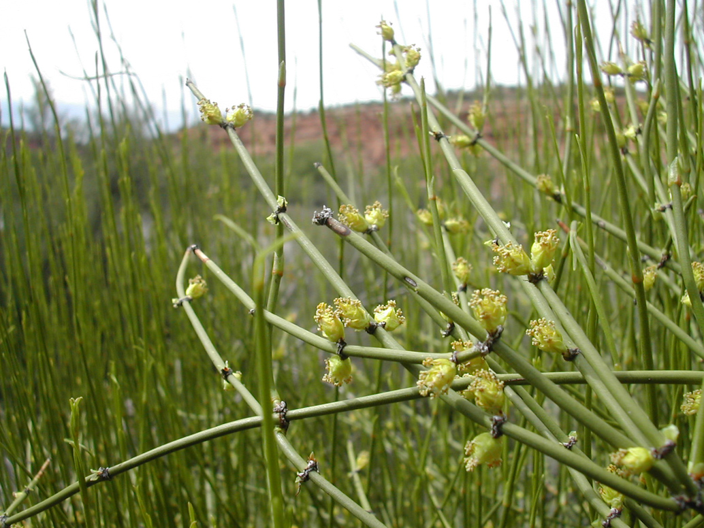

## Medicinal Plants and Cancer
<hr>
<br/>

<div style="float: left; width: 65%;">

* **Humans have suffered cancer for 1,000s of years**
    + Ebers Papyrus suggested treatments
    + 2^nd^  leading cause of death in US
    
<br/>

* **Plants have always featured in folk remedies**
    +  search for anticancer plant sources began in 50's by NCI
    + 1,000s of plants have been screened
    + several now part of chemotherapy treatments

<br/>

* **Vinca alkaloids for leukemia (Madagascar periwinkle)**
* **Taxol from Pacific yew used in many chemotherapy treatments**
* **Camptotheca from Chinese happy tree for ovarian cancer**

</div>

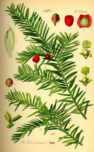

## Herbal Remedies: Promises and Problems
<hr>
<br/>

<div style="float: right; width: 60%;">

* **Plants and plant extracts feature prominently in alternative medicines**
    + considered dietary supplements by FDA
    + $7 billion  a year industry

<br/>

* **Dietary supplements are not subject to FDA approval**
    + no rigorous clinical testing
    + FDA will only take reactionary actions

<br/>

* **Secondary plant compounds may have health benefits or cause adverse reactions**
    + 40% of US populations uses alternative medicines
    + no clinical linkage to medications

</div>

