## Why does traditional plant medicine exist?

 

* **Humans have always searched for substances that relieve suffering and provide cures for loved ones**

 

* **Mystical agents underlying the natural world were thought to cause illness, thus cures were sought from animals and plants**  
    + likely involved a painful process of trial and error

 

* **Communication among early populations was poor...**
    + slowed accumulation/spread of medical knowledge
    + remedies discovered independently several times

 

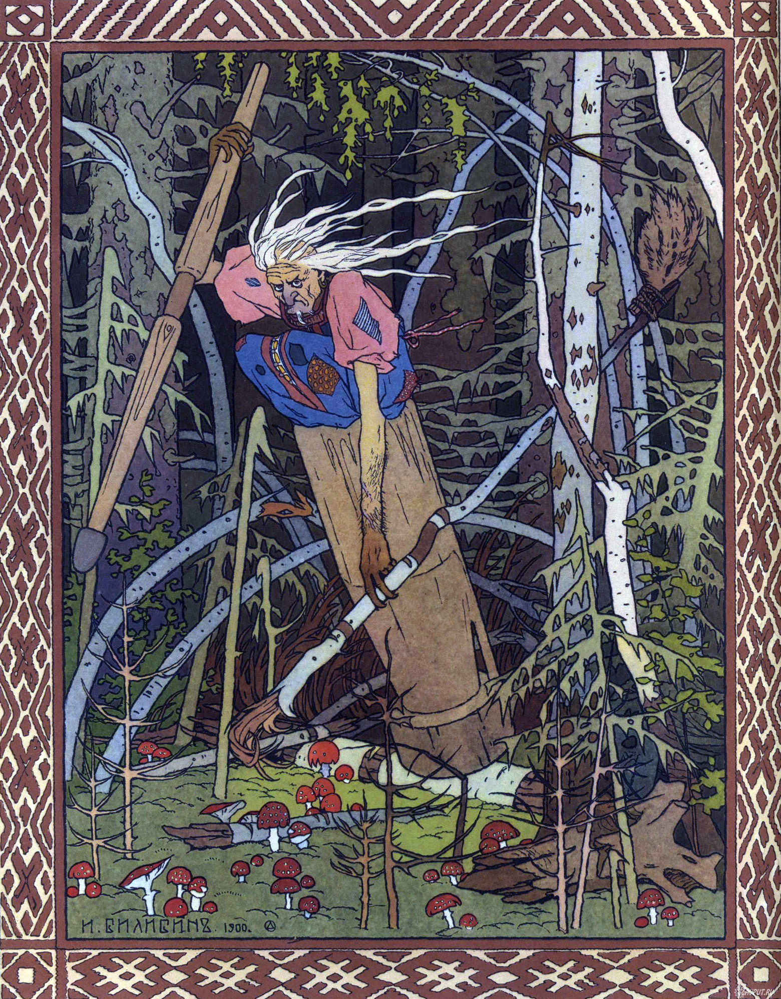

## Histories of plants in medicine eventually recorded

 

* **Earilest known medical document by Sumerians**
    + 4,000 years ago in Mesopotamia

 

* **Herbal medicines were prevalent in ancient Egypt**
    + mandrake for pain, garlic for heart
    + remedies 'published' in Ebers Papyrus

 

* **Ancient Chinese reveal herbal remedies**
    + Pun-tsao (1600) thousands of herbal remedies

 

* **Aztecs gifted Badianus manuscript to king of Spain**
    + mesoamerican herbal remedies for 100 afflictions

 

## Ancient Greeks are the foundation of western medicine

 

* **Greek physician, Hippocrates, Father of Medicine**
    + believed diseases had *natural* causes
    + used various herbal remedies
    + works used for 1500 years!

 

* **Dioscorides, Roman military physician, wrote 'De Materia Medica' describing preparation of 1000 simple drugs**
    + 600 species of plants with medicinal value
    + very inaccurate but became a prototype

 

* **Herbal remedies by Greeks/Romans have been kept and lost**
    + willow bark tea = precursor to asprin
    + *Ferula* used for contraception but collected to extinction

 

 
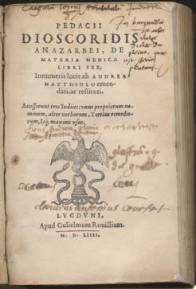

## Age of herbals: Doctrine of Signatures

 

* **Renaissance age (1500) & printing press created a revival of herbalism**
    + 4 German 'Fathers of Botany'
    + Gerard, "The herbal of general history of plants"

 

* **Publishings included medicinal uses & superstitions**
    + Culpepper, "The complete herbal" included astrology
 
  
 
* **Doctrine of Signatures: herbs resembling various parts of the body can be used to treat ailments of those body parts**
    + juice of bloodwort treats blood disorders
    + lobed liverwort treats liver complaints

 

 
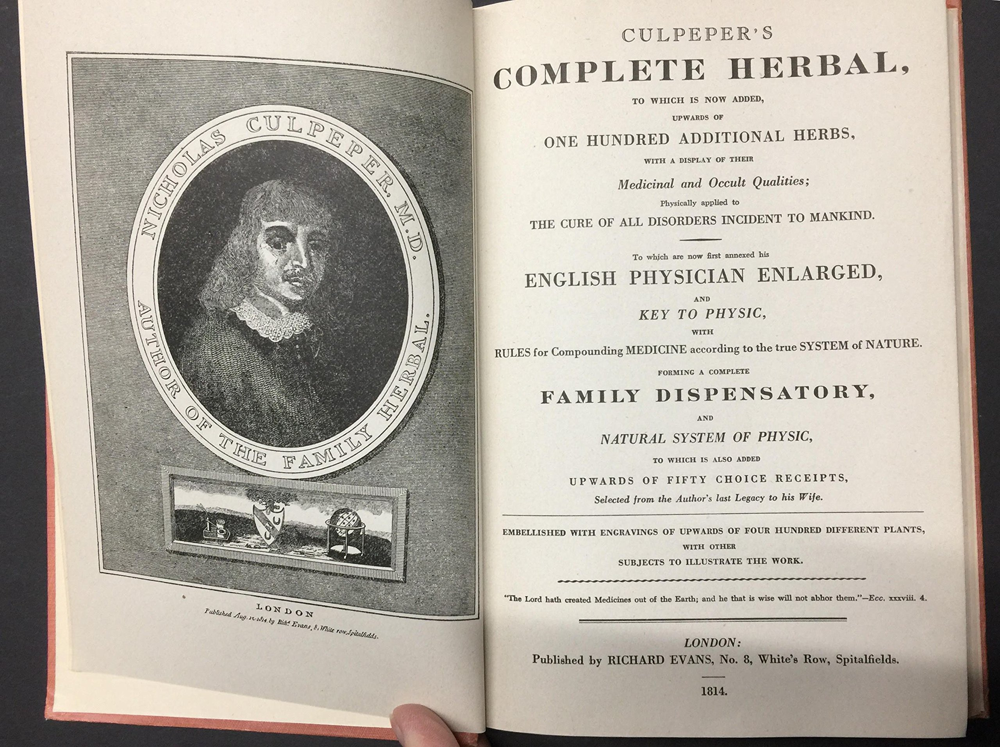

## 

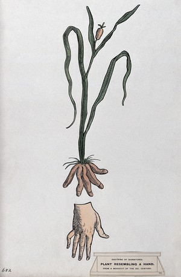

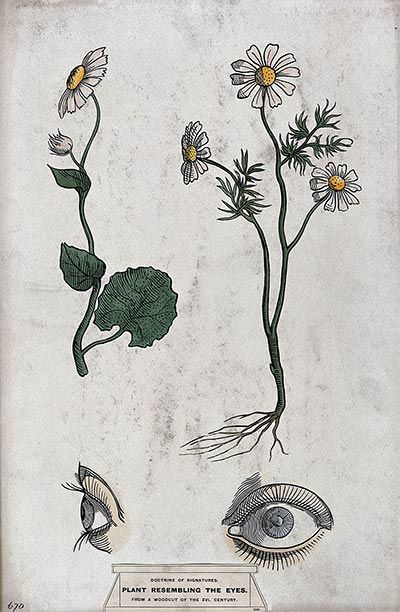

<!-- 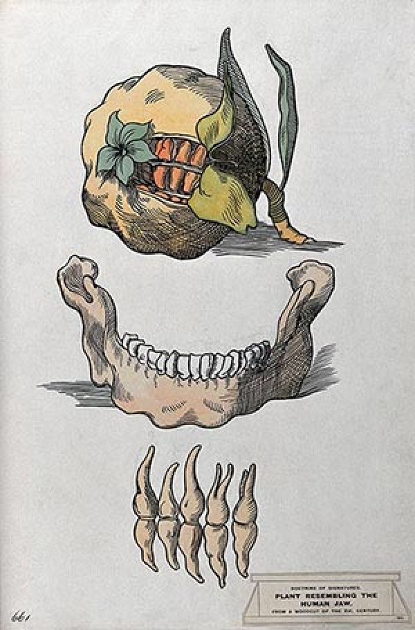 -->

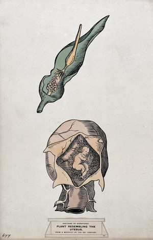

## 17-18th century added experimental approaches

 
 

* **Science and philosophy advanced to hypotheses testing stage**
    + helped discredit many previous approaches

 

* **Improved understanding of human physiology led to more careful testing of medicines**

 

* **Led to the discovery of vaccinations and documented experiments on plant medicines for heart problems (e.g., foxglove for dropsy)**
    + start of 'pharamacology'

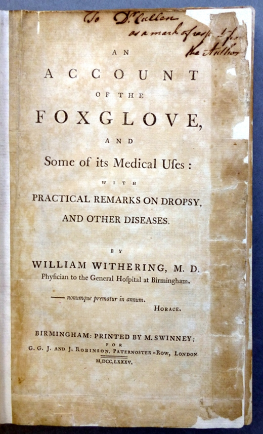

## Modern era prescription drugs

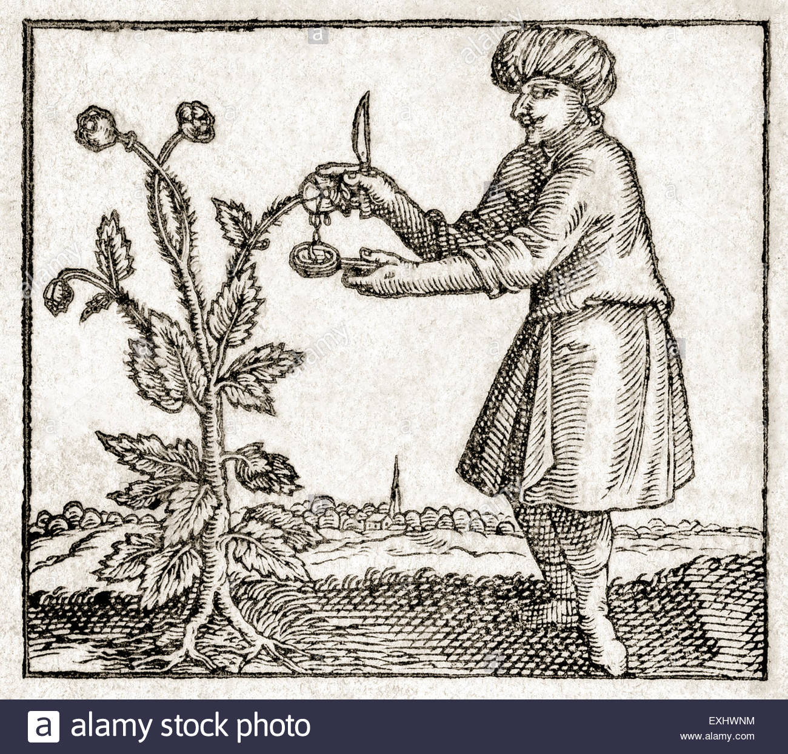

* **Herbalism diminished in recent centuries, but remedies still were effective**
    + remedies became 'prescriptions' by physicians
    + William Withering, 1775, foxglove for heart failure
    + new standard for pharmaceutical industry

 

* **Purifying active extracts/synthetics started in 19^th^ century**
    + morphine from poppy in 1806
    + Salicyclic acid (many plants) synthesized for pain relief

 

* **25% of prescriptions today contain plant-derived active ingredients**
    + research still investigating new active compounds
    + e.g. studying ingredients in Native America remedies

 
 
## Modern era plant-based medicine

 

* **First half of 20th century was a period of tremendous advancement as the causes of diseases were uncovered**

 

* **Initially, many modern medicines were isolated, purified products from traditional plant-derived extracts**
    + morphine, quinine, ephedrine

 

* **Chemists begin to determine the structures of these active compounds**
    + eventually leads to synthetic synthesis

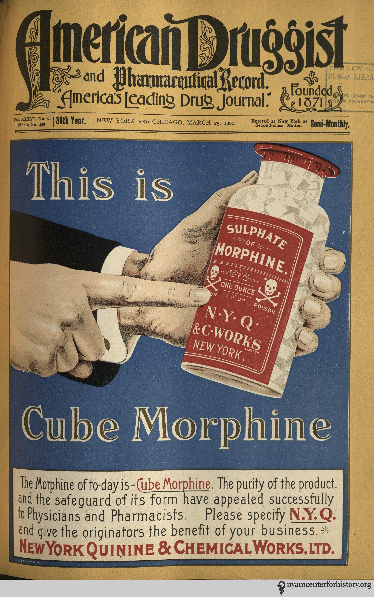

## Reduction in natural remedies post 1950's

    

* **Health care workers developed disdain for 'folk' based medicine**
    + belief that humans have 'tested-out' plants for medicinal value

    

* **Pharmaceutical companies are now reluctant to undertake massive screening and testing programs to explore for new plant drugs**
    + low ROI

 

* **Advances in understanding the biochemistry of disease favor design of novel synthetic drugs**

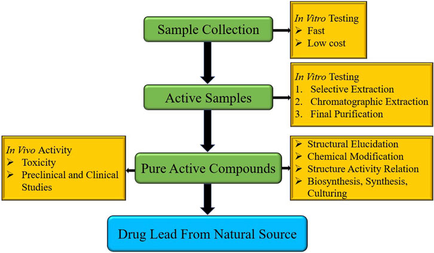

## Is the philosophy of Western medicine a barrier?

 

* **Western medicine philosophy: emphasis on diagnosis of explicit disease and treatment with with one/few specific compounds**

 

* **Different practices of medicine treat illnesses more holistically**
    + ailments are manifestations of an imbalance
    
 

* **In these alternate practices, plant-based medicine is far more common**
    + in recent decades these approaches have increased in the US/Europe

     
    
* **Across approaches to medicine, the role of plant biodiversity remain vital**
    + emerging diseases/strains vs compounds discovered from plants

## National Cancer Institute: Natural Products Discovery Program

  

**Since 1986, the Developmental Therapeutics Program at NCI has empowered the program to acquire plants and marine organisms through collection contracts**

  

**Encompasses >25 tropical and subtropical countries worldwide**

  

* **80k plant samples (green)**
    + 5K unique genera
  

* **25K marine invertebrates and algae (blue)**
    + 4K unique genera
  

* **25K microbial samples (brownish)**
    + 1K unique genera
  

* **over 230,000 unique extracts**

 
## Herbal medicine today

* **Rural populations still rely on herbal medicine**
    + China, India, S. America, Africa, & Appalachia
    + medicine + supplements industry value = ~250 million

 

* **Modern Chinese medicine combines herbal, acupuncture & Western medicine**
    + unique health care from 1 billion people
    + thousands of medicinal herbs

 

* **Modern Indian culture believe in traditional medicine**
    + manufactured pharmaceuticals too expensive
    + reliance on indigenous cures

 

* **Rainforests are hubs of medical potential, but are decreasing**
    + loss of tribal herbal practices

 

 
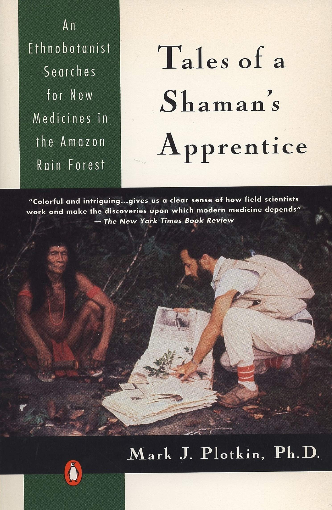

## Active principals in plants

 
 
 

* **Medicine value tied to chemical compounds**
    + manufactured by biochemical pathways

 

* **Compounds called 'secondary products' as they do not directly impact metabolism (growth)**
    + alkaloids, glycosides, terpenes & phenolics

 

* **Herbivore defense, inhibit fungal or bacteria pathogens**

 

 
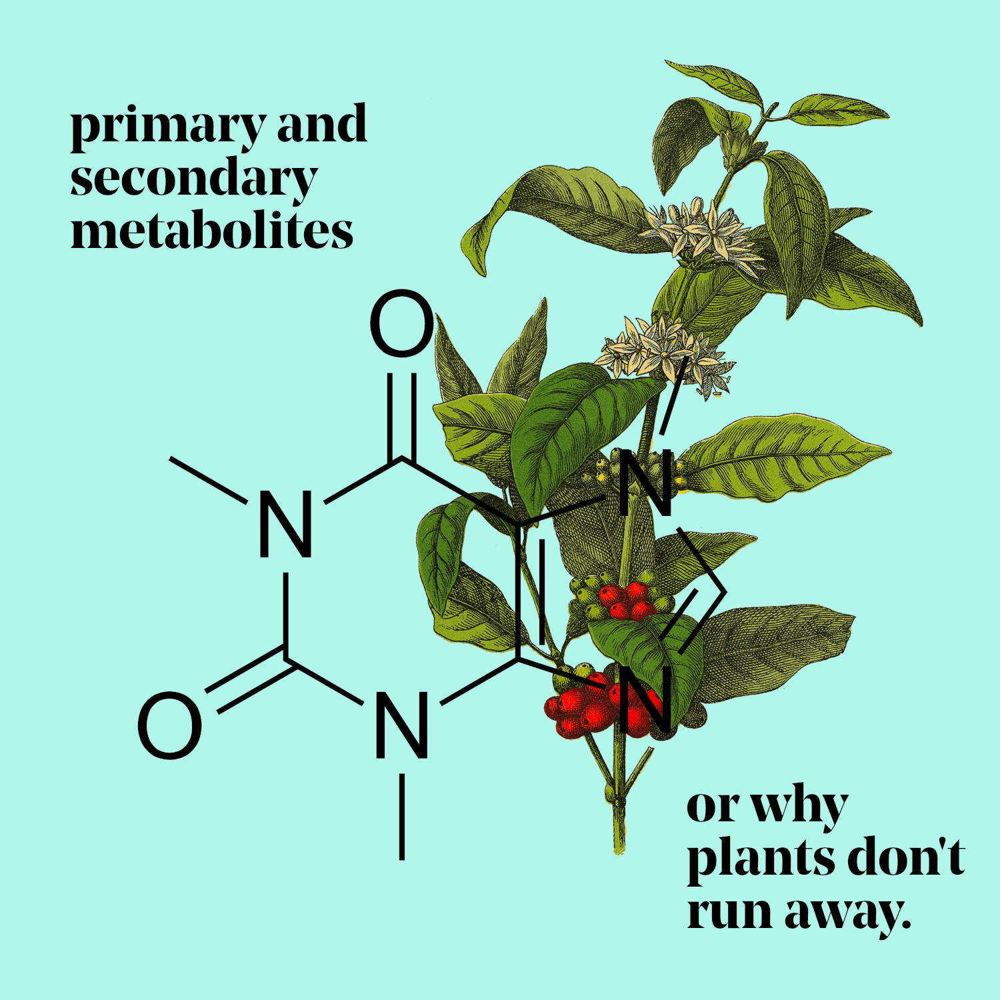

## Alkaloids and Glycosides

 

* **Alkaloids: diverse compounds found in dicots**
    + analegstics - pain reduction
    + impact animal nervous/muscle systems
    + medicinal, poisonous, hallucinogenic
    + *caffeine, nicotine, cocaine, morphine, quinine*

 

* **Glycosides: widespread compounds with glucose**
    + cyanogenic or cardioactive glycosides, saponins
    + steroid molecules as active component
    + treat heart failure, can be toxic
    + digitalis, lily of the valley, oleander
    
 

 
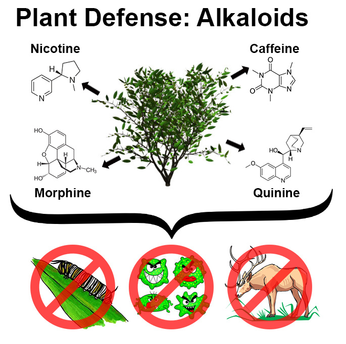

## Medicinal plant case study: Foxglove

 

* **Foxglove (*digitalis purpurea*) bienneial in snapdragon family**
    + lawn ornamental
    + 30 different glycosides
    + can be very toxic

 

* **Digitoxin no longer a front-line drug today but still used on hundreds of thousands of patients**
    + thin line between theraputic and toxic

 

* **In 1775, British physician learned of a folk remedy for dropsy**
    + bloating due to fluid accumulation: congestive heart failure
    + digitalis tea became treatment
    + slows heart rate, increase strength of heartbeat
    

  
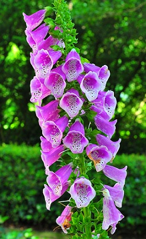

##

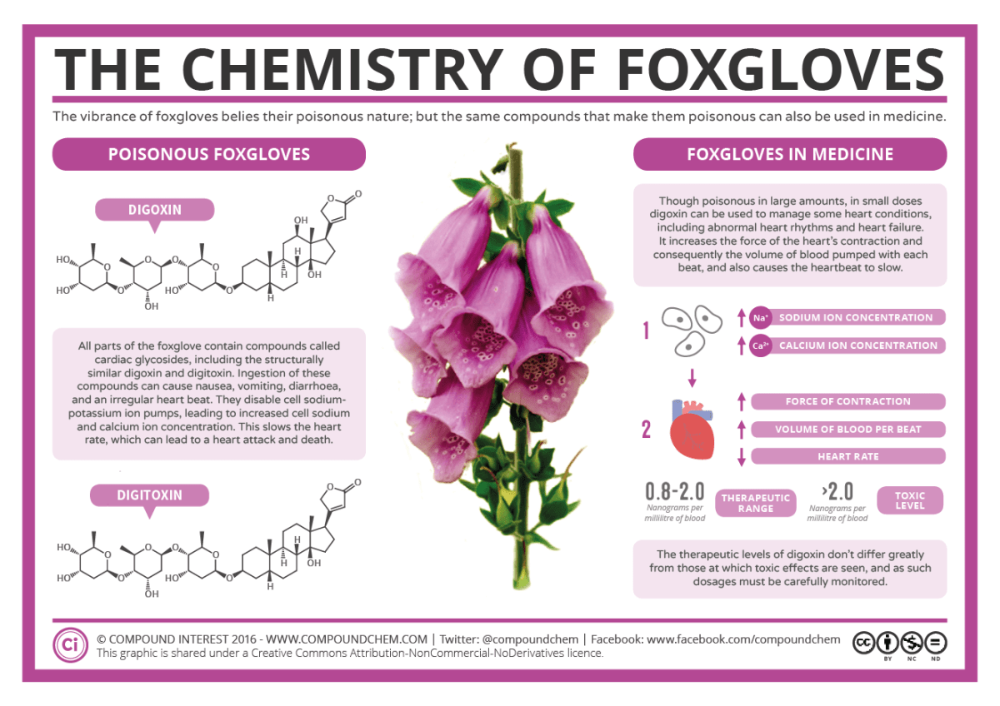

## Medicinal plant case study: Willow to aspirin

 

* **Willow tree bark used for pain reduction in many cultures**
    + ancient Greeks and Native Americans
    + reduces fever and chills

 

* **Evolution of aspirin began with willow bark experiments in England**
    + 1828, salicin isolated as active ingredient
    + salicin derivatives occur in many species

 

* **BAYER focused on acetylsalicylic acid from *Spirea*  plant**
    + less digestive issues
    + renamed to *aspirin*

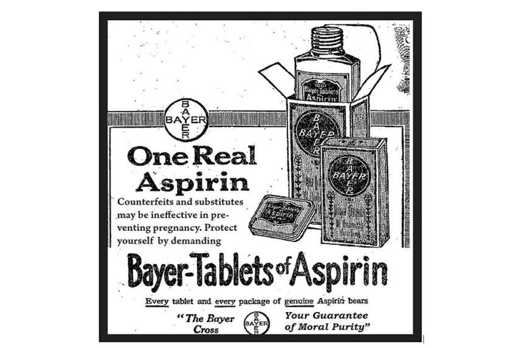

## Medicinal plant case study: Fever Bark Tree

 

* **Malaria is one of the worlds most prevalent diseases**
    + 200 million infections each year
    + records of malaria date back to ancient Egyptians
    + female *Anopheles* mosquite w/ *Plasmodium* parasite
  
     

* **Fever bark tree was first treatment for malaria**
    + native to east slopes of Andes mtns
    + belongs to coffee family
    + used by Incas to treat fever, then malaria
 
 
  
* **Trade developed for powdered bark**
    + 2lbs to treat one person
    + *quinine* was isolated before over-exploitation
    + now: synthetic cholroquinine

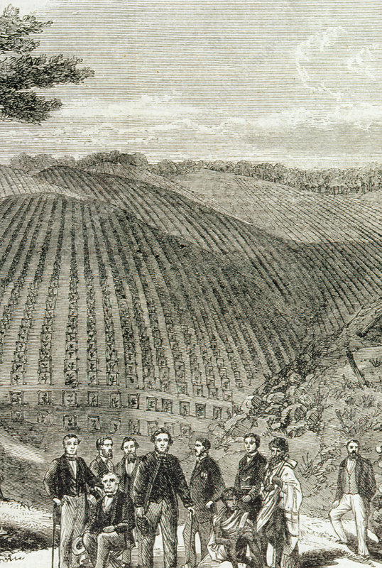

<!-- ## Medicinal Plants: French Lilca -->
<!-- 
 -->

<!--  -->

## Medicinal plant case study: Ephedra

* **Ephedrine is a plant alkaloid produced by genu *Ephedra* **
    + only one genus in the family of gymnosperms
    + native to Americas, Europe, Asia & Africa

 

* **Long cultural history as a herbal medicine**
    + decongestant and respiratory ailments

 

* **Ephedrine still found in modern drugs**
    + relaxes bronchial muscles & a CNS stimulant

 

* **Large scale abuse of herbal *Ephedra* products**
    + herbal ecstasy, similar to amphetamines
    + activates thermogenesis, calorie burning
    + supplements illegal, medications?

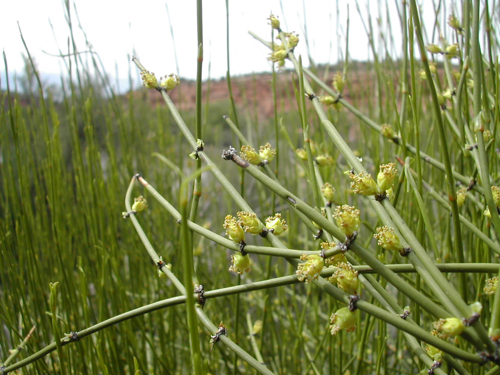

## Medicinal plants and cancer

 

* **Humans have suffered cancer for 1,000s of years**
    + Ebers Papyrus suggested treatments
    + 2^nd^  leading cause of death in US
    
 

* **Plants have always featured in folk remedies**
    +  search for anticancer plant sources began in 50's by NCI
    + 1,000s of plants have been screened
    + several now part of chemotherapy treatments

 

* **Vinca alkaloids for leukemia (Madagascar periwinkle)**
* **Taxol from Pacific yew used in many chemotherapy treatments**
* **Camptotheca from Chinese happy tree for ovarian cancer**

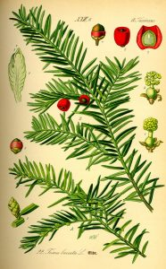

## Herbal remedies: promises and problems

 

* **Plants and plant extracts feature prominently in alternative medicines**
    + considered dietary supplements by FDA
    + multi-billion  a year industry

 

* **Dietary supplements are not subject to FDA approval**
    + no rigorous clinical testing
    + FDA will only take reactionary actions

 

* **Secondary plant compounds may have health benefits or cause adverse reactions**
    + 40% of US populations uses alternative medicines
    + no clinical linkage to medications

