## Review: location for photosynthesis

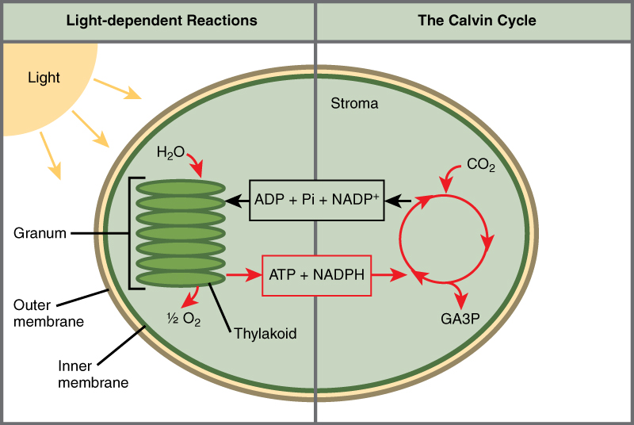

## Review: light energy to chemical energy

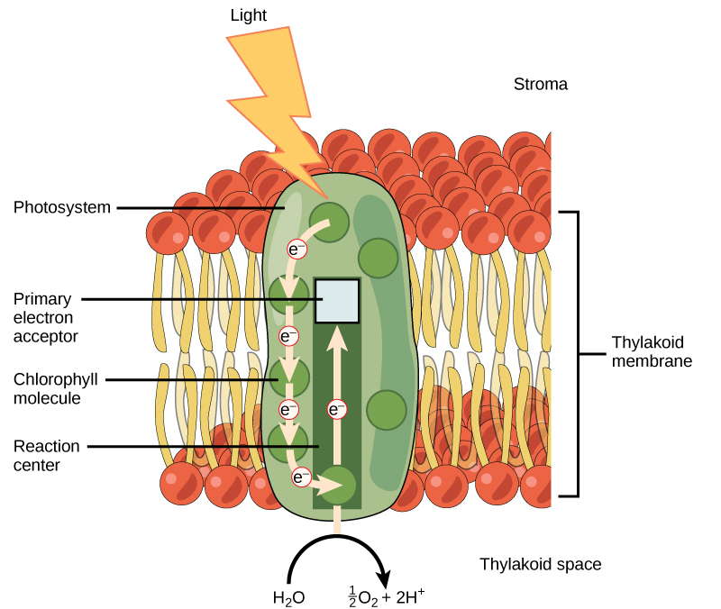

## Light reactions: make ATP + NADPH for Calvin cycle

 

## Review: Calvin Benson cycle fixes C and makes sugar

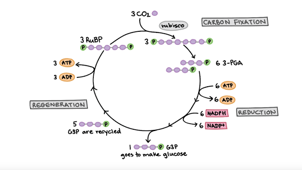

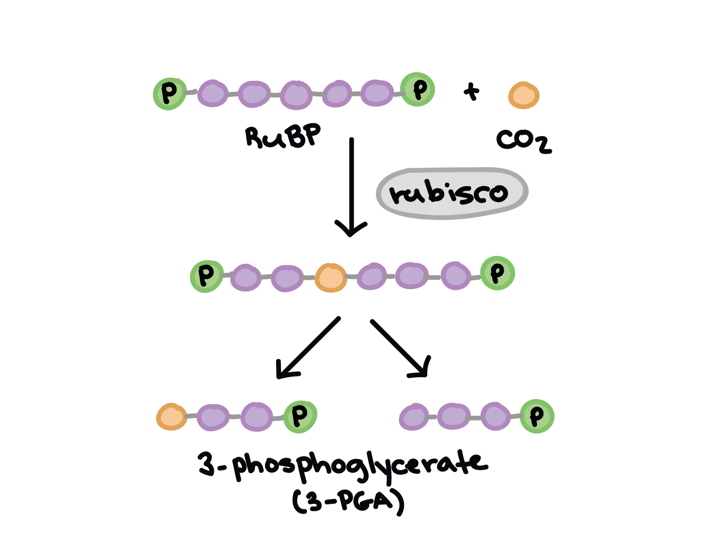

## Rubisco - the enzyme that dominates carbon fixation

 

**Carbon in often locked in highly oxidized forms, such as carbonate minerals and carbon dioxide gas. To be useful, as a building block of life, oxidized carbon must be "fixed" into organic forms, rich in carbon-carbon bonds**

 
 

* **Most CO~2~ converted into biomass is fixed by rubisco**
    + bridge between life and lifeless
    + creates organic C from CO~2~

 

* **Most abundant enzyme in the world**

 

* **Large molecule : 16 polypeptides : 8 active sites**

## Rubisco: the clunky and slow carbon fixer

 
 

* **In spite of role, rubisco is remarkably inefficient**
    + plant rubisco way bigger than cyanobacteria

 

* **Only 3-10 reactions per second**
    + limits photosynthesis
    
 

* **20% error rate**
    + gets worse at high temperatures

 

* **Hmmm...why is Rubisco so abundant?**

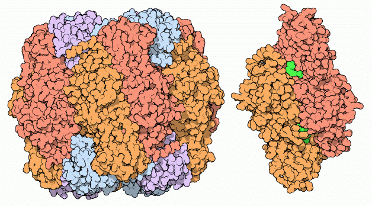

## Rubisco is a cheater!!!

 
 

* **Reacts with both O~2~ and CO~2~**

 

* **O~2~ reaction called Photorespiration**
    + uses ATP and NADPH to make CO~2~
    + totally wasteful!!!

 

* **Non-specific CO~2~ targeting related to evolution**

## Cyanobacteria evolved around 2.7 BYA

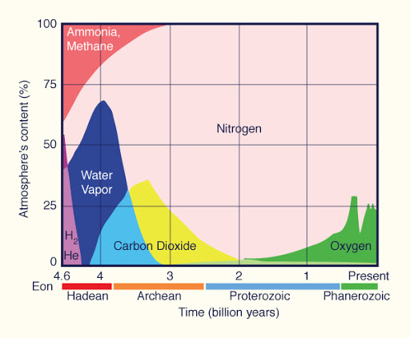

## C3 photosynthesis how did we get here...

 
 
 

* **Evolution doesn't always create the best solution**

 

* **Photorespiration is completely wasteful**
    + 2x energy to produce the same amount of sugar than if Rubisco only reacted with CO~2~

 

* **Rubisco did evolve high affinity for CO~2~ (80x > O~2~)** 
    + compare to the composition of the atmosphere...

 

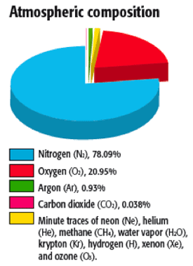

## Rubisco substrate choice

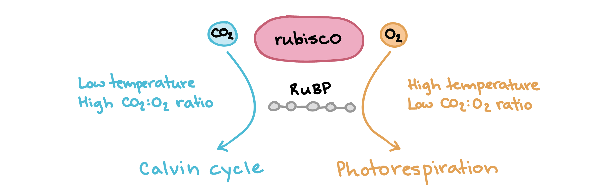

## Photorespiration inpacts food security

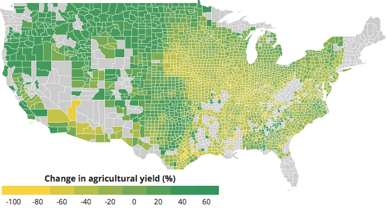

## Rubisco and plant evolution: How did we get here?

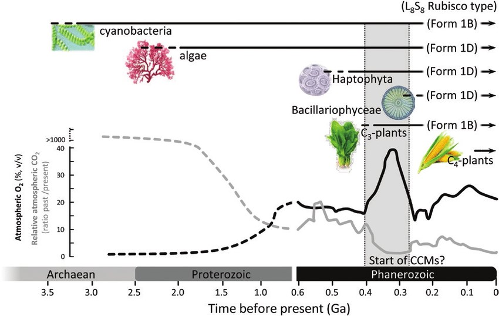

## Plant evolution tied to atmospheric shifts in CO~2~:O~2~

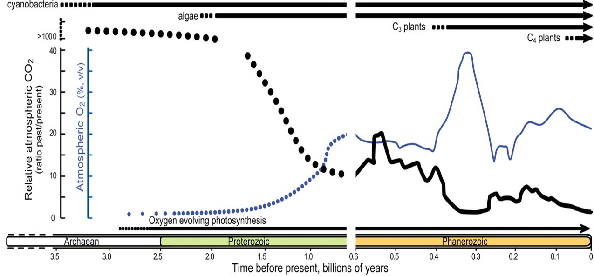

##

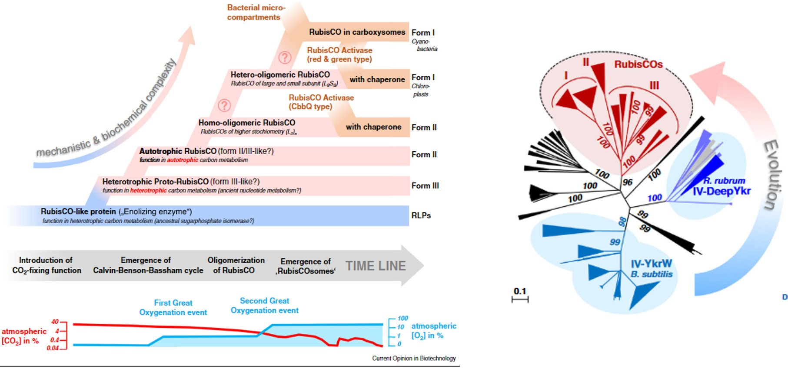

## Why has Rubisco not been replaced?

 
 

* **Evolution of enzymes difficult**
    * trade-offs between activity and stability
 
  
 
* **Removing oxygen reaction breaks Rubisco**
    * selection against modifying mutations

 

* **RubisCO → RubisC???**
    + requires a decrease in fitness 
    + plants are stuck with Rubisco
    
  
 
* **Natural selection increased affinity for CO~2~**
    + makes it slow

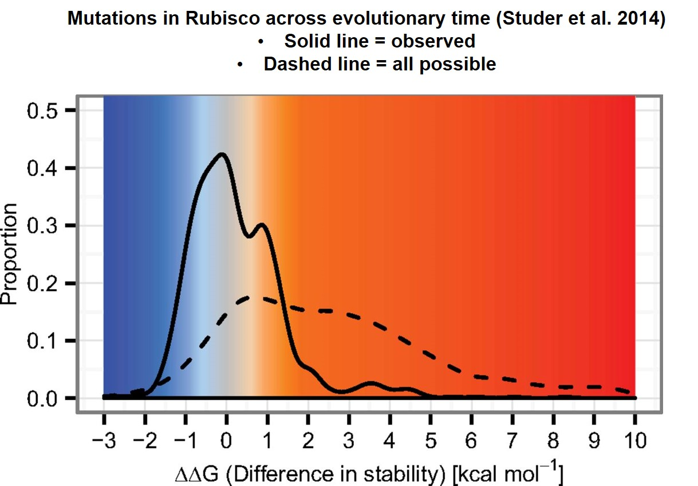

## Evolution tinkers with other parts of photosynthesis

 
 

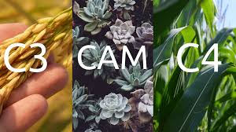

* **Improved and recombined existing parts and pieces**
    + work around the photorespiration issue
 
 

* **In response to environmental change**
    + lower [CO~2~] & higher [O~2~]
    + high temperatures 
    + water limitations 

 

* **Evolution of new photosynthesis pathways**
    + C4 pathway and CAM
    + Allowed plants to exploit new habitats

## Plants and humanity: Why does photorespiration matter?

 
 
 

* **Consumes 32% of ATP and 28% of NADH in C3 leaves**
    + under current conditions

 

* **Crop productivity improvement not sufficient to meet 2x food production by 2050**

 

* **Photorespiration decreases US soybean and wheat yields by 36% and 20%**
    + loss of 148 trillion potential calories
    + would feed 203 million people for a year

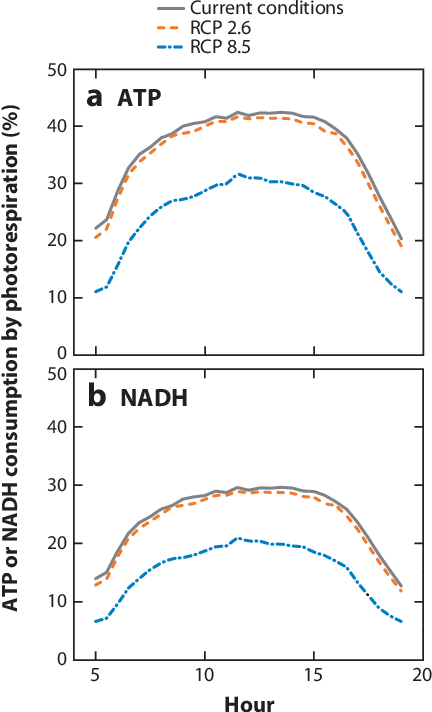