##
 
 
 
 
 
 

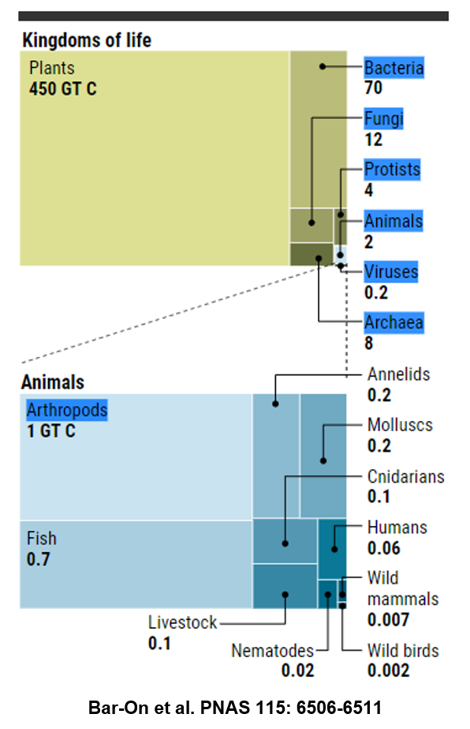

https://www.vox.com/science-and-health/2018/5/29/17386112/all-life-on-earth-chart-weight-plants-animals-pnas

## Leaf structure and why it matters

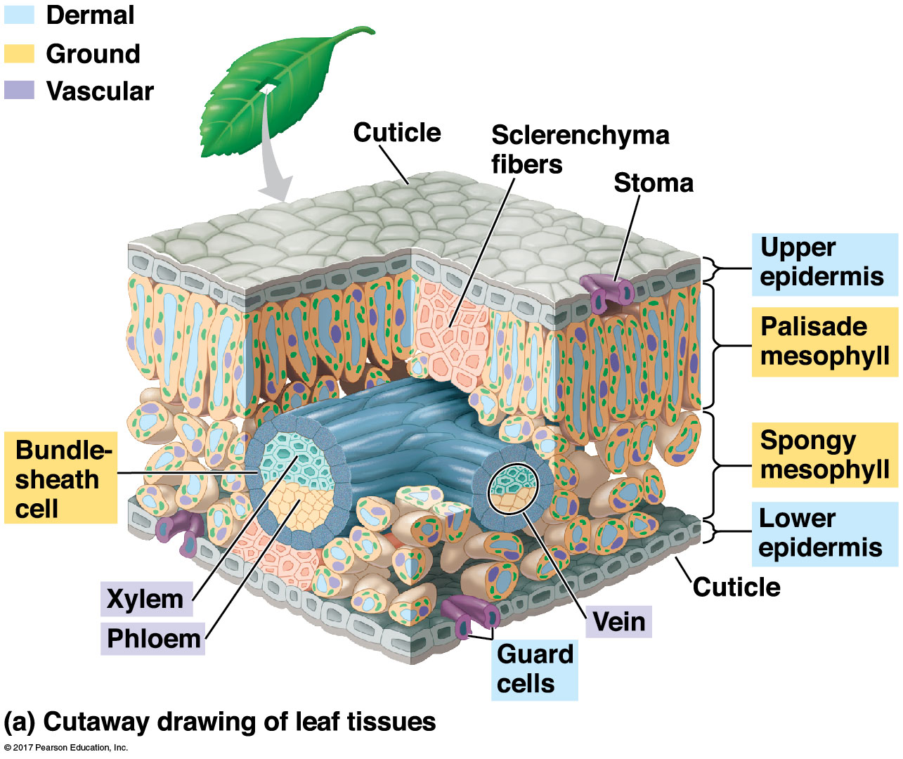

## Leaves exchange gases via stomata

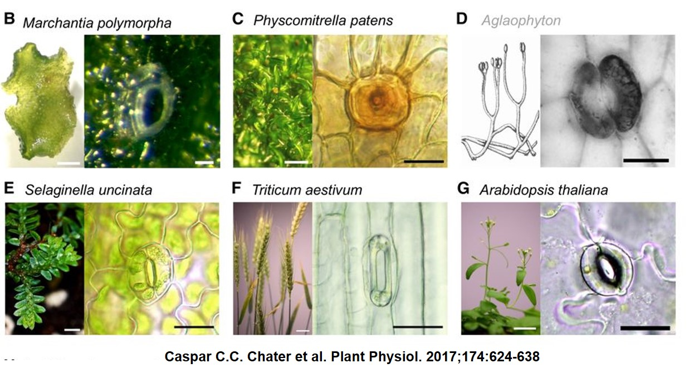

## How stomata work...

## Leaf gas exchange impacts global ecology

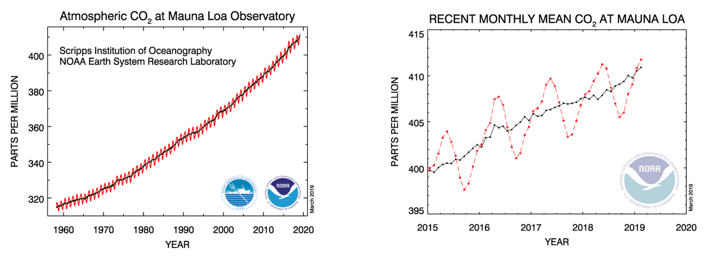

## Vascular tissues in leaves are confined to veins

 

* **_Transpiration_ is a by‐product of opening stomatal pores**
 

* **H~2~O transport needs to be sufficient to keep stomata open** 
 

* **Venation represents investment in H~2~O supply**

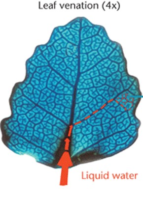

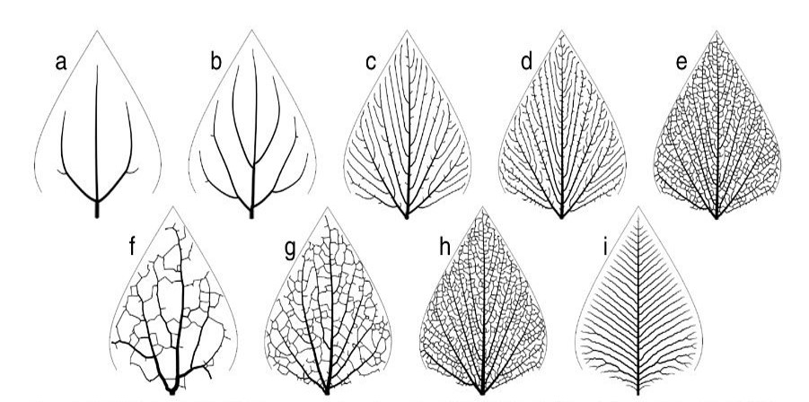

## How leaf veins changed the world....

## Are plants intelligent? Leaf economic theory

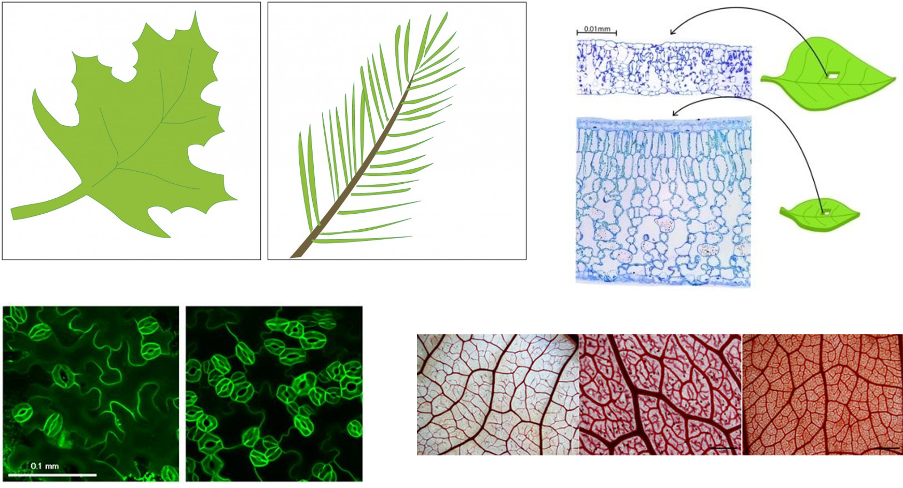

## Photosynthesis is complicated....

 

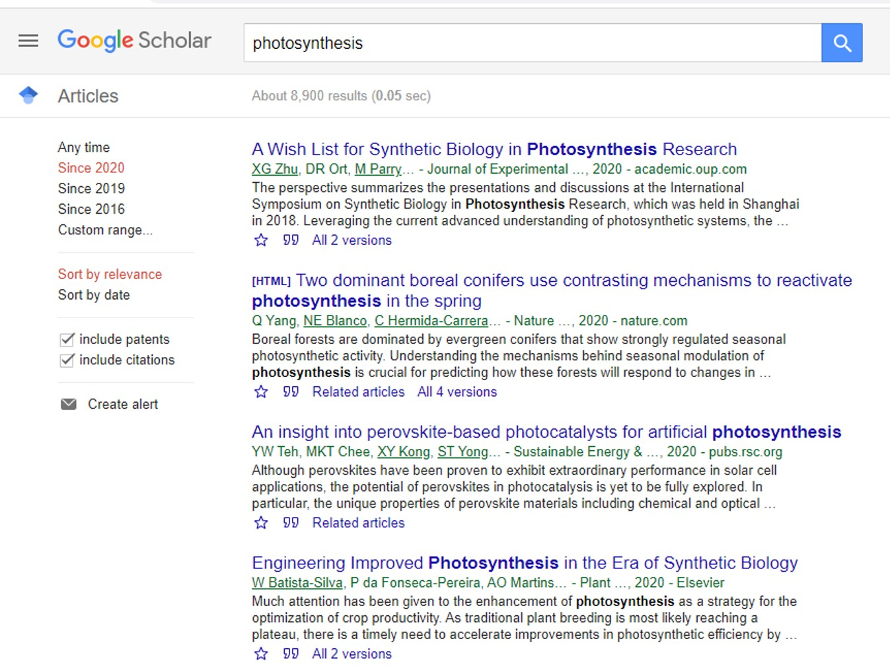

<!-- ## What do we do when we are hungry? -->
<!-- 
 -->
<!--   -->

<!--  -->

<!--  -->

## What do plants do when they are hungry?

    

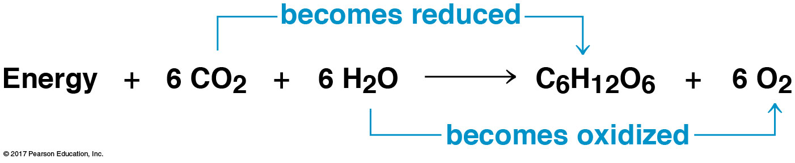

## Photosynthesis is the basis for most life on Earth

 
 
 

* **Greek = “building with light”**
* **Autotroph = “self nourishing”**
* **Photoautotroph = “self nourishing with light”**

 

* **Photosynthesis is an energy pathway**
    + 2 linked reactions
    + light reaction + Calvin cycle

 

 

## Chloroplasts: Where the magic happens

## The nature of light

 

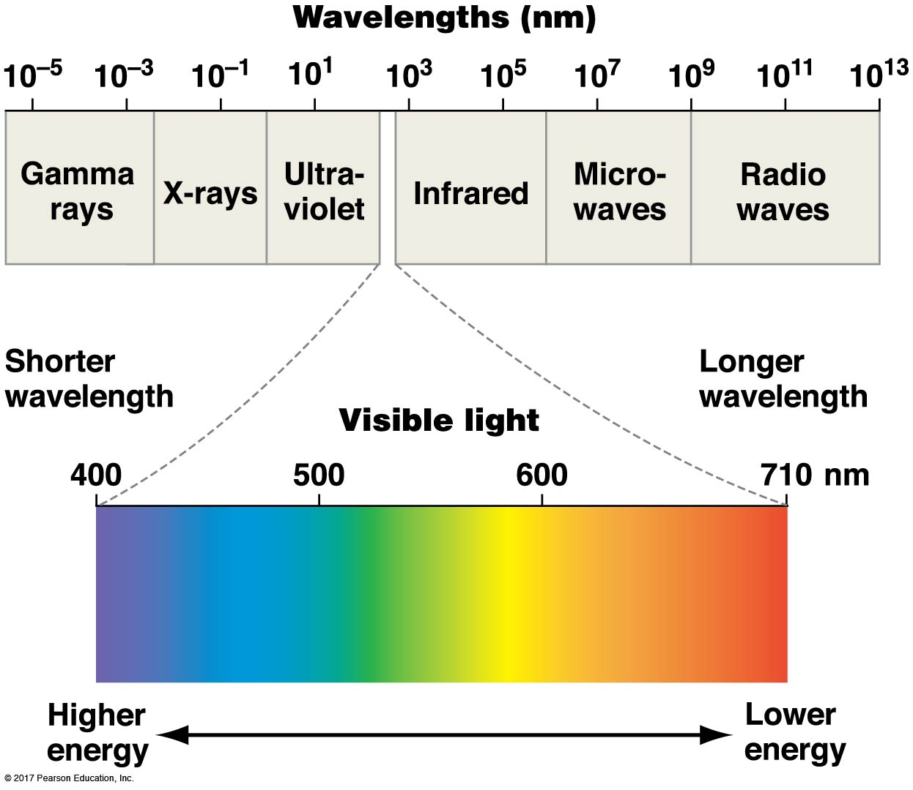

## When light hits chlorophyll a few things can happen

## When pigments absorb photons an election gets excited

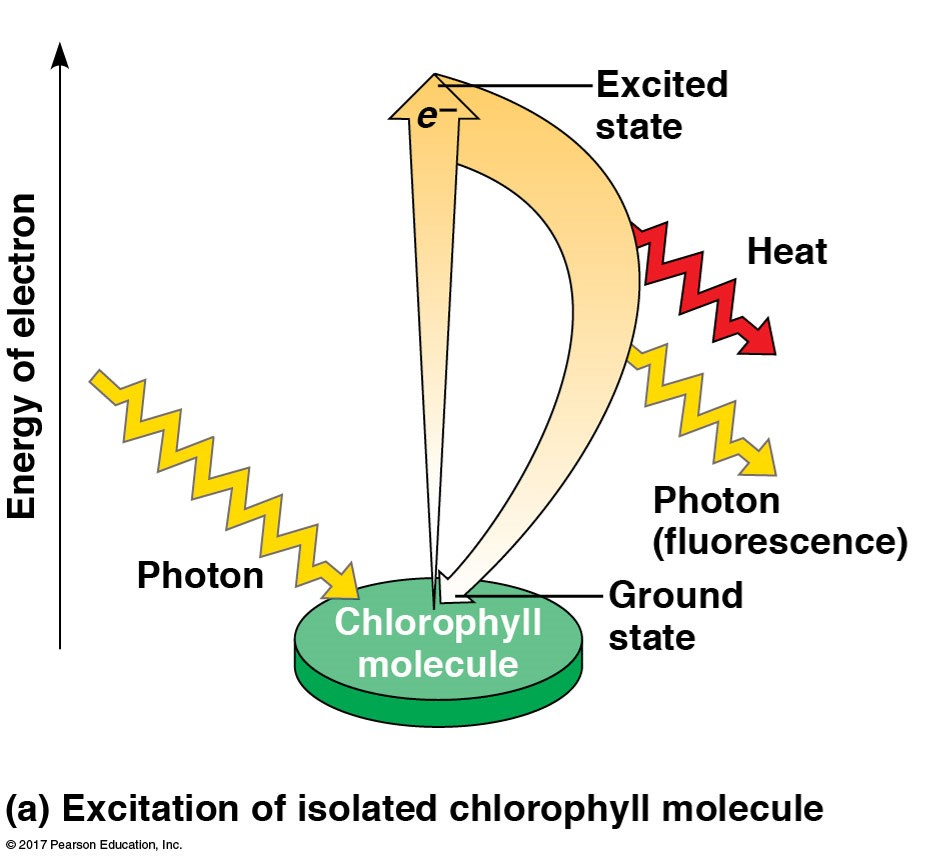

## Photosystems (2) convert light energy to chemical energy

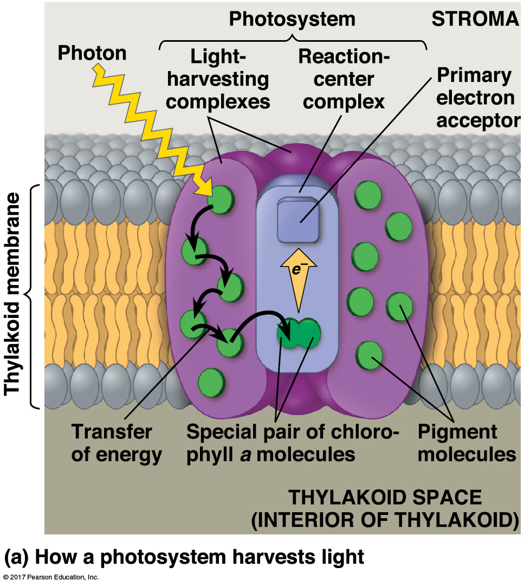

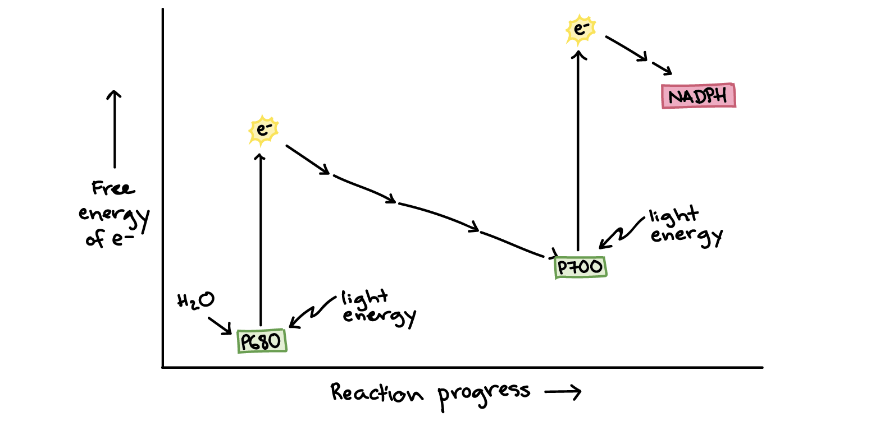

## Light reactions: make ATP + NADPH for Calvin cycle

 

## 

## Dark Reactions (aka Calvin cycle)

## Calvin cycle is a 3-step process

 

* **1. Fixation: CO~2~ reacts with 5C molecule (RUBP)**
    + new 6C split into 2 acids (3C each)
    + catalyzed by Rubisco enzyme

 

* **2. ATP and NADPH turn 3C acids into sugars**
    + reduction of acids

 

* **3. Some 3C sugars recycled to make RUBP (5C)**
    + one 3C sugar leaves to make glucose
    + recycling needs ATP
    
 

## Making sugars requires several cycles

<!-- ## Rubisco - the enzyme that dominates carbon fixation -->
<!-- 
 -->
<!--   -->
<!--   -->
<!--   -->
<!--   -->
<!--   -->

<!--  -->

<!-- 
 -->

<!-- * **Most abundant enzyme in the world** -->

<!--   -->

<!-- * **Most CO~2~ converted into biomass is fixed by Rubisco** -->

<!--   -->

<!-- * **Large molecule : 16 polypeptides : 8 active sites** -->

<!-- 
 -->

<!-- ## Rubisco: the clunky and slow carbon fixer -->
<!-- 
 -->
<!--   -->
<!--   -->
<!--   -->
<!--   -->

<!-- 
 -->

<!-- * **Only 3-10 reactions per second** -->

<!--   -->

<!-- * **20% error rate** -->
<!--     * gets worse at high temperatures -->

<!--   -->

<!-- * **Performs carboxylation and OXYGENATION** -->

<!-- 
 -->

<!--  -->

<!-- ## C3 photosynthesis how did we get here... -->
<!-- 
 -->
<!--   -->
<!--   -->
<!--   -->
<!--   -->

<!-- 
 -->

<!-- * **Evolution doesn't necessarily create the best solution** -->

<!--   -->

<!-- * **Oxygenation products are completely wasteful** -->

<!--   -->

<!-- * **2x energy to produce the same amount of sugar than if Rubisco just reacted with CO~2~** -->

<!--  
 -->

<!--  -->

<!-- ## Calvin Benson won a Nobel prize, his TA won best practical joke -->
<!-- 
 -->

<!-- 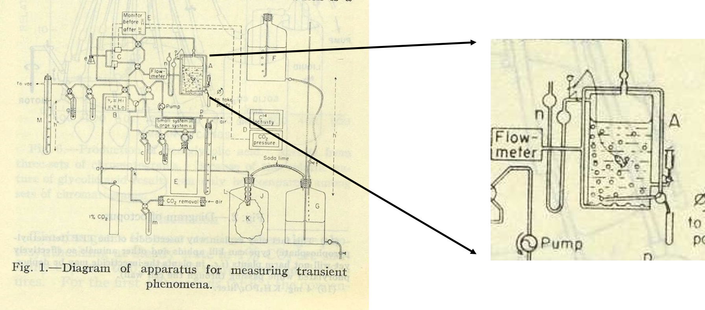 -->
