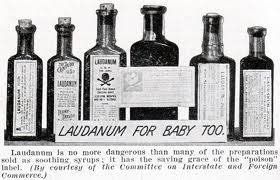
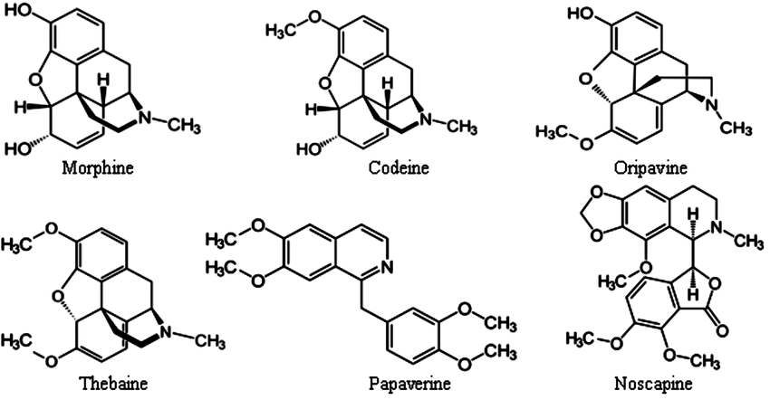

## Mind Altering Plants Rooted in Human Society

* **Use of psychoactive plants dates to earliest societies**
    + mix of medicine & spirituality
    + 6,000 years ago, Opium = 'joy plant'
    
 

* **Hieroglyphs show prominent use in Ancient Egypt**
    + belief that certain plants have spiritual properties
    + ashwagandha, lotus, reed, acacia, henbane, opium
    
 

* **'Spirit Molecule' in indigenous tribes of the Amazon**
    + Ayahuasca vine and Chacruna shrub
    + molecule 'DMT' powerful hallucinogen

 

* **DMT from *Acacia* used in many cultures**
    + ‘Golden Wattle’ is botanical emblem of Australia

    

## Psychoactive Drugs

 

* **Affect nervous system by influencing neurotransmitters**
    + or mimicking them
    + neurons &#8594; transmitters &#8594; receptor
    + inhibitory or excitatory
    
 

* **Psychoactives can be stimulants, hallucinogens or depressants**
    + narrow line between medicinal, psychoactive & toxic
    
 

* **Stimulants = excite and enhance mental alertness**
 
* **Hallucinogens = change perception**
 
* **Depressants = dull mental awareness & induce sleep**  

    
## Psychoactive Drugs: Narcotics

 

* **Narcotics depression central nervous system**
    + also defined as addictive
    
 

* **Psychoactive plants fall into both categories**

 

* **Active compounds are mostly alkaloids**
    + contain nitrogen, bitter, affect CNS
    
 

* **Many angiosperms families contain psychoactive alkaloids**
    + nightshade, poppy, coffee, coca, nutmeg & morning glory
    

##

##

## Opium Poppy: An Ancient Curse

* **Large annual herb, ovary matures into capsule**
    + Native to Middle east
    + green capsule produces latex w/ alkaloids
    + Dried latex is crude opium
    
 

* **Opium (*Papaver somniferum*) present in early societies**
    + Babylonian and Egyptian writings
    + pain relief & inducing sleep
    + addictive properties became 'curse'

 

* **Uses differ throughout history**
    + dissolved in wine
    + dissolved in alcohol (*laudanum*)
    + eaten & smoked

## The Lure of Laudanum

## Opium Wars

* **Opium use tied to history of China**
    + use increased when tobacco was introduced (1600)
    + addiction increased, banned by Emperor
    
 

* **Addiction fueled by trade with British!**
    + Chinese had no interest in European goods
    + wanted silver or Opium
    
 

* **British East India Company smuggled in opium**
    + opium widely cultivated in India

 

* **Chinese gov't tried to stop smuggling**
    + 2 Opium Wars, starting in 1839
    + 25% of Chinese addicted
    

## Opium Alkaloids

 

* **More than 20 alkaloids identified in Opium**

 

* **Morphine = named after Greek god of dreams**
    + first active principle isolated
    + unsurpassed in pain relief
    + depresses areas in brain involved in pain perception
    + highly addictive
    
 

* **Codeine is one of the most commonly used opiates**
    + oral analgesic
    + 1/5 as strong as morphine
    + suppresses coughs
    

## Soldiers Disease: Did Civil War Start Opiod Epidemic?

## Heroin

 

* **In 1898, BAYER introduced heroin**
    + believed was a nonaddictive opiate
    + semi-synthetic used widely over-the-counter
    + Americans could order from Sears
    
 

* **Heroin is actually 6x more addictive than morphine**
    + no longer medicinally used in USA
    + no longer legally produced in USA
  
 
  
* **India still produces heroin for medicine**

 

* **Middle east and Asian countries large illegal production**

## Marijuana: One of the Oldest Cultivated Plants

 
 

* **Cannabis sativa is a dioecious plant, with resin production on trichomes**
    + resin is source of psychoactive compounds
    + native to central Asia, grown globally

 

* **Marijuana is highly variable is size and growth**
    + potentially 3 separate species

 

* **Used for various purposes in many cultures**
    + hallucinogen, fiber, oil

## Early history of *Cannabis*

 

* **Use of *Cannabis* traced to ancient China**
    + valued from fiber and medicine
    + Emperor Nung (5,000 years ago) recommended for medicine

 

* **Ancient nomadic Asian horsemen first records of smoking**
    + ritual ceremonies ~500 B.C.
    
     
   
* **Spread from Asian to India ~600 B.C.**
    + folk medicines use extensively
    + 1 of 5 sacred plants
    + bhang (variety) sold outside Hindu temples
    

## Introduction of *Cannabis* to the West

* **Europeans cultivated hemp fibers for centuries**
    + use as psychoactive around 19^th^ century

 

* **Rumored Napoleon's armies popularized smoking**
    + popular in Paris (1850's) among intellectuals

 

* **US from Mexico or Caribbean (~1900)**
    + recreational and over-the-counter medicine
    + eliminated medicinal use
    
 

* **Federal Marijuana Tax Act (1937)**
    + gov't 'educational campaigns'
    

## Pyschoactive Effects of THC

 

* **Chemistry of *Cannabis* is unique phenolic compounds**
    + cannabinoids not alkaloids
    + THC (psychoactive) identified in 1964
    
 

* **THC concentration varies by strain, sex, climate & growing conditions**
    + effects include euphoria and calmness
    
 

* **Regions of the brain contain cannabinoid receptors**
    + THC receptors in high densities in several brain areas
    + THC receptors found in immune system cells
    + THC mimics naturally produced cells for these receptors

##

## The Origins of Cocaine

* **Cocaine is the major alkaloid of coca plant (*Erthroxylum*)**
    + small shrub with shiny leaves
    + native to Andes mountains of S.America

 

* **Alkaloids can be harvested from leaves 2-3 times a years**

 

* **Archaeology evidence indicates plants used for at least 3500 years**
    + believed a god created coca plant

 

* **Coca chewing was mostly restricted to ruling class**
    + soldiers and workers allowed for endurance

 

* **Coca leaves exchanged for food**

## Freud, Holmes & Coca-Cola

 

* **Modern history begins with isolation of cocaine in 1850's**
    + Sigmund Freud was a huge advocate
 
  
 
* **Cocaine became over-the-counter drug in the USA** 
    + effective in draining sinuses and curing headaches
    + Coca-wine one of the most popular beverages
    
  
 
* **In 1886, Atlanta pharmacist created Coca-Cola**
    + 'brain tonic'
    + cocaine removed in 1903
    
  
 
* **Widespread use evident in 19th & 20th century literature**
    + Sherlock Holmes was a cocaine user
    

## Harrison Act (1914): First Anti-narcotic Law

## Medical Uses of Cocaine

 
 
 

* **Cocaine acts as local anesthetic**
    + blocks nerves receptor at application site
    
 

* **Common synthetic local anesthics similar to cocaine**
    + Novocain, lidocaine, xylocaine
    
 

* **Constricts blood vessels, reducing blood flow**
    + popular in many surgeries

## Tobacco: A New World Habit

* **Nicotania is a genus of 65 species**
    + annual herb w/ large leaves
    + native to Americas & Australia
    + cultivated in Andes ~5000 B.C.

 

* **Nicotine is major alkaloid in tobacco**
    + most addictive plant psychoactive in widespread use

 

* **Mayans & Aztecs used for pleasure, rituals and medicines**
    + 2 Mayan gods were depicted as habitual smokers
    
 

* **Modern cigarette appears in Europe after Crimean war**
    + first cigarette machine in 1881
    + really increased after WW1
 
 

 

## Nicotine Effects

 

* **One of the most toxic plants poisons**
    + ingestion of a few drops is lethal
    + carcinogen

     

* **Acts as a stimulant on the CNS**

 

* **Acts on the peripheral nervous system**
    + blocks heat, pain & hunger signals
    + increases heart rate

 

* **Tobacco industry now on the defensive**
    + advertising and promotion banned

 

 

