## 

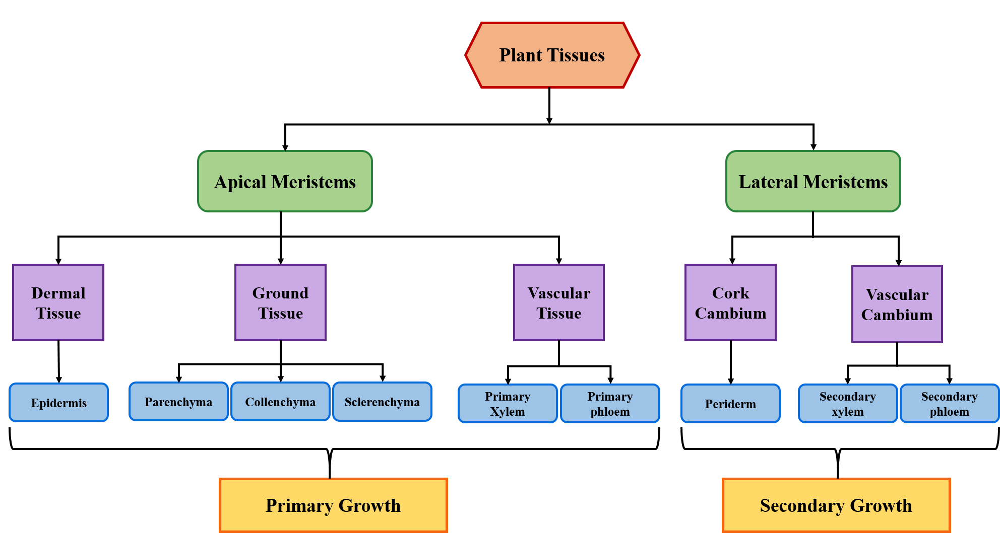

## Themes in plant form

 
 

* **Plants gather materials to grow**
    * soil
    * atmosphere
    * materials can be limiting

  

* **Above and belowground body plan**

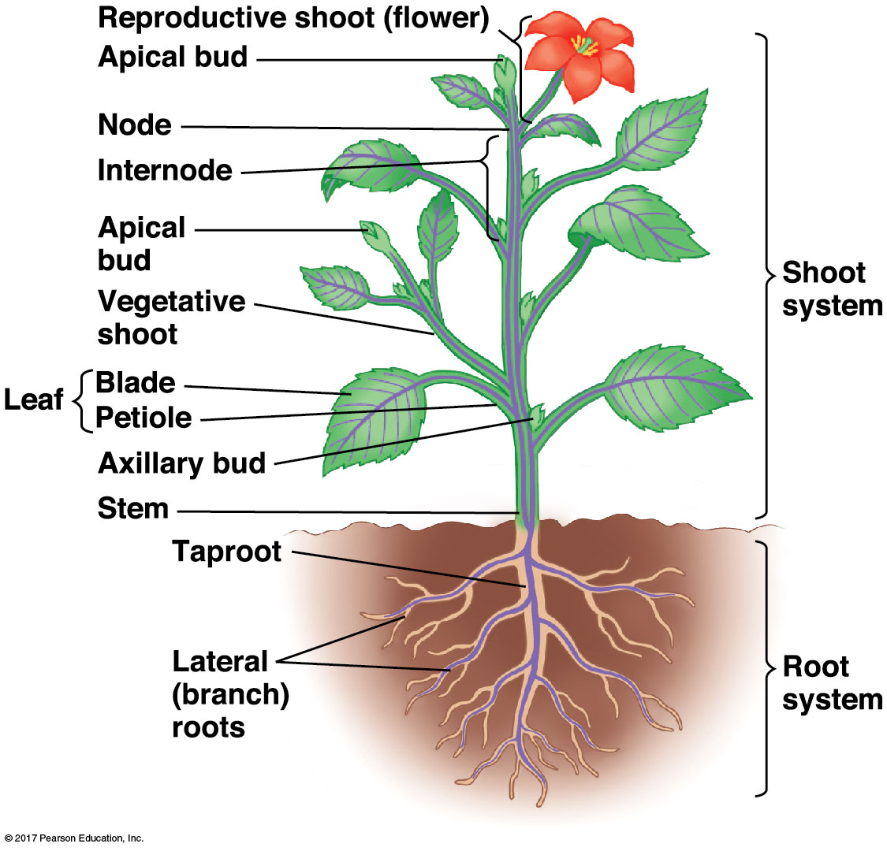

## Themes in plant form

 
 

* **Plants gather materials to grow**
    * soil
    * atmosphere
    * materials can be limiting

  

* **Above and belowground body plan**
  
  

* **Plants exhibit indeterminate growth**
    * "foragers"
    * diversity of size & shape

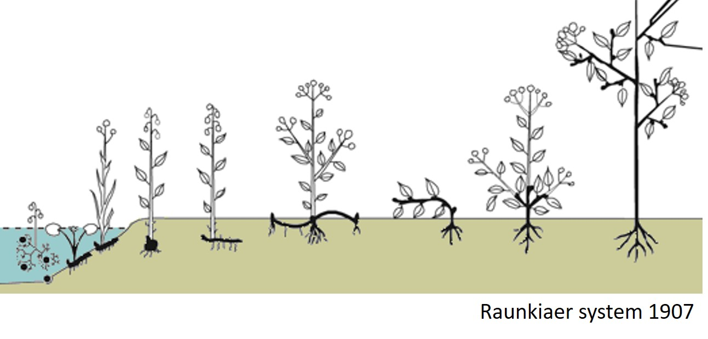

## Plants do all this without moving!

 
 
 
 

* **Mostly defined by their total inability to move**

 

* **Is this a good thing or a bad thing?**

 

* *Their Darwinian struggle for growth, survival and reproduction in very different arenas has resulted in an extremely wide variety of form and function (Diaz et al 2016)*

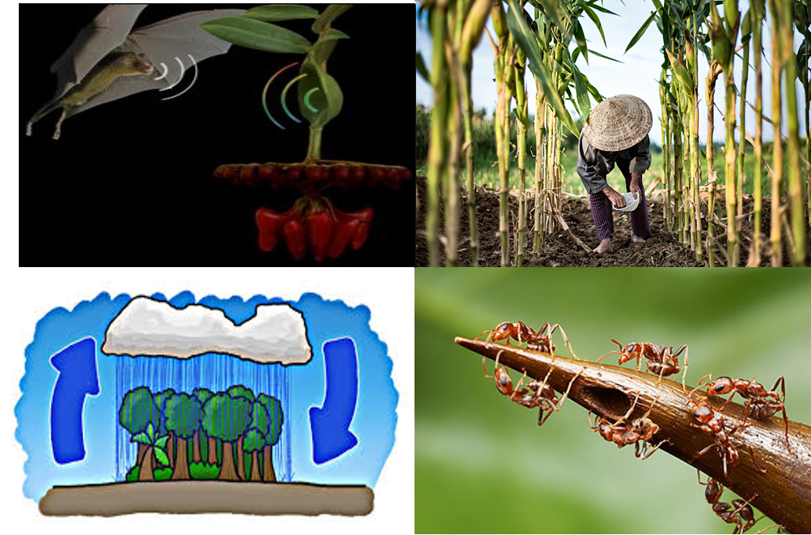

## 

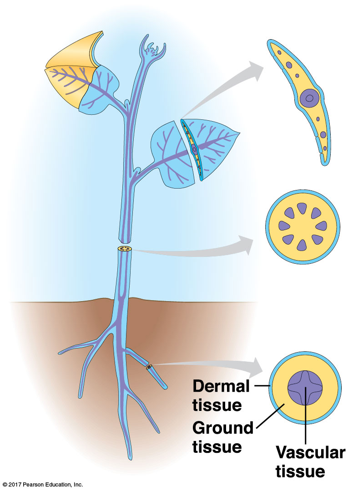

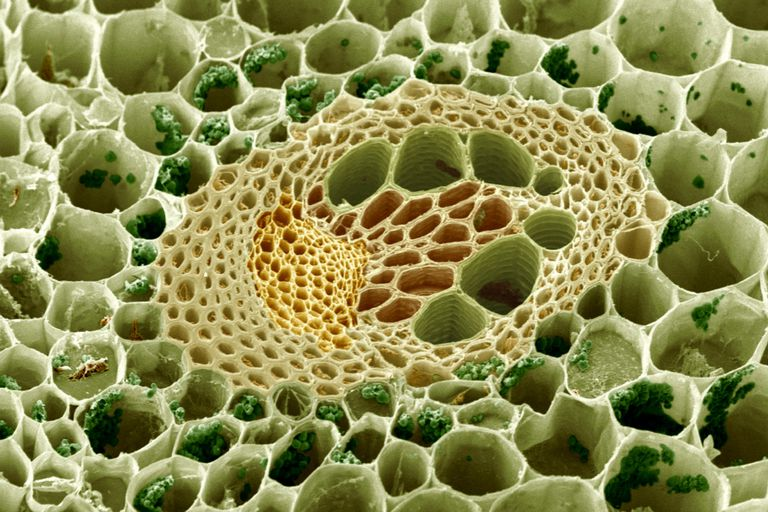

## Dermal (1) tissue (aka 'Skin')

 
 
 

* **Outer layer in young/non-woody plants = epidermis**
    + single layer of flattened cells

 

* **Woody plants epidermis cracks and is replaced**
    + occurs from ____________
    + new layer is called *periderm*
    + whole thing called 'bark'

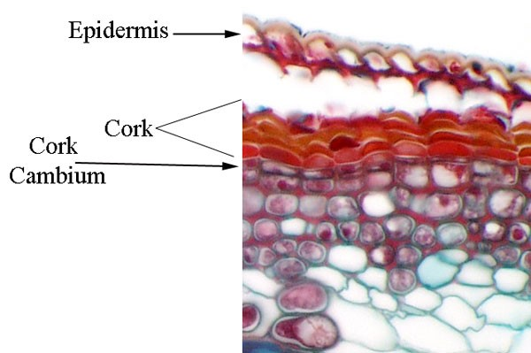

## Wine cork = periderm from *Quercus suber*

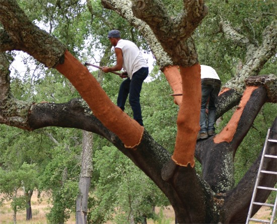

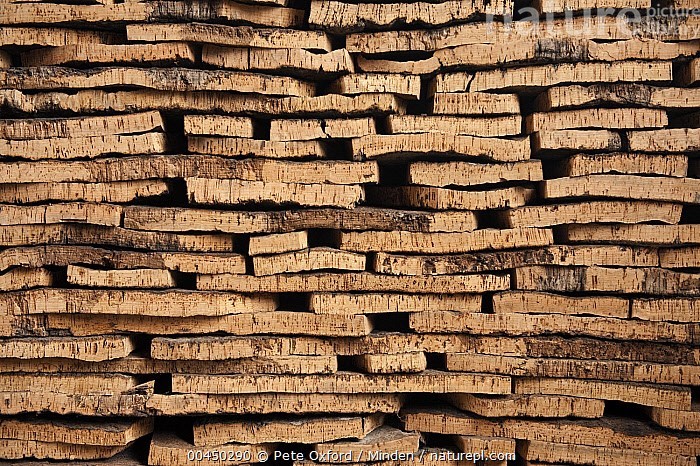
    
## Epidermal cells secrete 'cutin'

 
 
 

* **Wax-like substances that forms the 'cuticle'**
    + prevents evaporative water loss
    + makes the plant water proof

 

* **Often thick enough to make leaf shiny**
    + succulents & tropical plants

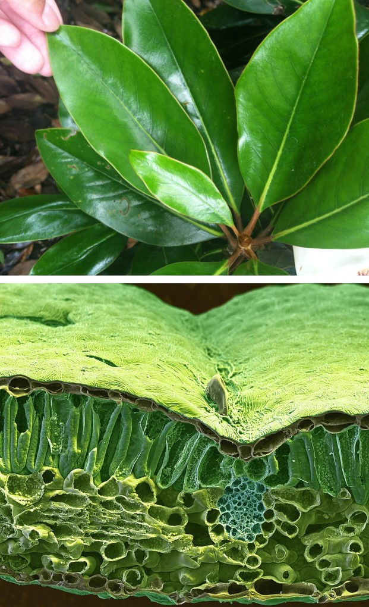
    
## Epidermal cells secrete 'cutin'

 
 

* **Wax-like substances that forms the 'cuticle'**
    + prevents evaporative water loss
    + makes the plant water proof

 

* **Often thick enough to make leaf shiny**
    + succulents & tropical plants

 

* **Trichomes may also be present on epidermis**
    + hairs (sometimes glandular)

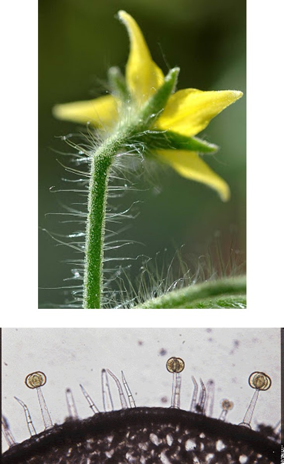

## Stomata are scattered within leaf epidermis

 
 
 

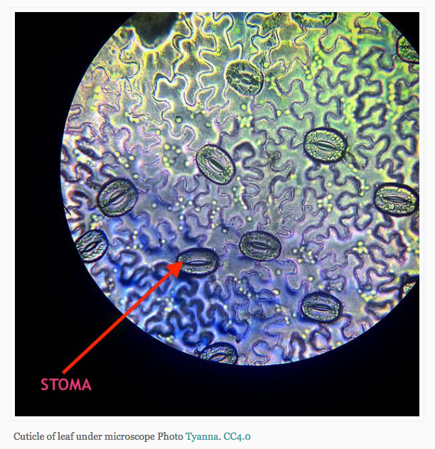

* **Pores that allow gas exchange**
    + CO_2_, O_2_, water vapor

 

* **Essential since plant is 'water proof'**

 

* **Pair of guard cells shrink/swell to open/close**
    + *much more later...*

## How stomata work...

## Ground (2) Tissues make up bulk of plant organs

 

* **Parenchyma = thin walled & most versatile**
    + photosynthetic cells in green tissues
    + storage cells in other organs

 

* **Collencyhma = primary support cells**
    + elongated & thick
    + living
    + 'strings' in celery

 

* **Schlerenchyma = mechanical support & protection**
    + elongate & very thick
    + dead @ maturity
    + used to make cloth and rope

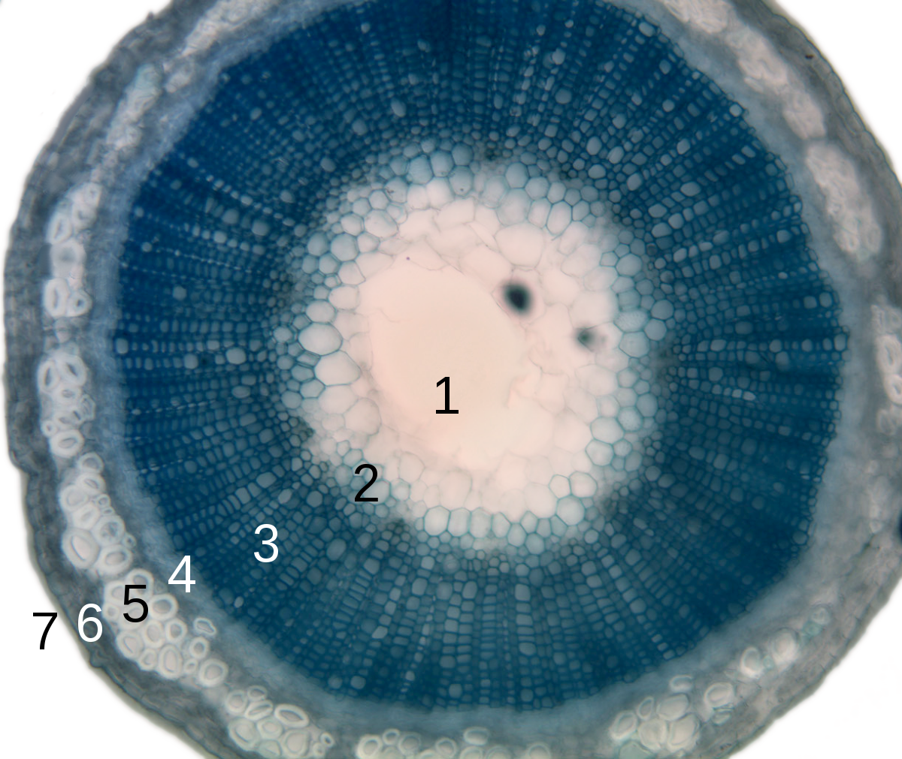

## Parenchyma cells: living, dividing with metabolic function

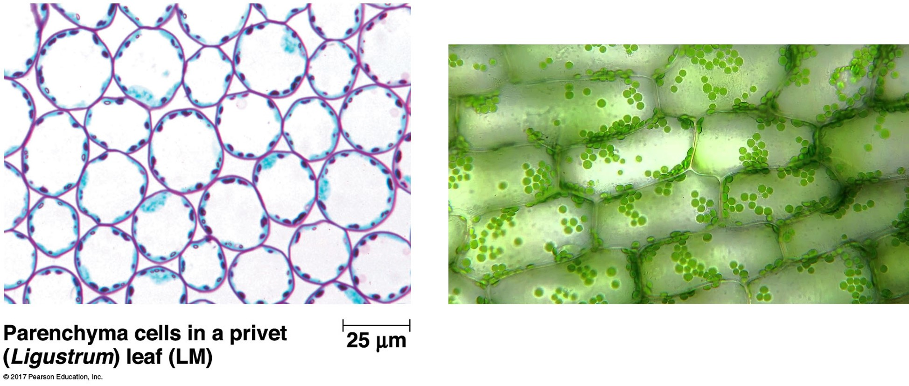

## Collenchyma (flexible) & Sclerenchyma (rigid) for support

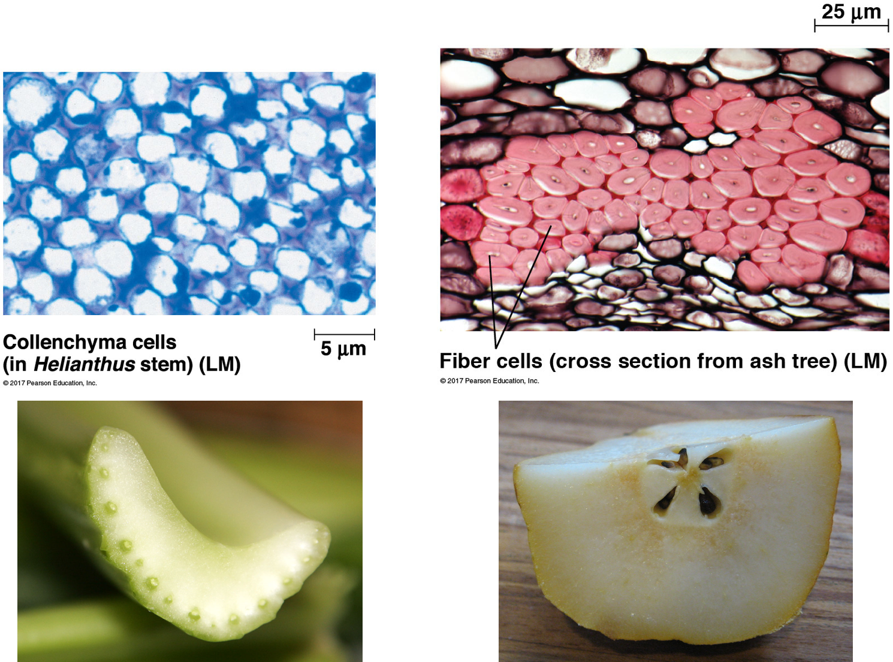

## Vascular (3) Tissues

 

* **Conducting tissues in plants**
    + visible in leaves = veins!

 

* **Two tissues systems allow unrestricted movement of materials**
    + created from apical and lateral meristems

 

* **Xylem = water and minerals from roots upward**

 

* **Phloem = organic materials from source leaf to rest of plant**

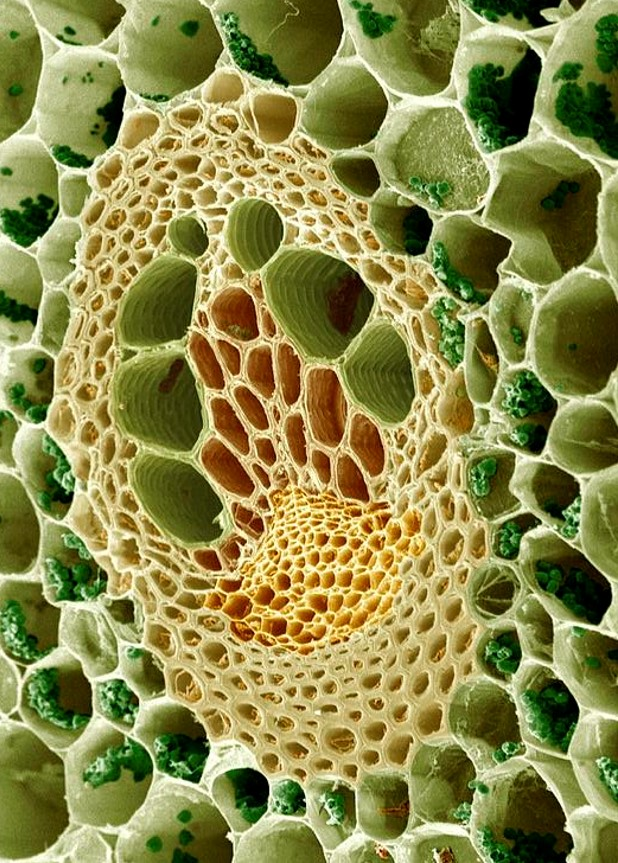

## Pipe Theory works to visual continuum

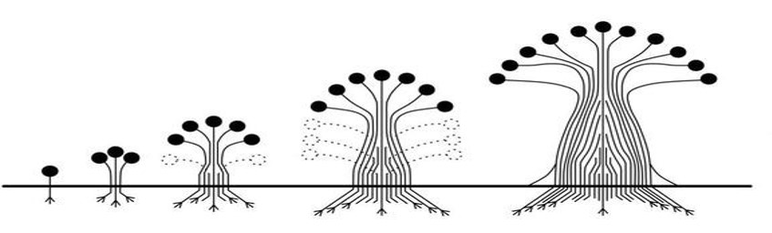

## Tracheids and vessels are conducting xylem cells

 
 

* **Both are dead at maturity, with just cell walls**

 

* **Tracheids = long, thin & tapered**
    + many pits in cell walls
    + pits are not holes

 

* **Vessels = short, wide & end to end**
    + made pits in cells walls
    + unique to angiosperms
  
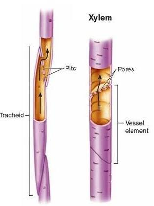

## Sieve tube members make up phloem

   
 
 

* **Living cells with only primary cell wall**
    + nucleus/organelles eventually disappear

 

* **Sieve plates = end walls with large pores**

 

* **Each seive tube has a companion cell**
    + developmentally tied together
    + lots of plasmodesmata connect 2 cells
    + loads and unloads

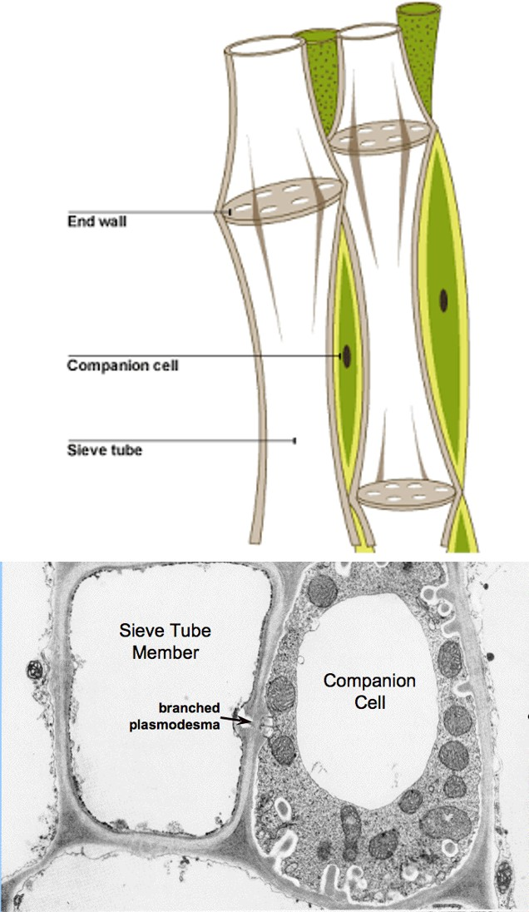

## Vascular tissues often wrapped in *bundle sheath* cells

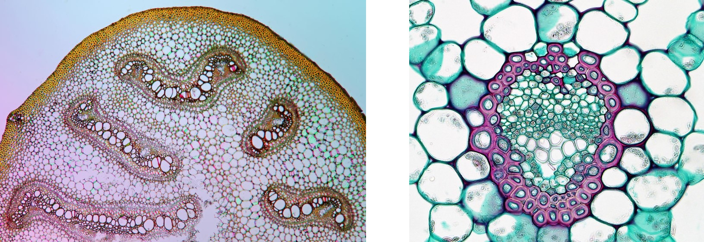

## Plant organs are so easy: Stems, roots & leaves

* **Roots: tap and fibrous root systems**
    + tap = one large root with small branches
    + fibrous = no central main root (grasses)

 

* **Stems: mostly ground tissue**
    + mostly xylem in woody plants
    + inner cambium = xylem = tree ring
    + when tree grows quick = xylem are large

 

* **Leaves: photosynthetic machines**
    + flat blade (mostly)
    + many shapes and sizes

 

* **Flower = modified 'shoot'**

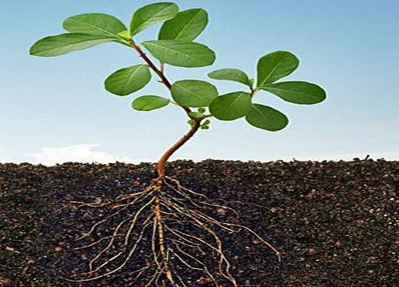

## Test yourself....this image is not a leaf....

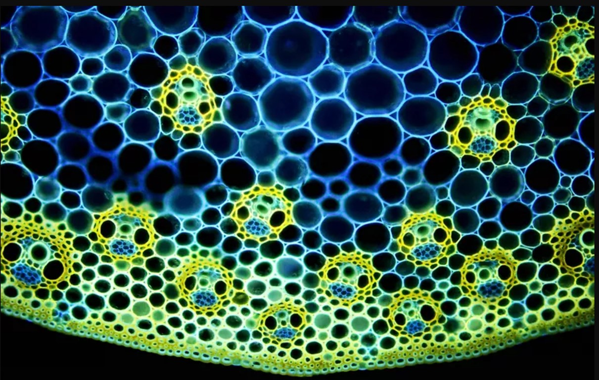

## Test yourself....this image is a leaf....

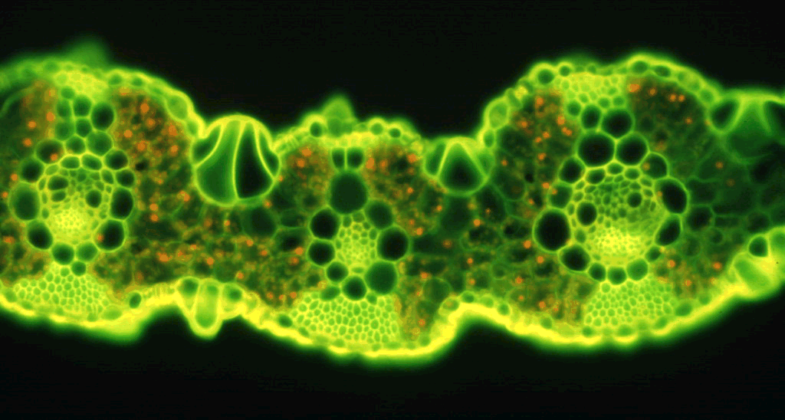
