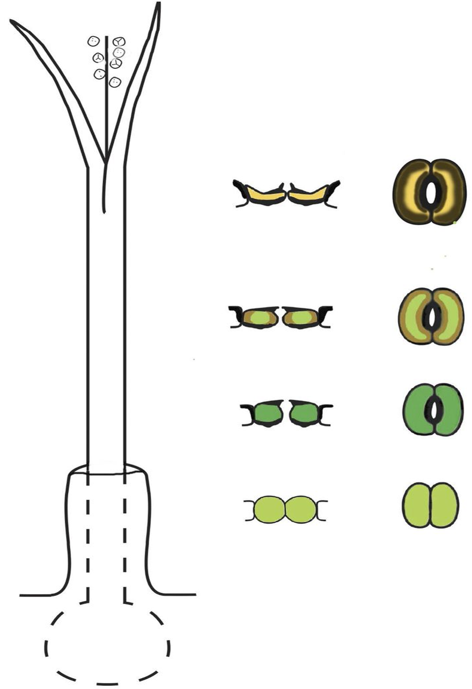

## The big picture: Plants evolved from green algae

 

* **Cyanobacteria & protist made landfall ~1.2 bya**
    + plants, fungi and animals ~500 mya
    + first forests 385 mya

 

* **Plants evolved from green algae**
    + Several key *'shared traits'*
    + **WHAT DO YOU THINK THEY ARE?**

 

* **Plants support all life on earth**
    + Oxygen to breath
    + food to eat
    + new habitats
    

## Green Algae (Oedogonium)

 
 

* **Sister group to land plants**
    + marine and freshwater
    + single and multi-cellular
    + broad, thick filaments
    + some have AoG
    + evolved around ~750mya
    
 

* **Reproductive features:**
    + *Oogonia* = egg containing cell
    + *Antheridium* = sperm containing cell
    

## Molecular evidence points at charophytes as plant ancestors

## Charophytes (freshwater green algae)

 

* **Freshwater species**

 

* **Transition from water to land starts with Charophytes**
    + freshwater habitats may have dried
    + a population eventually lived above water line

 

* **More shared traits with land plants:**
    + circular protein rings in plasma membrane; make cellulose fibers in cell wall
    + swimming sperm with similar structure
    

##

## Land plants are a monophyletic group

 

## All land plants are embryophytes

 

 * **10 divisions of land plants**
    + does not include algae
    + divisions are species diverse

 

* **Zygote develops into multi-cellular embyro, while enclosed in reproductive structure**
    + algae do not retain embryo

 

* **Land plant & embryophyte terms used interchangeably**

## Shared Traits further define plant evolution

## Multi-cellular, Dependent embryos (placental transfer)

## Waxy cuticle and stomata

## Multi-cellular Gametangia

## Photosynthesis with unique pigments (chlorophyll A & B)

## Unique cell walls

 
 
 

* **Cells walls made of cellulose** 
    + not unique to plants
    
 

* **Pectin to fortify cell walls **
    + unique to plants

 

* **Produce cells walls in unique way**
    + at end of mitosis

## Alternation of generations

 

* **Land plants alterate between diplod (2N) and haploid (1N) generations**
    + diploid = *sporophyte*
    + haploid = *gametophyte*

 

* **sex cells (1N) make zygote (2N)**
* **zygote &rarr; embryo &rarr; sporophyte (all mitosis)**
* **sporophyte makes spores (1N) by meosis**
* **spores germinate into gametophyte (1N) by mitosis**
* **gametophyte makes sex cells (sperm and egg)**

 

* **dominance of different generations key for evolution**

## First plant group: non-vascular bryophytes (mosses)

 

* **Mosses, hornworts and liverworts**
    + Fossils of bryophyte spores ~470mya
    
 

* **Non-vascular; ground hugging carpets**
    + bodies to thin to support height growth

 

* **Have a rhizoid but not a root**
    + anchors plant
    + does not uptake water

 

* **Resistant spores**

## Bryophytes have gametophyte dominated life cycle

## Bryophyte diversity and stomatal evolution

 

* **Not all mosses (early lineages) have stomata**
    + some moss stomata are not functional

 

* **Stomata only on capsule of sporophyte**
    + small strucutre on stalk that makes spores

 

* **Liverworts do not have stomata!**
    + what does this mean?

## Bryophyte diversity and stomatal evolution

 

* **Not all mosses (early lineages) have stomata**
    + some moss stomata are not functional

 

* **Stomata only on capsule of sporophyte**
    + small strucutre on stalk that makes spores

 

* **Liverworts do not have stomata!**
    + what does this mean?

 

* **Hornworts look like liverworts but have stomata**
    + once open, stomata never close

## Byrophyte stomatal evolution (Renzaglia et al. 2017)

