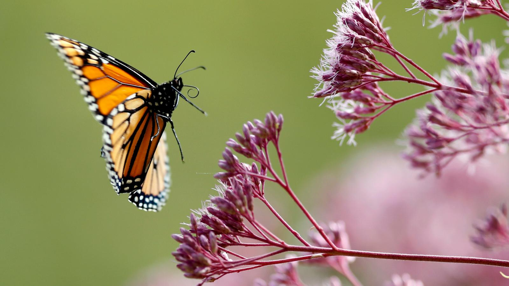

## The big picture: Plants evolved from green algae

 

* **Cyanobacteria & protist made landfall ~1.2 bya**
    + plants, fungi and animals ~500 mya
    + first forests 385 mya

 

* **Plants evolved from green algae**
    + Several key *'derived shared traits'*

 

* **Plants support all life on earth**
    + Oxygen to breath
    + food to eat
    + new habitats
    

## Green Algae (Oedogonium)

 
 

* **Sister group to land plants**
    + marine and freshwater
    + single and multi-cellular
    + broad, thick filaments
    + some have AoG
    + evolved around ~750mya
    
 

* **Reproductive features:**
    + *Oogonia* = egg containing cell
    + *Antheridium* = sperm containing cell
    

## Molecular evidence points at charophytes (freshwater)

##

## Land plants are a monophyletic group

 

## All land plants are embryophytes

 
 
 

 * **10 divisions of land plants**
    + does not include algae
    + divisions are species diverse

 

* **Zygote develops into multi-cell embryo**
    + enclosed in reproductive structure
    + algae do not retain embryo

 

* **Land plant & embryophyte terms used interchangeably**

## Shared traits define land plant evolution

## Multi-cellular, Dependent embryos (placental transfer)

## Waxy cuticle and stomata

## Multi-cellular Gametangia

## Photosynthesis with unique pigments (chlorophyll A & B)

## Unique cell walls

 
 
 

* **Cells walls made of cellulose** 
    + not unique to plants
    
 

* **Pectin to fortify cell walls **
    + unique to plants

 

* **Produce cells walls in unique way**
    + at end of mitosis

## Alternation of generations

 

* **Land plants alternate between diplod (2N) and haploid (1N) generations**
    + diploid = *sporophyte*
    + haploid = *gametophyte*

 

* **sex cells (1N) make zygote (2N)**
* **zygote &rarr; embryo &rarr; sporophyte (all mitosis)**
* **sporophyte makes spores (1N) by meosis**
* **spores germinate into gametophyte (1N) by mitosis**
* **gametophyte makes sex cells (sperm and egg)**

 

* **Dominance of different generations key for evolution**

## First plant group: non-vascular bryophytes (mosses)

 

* **Mosses, hornworts and liverworts**
    + Fossils of bryophyte spores ~470mya
    
 

* **Non-vascular; ground hugging carpets**
    + bodies to thin to support height growth

 

* **Have a rhizoid but not a root**
    + anchors plant
    + does not uptake water

 

* **Need H~2~0 for swimming sperm**

## Bryophytes have gametophyte dominated life cycle

## Vascular plants were the next evolutionary step

* **Vascular plants show up ~425mya**
    + gametophytes become reduced

 

* **Developed a vascular system**
    + grow taller = get light
    + xylem and phlome conduct

 

* **Developed leaves & roots**
    + better access to resources
    
 

* **First vascular plants lacked seeds**
    + sperm still needed to swim 
    + ferns and lycophytes
    

## Lycophytes: First vascular plants

 
 

* **Independent,	branched	sporophyte**
    + now with roots

 

* **Lignified	vascular	tissue**
    + xylem and phloem

 

* **Leaves are microphylls**
    + one vein per leaf (unique trait)
    
 

* **Lycophyte forests (30m) once existed**
    + gives us coal!

## Ferns

 

* **Whisk Ferns, Equisetum & Ferns**
    
 

* **Leaves are megaphylls**
    + many veins per leaf

  

* **Best plants ever!**

  

* **New *Gaga* genus with 19 species**
    + “We wanted to name this genus for Lady Gaga because of her fervent defense of equality and individual expression” Pryer @ Duke University
    

## Seedless vascular plants have free-living separate generations

 
 

* **Sporophyte: The fern you see in the woods**
    + becomes dominant stage

 

* **Gametophye: independent haploid generation**
    + start out female or bisexual

 

* **Derived Trait - remember how a moss looks!**

 

* **What does natural selection favor diploid dominant	life cycles?**

## Seed plants were the next evolutionary step

 

* **Seeds changed the course of plant evolution**
    + Seed plants show up ~360 mya
    + climate became drier
    
 

* **Seeds consists of embryo & nutrients**
    + surrounded by protective coat
    + seeds can be dispersed long distances
    + less dependence on water

 

* **2 living seed lineages**
    + gymnosperms (naked seed)
    + angiosperms (covered seed = fruits)
    

## Why seeds matter so much...

 

* **Before seeds, spore was only protective structure** 
    + super small so spread all over Earth

 

* **Seeds are multicellular**
    + what can this add?

 

* **Seeds can remain dormant for a long time**

 

* **Gymnosperms: seeds exposed on sporophylls, form cones**
* **Angiosperms: seeds enclosed inside fruits**

## 4 living lineages of gymnosperms

 

* **Cycads**: 300 living species
    + earliest evidence of insect pollination
    + Cycads and dinosaurs lived together

 

* **Gnteophytes**: small and super weird group
    + some flowering traits

 

* **Ginkos**: *Ginkgo biloba* is only species left!
    
 

* **Conifers**: ~600 species (cones)
    + evergreen and deciduous
    + leaves are needles or scales

## Flowering plant diversity

 

* **Most diverse living group of plants**
    + 14,000 genera, 250,000 species

* **2 classes: Moncots and Dicots**
    + monocots = one seed leaf in embryo
    + dicots = two seed leaf in embryo

## Angiosperm evolution: Bugs and animals

