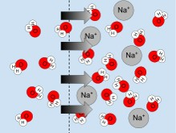

## Plant Transport: The big picture

 
 

* **Moving substances to target sites is fundamental**
    + often against diffusion gradient
    + processes consume energy (ATP)

 

* **Diffusion processes also occur**
    + proceed far slower

 

* **Question: Can plants sense the environment?**
    + does this impact transport processes
    
  

    

## Basic transport processes

 

* **Short distance: few cell diameters (or less)**
    + interior cells no in contact with environment
    + involves transfer of basic nutrients
    + outside &rarr; inside neighbor cells

 

* **Long distance: between cells that are now close neighbors**
    + adaptive for large land plants
    + evolution of vascular tissues
    + can be target-specific
    + results in non-transport advantages
    
## Moving water through the plant is vital

 

* **Most transport materials dissolve in H_2_0**

 

* **Water is weird and cool**
    + heavy
    + viscous (thick & *sticky*)
    
 

* **Water is component of photosynthesis**  

 

* **Water keeps cells turgid**
    + manipulated in guard cells

## Plants also have mechanisms to inhibit movement

 
 
 

* **Cutin-lined epidermis**
    + keeps water in

 

* **Casparian strip in roots*
    + surround cells cirlcing vascular bundle
    + forces selective diffusion through root cells
    

## Simple Transport: Diffusion through a membrane

 

* **Membranes can be free, impermeable or selective**

 

* **Some membranes have aqua-porins (proteins) to speed things up**

 

* **Membranes have *molecular pumps* for active transport**
    + use ATP to force molecules across membranes
    
## Water has the capacity to do work: Water Potential

 

* **Water has free energy (chemical potential)**
    + in botany = water poential
    + \psi of free water = 0 (no solutes)
 
 

* **Water potential can be increased/decreased**
    + heated
    + pressure
    + elevated
    
* **\psi detemined by pressure, solutes & stickness**

 

* **Movement of water is related to water poential**
    + moves from positive to negative
    + cells interconnected = plant one big pond
    

## Plant Water Transport: Soil - Root - Stem - Leaf - **Air**

## How do plants know? Sensory cell systems

 

* **Cell to cell signal networks**

 

* **Ca^2+^ based signals are common**

## Plants grow towards light:  Phototropism via Auxin

<!-- ## Sunflowers in the light -->
<!-- 
 -->

<!-- <iframe width="560" height="315" src="https://www.youtube.com/embed/GCRNHdGXTi4" frameborder="0" allow="autoplay; encrypted-media" allowfullscreen></iframe> -->

## Plants competing for light can grow really tall

 
 
 

* **Primary and secondary growth allow trees to be giants**

 

* **Are their limitations to plant height?**
    + Redwoods = 116 m
      
 

* **What resource most limits growth?** 

 

## Are there limits to moving water?

 
 
 

* **Large trees move hundreds of gallons of water a day**

 

* **Gravity**
    + harder and harder to move water
    + xylem less efficient @ top
    + theoretically, limits growth to 122-130 m

 

* **Drying soil adds tension**

 

## How long a straw could Superman use?

 
## How can redwood trees grow so tall?

 

* **Cohesion tension theory**
    + plants use water properties to cheat gravity

 

* **Cohesion: H~2~0 stick to other H~2~0 molecules**
    + via H bonds

 

* **Adhesion: water sticks to non water molecules**
    + stick to sides of xylem tissues
    + is not pulled straight up!

 

* **Transpiration pulls water under tension**

 
 

## How can redwood trees grow so tall?

 
 

* **H~2~O also pulled in zig zag motion**
    + pits and perforations
    + tracheids are twisted

 

* **Vascular tissue is tough**
    + high resistance of lignified walls
    + built not to collapse
  
 

* **Redwoods near theoretical limit!** 
  

 

##

## Cavitation: When water breaks 

 
## Do plants sense cavitation events and repair them? 

<!--  -->

## How do plants avoid water problems #1

## Risky stomatal behavior

## How do plants avoid water problems #2

## How do plants avoid water problems #3

## Don't mess with the acacia tree!

## Plant herbivore defenses: Ethylene 

 
## Signalling herbivory

 

<iframe width="560" height="315" src="https://www.youtube.com/embed/Lzq-wRHCTKc" frameborder="0" allow="autoplay; encrypted-media" allowfullscreen></iframe>

## Wounding triggers transmission of Ca^2+^ to start defense

 

## Protective perfumes

## 

