## Plant Transport: The big picture

 
 

* **Moving substances to target sites is fundamental**
    + often against diffusion gradient
    + processes consume energy (ATP)

 

* **Diffusion processes also occur**
    + proceed far slower

 

* **Can plants sense the environment?**
    + does this impact transport processes
    
  

    
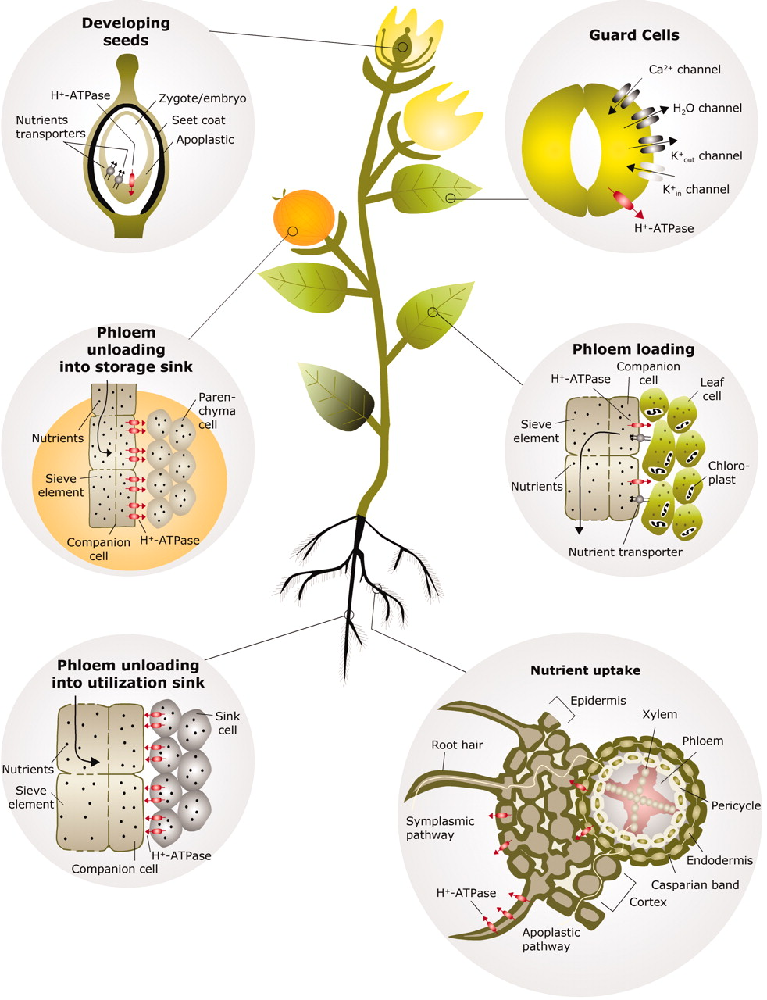

<!-- ## Basic transport processes -->
<!-- 
 -->
<!--   -->

<!-- * **Short distance: few cell diameters (or less)** -->
<!--     + interior cells no in contact with environment -->
<!--     + involves transfer of basic nutrients -->
<!--     + outside &rarr; inside neighbor cells -->

<!--   -->

<!-- * **Long distance: between cells that are now close neighbors** -->
<!--     + adaptive for large land plants -->
<!--     + evolution of vascular tissues -->
<!--     + can be target-specific -->
<!--     + results in non-transport advantages -->
    
## Moving water through the plant is vital

 

* **Most transport materials dissolve in H~2~0**

 

* **Water is component of photosynthesis**  

 

* **Water keeps cells turgid**
    + manipulated in guard cells

 

* **Water is weird and cool**
    + heavy
    + viscous (thick & *sticky*)

 

 
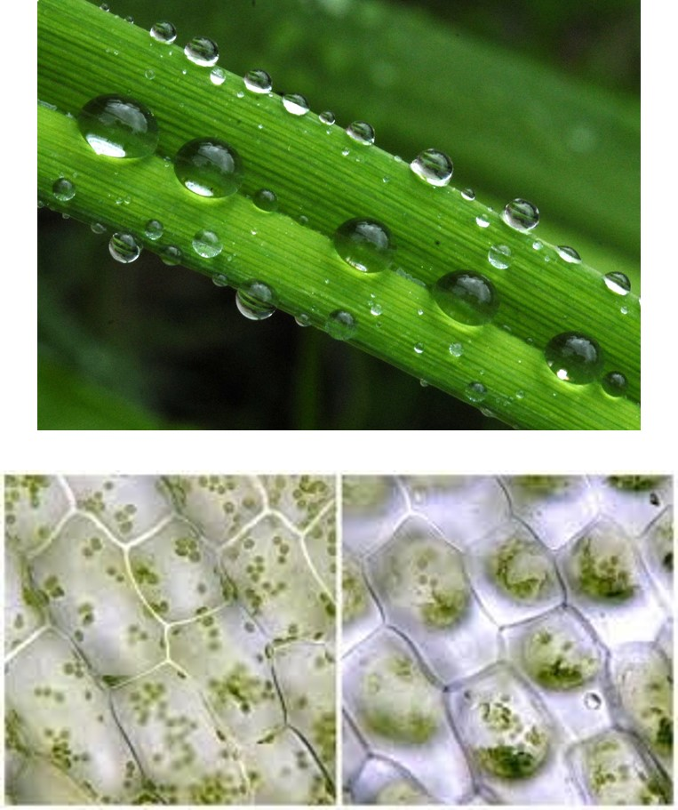

## Plants also need mechanisms to inhibit movement

 
 
 

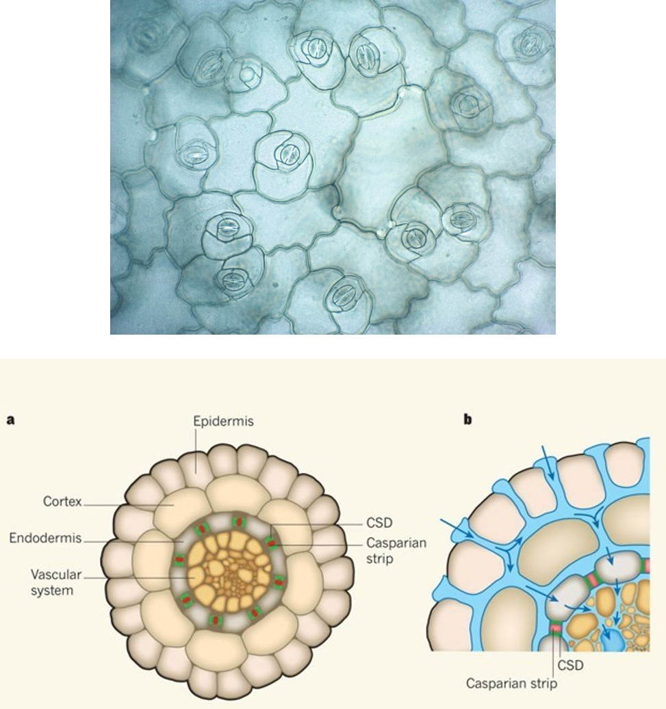

* **Cutin-lined epidermis**
    + keeps water in

 
 
 

* **Casparian strip in roots**
    + surround cells circling vascular bundle
    + forces selective diffusion through root cells
    

## Simple Transport: Diffusion through a membrane

 

* **Membranes can be free, impermeable or selective**

 

* **Some membranes have aquaporins (proteins) to speed things up**

 

* **Membranes have *molecular pumps* for active transport**
    + use ATP to force molecules across membranes

 

* **Water enters roots through osmosis**
    + often as nutrient solution
    

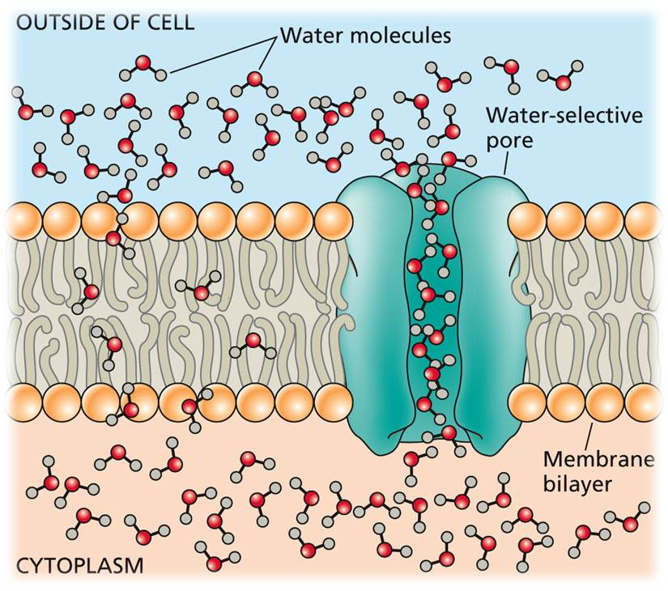

## Water has the capacity to do work: Water Potential

* **Water has free energy (chemical potential)**
    + in botany = water potential($\psi$)
    + $\psi$ of pure water = 0 (no solutes)
 
 

* **Water potential can be increased/decreased**
    + heated
    + pressure
    + elevated
    
 

* **$\psi$ determined by pressure, solutes & stickiness**

 

* **Movement of water is related to water potential**
    + moves towards more negative $\psi$ (more solutes)
    + cells interconnected = plant one big pond
    
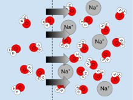

## Plant cell walls will never burst!

* **Example: Plant cells (-.3 mPa) placed in pure water**
    + water will move in to cell

 

* **Example: Plant cells (-.15 mPa) placed in -0.3 solution**
    + water will move our of cell

 

* **Both these changes would need drastic adjustments of H~2~O or solutes**
    + each cause cell death

 

* **Cell walls push or pull against change = pressure potential**
    + part of water potential calculation
    + more 'flexibility' to reach equilibrium

## Phloem: uses active transport & water potential

 

* **Source: sites where sugars are exported**
    + active leaves or storage tissues

 

* **Sinks: sites that receive phloem sap**
    + all parts of plant

 

* **Sugars actively loaded/unloaded into sieve elements**
    + at source and sink
    + changes water potential (both ends) 
    + water diffuses in/out driving sap
    + phloem under high pressure
    
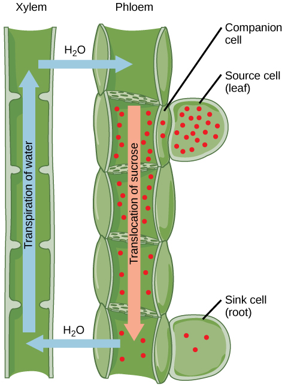

## Xylem Transport: Soil - Root - Stem - Leaf - **Air**

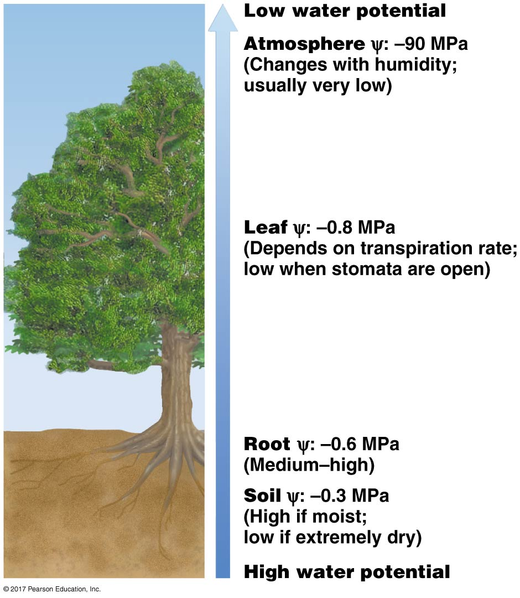

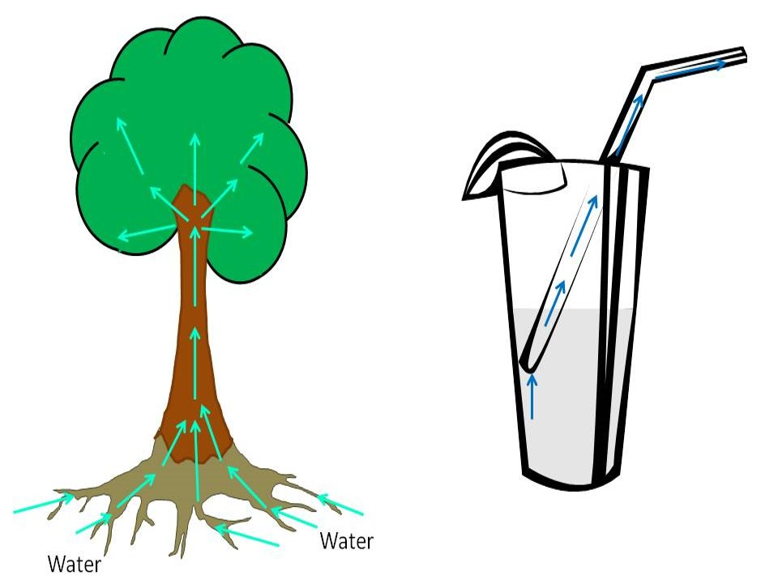

## Are there limits to moving water?

 
 
 

* **Large trees move hundreds of gallons of water a day**

 

* **Gravity**
    + harder and harder to move water
    + xylem less efficient @ top
    + theoretically, limits growth to 122-130 m

 

* **Drying soil adds more tension**

 

## How long a xylem straw could Superman use?

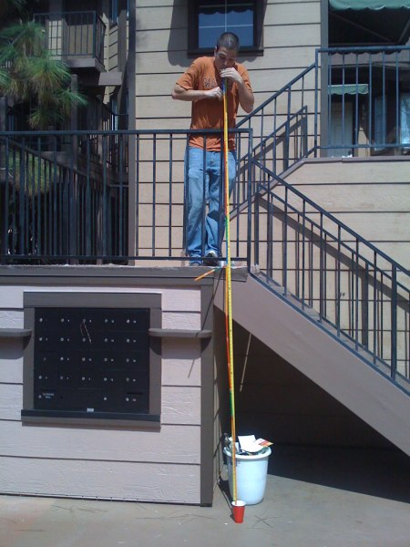
 
## How can redwood trees grow so tall? Hyperion = 116m

 

* **Cohesion tension theory**
    + plants use water properties to cheat gravity

 

* **Cohesion: H~2~0 stick to other H~2~0 molecules**
    + via H bonds

 

* **Adhesion: water sticks to non water molecules**
    + stick to sides of xylem tissues
    + is not pulled straight up!

 

* **Transpiration pulls water under tension**

 
 
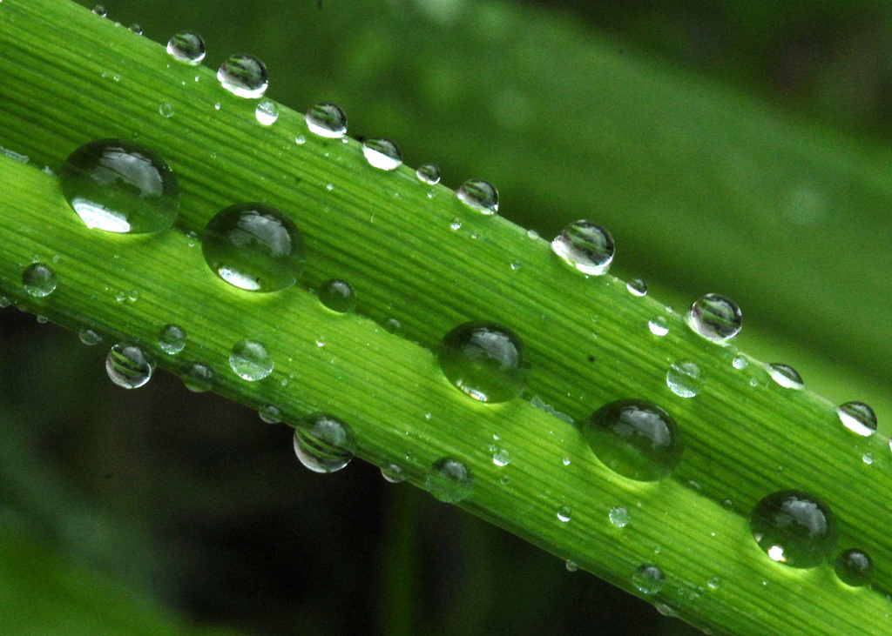

## How can redwood trees grow so tall?

 
 

* **H~2~O also pulled in zig zag motion**
    + pits and perforations
    + tracheids are twisted

 

* **Vascular tissue is tough**
    + high resistance of lignified walls
    + built not to collapse
  
 

* **Hyperion tree near theoretical limit!** 
  

 

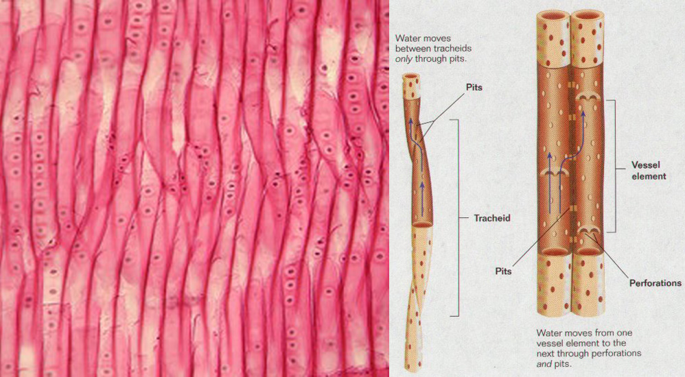

## Issues: Leaves (stomata) are sensitive to VPD

 
 

* **Vapor Pressure Deficit: difference between moisture in air and how much moisture air can hold**
    + if *high* then the air is 'drier'
    + combo of temperature and humidity
    
 

* **High VPD pulls has large impact on transpiration**

 

* **If stressful, stomata should close**
    + stop excessive water loss

 

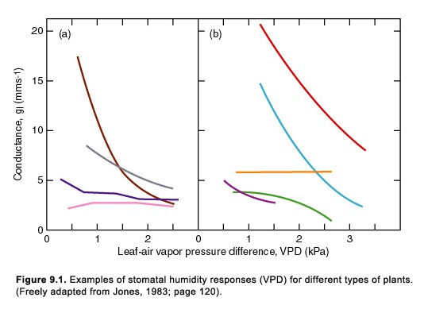

## FIX: Just close your stomata (Right?!?)

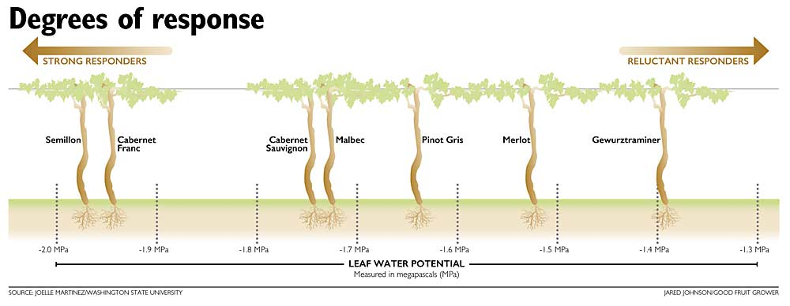

## Issue: What happens if if doesnt rain for a while?

 
 

* **If the soil dries out, what will &psi;_soil_ become?**

 

* **Generally, predawn &psi; is really high**
    + right before sun comes up
    + stomata closed

 

* **During day: stomata open, air pulls and soil water drained**
    + &psi;_soil_ become?
  
 

* **How is this sustainable?**

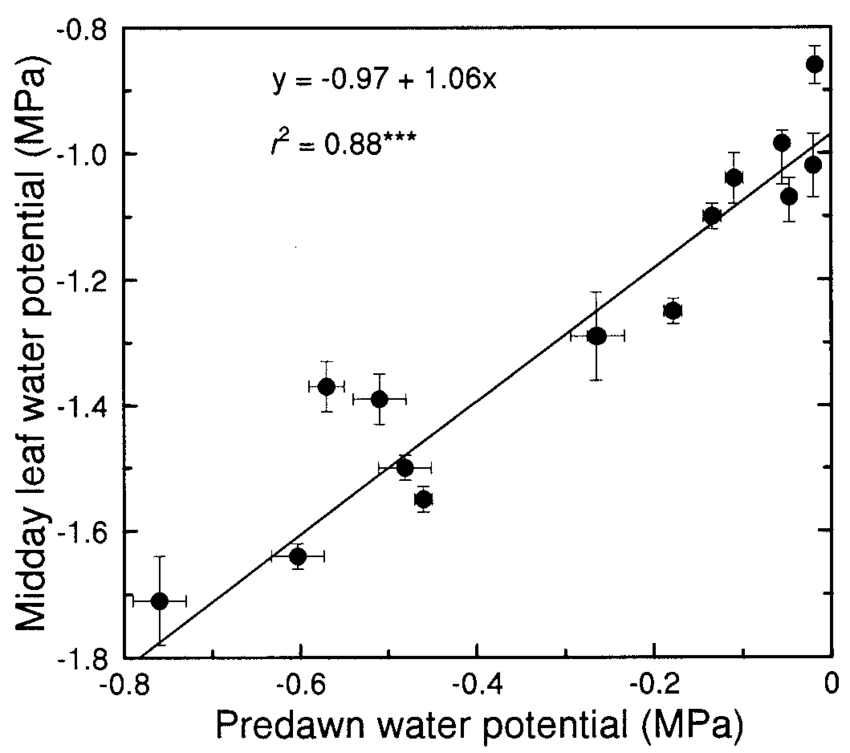

## Fix: Soils will refill without rain

 

* **Capillary action and surface attraction draw in water**
    + clay soils have lots of 'pore' space
    + often stronger than gravity

 

* **Potential energy (aka water potential) governs how water moves around in soil**
    + redistribution @ night
    + 'sponge' behavior during day

 

* **Prolonged drought can impact the soil water potentials**

 

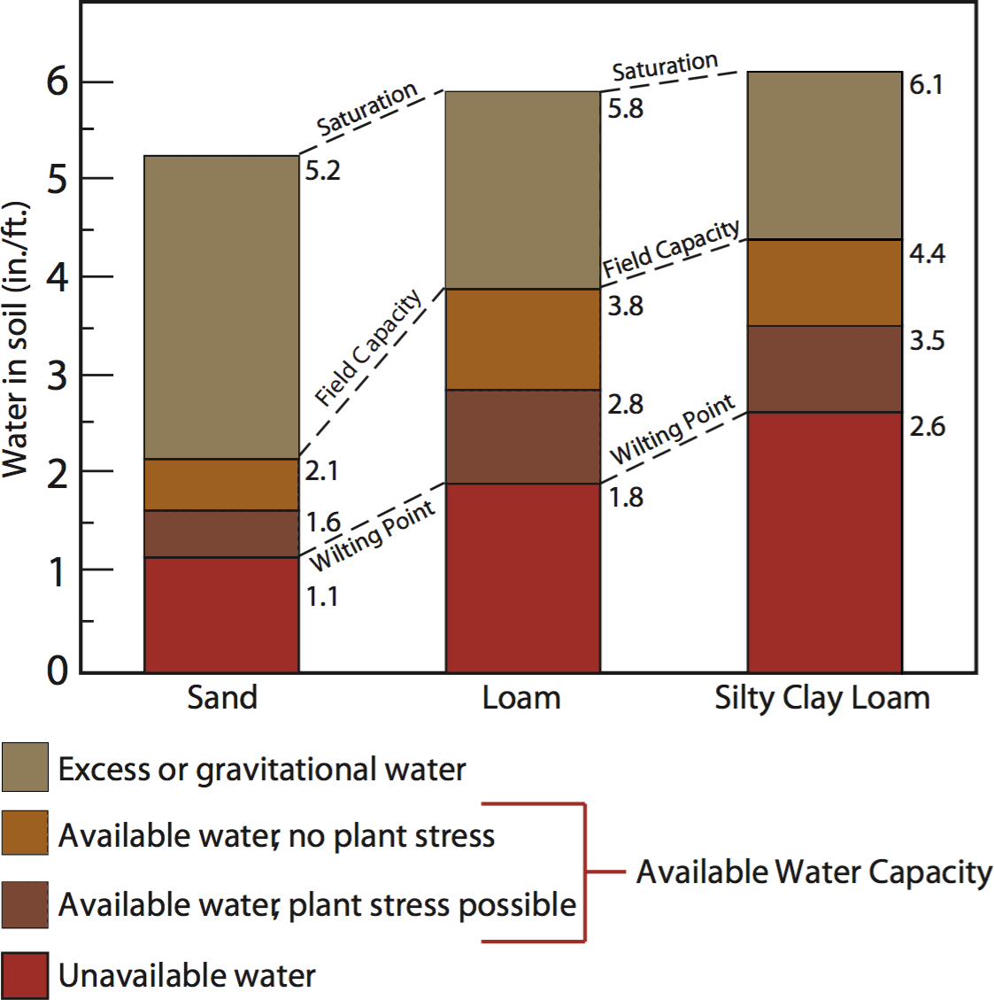

## Issue: When water breaks (cavitation)

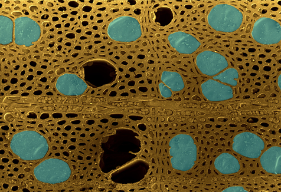

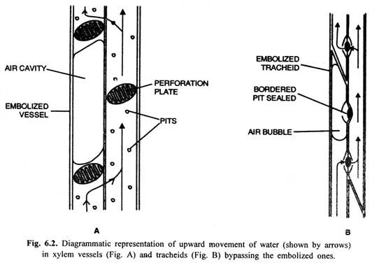
 
## Fix: Build new xylem 

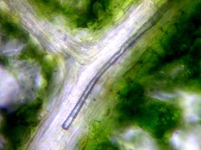

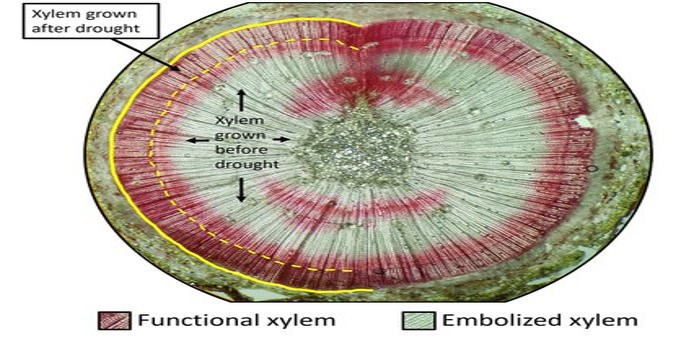

## Fix: Grow tall and make xylem skinny

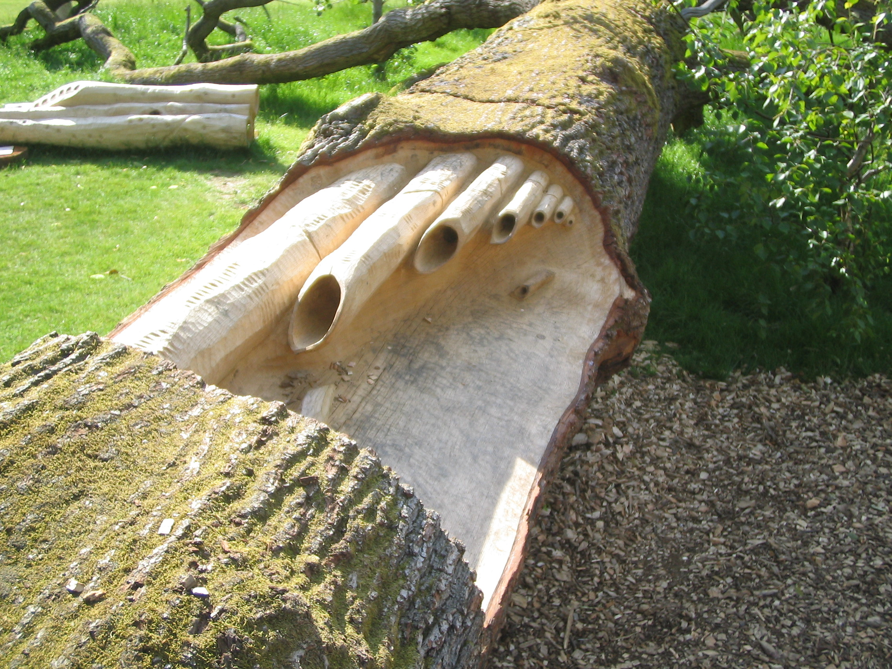

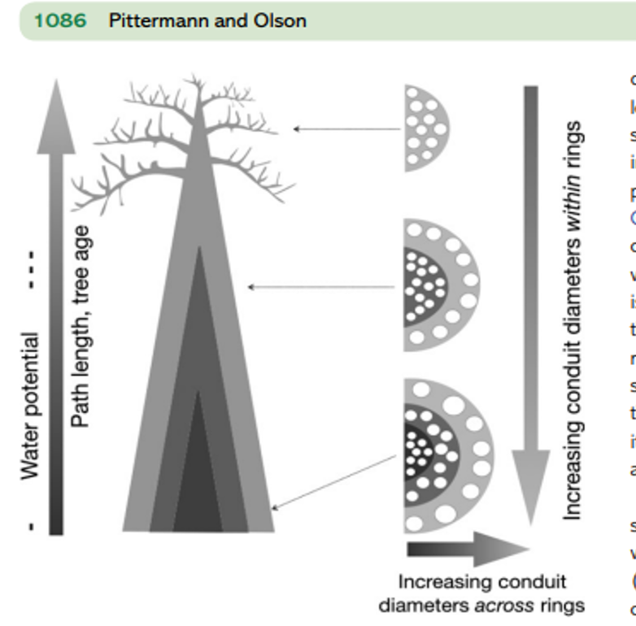

## Brainstorm: Will climate change impact water transport?

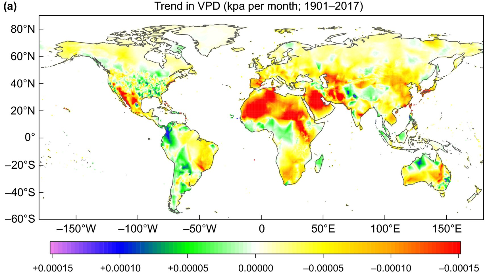