## Moving water through the plant is vital

 

* **Most transport materials dissolve in H~2~0**

 

* **Water is component of photosynthesis**

 

* **Water keeps cells turgid**
    + manipulated in guard cells

 

* **Water is weird and cool**
    + heavy
    + viscous (thick & *sticky*)

 

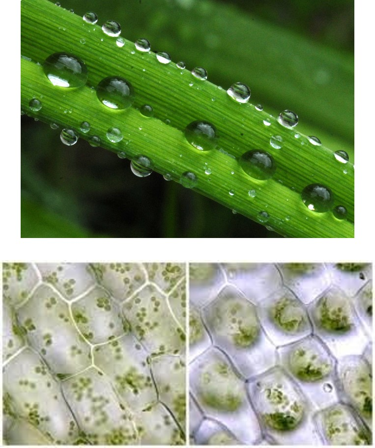

<!-- ## Simple Transport: Diffusion through a membrane -->
<!-- 
 -->
<!--   -->

<!-- 
 -->

<!-- * **Membranes can be free, impermeable or selective** -->

<!--   -->

<!-- * **Some membranes have aquaporins (proteins) to speed things up** -->

<!--   -->

<!-- * **Membranes have *molecular pumps* for active transport** -->
<!--     + use ATP to force molecules across membranes -->

<!--   -->

<!-- * **Water enters root hairs through osmosis** -->
<!--     + often as nutrient solution -->

<!-- 
 -->

<!-- 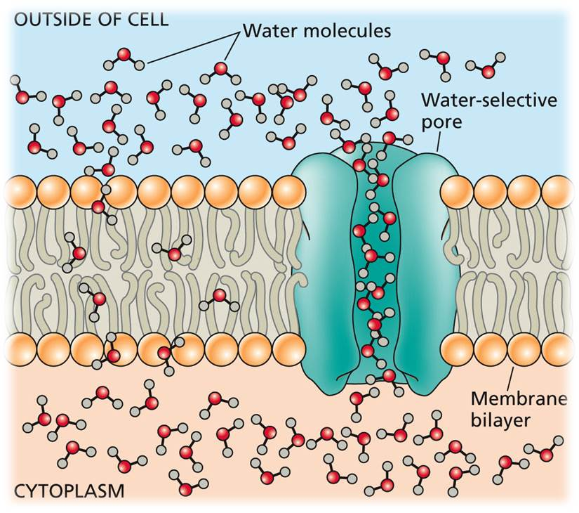 -->

## Water has the capacity to do work: Water Potential

* **Water has free energy (chemical potential) = ability to do work or move**
    + in botany = water potential ($\psi$)
    + $\psi$ of pure water = 0 (no solutes)
    + $\psi$ is generally negative but closer to 0 (higher) = more available energy

 

* **$\psi$ determined by pressure, solutes & stickiness**
    + adding things to water (solutes) lowers water potential = -$\psi$
    + turgor in cells puts pressure on water (push) = higher $\psi$
    + tension on water in xylem (pull) = lower $\psi$

 

* **Movement of water is related to water potential**
    + water moves towards more negative $\psi$ (more solutes)
    + cells interconnected = plant one big pond
    + $\psi$ gradient drives water into roots, transport through xylem, and movement between cells

<!-- 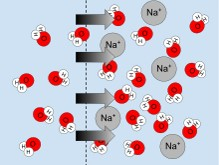 -->

## Plant cell walls will never burst!

* **Example: Plant cells (-0.3 mPa $\psi$) placed in pure water**
    + water will move in to cell

 

* **In plant cells, pressure builds up as the central vacuole fills with water**
    + The rigid cell wall resists expansion, creating turgor pressure (positive $\psi$).

 

* **This pressure raises the overall water potential (Ψ), often offsetting negative Ψs from solutes**
    + without the balancing pressure, water flow into cells until the burst

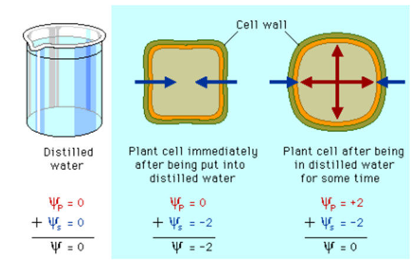

## Phloem: uses active transport & water potential

 

* **Source: sites where sugars are exported**
    + active leaves or storage tissues

 

* **Sinks: sites that receive phloem sap**
    + all parts of plant

 

* **Sugars actively loaded/unloaded into sieve elements**
    + at source and sink (often using ATP)
    + changes water potential (Ψ at both ends)
    + water diffuses in/out driving sap flow
    + phloem under high pressure

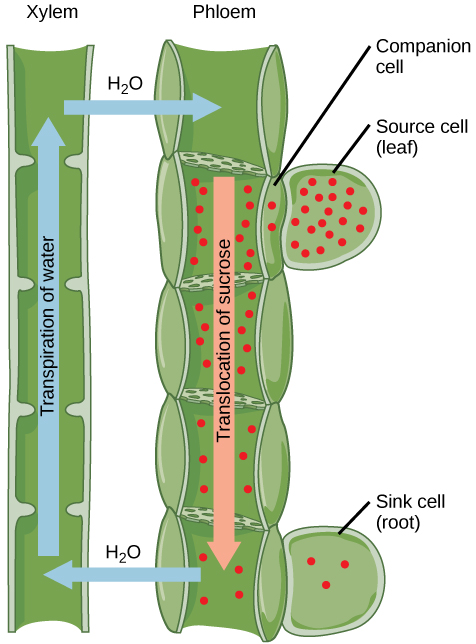

## Xylem Transport: Soil - Root - Stem - Leaf - **Air**

 

**Water potential gradients are the driving force of how water moves through a plant**

 

**Transpiration = loss of water through evaporation at the leaf surface**

 

**The atmosphere to which the leaf is exposed drives transpiration because air has a really negative Ψ**

 

**Creates a powerful negative pressure (tension) at the leaf surface, pulling water up**

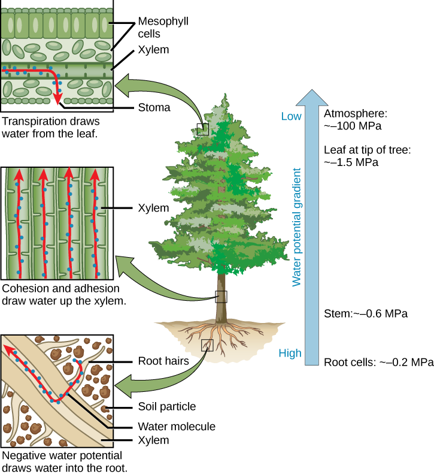

## Plant H~2~O transport: Soil - Root - Stem - Leaf - **Air**

 
 
 
 
 

**Air controls transpiration by changing the water potential difference between the leaf and atmosphere, essentially sucking water vapor out of the plant when stomata are open**

 

**Uptake: water moves towards more negative $\psi$**

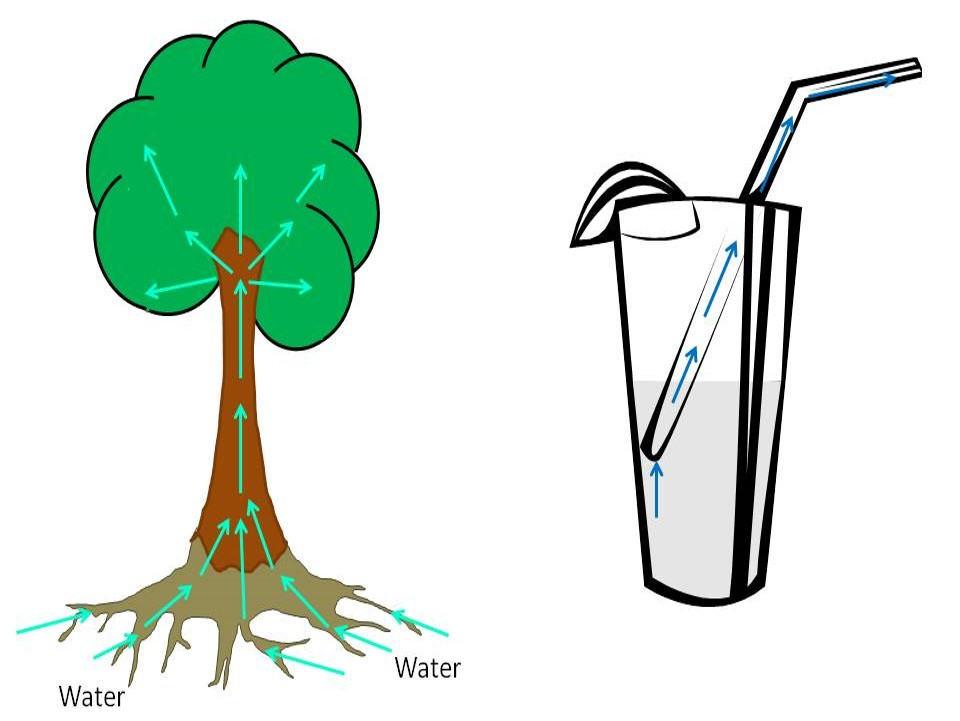

## Opening of stomata with sunlight creates the Ψ gradient

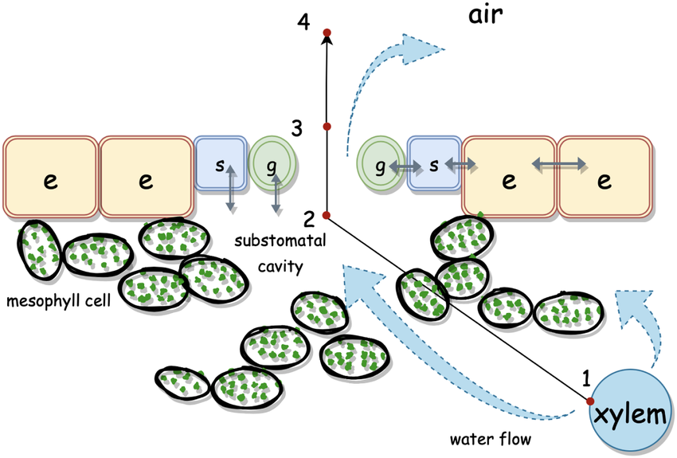

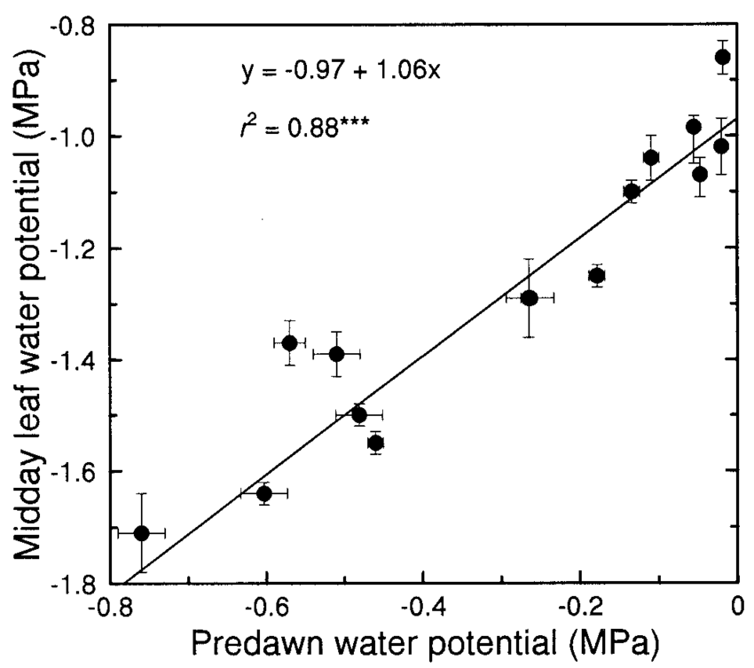

## Cohesion-tension: Capillary action aids upward movement

 

**Cohesion= water molecules sticking together via hydrogen bonding**

 

**Adhesion=water molecules sticking to the walls of xylem vessels**

 

**Combined create *capillary action (flow of liquid within narrow spaces)***

 

**Allows water to rise through the narrow tubes of the xylem, against the push of gravity, as an unbroken column**

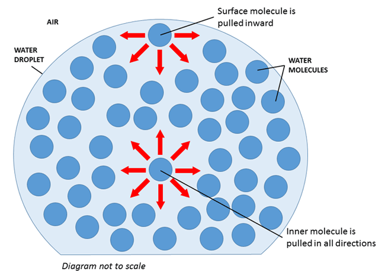

## Capillary action + transpiration move water through plant

 

**Evaporation of water at leaves creates the transpiration pull (gradient of negative $\psi$)** 

 

**This tension is transmitted down the whole water column due to cohesion**

 

**This stickiness of water keeps the column of water from pulling apart**

 

**When stomata are closed at night, cohesion/adhesion hold water in place**

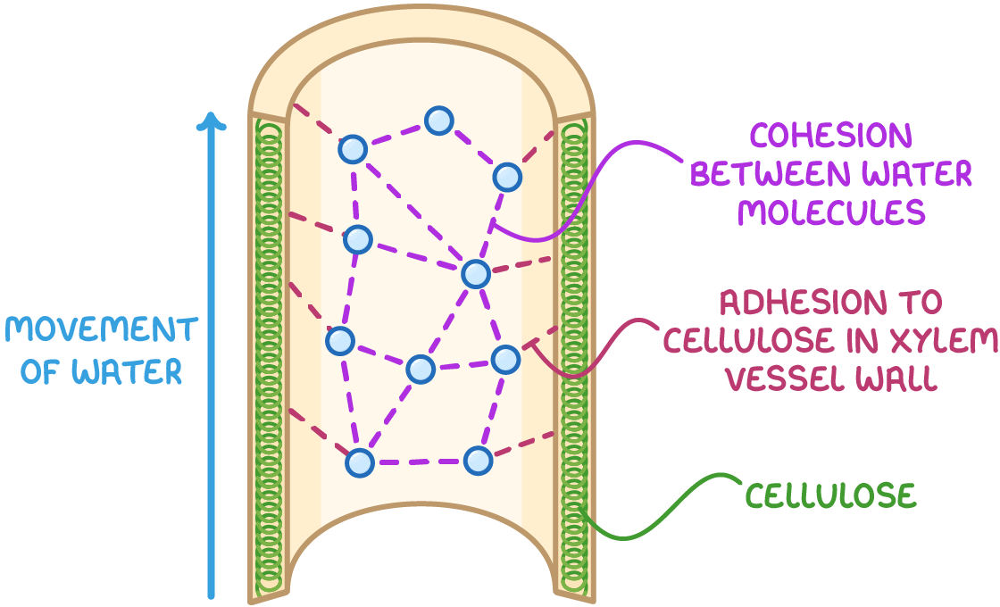

## Water pulled through root cells towards the xylem

**Pull of water under tension in vascular tissues means xylem have a more negative $\psi$ than root cells**

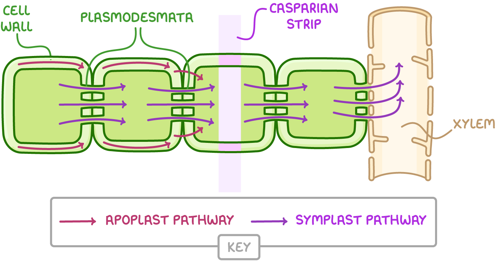

## Ψ gradient in roots cells drives osmosis

**Due to the $\psi$ gradient in cells, the surrounding soil has a higher $\psi$, driving diffusion into root hairs**

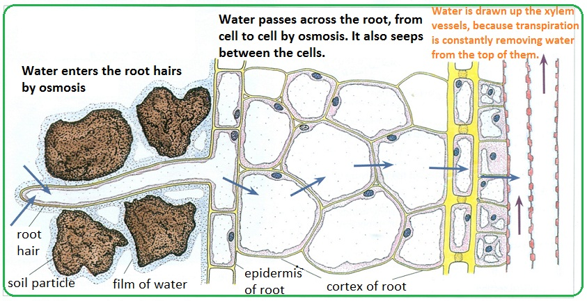

## Are there limits to moving water through plants?

 
 

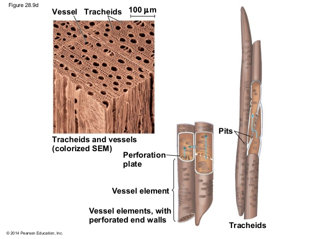

* **Really large trees (redwoods) can move hundreds of gallons of water a day**

 

* **Gravity**
    + gets harder to move water vertically
    + xylem less efficient @ top
    + theoretically, limits growth to 122-130 m

 

* **Drying soil adds more tension**
    + $\psi$ gets more negative, reducing the water potential gradient with the plant

## How can trees grow over 100 meters tall?

 
 

* **H~2~O also pulled in zig zag motion**
    + pits in vessels/tracheids
    + tracheids are twisted

 

* **Vascular tissue is tough**
    + high resistance of lignified walls
    + built not to collapse
  
 

* **Coastal redwood tree nears theoretical limit!** 
  

 

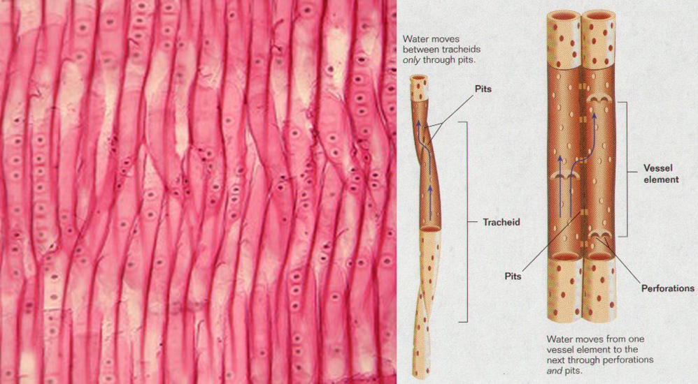

## Issue: When the column of water breaks, embolisms form

**Cavitation is the formation of air bubbles inside xylem vessels or tracheids, blocking water transport**
 
**Occurs when tension (from transpiration pull) becomes too great, overpowering cohesion**

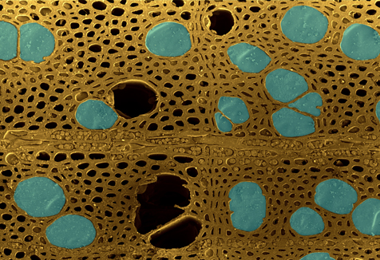

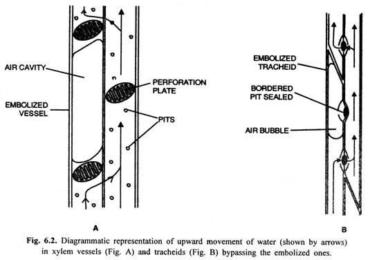

## The sound of water stress....

<iframe width="560" height="315" src="https://www.youtube.com/embed/uWL0EoZh09w?start=102" frameborder="0" allow="accelerometer; autoplay; clipboard-write; encrypted-media; gyroscope; picture-in-picture" allowfullscreen></iframe>

## Fix: Can plants repair embolisms?

**A stem would need to create a new $\psi$ with surrounding cells (via adding solutes) to refill while also compressing the air bubble until it dissolves into solution. If/how they do it is a huge matter of debate**

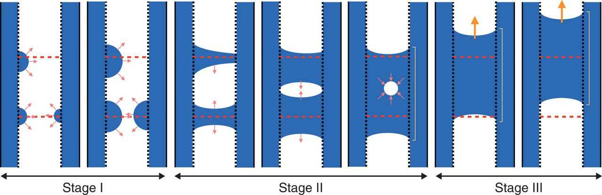

## Fix: Building new xylem cells works but slow and expensive

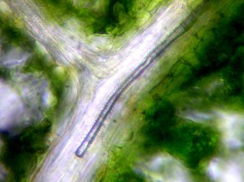

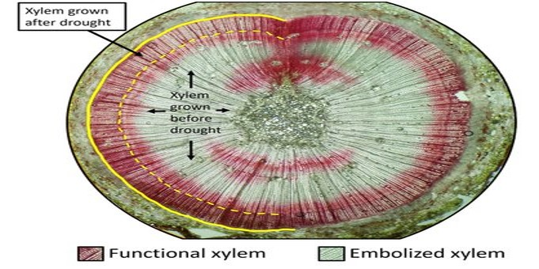

## Avoidance: Taper xylem (make skinny) as tree gets taller

**Decreasing xylem diameter as plant gets taller reduces cohesion tension and promotes adhesion**

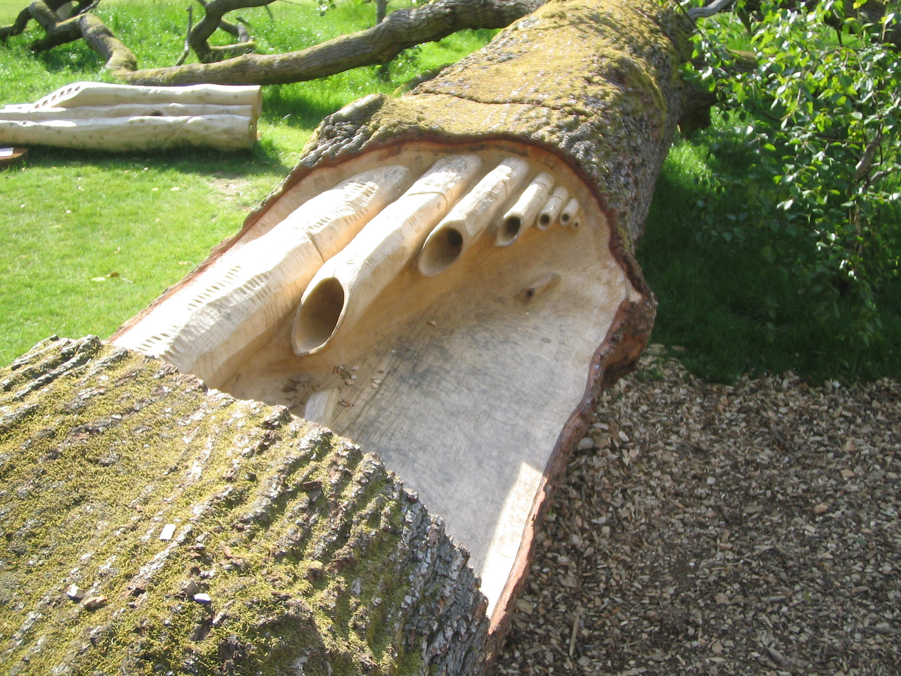

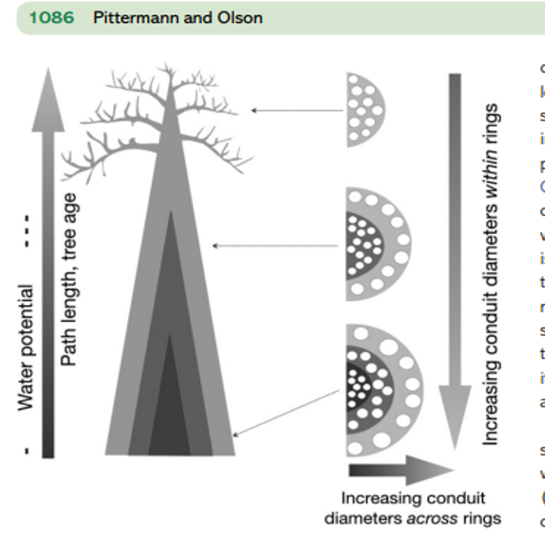

## Issues: Leaves (stomata) are sensitive to VPD

 
 

* **Vapor Pressure Deficit: difference between moisture in air and how much moisture air can hold**
    + if *high* then the air is 'drier'
    + combo of temperature and humidity
    
 

* **High VPD creates massive pulling effect for transpiration**

 

* **If stressful, stomata *should* close**
    + stop excessive water loss

 

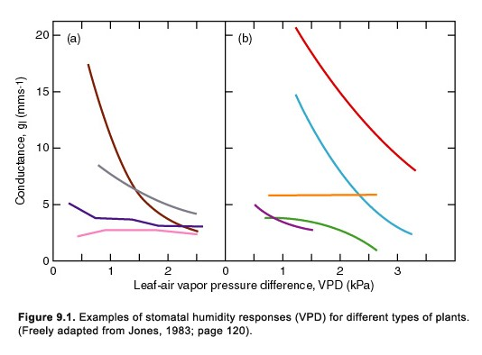

## FIX: Just close your stomata (Right?!?)

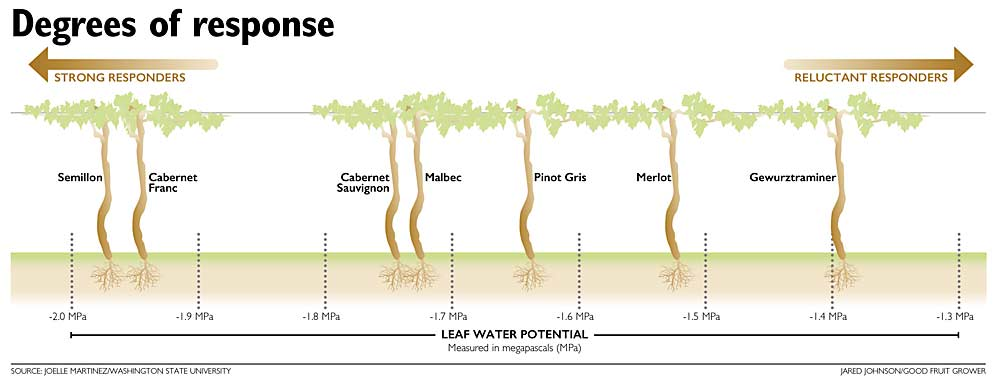

## Issue: What happens if if doesnt rain for a while?

 
 

* **If the soil dries out, what will &psi;_soil_ become?**

 

* **Generally, predawn &psi; is really high**
    + right before sun comes up
    + stomata closed

 

* **During day: stomata open, air pulls and soil water drained**
    + &psi;_soil_ become?
  
 

* **How is this sustainable?**

## Fix: Soils will refill without rain

 

* **Capillary action and surface attraction draw in water**
    + clay soils have lots of 'pore' space
    + often stronger than gravity

 

* **Potential energy (aka water potential) governs how water moves around in soil**
    + redistribution @ night
    + 'sponge' behavior during day

 

* **Prolonged drought can impact the soil water potentials**

 

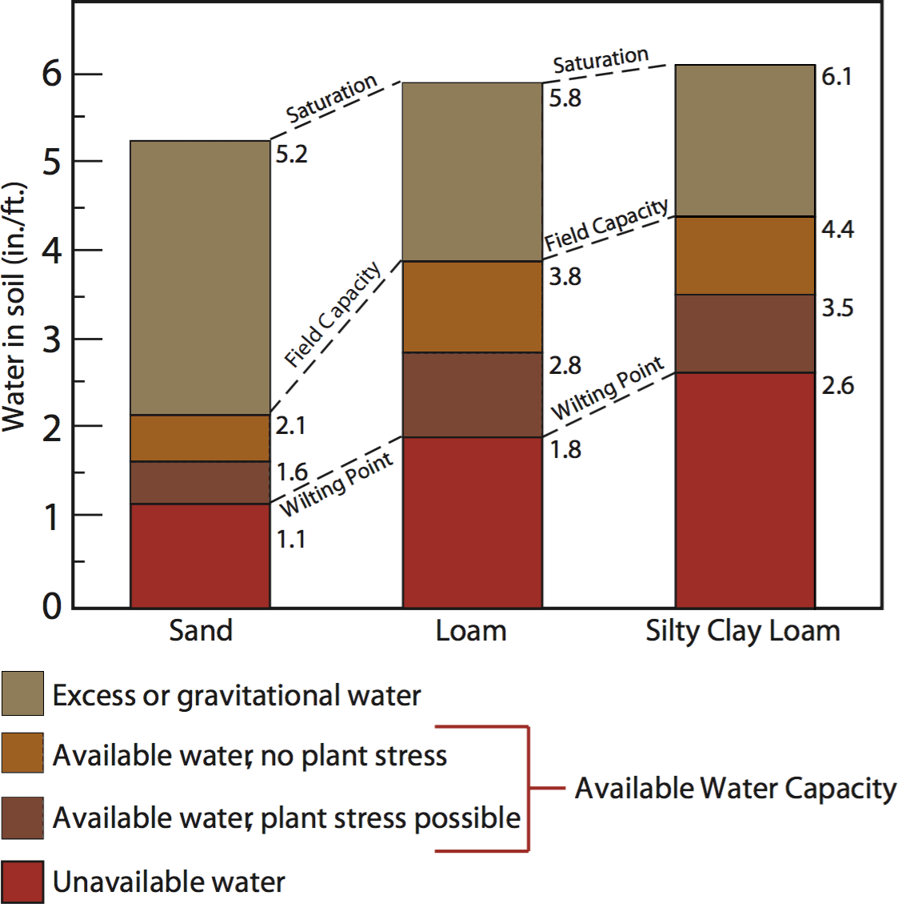

## Brainstorm: Will climate change impact plant water transport?

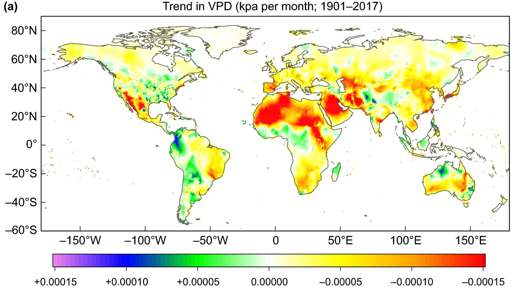