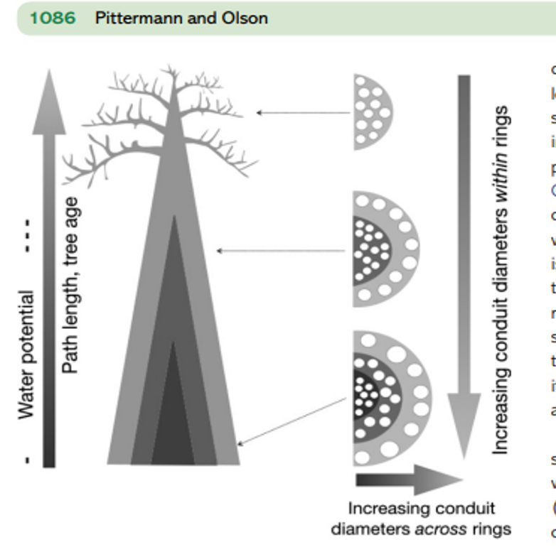
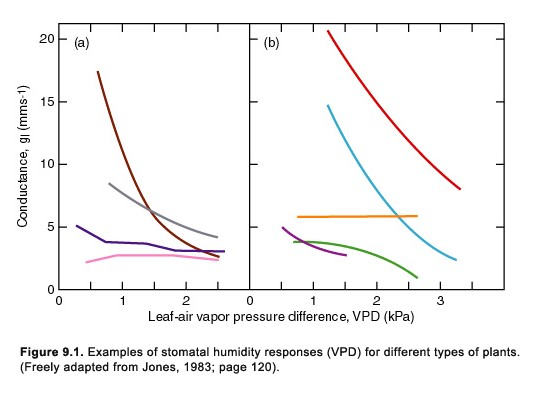

## Xylem Transport: Soil - Root - Stem - Leaf - **Air**

## Cohesion-tension: Water drop vs Xylem

## How can redwood trees grow so tall?

 
 

* **H~2~O also pulled in zig zag motion**
    + pits and perforations
    + tracheids are twisted

 

* **Vascular tissue is tough**
    + high resistance of lignified walls
    + built not to collapse
  
 

* **Hyperion tree near theoretical limit!** 
  

 

##

## The sound of water stress....

<iframe width="560" height="315" src="https://www.youtube.com/embed/uWL0EoZh09w?start=102" frameborder="0" allow="accelerometer; autoplay; clipboard-write; encrypted-media; gyroscope; picture-in-picture" allowfullscreen></iframe>

## Issue: When water breaks (cavitation)

## Fix: Repair embolisms?

## Fix: Build new xylem 

## Fix: Grow tall and make xylem skinny

## Issues: Leaves (stomata) are sensitive to VPD

 
 

* **Vapor Pressure Deficit: difference between moisture in air and how much moisture air can hold**
    + if *high* then the air is 'drier'
    + combo of temperature and humidity
    
 

* **High VPD pulls has large impact on transpiration**

 

* **If stressful, stomata should close**
    + stop excessive water loss

 

## FIX: Just close your stomata (Right?!?)

## Issue: What happens if if doesnt rain for a while?

 
 

* **If the soil dries out, what will &psi;_soil_ become?**

 

* **Generally, predawn &psi; is really high**
    + right before sun comes up
    + stomata closed

 

* **During day: stomata open, air pulls and soil water drained**
    + &psi;_soil_ become?
  
 

* **How is this sustainable?**

## Fix: Soils will refill without rain

 

* **Capillary action and surface attraction draw in water**
    + clay soils have lots of 'pore' space
    + often stronger than gravity

 

* **Potential energy (aka water potential) governs how water moves around in soil**
    + redistribution @ night
    + 'sponge' behavior during day

 

* **Prolonged drought can impact the soil water potentials**

 

## Brainstorm: How will climate change impact plant hydraulics?

## Drought tolerate crops?

