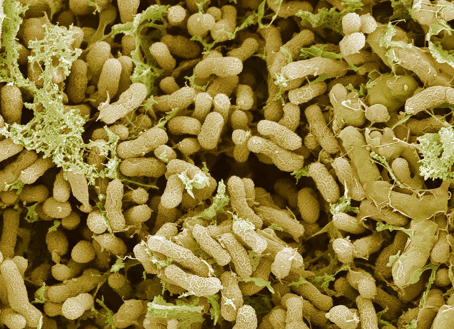
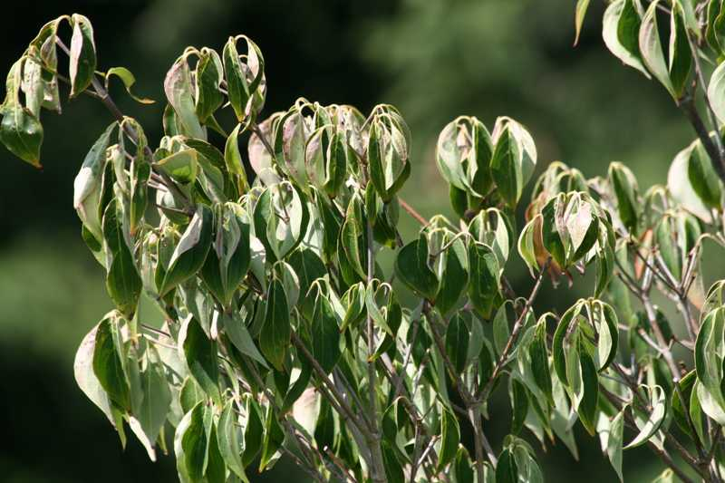
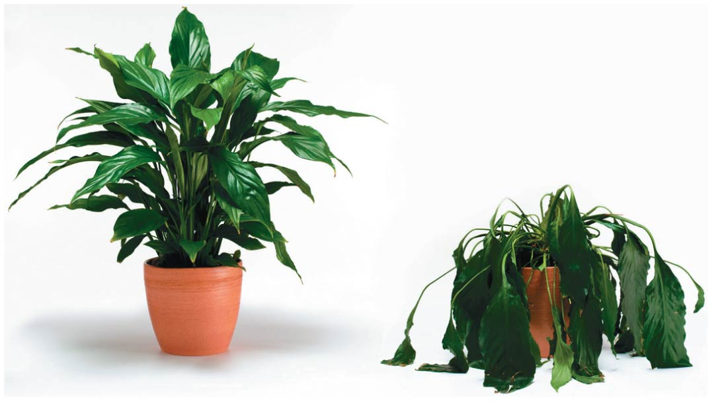
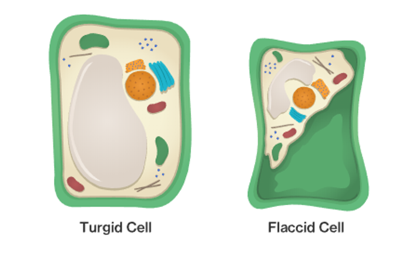

```{r setup, include=FALSE}
knitr::opts_chunk$set(echo = FALSE)
```

## What did you come up with
<hr>

* **I asked you to do a quick web reseach on nutrient limitation.**


## What limits plant growth and survival?
<hr>


## Resources for photosynthesis
<hr>


## Nutritional elements for growth
<hr>
<br/>
<br/>
<br/>


<div style="float: right; width: 45%;">

* **Carbon, Hydrogen & Oxygen**
* >95% of biomass

<br/>

* **Most have multiple functions**
      
<br/>

* **A few are often limiting**

 </div> 
 
## N - P - K
<hr>


## 


## Mineral elements come from soil
<hr>


## Review: root nutrient uptake
<hr>


## Review: mycorrhizae
<hr>


## Nitrogen fixation
<hr>




## Cool plant adaptations
<hr>


## What is the most essential resource for plants?
<hr>



##


## Turgor pressure
<hr>





## Liebig's Law of the minimum
<hr>


## Plant nutrient limitation in natural systems
<hr>


## Plant nutrient limitation in crop systems
<hr>

