```{r setup, include=FALSE}
knitr::opts_chunk$set(echo = FALSE)
```

## Mineral nutrition in plants
<hr>
<br/>

* **Plants are capable of making all necessary organic compounds from inorganic compounds and elements in the environment**
    + aka 'autotrophic'
    + mineral: an inorganic element (e.g. inorganic ion from soil)
    + some minerals are essential and some are beneficial

<br/>

* **These resources often have multiple functions in the plant**
    + metabolic, biochemical, structure, etc
    + amount required or present varies

<br/>

* **Review: acquiring these resources requires and above- and belowground body plan**
    + plants are 'environmental miners'
    
## What did you find: What limits plant growth and survival?
<hr>
<br/>

1) What resource is most limiting for plants?
2) Are there places on earth that are more nutrient limited than others?
3) What plant ecosystems (natural/managed) are nutrient limited?
4) What is the current state of nutrient limitation in global croplands?

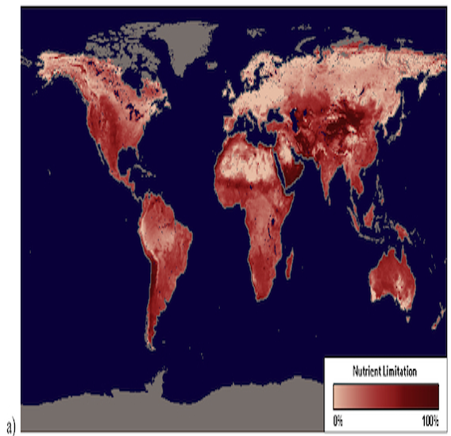

## Resources for photosynthesis
<hr>

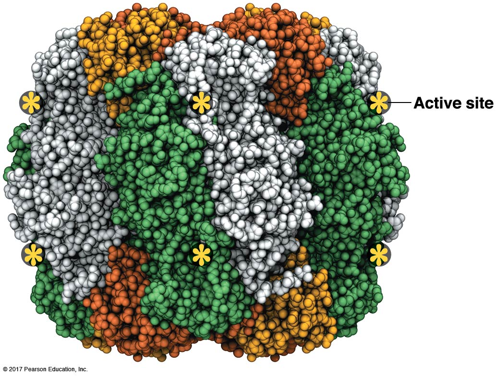

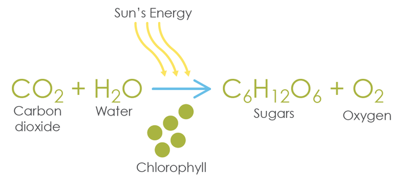

## Nutritional elements for growth
<hr>
<br/>
<br/>
<br/>

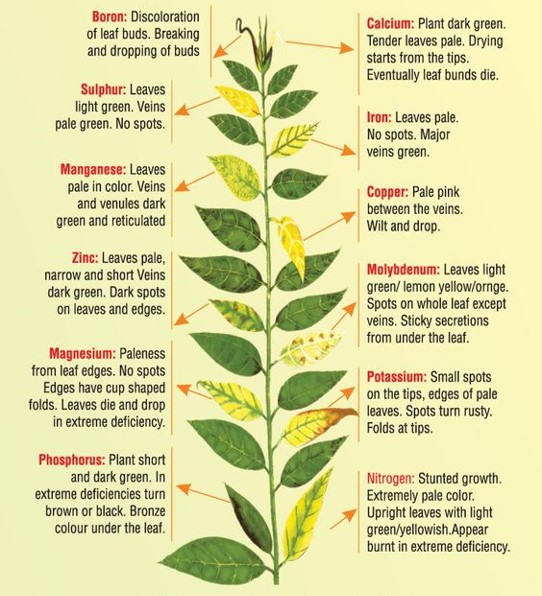

<div style="float: right; width: 45%;">

* **Carbon, Hydrogen & Oxygen**
* >95% of biomass

<br/>

* **Most have multiple functions**
      
<br/>

* **A few are often naturally limiting**
    + why we fertilizer

 </div> 
 
## N - P - K
<hr>


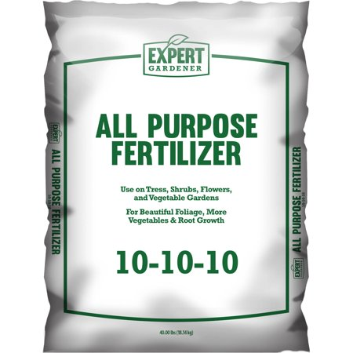

## 

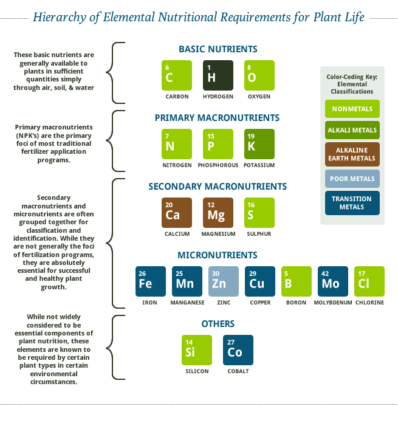


## Mineral elements come from soil
<hr>

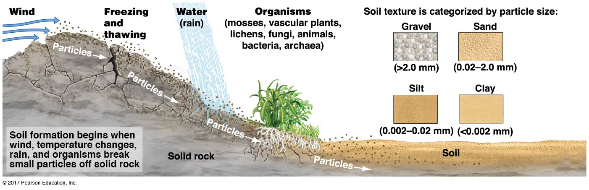

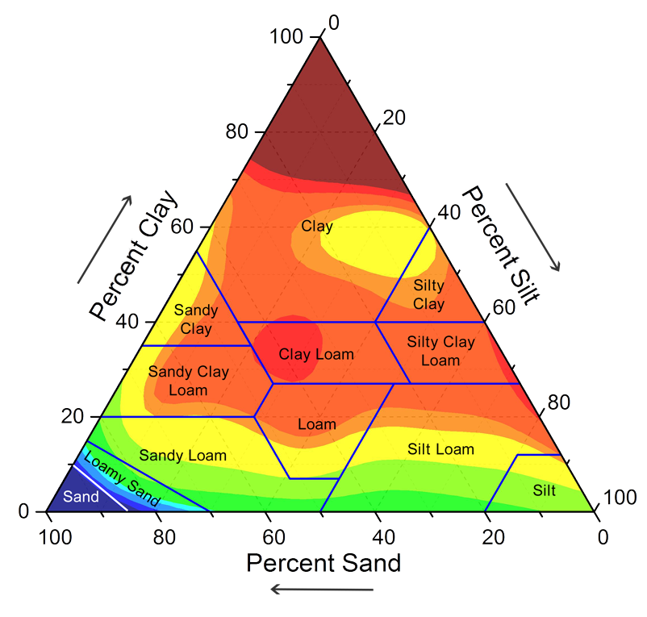

## Review: Nutrient uptake by roots
<hr>

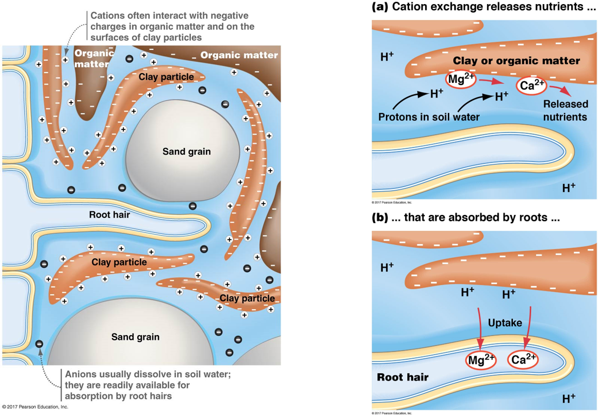

## Review: Nutrient uptake via fungi
<hr>

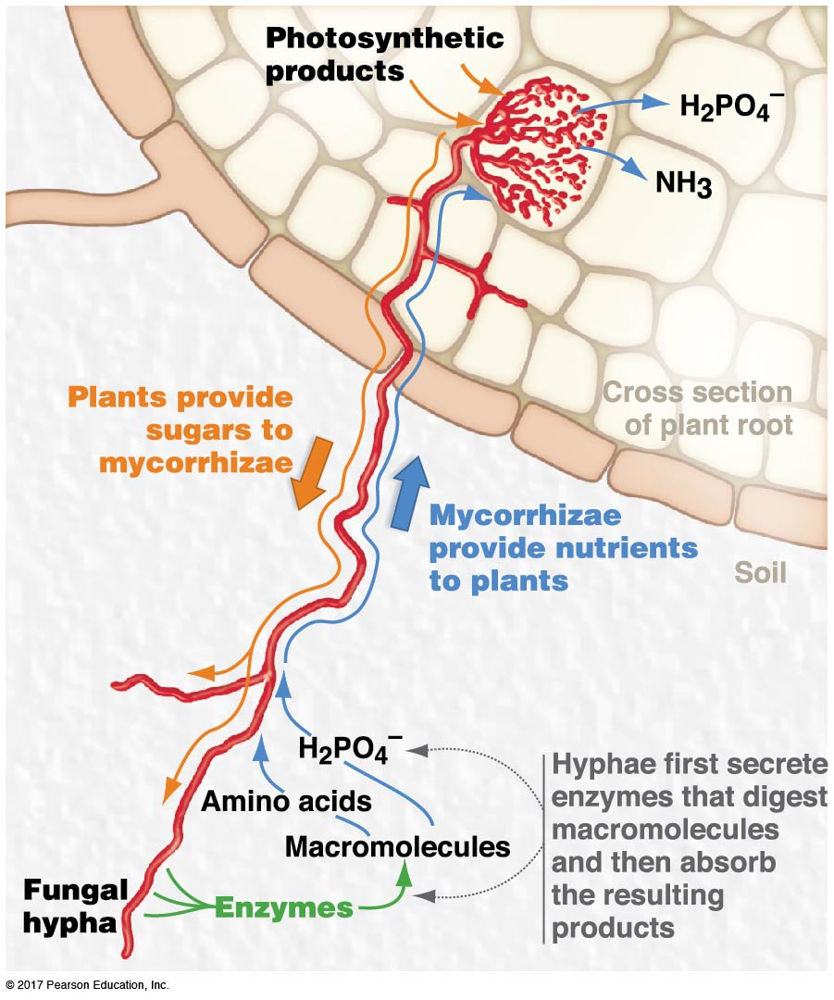

## Nutrients may be abundant but not available: Nitrogen
<hr>

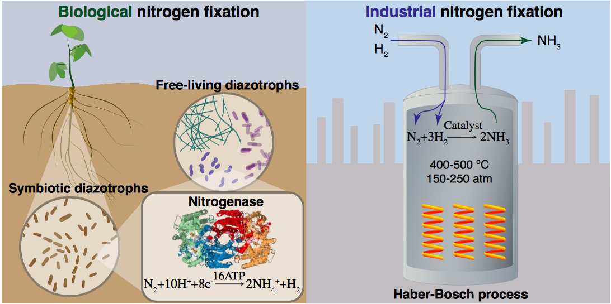

## Nutrients may be abundant but not available: Nitrogen
<hr>

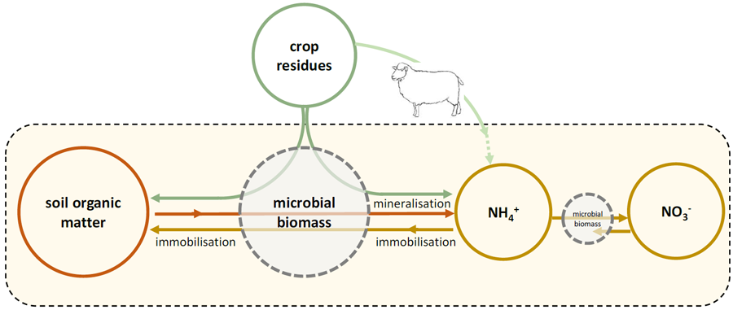

## Cool plant adaptations
<hr>

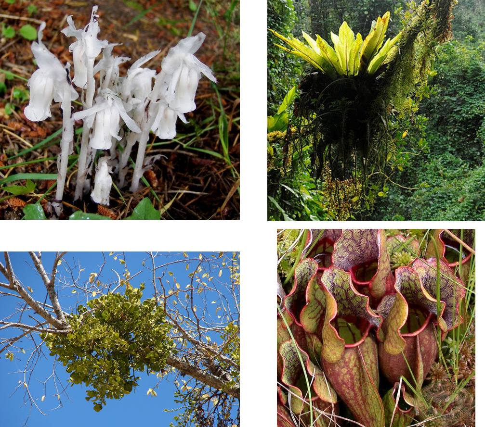

## What is the most essential resource for plants?
<hr>

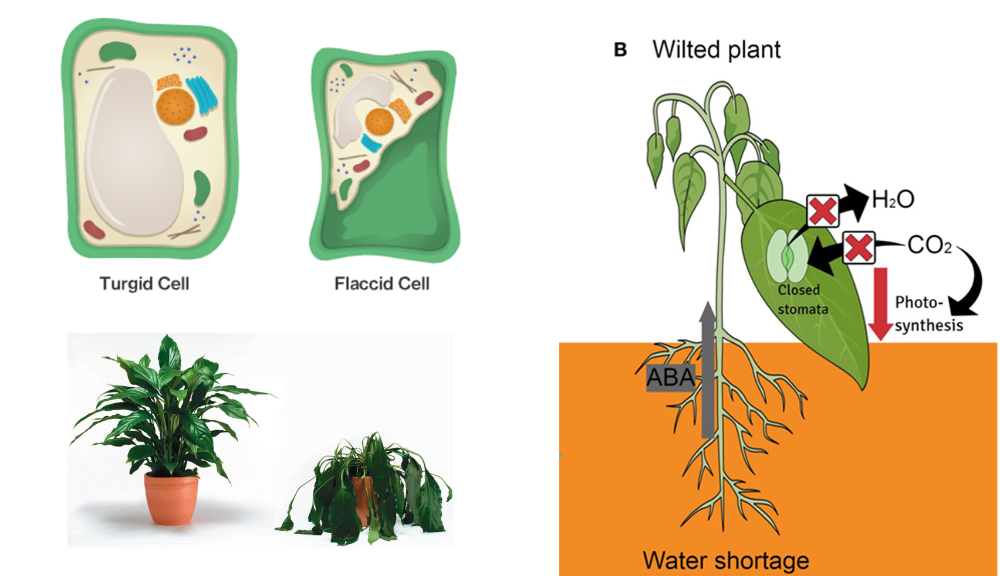

## What resource most limits plants? 
<hr>
<br/>
<br/>
<br/>
<br/>

<div style="float: left; width: 55%;">

* **Answer: whichever resources is the most limiting**

<br/>

* **Liebig's Law of the minimum**
    +  growth is dictated not by total resources available, but by the scarcest resource 

<br/>

* **Adding N-P-K to a crop is useless if there is no calcium**

</div>

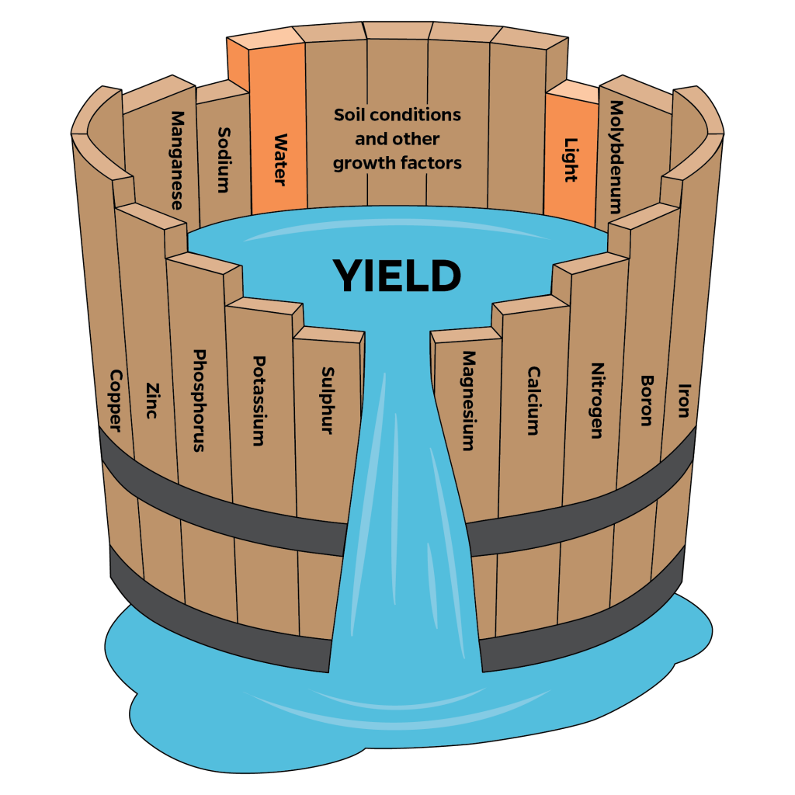

## 

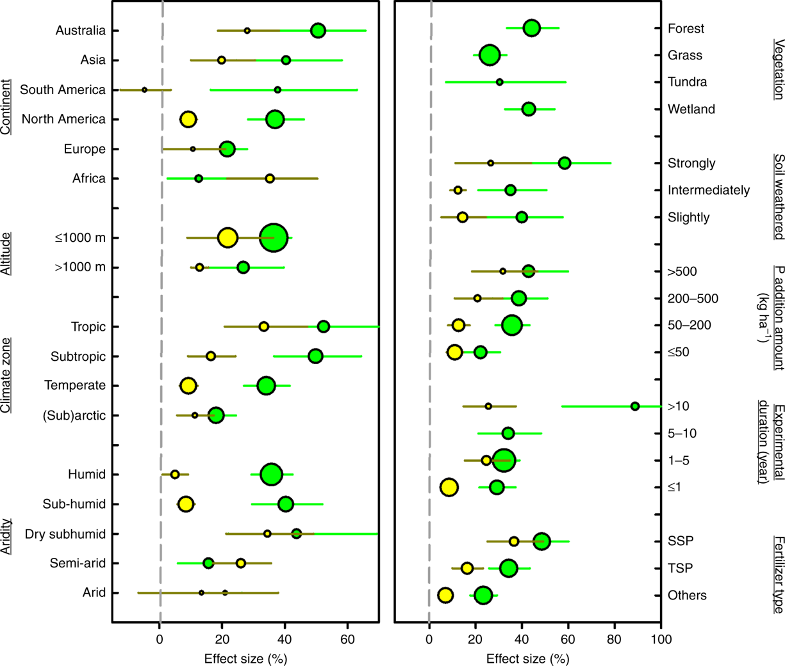

## Plant nutrient limitation in crop systems
<hr>

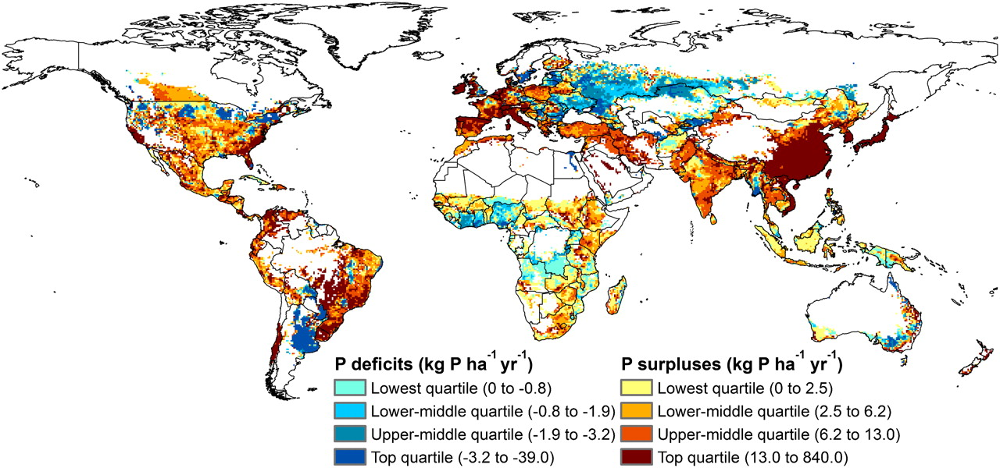