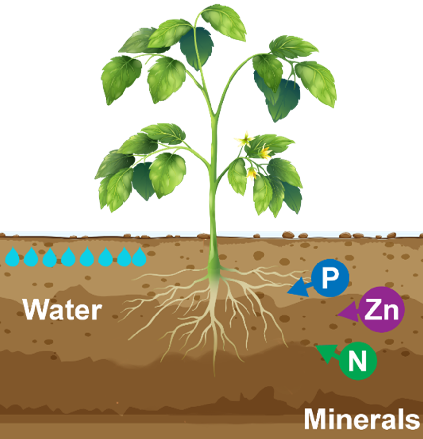
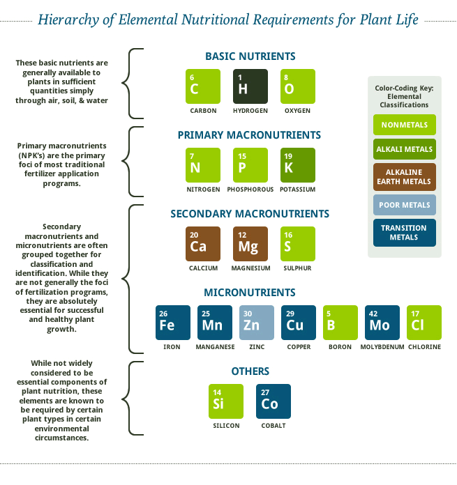
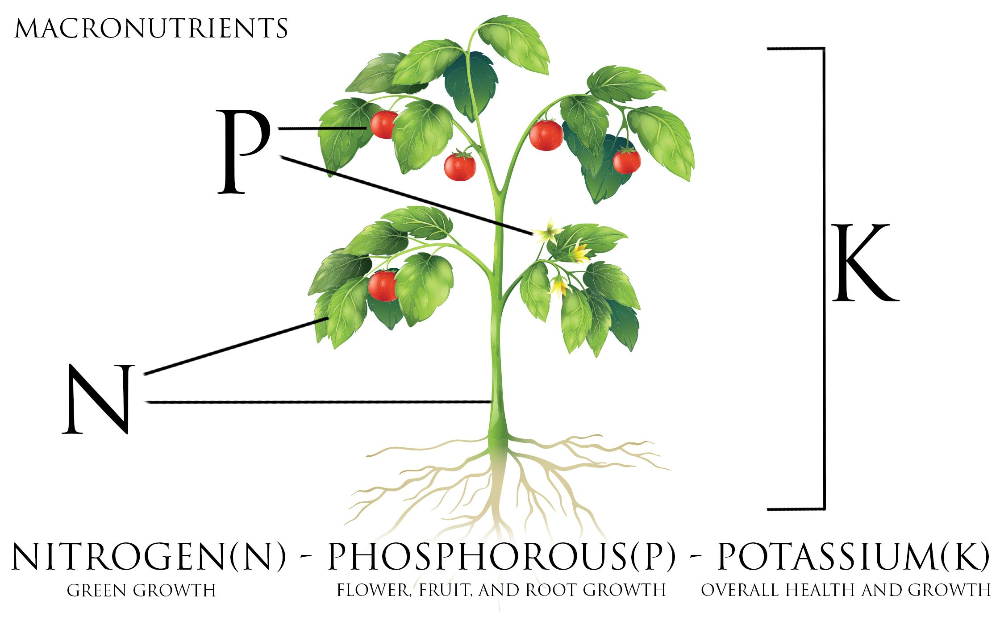
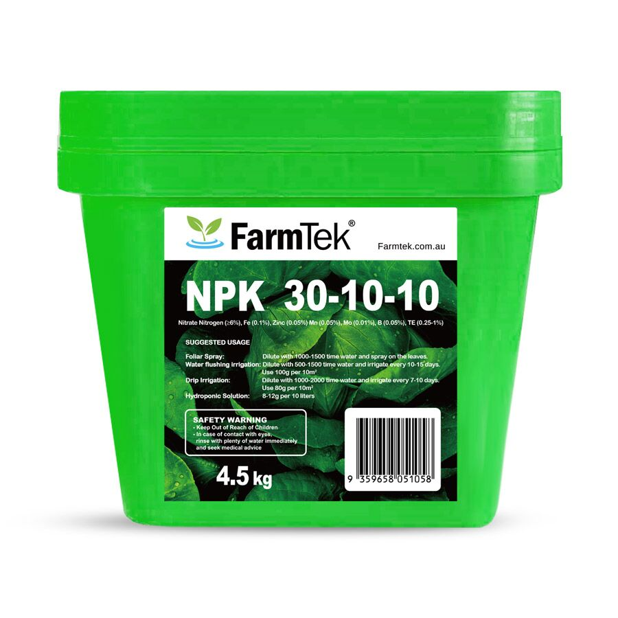
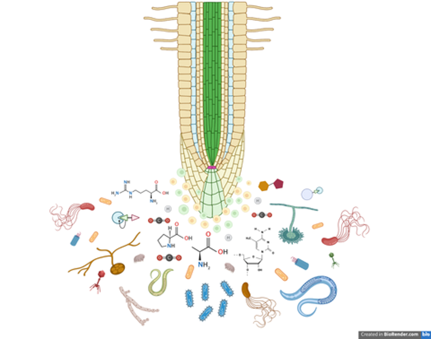
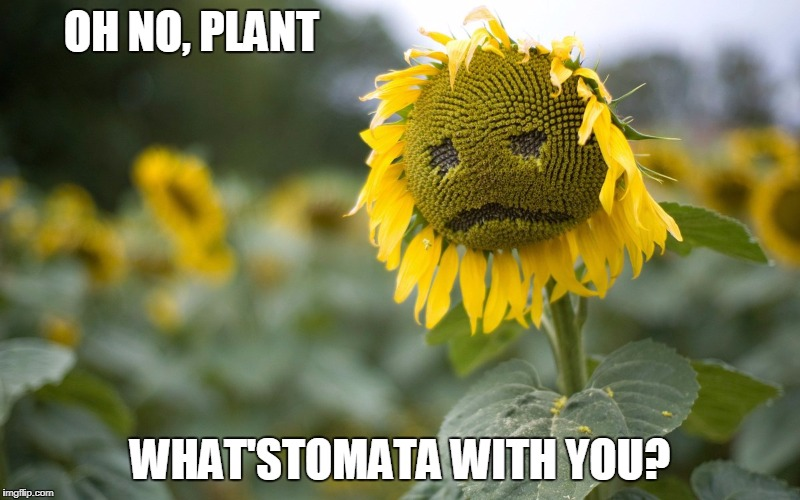
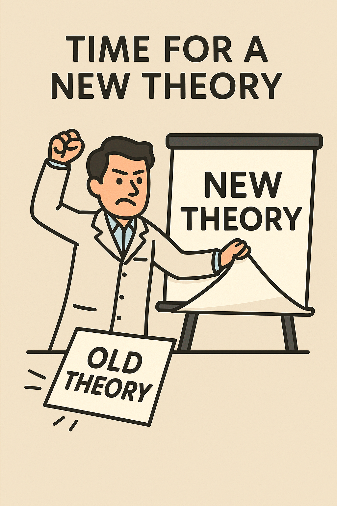
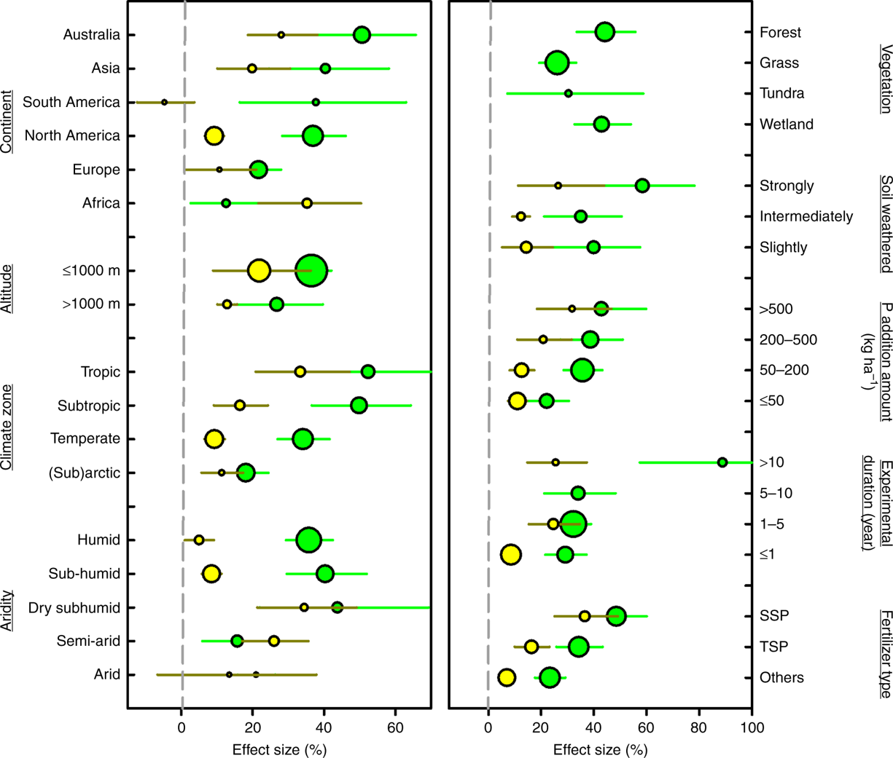
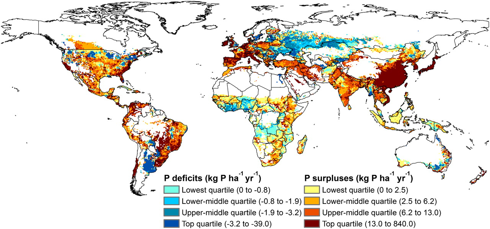
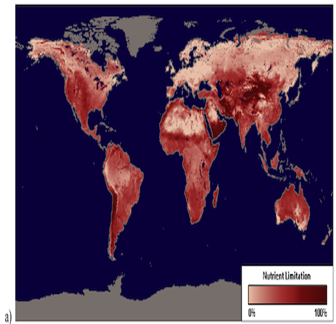

## Mineral nutrition in plants

 

* **Plants are capable of making all necessary organic compounds from inorganic compounds and elements in the environment**
    + aka 'autotrophic'
    + mineral: an inorganic element (e.g. inorganic ion from soil)
    + must obtain minerals from soil and water

 

* **Minerals often have multiple functions in the plant**
    + metabolic, biochemical, structure, etc
    + amount required varies

 

* **Form and Function: acquiring these resources requires and above- and belowground body plan**
    + plants are 'environmental miners'

 
 
 

## Major elements for plant growth

 

* **Macronutrients are those needed in large amounts**
    + Mineral nutrients obtained from soil:
      + Nitrogen (N): amino acids, chlorophyll, rubisco
      + Phosphorus (P): ATP, DNA/RNA
      + Potassium (K): osmoregulation, enzyme activation
    + Non-mineral nutrients obtained from air and water
      + C, H, O key for photosynthesis
 
  
 
* **Micronutrients are those needed in smaller amounts but have special roles**
    + examples: Fe (photosynthesis), Zn (enzyme function), B (cell wall structure)
    + deficiencies can cause critical dysfunctions
      
 
 

## Why do we fertilize plants?

* **Many mineral elements are limited in natural/managed ecosystems**

  
 
* **Nutrient deficiency impacts optimal plant performance**
    + photosynthesis declines
    + root:shoot ratio increases (more allocation to roots)
    + stunted growth and leaf yellowing
    + delayed or reduced flowering and fruiting
    + weakened defense against pests and stress 

  
 
* **Commercial fertilizers supply the key mineral nutrients nitrogen (N), phosphorus (P), and potassium (K)**
    + often limiting 
    + see roles of each in previous slide

 
 
 

## Nutrient Abundance ≠ Nutrient Availability

 

* **Nutrients may be abundant in soil but chemically or physically inaccessible**
    + Example: Phosphorus is often abundant but <1% is plant-available
 
   
  
 
 

 

* **Key barriers to availability:**
    + Soil pH affects solubility (e.g., P become insoluble at high pH)
    + Strong binding to soil particles (e.g., P binds to iron/aluminum oxides)
    + Low microbial activity slows organic matter breakdown
    + Poor root access due to compaction, drought, or low *mycorrhizal* presence

  
 
* **Plants may exude organic acids (stimulate microbes) or increase root surface area to overcome these limits** 

 
 
 

## What is the most essential resource for plants?

## BIG QUESTION: What resource most limits plants? 

## What resource most limits plants? 

 
 
 
 

* **Answer: whichever resource is the most limiting**

 

* **THEORY: Liebig's Law of the minimum**
    +  growth is dictated not by total resources available, but by the scarcest resource 

 

* **Adding N-P-K to a crop is useless if there is no calcium**

<!-- ##  -->

<!--  -->

<!-- ## Plant nutrient limitation in crop systems -->
<!-- 
 -->

<!--  -->

## Its Time For A.........

<!-- ## What did you find: What limits plant growth and survival? -->
<!-- 
 -->
<!--   -->

<!-- 1) What resource is most limiting for plants? -->
<!-- 2) Are there places on earth that are more nutrient limited than others? -->
<!-- 3) What plant ecosystems (natural/managed) are nutrient limited? -->
<!-- 4) What is the current state of nutrient limitation in global croplands? -->

<!--  -->