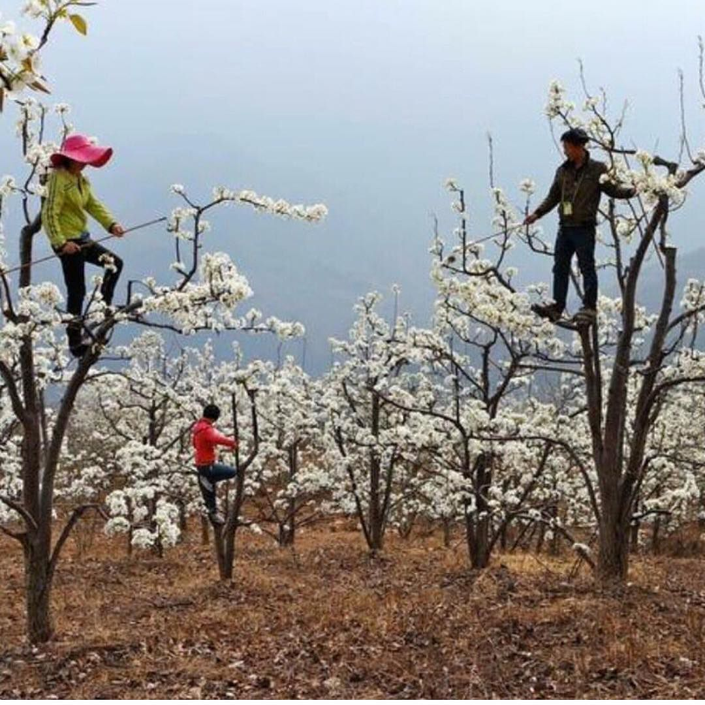

```{r setup, include=FALSE}
knitr::opts_chunk$set(echo = FALSE)
```

## Most flowering plants require and animal pollinator
<hr>
<br/>

* **200,000 species of animal pollinators**
    + most are insects

<br/>

* **Lots of insects pollinate**
    + bees, flies, moths, butterflies
    + wasps, ants, beetles

<br/>

* **~25% of pollination by non-insects**
    + birds, bats, lizards, humans
    
## 
    
## Ecosystems need to contain nectar and host plants
<hr>
<br/>


## The Price of Attraction
<hr>
<br/>


<div style="float: right; width: 55%;">

* **Nectar investment occurs on a spectrum in plants**
    + up to 37% of plants

<br/>

* **Complex trade-off between cost (left) and benefit (right)**
    + currency = seeds

<br/>

* **Plants often cheat!!**
    + mechanisms to attract via deception

</div>

## Pollinator mediated evolution
<hr>
<br/>


## Group 1: Coolest pollinator co-evolution.....
<hr>


## An Orchid's trap

<iframe width="560" height="315" src="https://www.youtube.com/embed/_uHJGdTgtXE" frameborder="0" allow="accelerometer; autoplay; clipboard-write; encrypted-media; gyroscope; picture-in-picture" allowfullscreen></iframe>

## Sexual deception of orchids
<hr>

<div style="max-width:854px"><div style="position:relative;height:0;padding-bottom:56.25%"><iframe src="https://embed.ted.com/talks/anne_gaskett_the_sexual_deception_of_orchids" width="854" height="480" style="position:absolute;left:0;top:0;width:100%;height:100%" frameborder="0" scrolling="no" allowfullscreen></iframe></div></div>

## Pollinator-dependent crops are essential for human health
<hr>
<br/>

* **grown to provide food, fiber, fuel and nutrients**

* **Yield and quality benefit from flower visitation by animals**

## Group 2: Evaliuate the hierarchy of crop pollinators
<hr>


## Honey bees are the most versatile crop pollinator
<hr>

* **Top 10 pollinators in agriculture:**
1. Wild Honey bees
2. Managed bees (European honey bees)
3. Bumble bees
4. Other bees (4,000 species in USA)
5. Butteflies
6. Moths
7. Wasps
8. Other insects
9. Birds
10. Bats


## Bee Colony collapse disorder
<hr>


## Group3: Climate change and pollinators
<hr>

## Group 4: Robot pollinators?
<hr>


