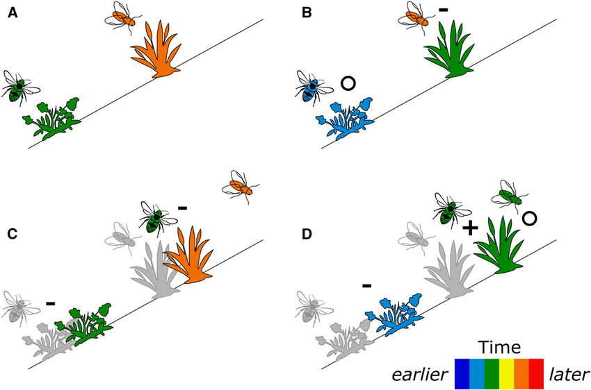

```{r setup, include=FALSE}
knitr::opts_chunk$set(echo = FALSE)
```

## Most flowering plants require and animal pollinator
<hr>
<br/>

* **200,000 species of animal pollinators**
    + most are insects

<br/>

* **Lots of insects pollinate**
    + bees, flies, moths, butterflies
    + wasps, ants, beetles

<br/>

* **~25% of pollination by non-insects**
    + birds, bats, lizards, humans

<br/> 

* **Pollinators can be generalists or specialists**
    

    
## Ecosystems need to contain nectar and host plants
<hr>
<br/>

* **Adult and larval forms on insects do not eat the same food**

<br/>

* **Some insects will only lay eggs on specific plants**
    + food for larve
    + milkweed for Monarchs

<br/>

* **Host plants may or may not be nectar source**

<br/>

* **Pollinator relationship are multi-faceted**
    + native species may not feed on invasive plants
    


## The Price of Attraction
<hr>
<br/>
<br/>


<div style="float: right; width: 50%;">

* **Nectar investment occurs on a spectrum in plants**
    + up to 37% of plants

<br/>

* **Complex trade-off between cost (left) and benefit (right)**
    + currency = seeds

<br/>

* **Plants often cheat!!**
    + mechanisms to attract via deception

</div>

##


## Group 1: Coolest pollinator co-evolution.....
<hr>


## An Orchid's trap
<hr>

<iframe width="560" height="315" src="https://www.youtube.com/embed/_uHJGdTgtXE" frameborder="0" allow="accelerometer; autoplay; clipboard-write; encrypted-media; gyroscope; picture-in-picture" allowfullscreen></iframe>

## Sexual deception of orchids
<hr>

<iframe width="560" height="315" src="https://www.youtube.com/embed/hmI-rJuYAjw" frameborder="0" allow="accelerometer; autoplay; clipboard-write; encrypted-media; gyroscope; picture-in-picture" allowfullscreen></iframe>

## 


## Group 2: Evaliuate the hierarchy of crop pollinators
<hr>


## Honey bees are the most versatile crop pollinator
<hr>
<br/>
<br/>

* **Top 10 pollinators in agriculture:**
1. Wild Honey bees
2. Managed bees (European honey bees)
3. Bumble bees
4. Other bees (4,000 species in USA)
5. Butteflies
6. Moths
7. Wasps
8. Other insects
9. Birds
10. Bats


## Bee Colony collapse disorder
<hr>


## Group3: Climate change and pollinators
<hr>


## Changes in climate disrupt phenology
<hr>
<br/>

<div style="float: left; width: 55%;">

* **Phenology: cyclic & seasonal natural phenomena**
    + sensitive to climate
    + animals & plants

<br/>

* **Changes in phenology disrupt pollination**

<br/>

* **Insect emergence synced to host plants**

<br/>

* **Flower blooming often synced with temperature**
    + availability of nectar

</div>



## 


## Group 4: Robot pollinators?
<hr>


## Soap bubble pollination.......
<hr>
<br/>

* **Hand pollination will not feed the world**

<br/>

* **Artificial pollination is a growing industry**
    + almonds, cherries, kiwi, pears, etc. 
    + https://www.edetepta.com/our-solution
    
<br/>


* **Mini-drones can be problematic**
    + lack finesse to be efficient
    + crash into flowers

<br/>

* **Drones drop pollen covered soap bubbles (Eijiro Miyako)**
    + soap contains calcium and ions
    + weather is a problem
    
