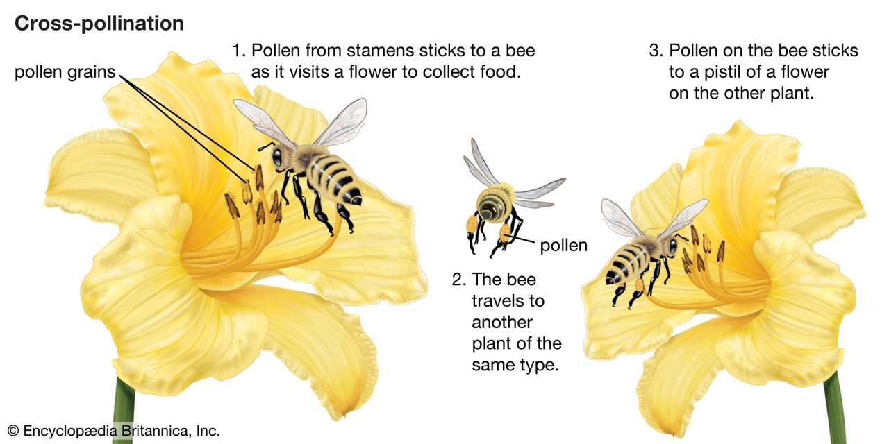
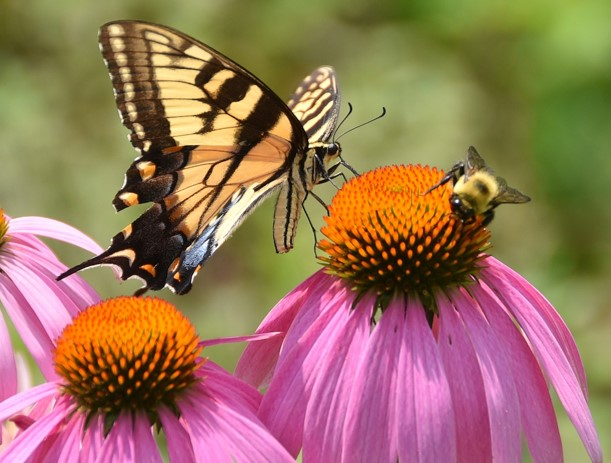
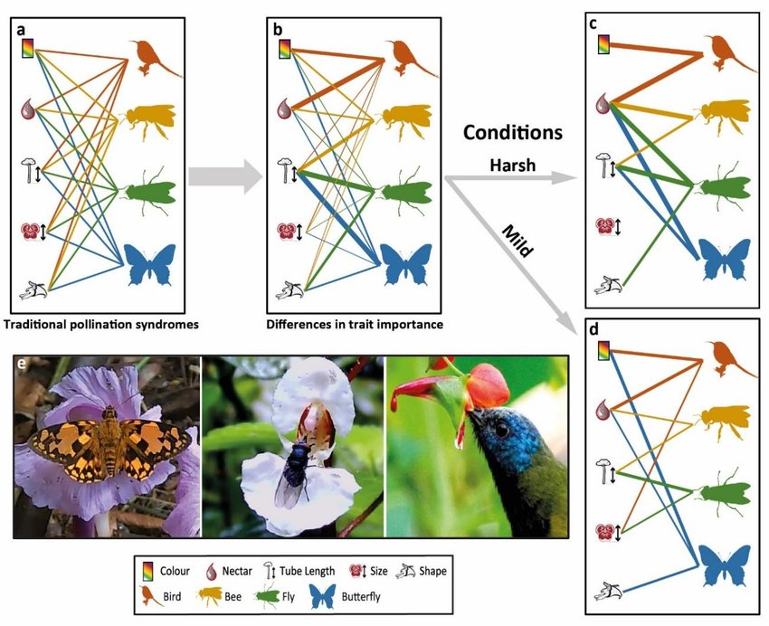

## Pollination

**Pollination is the process where pollen, produced by the male part of a flower (the anther), is transferred to the female part (the stigma), enabling fertilization and seed production**

## Why Study Flowers and Pollinators?

* **Pollination is a vital ecological process and key to plant reproduction**
    + human crops systems (~35%) depend on insect pollination
    
 

* **Most flowering plants require and animal pollinator**
    + dramatically increases the efficiency of pollination by wind (pine, grasses)
    + most pollinators are insects (bees, flies, moths, butterflies, wasps, ants, beetles)
    + ~25% of pollination by non-insects (birds, bats, lizards, humans)

 

* **Animal pollination is a product of millions of years of coevolution**
    + Studying form and function in these systems reveals the power of natural selection.
    + Pollinators have evolved to be generalists or specialists

## Form and Function in pollination...Plants

* **Flower Anatomy and Pollination**
    + Major structures: petals, sepals, stamens (anthers), pistils (stigmas, styles), nectaries
    + Each structure can influence pollinator attraction and behavior
    + Positioning of reproductive organs can ensure contact with visiting pollinators

  

* **Floral Traits and Their Functions**
    + Color: attracts specific pollinators (e.g., bees see UV, birds prefer red)
    + Scent: can attract or deter pollinators (e.g., sweet for bees, musky for bats)
    + Shape: tubular vs. open reflects tongue length, landing behavior, etc.
    

## Natural selection and flower anatomy

**Pollination syndromes=  suites of flower traits that have evolved in response to natural selection imposed by different pollen vectors. Pollen vector can be abiotic (wind and water) or biotic through different animals (pollinator-mediated selection)**

## The Price of Attraction

 
 

* **Nectar investment occurs on a spectrum**
    + up to 37% of plant energy

 

* **Complex trade-off between cost (left) and benefit (right)**
    + currency = seeds (next generation)

 

* **Plants often cheat with mechanisms to attract via deception!**
    + mimicry of other rewarding flowers, or sexual deception where the flower mimics a female insect to attract males

## Evolution of Animal Pollination

- **Gymnosperms rely on inefficient abiotic wind pollination**
 

- **Angiosperms (flowering plants) first appeared ~140 million years ago (Cretaceous)**
    + coevolution between flowers and pollinators drove diversification in both groups
    + By the Late Cretaceous, many plant-pollinator mutualisms were established
    + Animal-mediated pollination is now involved in the reproduction of ~80% of flowering plants.

## Key Morphological Traits of Animal Pollinators

**Flies: Mimic bees/wasps, short or medium proboscis, often visit open flowers; limited body hair (less efficient pollinators)**

 

**Butterflies/Moths: Long, coiled proboscis suited for deep tubular flowers; butterflies are diurnal and visual, moths are nocturnal and rely on scent**

 

**Beetles: “Mess and Soil” pollinators: eat flower parts and leave behind poop on flowers. Damage flowers but still transfer pollen**

 

**Hummingbirds: Long, slender beaks and brush-tipped tongues to reach deep nectar tubes; hovering flight minimizes flower damage**

 

**Bats: Strong sense of smell, adapted for nocturnal feeding; furry bodies collect and spread pollen efficiently**

## Pollinator Behavior and Functional Adaptations

- **Flower constancy: Many pollinators repeatedly visit the same species of flower during a single foraging trip**
    + increases pollen transfer accuracy and reduces waste

 

- **Pollination efficiency: optimally foraging nectar...**
    + Generalists (e.g., bumble bees, flies) visit many species; more resilient but less precise.
    + Specialists (e.g., yucca moths, fig wasps) visit only one/few plant species; high fidelity, but sensitive to disturbance.

 

- **Foraging traits vary across pollinators:**
    + Time of activity (day vs. night) influences what flowers are visited.
    + Visual and olfactory sensitivity determines flowers detection (e.g., UV vision vs scent)
    + Flight ability and body size determine range, landing strategy, and access to nectar.

## Bees are the most exceptional pollinators

- **Dense, branched body hairs trap large amounts of pollen**
    + electrostatic charge helps attract and hold pollen grains while flying
    + pollen baskets (corbiculae) allow bees to transport pollen efficiently between flowers and back to the hive
    
 

- **Specialized mouth parts (proboscis) allow nectar access in both open and tubular flowers**

 

- **Bees are smart foragers, often visiting one flower type per trip, enhancing species-specific pollen transfer**
    + ability to learn and remember floral cues (e.g., shape, scent, nectar reward).
    + ability to be generalist or specialist
    
 

- **Some species (e.g., bumble bees), can perform buzz pollination—vibrating flowers to release tightly held pollen**

## Pollination power of bes

 

- **Ecosystem services: Bees pollinate ~80% of flowering plant species worldwide**
    + Responsible for ~35% of global food crop production.

 

- **Economic value: Global economic contribution of pollinators: ~$235–$577 billion annually (IPBES, 2016)**
    + Honey bees alone contribute over $15 billion per year to the U.S. agricultural economy

 

- **Alarming declines: Bee populations are threatened by habitat loss, pesticide use, disease, and climate change**
    + Wild bee abundance and diversity are strongly linked to local floral diversity and landscape quality.

## More farms = Less bees?????????

## Its Time For A.........

