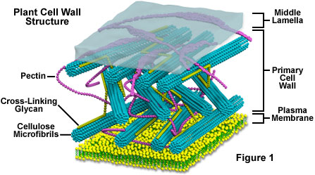
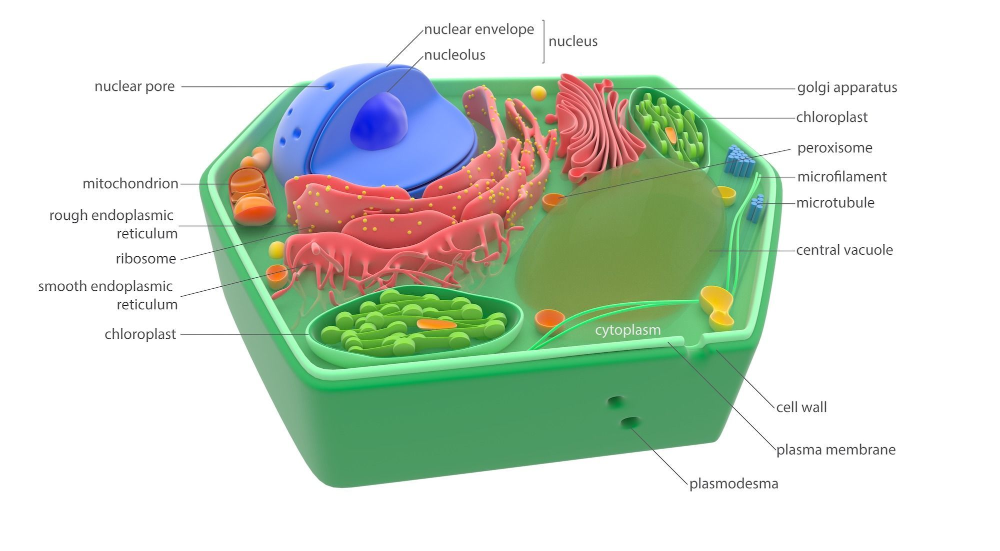

##  Plant form and function is ruled by cells

 

* **Cell walls maintain physical framework*
    + maintain turosity of cells

 

* **Root cells start the uptake and transport of water**

 

* **Specific leaf cells are specilzaed for photosynthesis**

 
* **Cell biology of flowers controls reproduction**
    + cells producing pigments and nectar 

## PLant cell walls

 

* **mostly made of cellulose**
    + strength and protection of cytoplasm
    
* **metabolism does occur (so not inert)**

## Plant cell membranes

 

* **Membrane covers the surface of the protoplasm**
    + proteins differ on in/outside

* **Impermeable to bad stuff, permeable to beneficial stuff**

* **Molecular pumps transport molecules in and out**

## Anatomy of a plant cell

 

* **Virtually all plant cells, although diverse, have conserved organelles**
    + roots, wood, barks, leaves, flowers
    + certain organeels can become modified

 

* **Contain *protoplasm*: water + proteins, lipids & nucleic acids**

 

* **Nucleus, ribsomes and endoplasmic reticulum**

 

* **Golgi apparatus: transport, modify, and package proteins & lipids for delivery**

 

* **Peroxisomes: organelle that produces or uses peroxide**
    + detoxify product of photosynthesis
    

## plastids
    
## Does calcium make strong bones in plants?

## cell division

## cancerous growth in plants?

## Basic cell types

