## Form & function: the prime directive of biology

* **Core idea: Natural selection matches structure to task**
    + tunes the fit between the 'form" and the 'job'
    + often a cost/benefit

 

* **Form and function emerges across scales**
    + molecules to cells to tissues, etc. 

 

 

* **Form and Function Pocket Test:**
    + Purpose: What is it for?
    + Pressures: What pushes on it (energy, predators, mating, breathing, etc.)?
    + Proof: Which feature/s makes sense for that 'job'?
    + Price: What was given up for it?

##  Plant form and function is ruled by cells

* **Plant cells range from 10-100um in length**

 

* **Cell walls maintain physical framework**
    + maintain cell turgidity

 

* **Root cells uptake & transport H~2~O **

* **Leaf cells are specialized for photosynthesis**

 

* **Cells of flowers control reproduction**
    + produce pigments and nectar 

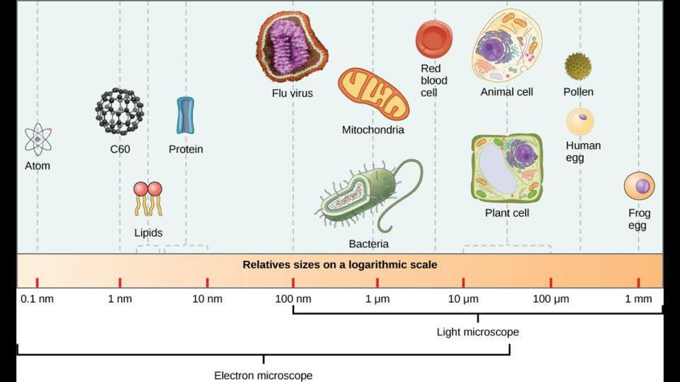

## Plant cell walls resist the internal water pressure

 

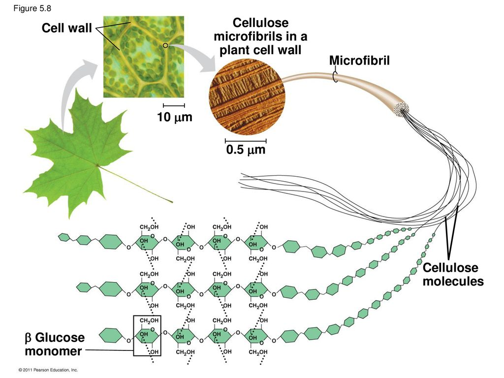

* **Mostly made of cellulose**
    + strength and protection of *protoplast*
    + chains of cellulose molecules (*microfibrils*) form 'molecular rebar'

 

* **Consists or 1 *or* 2 layers**
    + primary (1^st^ layer) = cellulose fibers
    + secondary (internal) = lignin + cellulose

 

* **Sticky layer (*lamella*) connects adjacent cells together**
    + made of pectin (jelly!)
    

## Support or water conducting cells have secondary walls

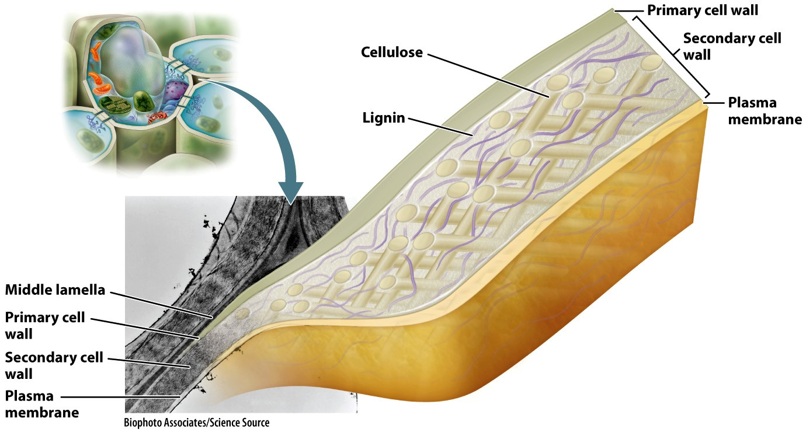

## Cellulose and lignin extremely abundant on Earth

**Lignin is super tough, prevents pathogens,is hard for insects to digest, and for fungi to break down.**

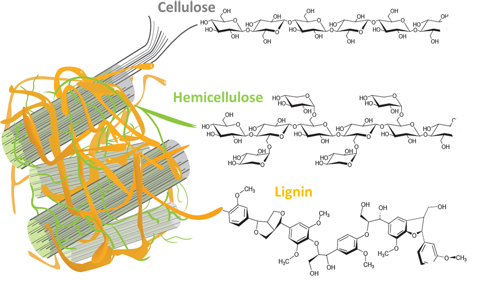

## Why dont plants have strong bones made of Calcium?

 

* **Animals with shells use calcium carbonate**
    + ion extracted from seawater not from inside of the cell
    + cell pH not affected

 

* **Animals with internal skeletons use calcium phosphate**
    + can't handle calcium carbonate (see above)
    + phosphate ion has little effect on cell acidity
    + if phosphate gets released, is a useful metabolite
    
 

* **Why are plant cell walls not also made of calcium?**

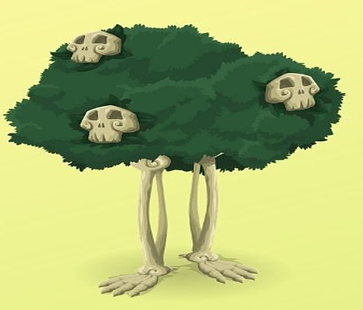

## Why dont plants have strong bones made of Calcium?

 

* **Plants must also be careful with Calcium and it's salts**
    + extracting calcium from seawater not really an option
    + plants need phosphate badly ('bones' would require too much)
    + roots may block excess Ca^2+^ uptake to regulate cell pH

 

* **Plants internally synthesize cell wall ingredients**
    + lignin and cellulose are inert (no pH problems)
    + lignin and cellulose produced from the products of photosynthesis
    

## Plant cells are not solid structures (cytoplasm channels)

**Cellular interactions are vital for complex organisms to exist, otherwise what is the point of being multicellular....**

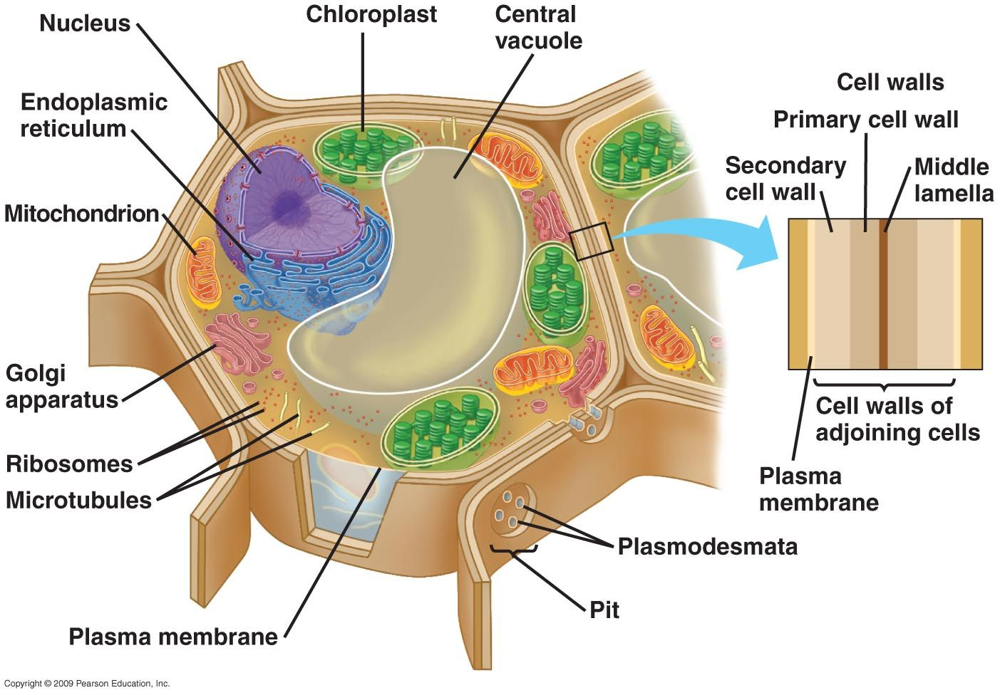

## Plant cells are not quite individuals

**The protoplasm of all plant cells function as part of one interconnected unit!**

 
 

* **Plasmodesmata diminish individuality of cells**
    + *symplast*: interconnections of protoplasm via plasmodesmata
    + living region, transport & communication
    
 

* **Cell walls do separate cells, just not cleanly**
    + lots of intercellular air spaces (@ corners)
    + *apoplast*: cells walls + intercellular spaces
    + gas diffusion occurs via apoplast
    + water through cell wall via capillary action

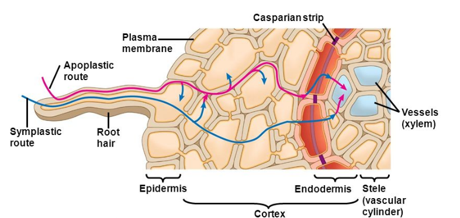

## Plant cell membrane structure fits *fluid mosaic model*

 

* **Membrane covers the surface of the protoplasm**
    + inside of cell walls
    
 

* **Embedded transport proteins move molecules in and out**
    + passive transport moves substances down a concentration gradient (no energy)
    + active transport moves substances against their gradients (needs ATP)
    
 

* **Molecules moving through plasmodesmata still have to cross cell membranes**

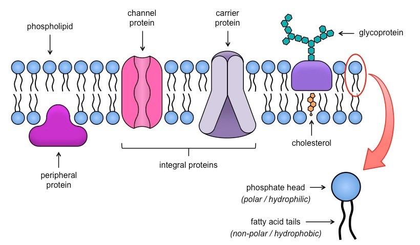

## Anatomy of a plant cell (cell as a 'city' analogy still applies)

 

* **Virtually all plant cells, although diverse, have conserved organelles**
    + roots, wood, barks, leaves, flowers
    + certain organelles do get modified

 

* **Contain *protoplasm*: water + proteins, lipids & nucleic acids**

 

* **Nucleus, ribosomes and endoplasmic reticulum**

 

* **Golgi apparatus: transport, modify, and package proteins & lipids for delivery**

 

* **Peroxisomes: organelle that produces or uses peroxide**
    + detoxify byproducts of photosynthesis

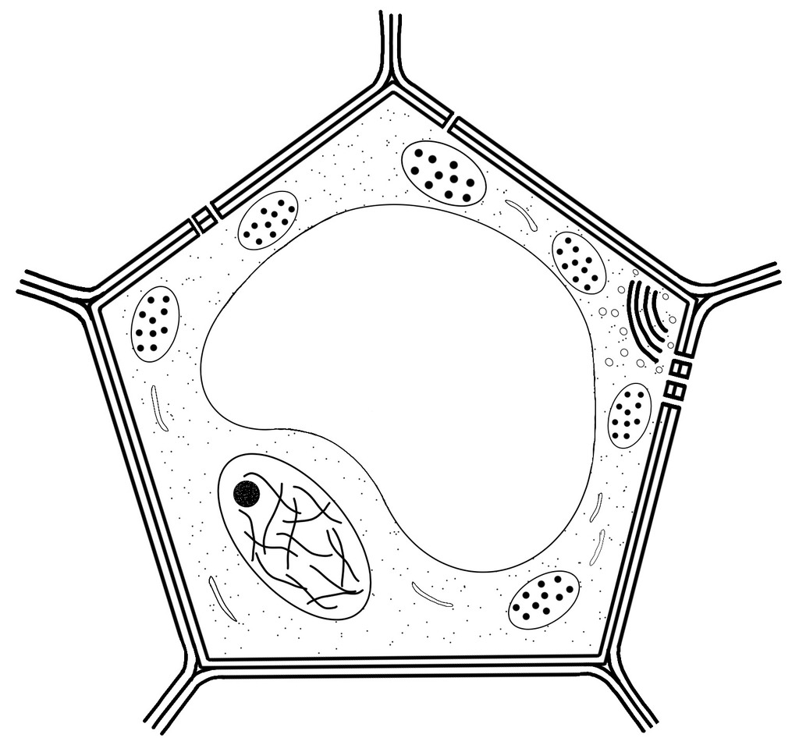

## 

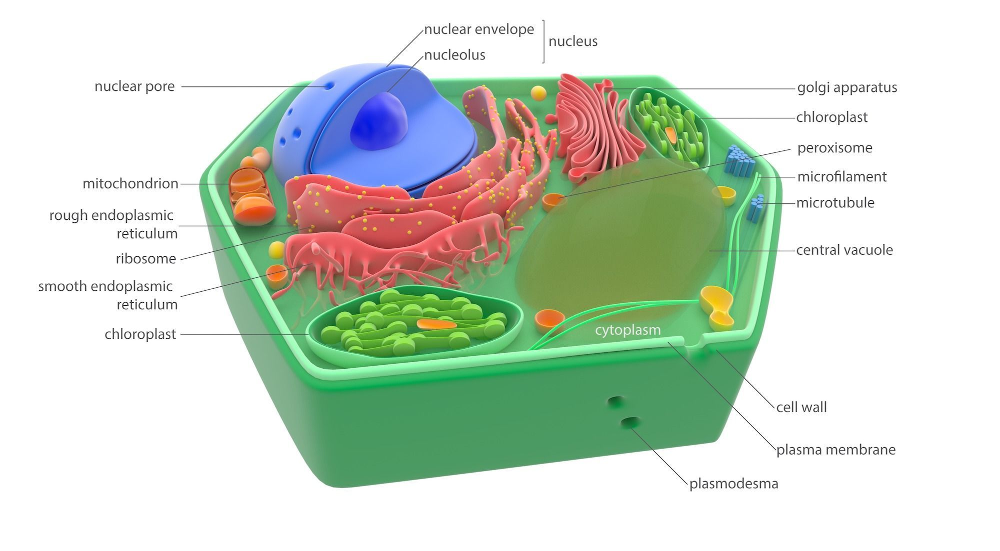

## Plastids: membrane bound organelles in plants & algae

 

* **Chloroplast: double membrane organelles in leaf cells**
    + key for photosynthesis
    + interesting evolutionary history

 

* **Leucoplast: colorless organelles storing starch**
    + products of photosynthesis need to be stored
    
 

* **Chromoplasts: organelles making and storing pigments for colored plant parts**
    + pigments to attract pollinators
    + colors of fruits to attract seed dispersers
    + antioxidants to reduce cell stress

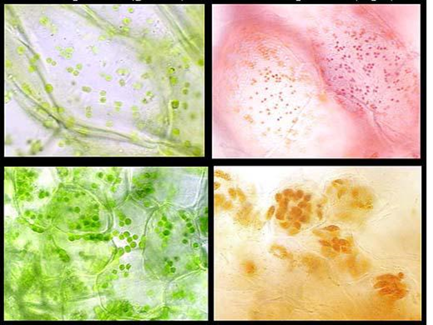

## Central vacuole makes up most volume in mature cells

**Plant cells only need to increase the amount of water in the vacuole to 'grow', while animal cells must synthesize new protoplasm. That is how shorter lived cells, like flower buds, can grow so quickly**

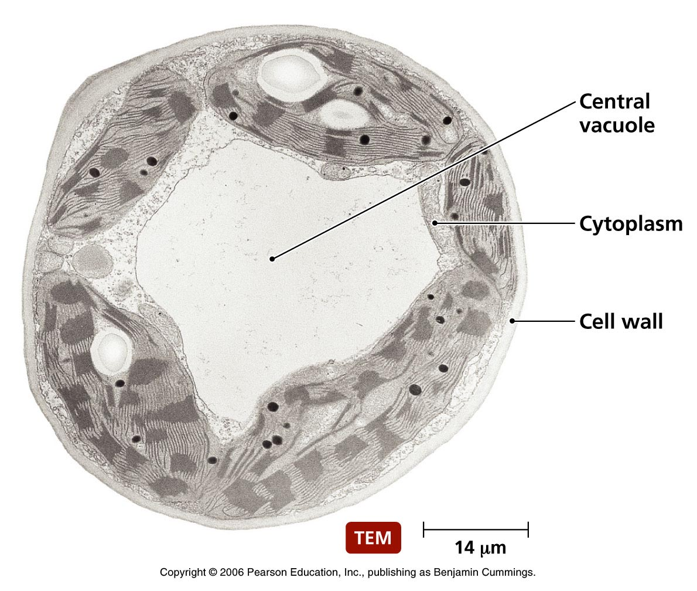

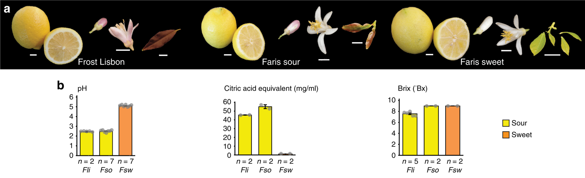

## Water is the most essential resource for plant cells

**Acts as the solvent for biochemical reactions, maintains turgor pressure to keep cells rigid, and is the transport medium for nutrients and sugars**
 
**Water provides the electrons needed in light reaction of photosynthesis**

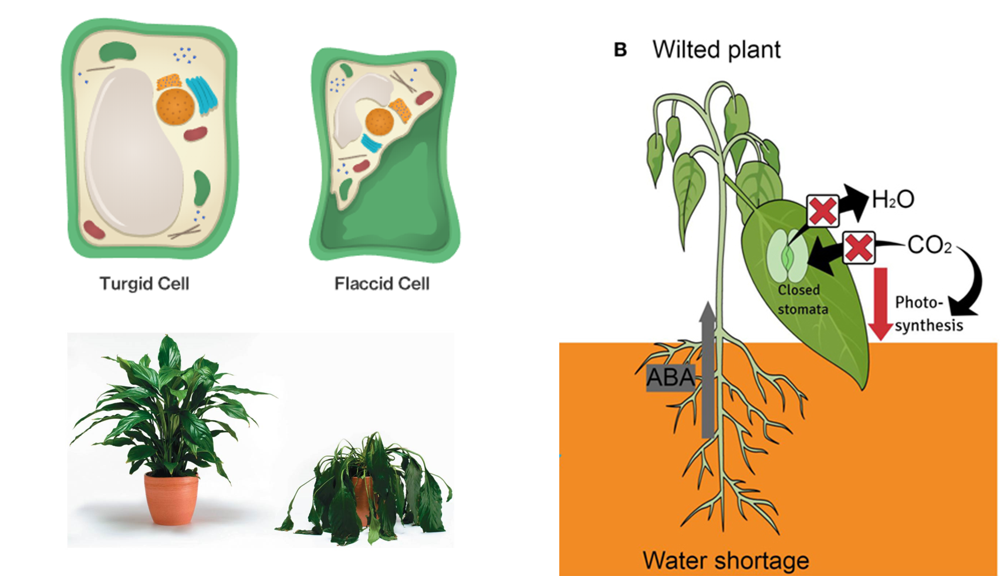

## New cells orginate from meristems

 

* **All plants are multicellular with active regions of cell division**
    + cells mostly divide my mitosis
    + meiosis in parts of reproductive cycle

 

* **Growth is localized in the active regions: meristems**
    + meristem cells are undifferentiated = they have not yet developed into a specific cell type
    + can continuously divide and produce new cells

 

* **Apical meristems: @ tips of roots and stems**
    + cell division propels tissues 'out'
    + primary growth of leaves, stem & roots

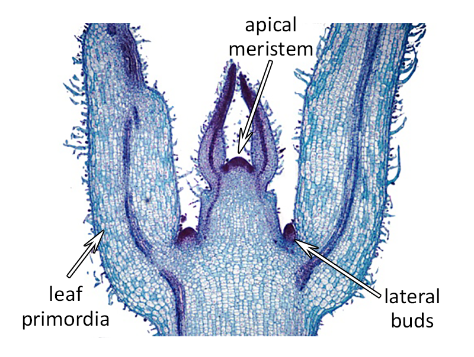

## New cells orginate from meristems

 

* **All plants are multicellular with active regions of cell division**
    + cells mostly divide my mitosis
    + meiosis in parts of reproductive cycle

 

* **Growth is localized in the active regions: meristems**
    + meristem cells are undifferentiated

 

* **Lateral meristems: secondary growth**
    + cell division adds diameter (support)
    + growth is xylem & phloem cells
    + tissues called 'cambium'

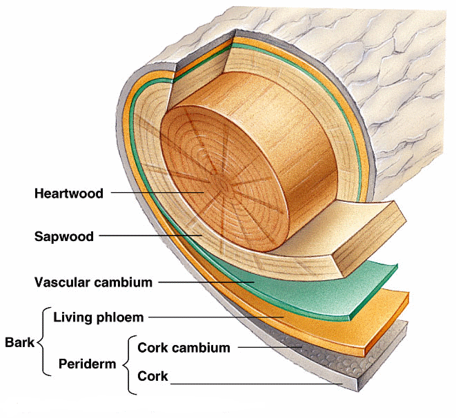

## Cancerous growth in plants?

 

* **Release of cell cycle arrest in humans can be fatal**
    + cigarette smoke can cause lung cancer
    + UV triggers skin cancer

 

* **Galls: abnormal growth causes by reaction to insects/microbes**
    + rapid mitosis triggered by invader organism to form a 'tumor'
    + hijack cell growth to create food or home
    

 

* **Irregular cell growth in plants less of a big deal**
    + cells cannot migrate in plants because of cell walls
    + cells cannot 'detach' and travel through the body
    + 'cancer-like' growths will be localized
    

    
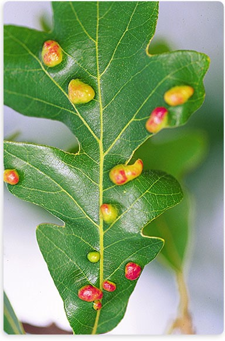

## 

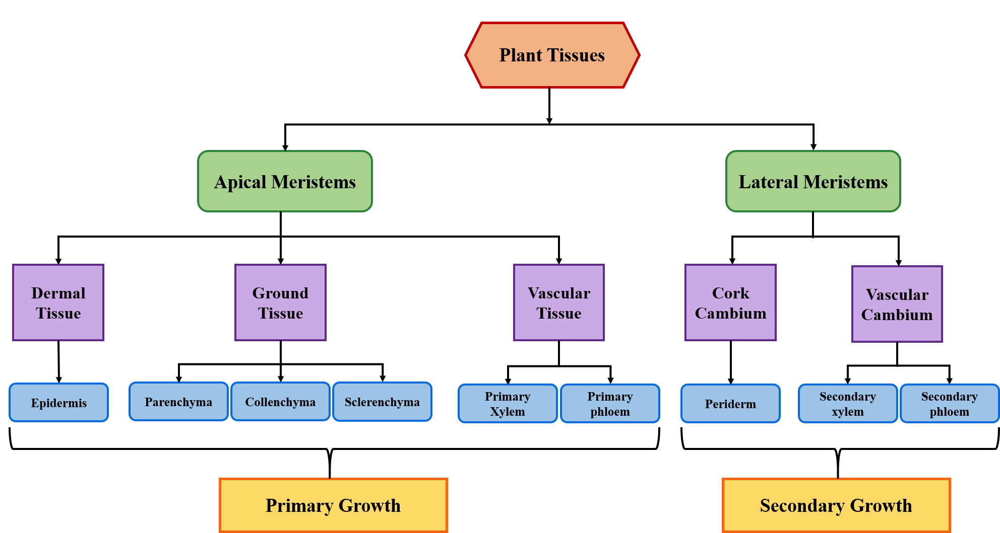