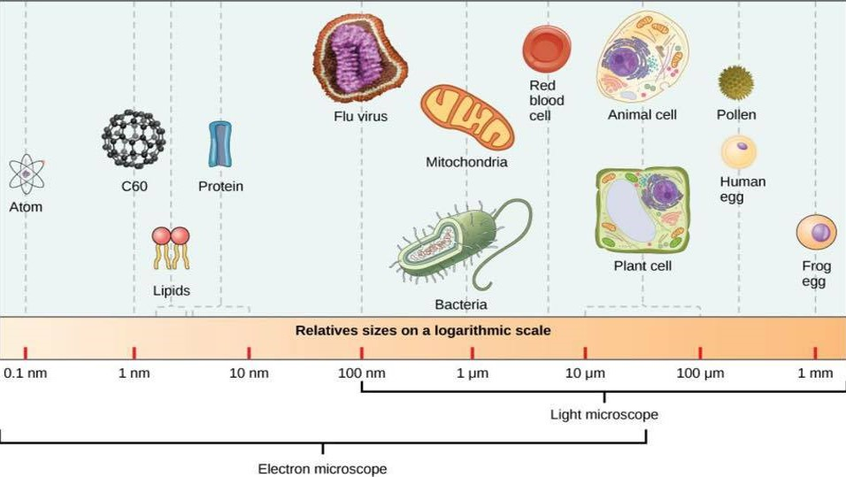

## Plant Cells and Growth

##  Plant form and function is ruled by cells

* **Plant cells range from 10-100um in length**

 

* **Cell walls maintain physical framework**
    + maintain cell turgidity

 

* **Root cells uptake & transport H~2~O **

* **Leaf cells are specialized for photosynthesis**

 

* **Cells of flowers control reproduction**
    + produce pigments and nectar 

## Plant cell walls

 

* **Mostly made of cellulose**
    + strength and protection of *protoplast*
    + chains of cellulose molecules = *fibrils*

 

* **Metabolism does occur (not inert)**

 

* **Consists or 1 *or* 2 layers**
    + primary wall (1^st^ layer) = cellulose fibers
    + secondary wall (internal) = lignin

 

* **Sticky layer (*lamella*) between walls**
    + made of pectin (jelly!)
    

## Support or water conducting cells have secondary walls

## Cellulose and lignin extremely abudant on Earth

## Why dont plants have strong bones made of Calcium?

 

* **Animals with shells use calcium carbonate**
    + carbonate comes from seawater, so pH not affected

 

* **Animals with internal skeleton use calcium phosphate**
    + cant handle carbonate
    + phosphate has little effect on cell acidity

 

* **Plants must also be careful with Calcium and its salts**
    + plants need phosphate badly
    + lignin and cellulose are inert
    + lignin and cellulose carbs from photosynthesis
    

## Plant cells are not solid structures (cytoplasm channels)

## Plant cells are not quite individuals

 
 
 

* **Plasmodesmata diminish individuality of cells**
    + *symplast*: interconnections of protoplasm
    + living region, transport & communication
    
 

* **Cell walls do separate cells, just not cleanly**
    + lots of intercellular air spaces (@ corners)
    + *apoplast*: cells walls + intercellular spaces
    + gas diffusion occurs via apoplast
    + water through cell wall via capillary action
    

## Plant cell membrane structure fits *fluid mosaic model*

 
 
 
 

* **Membrane covers the surface of the protoplasm**
    + Molecular pumps transport molecules in and out
    
 

* **Impermeable to bad stuff, permeable to beneficial stuff**

## Anatomy of a plant cell

 

* **Virtually all plant cells, although diverse, have conserved organelles**
    + roots, wood, barks, leaves, flowers
    + certain organelles can become modified

 

* **Contain *protoplasm*: water + proteins, lipids & nucleic acids**

 

* **Nucleus, ribosomes and endoplasmic reticulum**

 

* **Golgi apparatus: transport, modify, and package proteins & lipids for delivery**

 

* **Peroxisomes: organelle that produces or uses peroxide**
    + detoxify product of photosynthesis

## 

## Plastids: membrane bound organelles in plants & algae

 
 
 

* **Chloroplast: double membrane organelles in leaf cells**
    + key for photosynthesis
    + interesting evolutionary history

 

* **Leucoplast: colorless organelles storing starch**

 

* **Chromoplasts: organelles containing pigments for colored plant parts**

## Central vacuole makes up most volume in mature cells

## New cells orginate from meristems

 

* **All plants are multicellular with active regions of cell division**
    + cells mostly divide my mitosis
    + meiosis in parts of reproductive cycle

 

* **Growth is localized in the active regions: meristems**
    + meristem cells are undifferentiated

 

* **Apical meristems: @ tips of roots and stems**
    + cell division propels tissues 'out'
    + primary growth of leaves, stem & roots

## New cells orginate from meristems

 

* **All plants are multicellular with active regions of cell division**
    + cells mostly divide my mitosis
    + meiosis in parts of reproductive cycle

 

* **Growth is localized in the active regions: meristems**
    + meristem cells are undifferentiated

 

* **Lateral meristems: secondary growth**
    + cell division adds diameter
    + support, xylem, phloem cells
    + tissues called 'cambium'

## Cancerous growth in plants?

 
 

* **Release of cell cycle arrest in humans can be fatal**
    + cigarette smoke can cause lung cancer
    + UV triggers skin cancer

 

* **Galls: abnormal growth causes by reaction to insects/microbes**

 

* **Irregular cell growth in plants not a big deal**
    + cells cannot migrate in plants
    + no single plant organ is indispensable

    

## 

