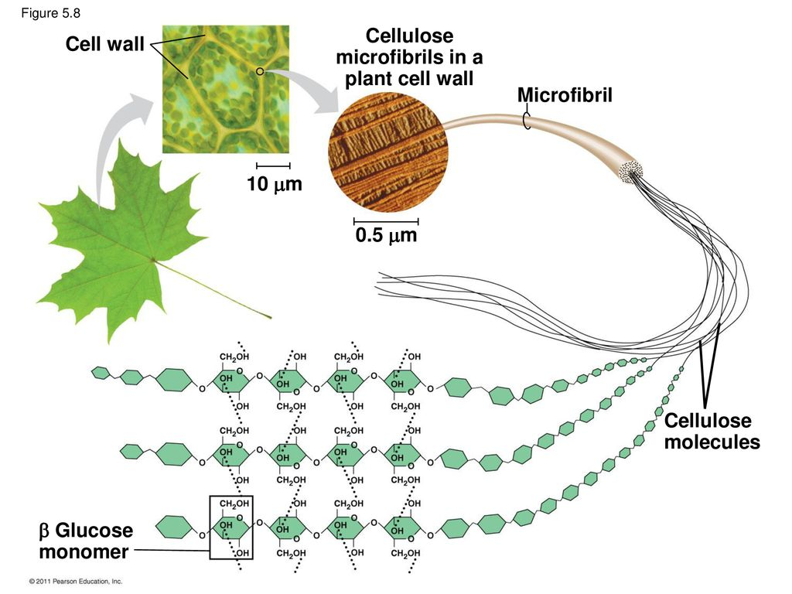

##  Plant form and function is ruled by cells

 

* **Plant cells range from 10-100um in length**
    + 250-2500 to an inch

 

* **Cell walls maintain physical framework*
    + maintain turosity of cells

 

* **Root cells start the uptake and transport of water**

 

* **Specific leaf cells are specialzed for photosynthesis**

 

* **Cell biology of flowers controls reproduction**
    + cells producing pigments and nectar 

## Plant cell walls

 

* **Mostly made of cellulose**
    + strength and protection of protoplast
    + chains of cellulose molecules (*fibrils*)

 

* **Metabolism does occur (so not inert)

 

* **Consists or 1 *or* 2 layers**
    + primary wall (1^st^ layer) = cellulse fibers
    + secondary wall (internal) = lignin

 

* **Sticky layer (*lamella*) between walls
    + made of pectin (jelly!)
    

## Support or water conducting cells have secondary walls

## Why dont plants have strong bones made of Calcium?

 

* **Animals with shells use calcium carbonate**
    + carbonate comes from seawater, so pH not affected

 

* **Animals with internal skeleton use calcium phosphate**
    + cant handle carbonate
    + phosphate has litte effect on cell acidity

 

* **Plants must also be careful with Calcium and its salts**
    + plants need phosphate badly
    + lignin and cellulose are inert
    + lignin and cellulose carbs from photosynthesis

## Plant cells are not solid structures

## Plant cell membrane structure fits fluid mosiac model

* **Membrane covers the surface of the protoplasm**
    + Molecular pumps transport molecules in and out
    
 

* **Impermeable to bad stuff, permeable to beneficial stuff**

## Anatomy of a plant cell

 

* **Virtually all plant cells, although diverse, have conserved organelles**
    + roots, wood, barks, leaves, flowers
    + certain organelles can become modified

 

* **Contain *protoplasm*: water + proteins, lipids & nucleic acids**

 

* **Nucleus, ribsomes and endoplasmic reticulum**

 

* **Golgi apparatus: transport, modify, and package proteins & lipids for delivery**

 

* **Peroxisomes: organelle that produces or uses peroxide**
    + detoxify product of photosynthesis
    

##

## Plastids: membrane bound organelles in plants & algae

* **Choloroplast: double membrane organells in leaf cells**
    + key for photosynthesis
    + interesting evolutionary history

 

* **Leucoplast: colorless organelles storing starch**

 

* **Chromoplasts: organelles containing pigments for colored plant parts**

## Central vacuole makes up most volume in mature cells

## Does calcium make strong bones in plants?

## cell division

## cancerous growth in plants?

## Basic cell types

