## Humans Need Diverse Nutrients from Food Supply

 

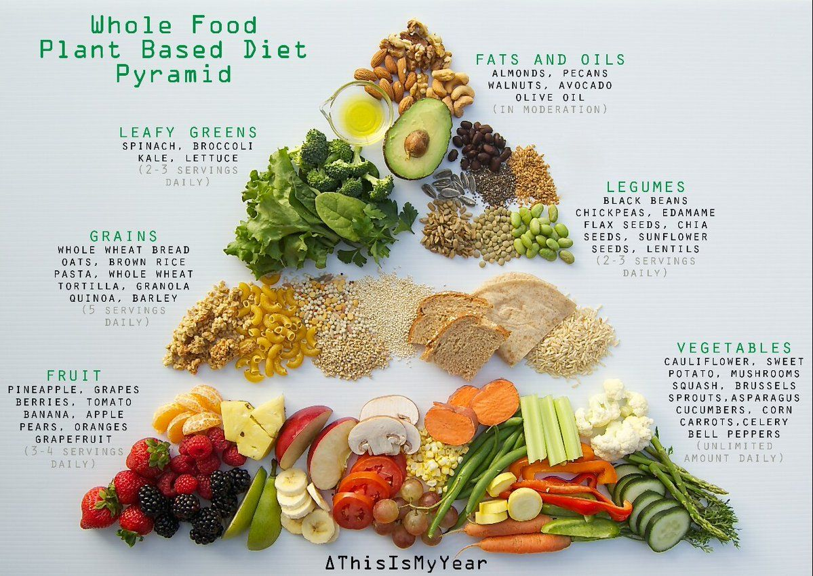

* **Macro-nutrients: Carbohydrates, proteins & fats**
    + carbohydrates & fats provide energy
    + proteins used as building blocks
    
 

* **Micro-nutrients: vitamins and minerals**
    
 

* **When water removed from plants, mass is just macro-nutrients**
    + foraging &#8594; agriculture &#8594; population &#8593;
    
 

* **Health advocates & advertisers promote diets based on these requirements**
    + plants can satisfy most of these resource needs
    
## Complex Carbohydrates from Plants

* **Commonly grouped into sugars and starches**
    + mono-, di- & polysaccharides (# of sugar units)

    
 

* **Glucose & fructose (mono-) broken down in cellular respiration**
    + corn syrup = high fructose
    + fructose common in fruit

 

* **Sucrose (di-) commonly found in table sugar**
    + sugarcane and sugar beet
    
 

* **Starches (poly-) are main storage form in plants**
    + seeds, fruits, tubers
    + major staple crops and underground crops

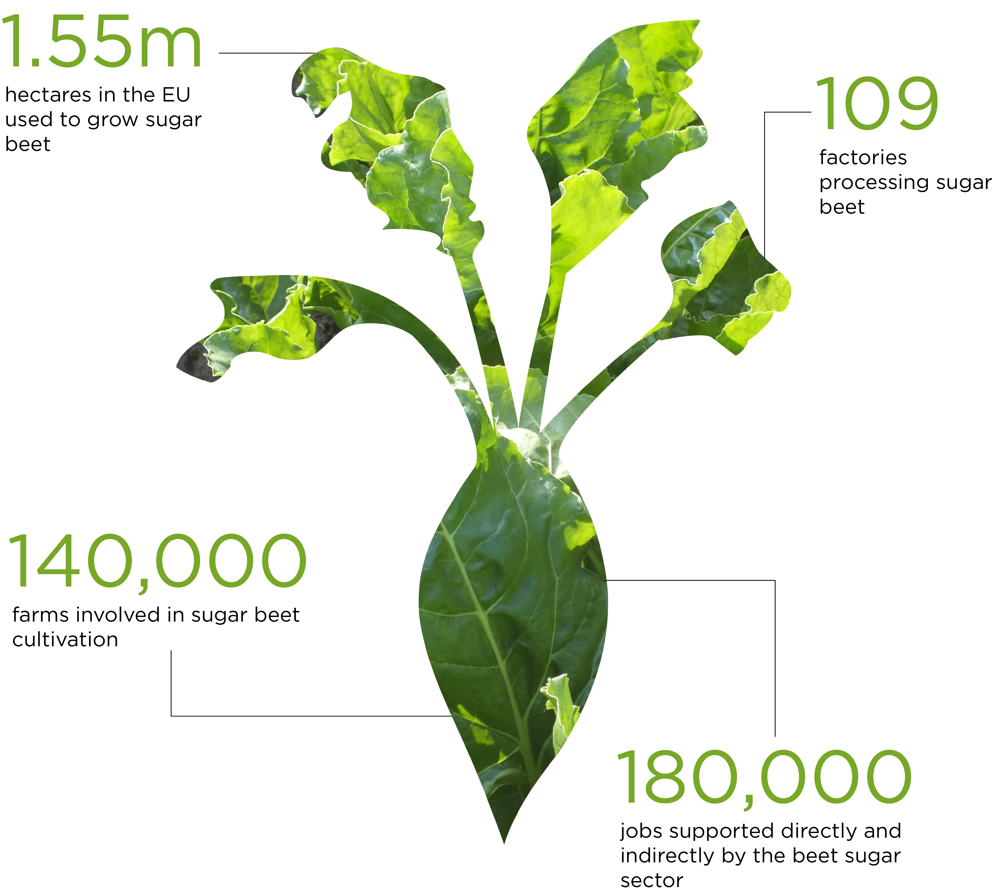

## Fiber in the Human Diet

 
 

* **Fiber, a polysaccharides, is largely not digestible **
    + derived from plant sources

    
 

* **Cellulose, lignin, pectin are components of cell walls**
    + humans lack enzymes to break them down

 

* **Bacteria in intestines ferment soluble fibers!**
    + stabilizes blood glucose
    + reduce cholesterol
    + reduces cancer risks

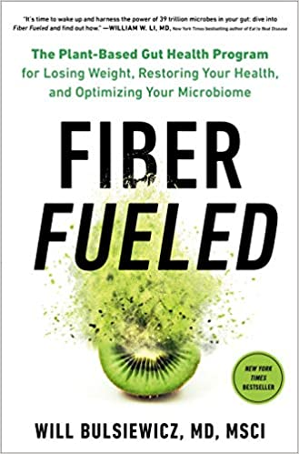

## Plant-Based Proteins

* **20 types of amino acids assembled into proteins **
    + regulate a variety of body functions
    + proteins broken down by enzymes and transported through blood
    
 

* **Dietary proteins need to provide 9 of 20 amino acids**
    + essential amino acids (9) not created or stored

 

* **Plant-based proteins are 'incomplete'**
    + do not contain all 9
    + varied plant diet needed

 

* **Traditional people of Mexico eat corn and beans**

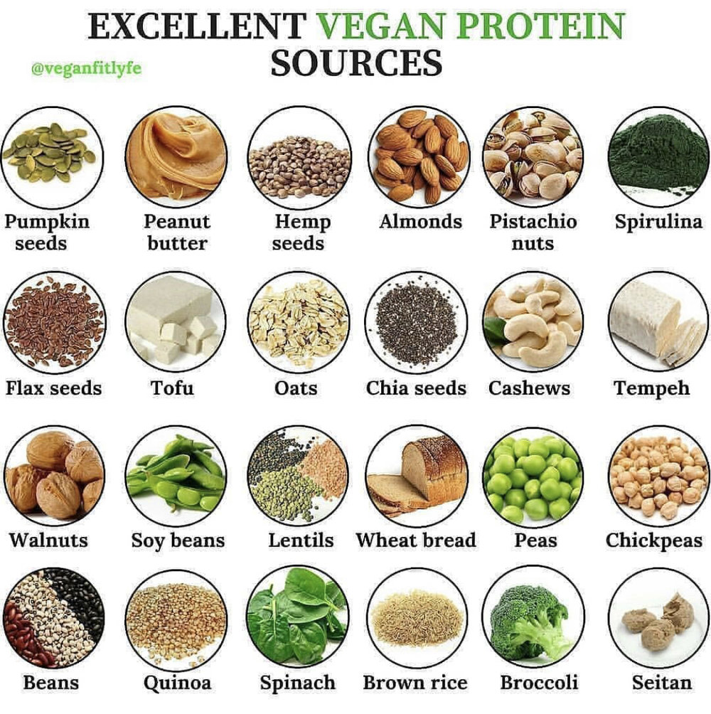

## Gluten and Celiac Disease

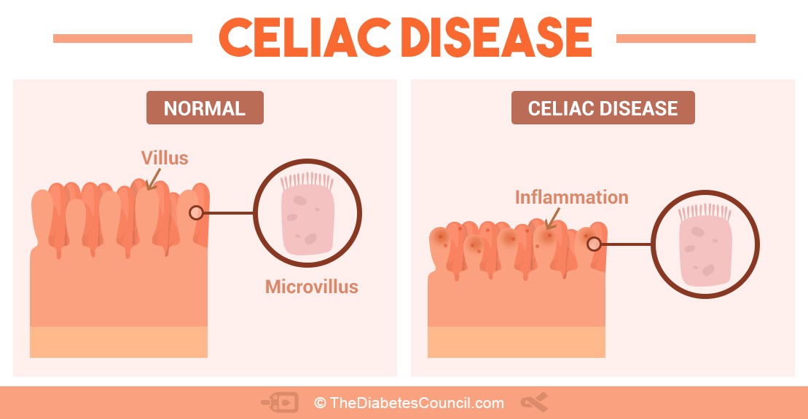

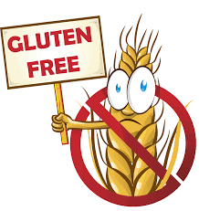

## Fats and Cholesterol from Plants

 

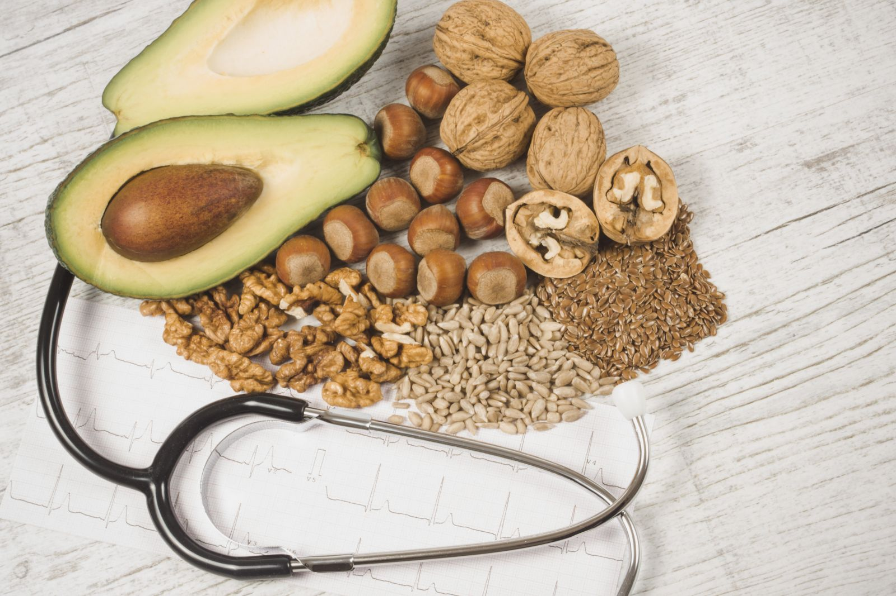

* **Some fats (lipids) are necessary in human diets**
    + vital functions and heart health

 
    
* **Food lipids are mostly fats and oils**

 

* **Human body cannot synthesis all fatty acids**
    + linoleic, linolenic & arachidonic acids
    + all available in vegetable oils
    + 1 tsp of corn oil supply each
    
 

* **Vegetable oils are mostly unsaturated fats**
    + olive, peanut, corn, soybean, etc, 
    + unsaturated fats generally considered healthier

## Micro-Nutrients from Plants

 
 

* **Vitamins (organic) play a role as co-enzymes**
    + required for enzyme function

 

* **Vitamin A (vision pigments) from yellow, orange and dark green vegetables and fruits**
    + beta-carotene
  
 
  
* **Vitamin C (collagen synthesis) **
    + not produced or stored in body
    + fruits and vegetables

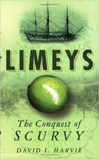

## Micro-Nutrients from Plants

 

* **Minerals (inorganic) components of complex molecules**
    + at least 18 minerals needed

 
    
* **Iron deficiency is common in women and children**
    + only 10% of dietary iron absorbed
    + Leafy greens, grains, legumes and dried fruits
    
 

* **Iron from animal = heme; from plants = non-heme**
    + heme gives blood its red color
    + some plants, like legumes, contain heme.

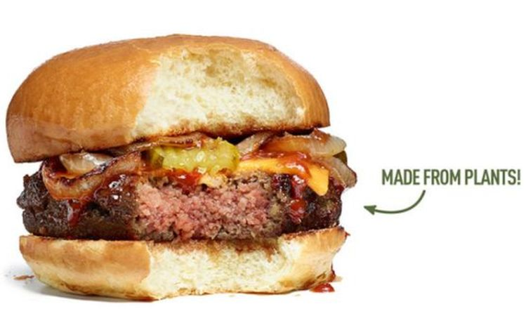

## Plant-Based Diets

 
 
 

* **Vegetarian diets are shown to provide healthy benefits**
    + fewer chronic diseases
    + blood cholesterol tracks animals fats
    + high fiber reduces diabetes risk

 

* **Plant-based diets must be aware of deficiencies**
    + iron, Vitamin B & D, calcium
    + complementary plants for amino acids
    

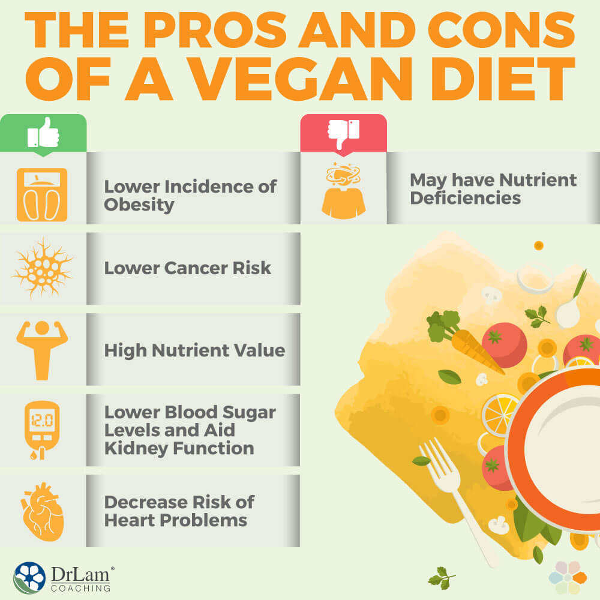

## The Staple Crops (Wheat, Maize & Rice)

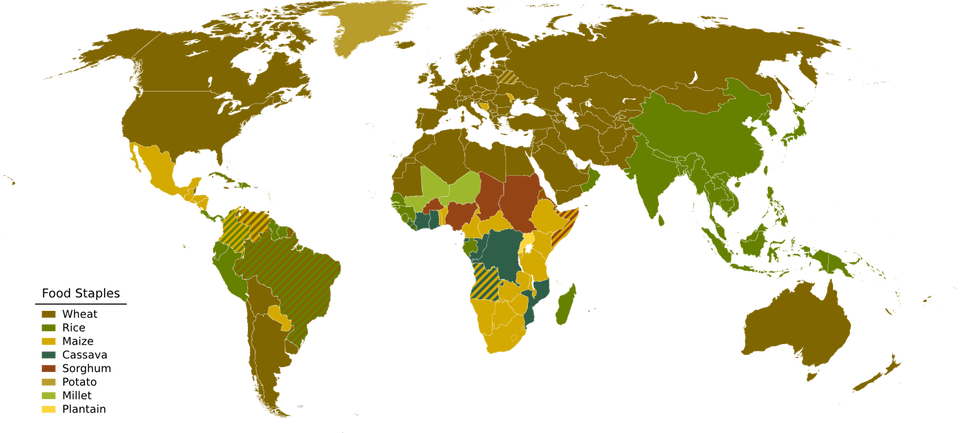

## Grass Family Most Important to Humans

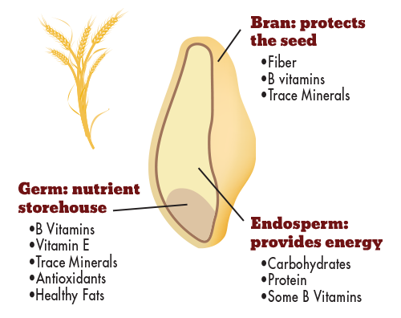

* **Edible grains of cultivated grasses basic food of human civilization**
    + wheat, core, rice
    + barely, oats, millet & rye
    
 
 
* **Sugar cane, a grass, world largest crop product**
    + 26 million hectares in 90 countries
    
 

* **Dry fruits from the grass family are 'grains'**
    + seed is mostly endosperm = starch
    + refined into white flour, corn starch & white rice
    + fruit wall + seed coat = bran fiber

 

* **Wheat, Maize & Rice (refined + whole) provide 50% of human calories consumed**
    

## Wheat: The Staff of Life

* **Wheat 'spikes' are densely packed with grains**
    + primarily grown in cool temperature zones
    + wild species found in Fertile Crescent
    
 
 
* **Einkorn wheat one of first cultivated species**
    + domesticate from is 'non-shattering'
    + hybridized with 'goat grass' to create 'emmer wheat'
    + 'emmer wheat' crossed with another 'goat grass'
    + diploid &#8594; tetraploid &#8594; hexaploid
    
 

* **Currently 1,000s of wheat cultivars**
    + tolerance to climate
    + amount of gluten
    + protein content in endosperm
    

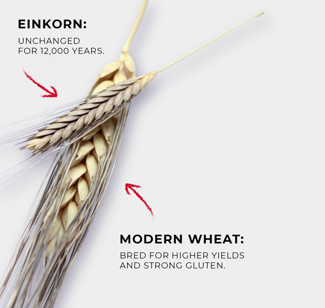

## Corn: Indian Maize

 

* **Summer annual, moderate temp and rain**
    + now: breed for diverse environments
    + requires nutrient-rich soil
    + today: hybrid corn w/ many large kernels

 

* **Unknown to arriving Europeans**
    + most types cultivated by Native Americas
    + poorly adapted for natural environment (husks)

 

* **'Popcorn' one of the most primitive varieties**
    + hard kernels, 'hard' starch around 'soft' starch
    + burst and swell when heated
    + avoids processing

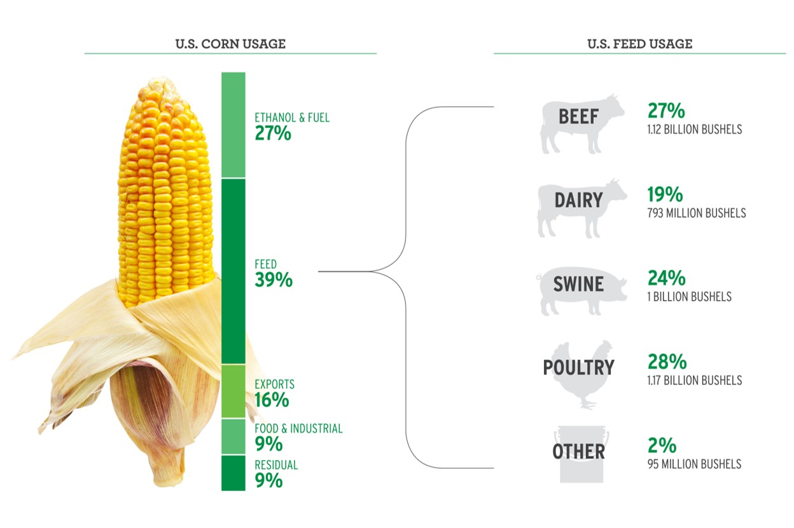

## Rice: Food for Billions

 

* **Rice feeds more than any other crop**
    + >2 billion people
    + 1,000's of varieties
 
  
 
* **Originated from wild ancestor in flooded tropical lowlands**
    + current: breed to grow any where 
 
  
 
* **Large annual grass with air chambers in stems**
    + air diffusion: stomata &#8594; roots
 
  
 
* **Rice mostly cultivated into flooded fields**
    + aquatic fern, *Azolla*, provides nitrogen
    + fields drained to harvest

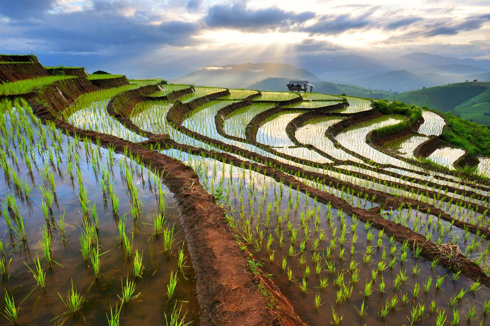
