## Plants furnish society with more than food

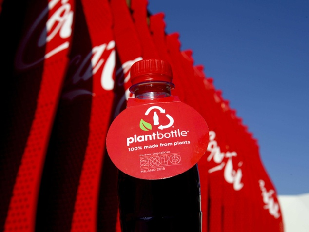

* **Plants provided early societies with shelter, clothing and fuel**
    + humans have used biomass energy from plants (as fuels) for millenia
    
 

* **Modern civilizations: plant-based products are key for our daily lives**
    + housing: wood and engineered timber 
    + clothing & goods: cotton, linen, hemp, fibers
    + key products based off rubber, pulp & paper, adhesives 

 

* **Future civilizations: Are plant-based products to answer to some of societies biggest problems?**
    + new products (e.g. bioplastics) may create sustainable solutions
    

## The most vintage crafts: Basket weaving

* **Basketry present in every human culture and oftern predates pottery**
    + tough to date, because perishable
    + Egyptian baskests = 10,000 years old

 

* **Basket making does cross gender barriers**
    + Pomo tribe in California 

 

* **Plants used for baskets region dependent**
    + palm and coconut in tropics
    + tree parts in temperate regions
    + grasses in prairies or marshes

 

* **Connection to today: keeping cultural livelihoods wtih fair-trade income, and living history**  

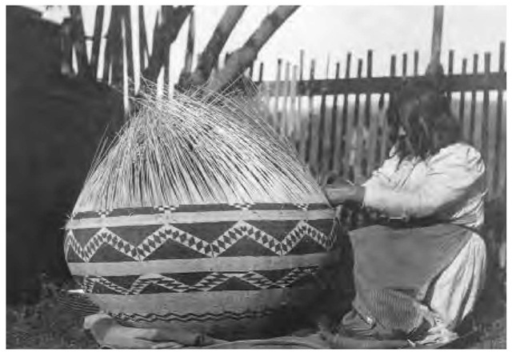
    
## Plant fibers

* **Fiber: long tapering plant cells with cellulose**
    + ground tissues: sclerenchyma cells (flexible)
    + thick cells walls with lignin, tannin, pectin
    
 

* **Most valuable fibers are mostly cellulose and white**
    + some cellulose has tensile strength of steel

 

* **Provide cloth, rope, paper, etc for millennia**
    + rope from flax plant dated 30,000 years old
    
 

* **Commercial fibers = elongated cells processed together**
    + limited # of plant species
    
 

* **Now: across the entire supply chain, employees 200-300 million people**
    

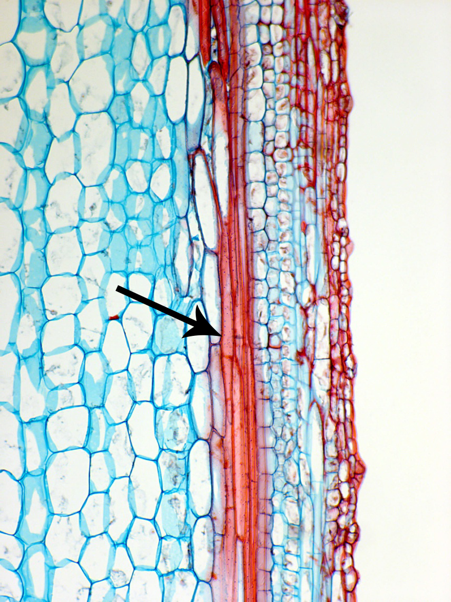

## RSW1 gene breakthrough

 

* **RSW1 gene codes for the enzyme responsible for cellulose production**
    + cellulose synthase

 

* **Isolated in *Arabidopsis* and cotton**

 

* **Can scientists manipulate cellulose content of plants used for fibers?**
    + recent cotton work shows proteins can thicken secondary walls and improve fiber traits

 

* **From discovery → products: guides today’s cotton fiber engineering**
    + understanding RSW1 underpins stronger fibers + better processing
    

## Fiber types

* **Natural fibers are plant or animal based**
    + synthetics may still mix in natural sources
    + e.g., rayon still has cellulose from wood pulp

 

* **Classified according to use:**

1. textile fibers: used to weave cloth
2. cordage fibers: used to make rope
3. filling fibers: used to stuff things
    
 

* **Classified from source on plant:**

1. surface fibers: coverings of leaf, fruit, seeds
2. soft fibers: clusters of phloem fibers
3. hard/leaf fibers: veins of leaves

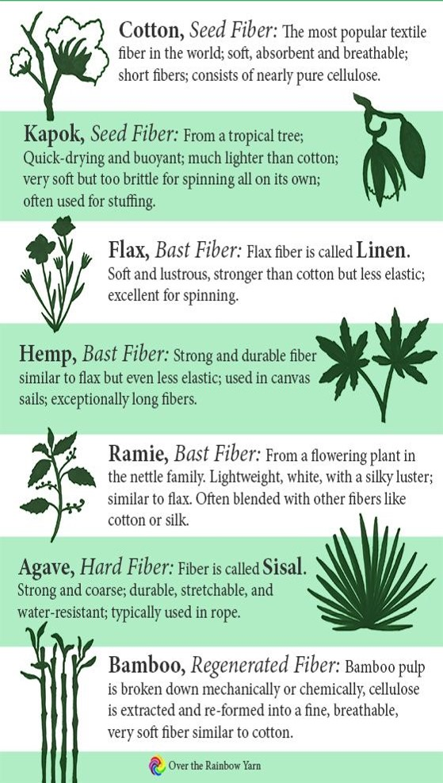

## Extracting fibers and spinning yarn

 

* **Surface fibers separated from plants (e.g., seeds) mechanically**
    + termed: *ginning*
    + has scaled up and automated easily
    
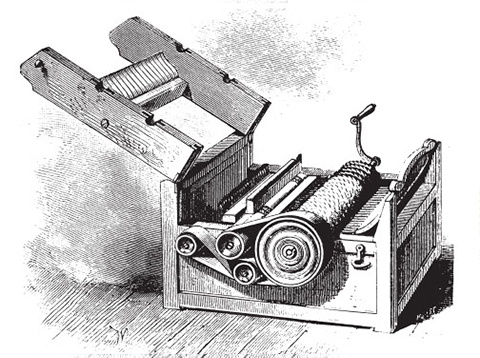

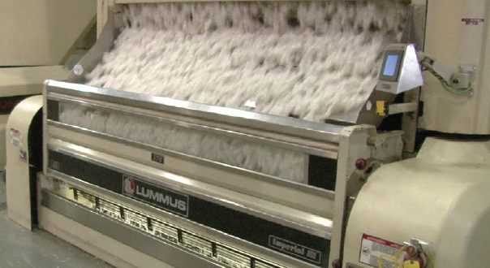

## Extracting fibers and spinning yarn

 
 

* **Soft fibers extracted using microbial degradation**
    + *retting* process loosens fibers from woody core 
    + breaks down pectin
    
 

* **Hard fibers scraped away by hand or machine**
    + this *decortication* occurs after *retting*

 

* **First spinning wheel in India ~750 a.d**
    + big advancements during industrial revolution
  
 

* **Now: These steps differ in labor and water use: retting can impact water quality, while decortication is mostly mechanical**

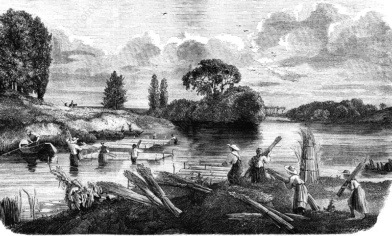

## Cotton

 

* **Rendering cotton into cloth was discovered independently in new & old worlds**

 

* **Harvested from wild plant in coastal Peru 10,000 years ago**
    + domesticated 4,500 years ago
  
 
  
* **Cotton cloths dates 5,000 years in India**
    + spread to Babylonia
    + Arabs brought cotton to Spain

 

* **Cotton brought to Florida in 1556**
    + commercial crop for southern colonies

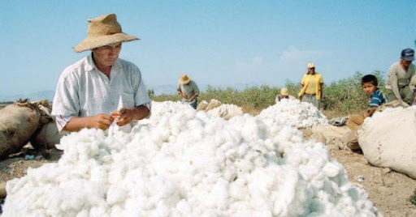

##
**Genetic and archaeological evidence suggests that the 4 commercially grown species of cotton—and possibly a few others—were domesticated independently by at least 4 groups around the world**

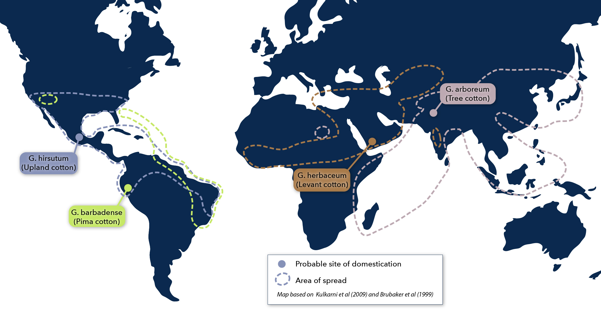

## Cotton plant

* **20-30 species in the genus (*Gossypium*)**
    + native to Asia, Africa, Americas and Australia
    + shrub with palmate leaves
    + warm climate with lots of water
    
 

* **Currently the most popular natural fiber**
    + 50% of world' textiles

 
    
* **Fruit of cotton is a capsule, splits along 5 seams**
    + fibers are hairs that extend from seed coats (10)
    + 20,000 hairs per seed
    + hairs naturally twisted

 

* **Now: 1 in ~2 garments contains cotton; price swings shape rural farm livelihoods**

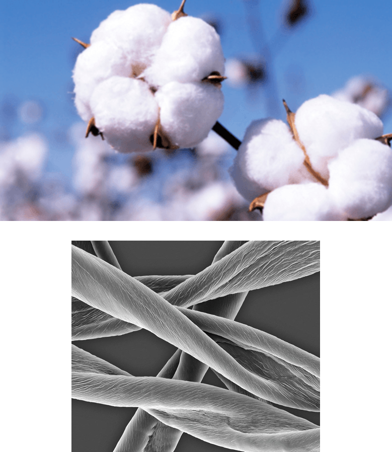

## Bioengineered cotton

* **Bollgard = Bt cotton created by Monsanto**
    + effective against many cotton pests
    + one of most planted transgenic crops

 

* **Bt cotton yield gain +10% in USA**
    + large reductions in insecticide use

 

* **Bollworm pests damage higher in India**
    + small farms cannot afford insecticides
    + yields increase 60% with Bt
    
     
   
* **Transgenic research combines cotton & polyester**
    + feel of cotton + heat retention
    + 'natural' cotton-poly blend
    

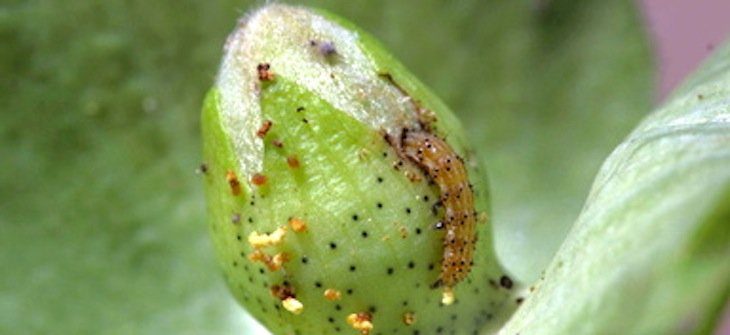

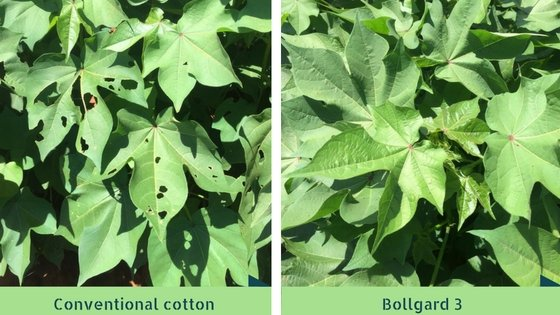

## Linen: An ancient fabric

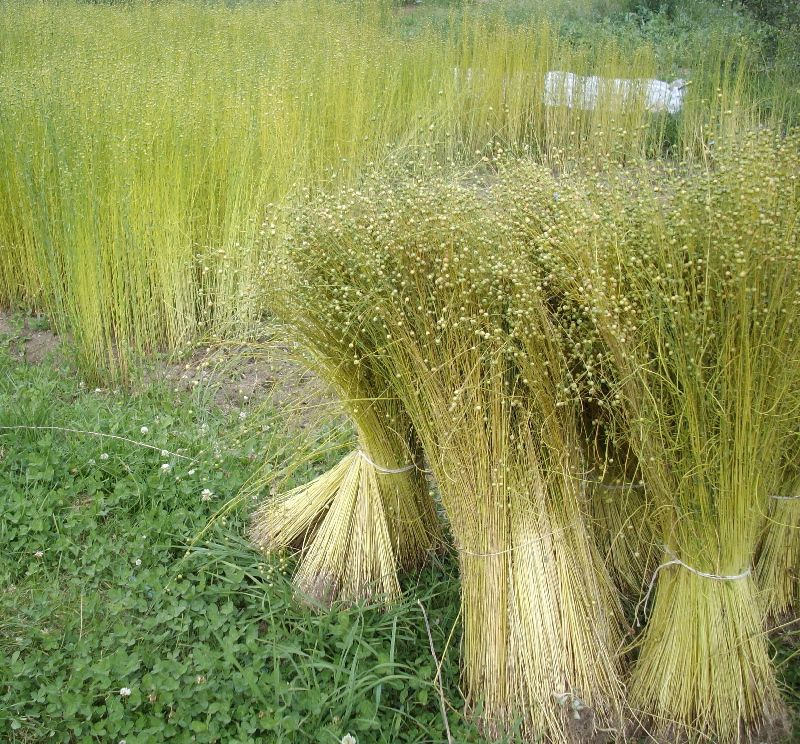

* **Flax (genus *Linus*) delicate, long, slender stems**
    + fibers from phloem cells

 

* **May be oldest plant fiber used to make cloth**
    + 30,000 year old wild flax fibers in cave used during stone age
    + used to bind tools or weave baskets?
    + fibers appear to have been dyed!

 

* **Ancient Egypt was the 'land of linen'**
    + worn by royalty or in mummy cloths
    + exported for use in sails

 

* **Grown in Soviet Union, China and Western Europe**

## Plant fibers vary by region and culture

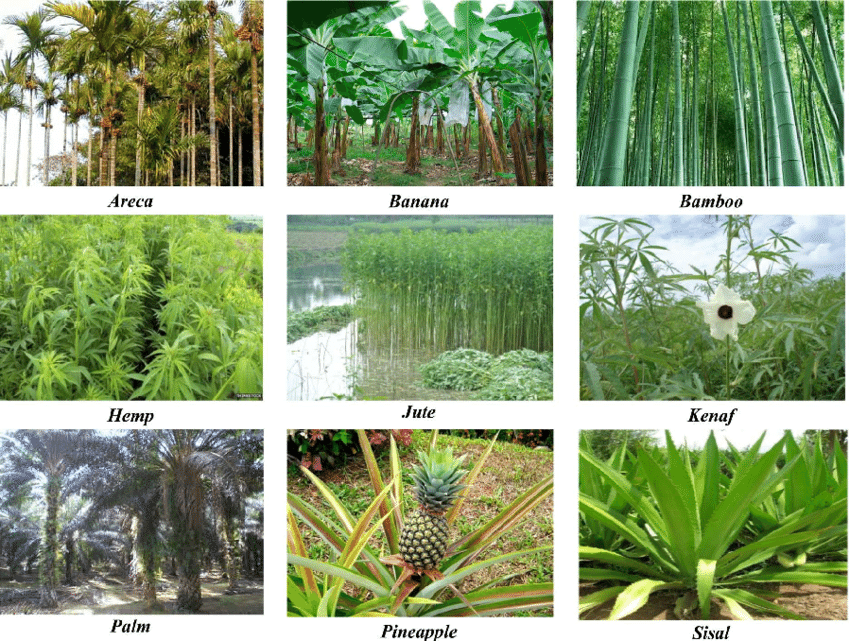

## Natural rubber & latex: From trees to tires

* **Natural rubber is extracted from latex, a white milky liquid that can be found in approximately 10% of  plants**
    + Rubber tree, dandelions and lettuces

 

* **Latex properties: long, coiled, and flexible chains held together by weak forces. Allows material to be stretched easily (uncoiling the chains) and then return to its original shape**

 

* **Vulcanization = chemical process that heats rubber with a curing agent (sulfur) to create cross-links between polymer chains (Goodyear)**
    + creates increased tensile strength, resistance to tearing, and better temperature tolerance. 

 

* **Applications beyond tires: medical gloves, elastic bands, vibration reduction**

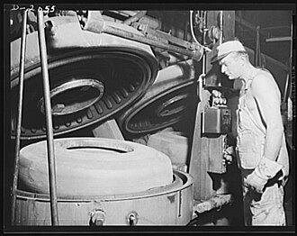

## Sticky, film-forming & astringent plant chemistries

 

* **Resins: pine rosin & turpentine → varnishes, adhesives, inks, fragrances**

 

* **Gums: gum arabic (Acacia) are stabilizers/emulsifiers in inks, paints, and food**
    + also printing & watercolor media

 

* **Tannins: leather tanning, natural mordants for dyeing**
    + historical bark/leaf sources (oak, sumac, chestnut)

 

* **Industrial relevance: viscosity control, film formation, adhesion, crosslinking.**

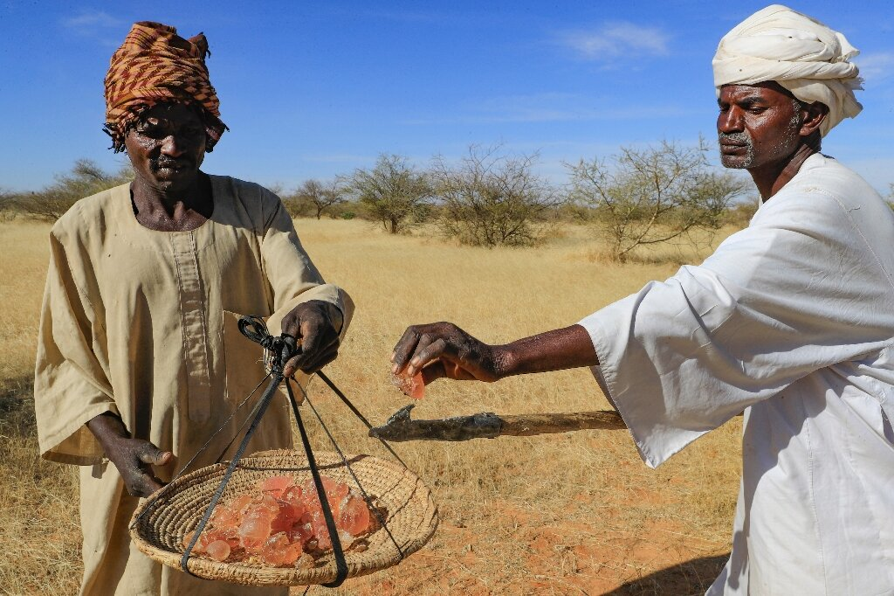

## Wood and wood products

* **Ranks next to food in importance to human society**
    + construction, fuel, synthetics
    + strength & insulating properties (construction)
    
 
 
* **1/3 of land surfaces covered by forests**
    + ~10 million hectares removed a year

 

* **Even with improvements, usage rate exceeds regeneration**
    + most forests unmanaged
    
 

* **Forest removal greater for agriculture than for timber**
    + or fuel
    

## Billion to trillion tree campaigns

**Paradox: trees for timber vs trees for carbon—how should society choose?**

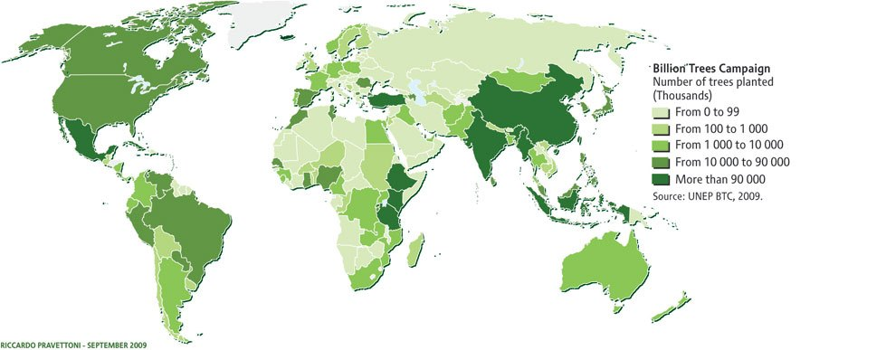

## Hardwoods vs softwoods

 

* **Wood is secondary xylem (vascular cambium)**
    + lots of strong (cellulose) dead cells
 
  
 
* **Wood strength determined by cell wall thickness, types of xylem cells & fibers** 
 
  
 
* **Hardwood lumber = angiosperm trees**
* **Softwood lumber = gymnosperm trees (conifers)**
 
  
 
* **Generally angiosperm lumber is more dense**
    + now: species choice affects local mills & job types
    

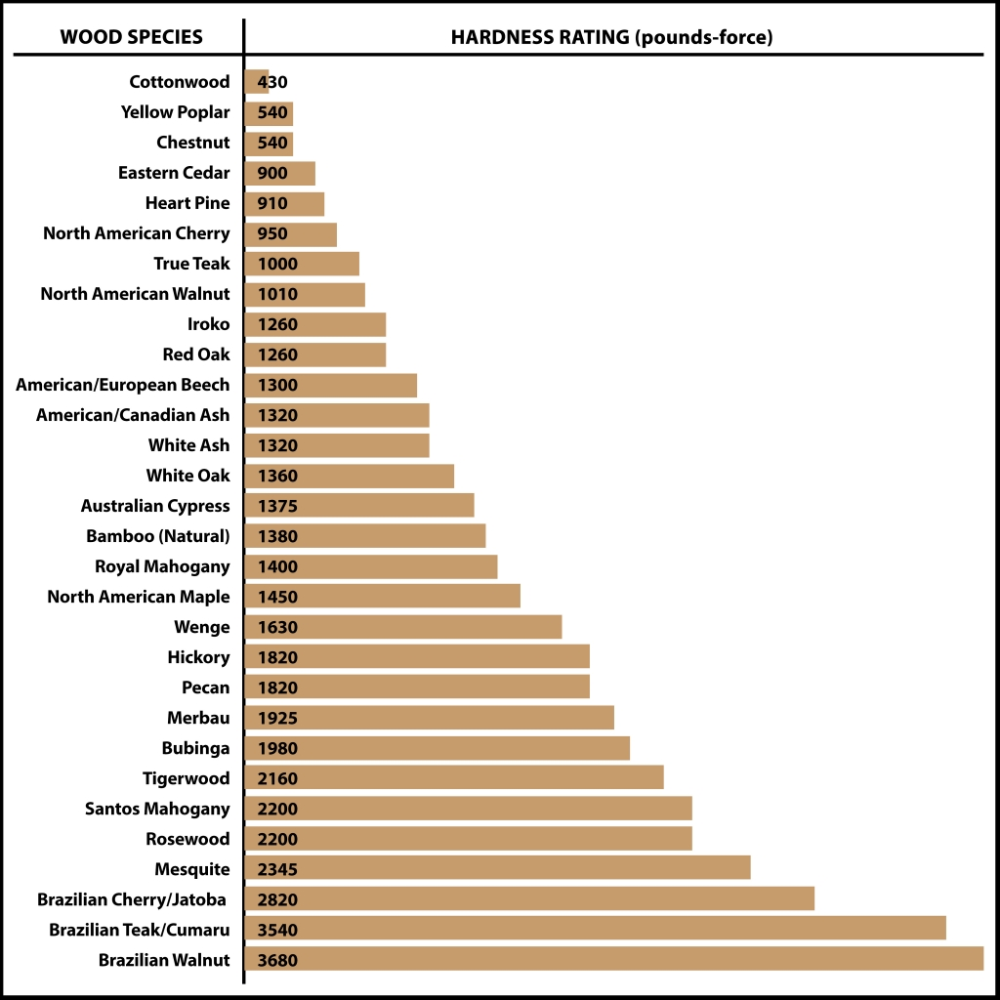

## Engineered wood & bio-composites

 

* **Engineered wood—like plywood is strong for its weight, easy to prefabricate, and locks up carbon.**
    + often more environmentally friendly than solid wood
    
 

* **Bio-composites mix plant fibers (flax/hemp) or wood with plastics for things like decking and furniture**
    + example: soy/corn adhesives
    + faster prefab builds, quieter sites, inside air quality
    
 

* **Performance trade-offs:**
    + plywood: moisture uptake (warping/sag), connectability, recyclability issues
    + composites: cost, fading, difficult to repair

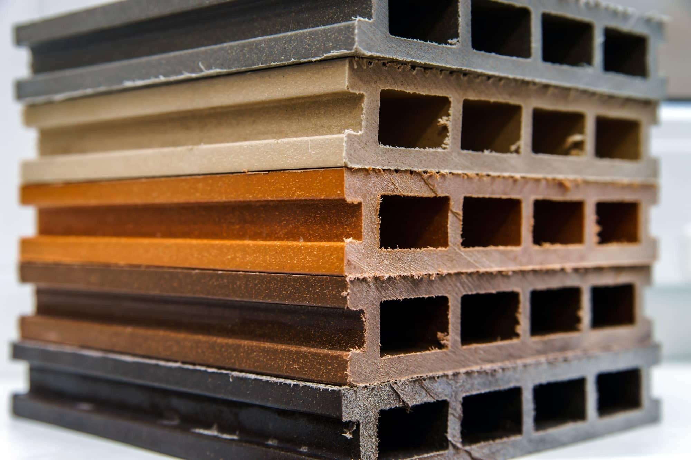

## Wood for fuel

* **Chief source of fuel until recent times**

 

* **Developing nations still depend on wood for fuel**
    + 2 billion people use for heating/cooking
    + most prominent in the tropics
    + household air pollution is a health risk
    
 

* **Charcoal production originated 7,000 years ago**
    + partial combustion with low air flow
    + burns at higher temperatures
    + caused the decimation of European forests

 

* **Charcoal today: ~70 Mt/yr, Africa-led production; vital for household cooking, crude iron production**

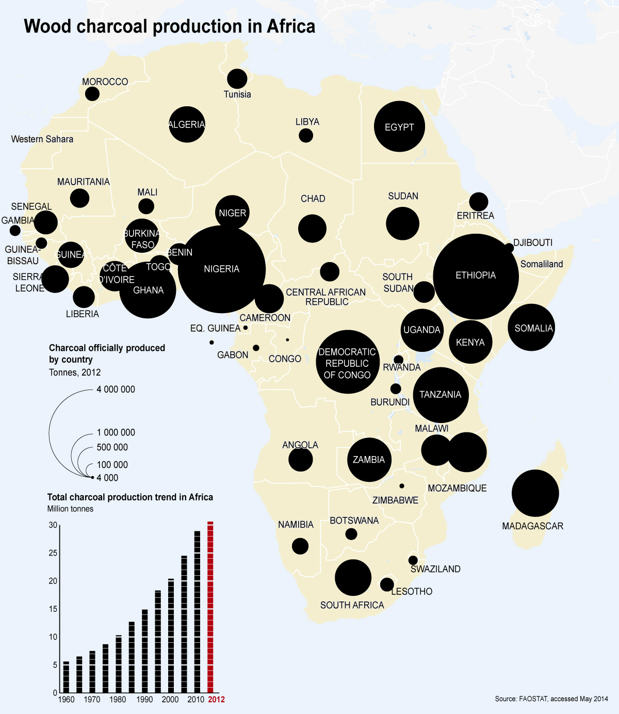

## Pulp and paper

* **Wood pulp = watery suspension of pulverized wood**
    + mostly xylem cells and fibers
    + ~50% of harvested wood goes to pulp
    + processing removes lignin (brown color)

 

* **Traditional processing (chlorine) harmful to environment**
    + now: utilization of wood-rotting fungi
    + now: transgenic *Eucalyptus* w/ low lignin

 

* **Wood pulp used for paper, cardboard and cellophane**

 

 

 
 

 
* **Americans consume about 30% of the world's paper, despite making up only 5% of the global population**
    + each American uses 700 lbs of paper, despite the internet
    + 1 billion trees harvested a year
 
 

 
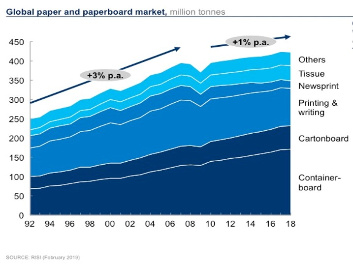

## Hemp now: paper, fiber & policy

 

<!-- 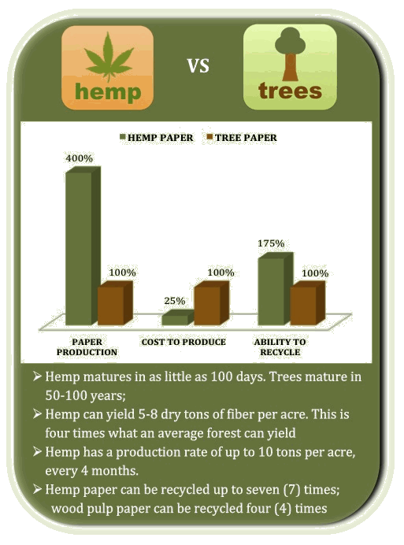 -->

 
* **Policy: 2018 Farm Bill legalized hemp (<0.3% THC); program extended through FY2025...**

 

* **Markets: fiber (paper/biocomposites) vs floral/cannabinoids; acreage/value modest but growing**
    + hemp matures way faster than trees
    + yields 4x fibre/acre than trees
    + can be recycled more than wood pulp paper
 
  
 
* **Cons: processing challenges, regulatory issues, no designed herbicides**

 

 
## Cellulosics & Bioplastics

* **Wood pulp products: purified cellulose from trees like eucalyptus, beech, spruce, pine**
    + Cellulose acetate is used for film, eyeglass frames, and tool handles

 

* **Bioplastics are plastics made from biological sources or designed to biodegrade**
    + include PLA & PHAs for packaging/fibers
    + low heat resistance and need industrial composting
    
 

 

 
 

 
* **Environmental nuance: “bio-based” ≠ “biodegradable"**
    + bio-based = made from biological sources (e.g., corn, sugarcane, wood pulp).
    + biodegradable = can be broken down by microbes under specific conditions 
    + plastic can be bio-based but not biodegradable or biodegradable but fossil-based

 

 
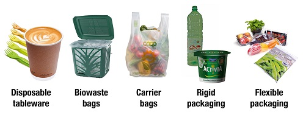
