## Overview of Plant Nutrient Uptake

* **Review: Plants require many mineral nutrients for growth, development, and metabolism**
    + nutrients are absorbed primarily through roots from the soil solution

 

* **Two main pathways for uptake:**
    + passive transport (diffusion, facilitated diffusion)
    + active transport (requires energy to move ions against gradient)

    

+ **Most nutrients enter roots as ions dissolved in water (e.g., NO₃⁻, K⁺)**
    + plants can't absorb solid particles directly
    + charged ions require transport proteins (in cells)

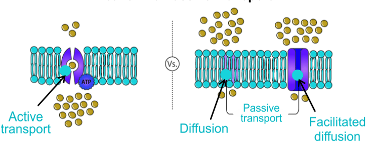

## Root Hair Cells: Structure and Function

 

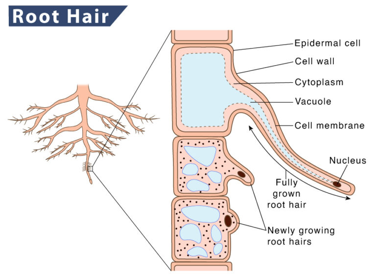

* **Root hair cells are extensions of epidermal cells in the root**
    + Increase surface area dramatically
    + No waxy cuticle, so water enters freely
    + High density of membrane transport proteins for selective nutrient uptake

 

* **Thin cell walls and large central vacuole aid in rapid uptake of ions and water**
    + lots of mitochondria (?)
    
 

* **Short-lived but continuously regenerated as roots grow through new soil zones**

## Active Uptake of Nutrients via Roots

 

* **Roots absorb scarce nutrients even when concentrations are higher inside the cell than in the soil**
    + passive diffusion would not work
    + ATP needed to transport across gradient

 

* **Root cells use energy to pump out hydrogen ions (H⁺) into the soil**
    + creates a gradient that helps pull anions like nitrate and phosphate into the root

 

* **Soil particles are negatively charged, holding cations (i.e. Ca^2+^)**
    + hydrogen ions also causes the cations to be swapped out into the soil water
    
## Active Uptake of Nutrients via Roots

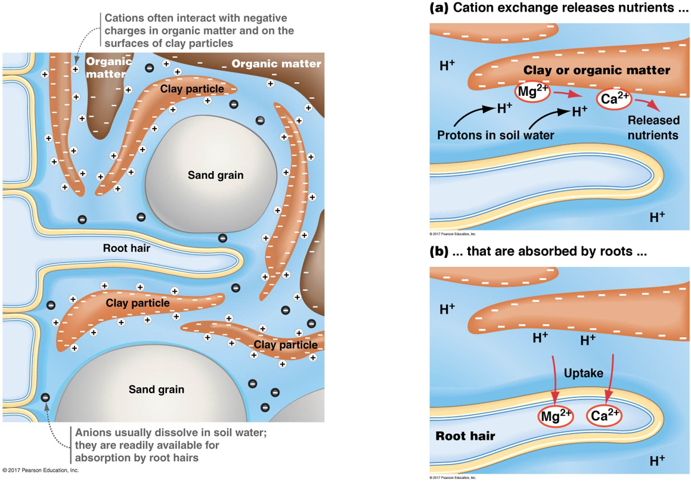

## Root Structure & Nutrient Entry

**Dissolved nutrients move between cells and through cell walls to reach xylem**

 

** Apoplastic pathway: movement through cell walls and intercellular spaces**

 

** Symplastic pathway: movement from cell to cell through plasmodesmata (tiny bridges between cells)**

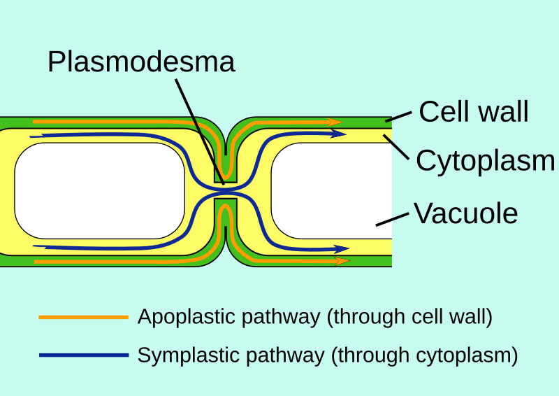

## Root Structure & Nutrient Entry

 

**Casparian strips are located in the cell walls of the layer of cells that surround the vascular cylinder in plant roots (xylem + phloem)**

 

**Forces selective uptake into symplast before xylem**

 

**Symplast pathways uses plasmodesmata - small channels that are lined with plasma membrane (selectively permeable!)**

 

**Allows regulation of molecule movement, prevents back flow, and prevents entry of pathogens into vascular system**

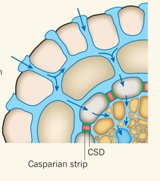

## Plants and Fungi

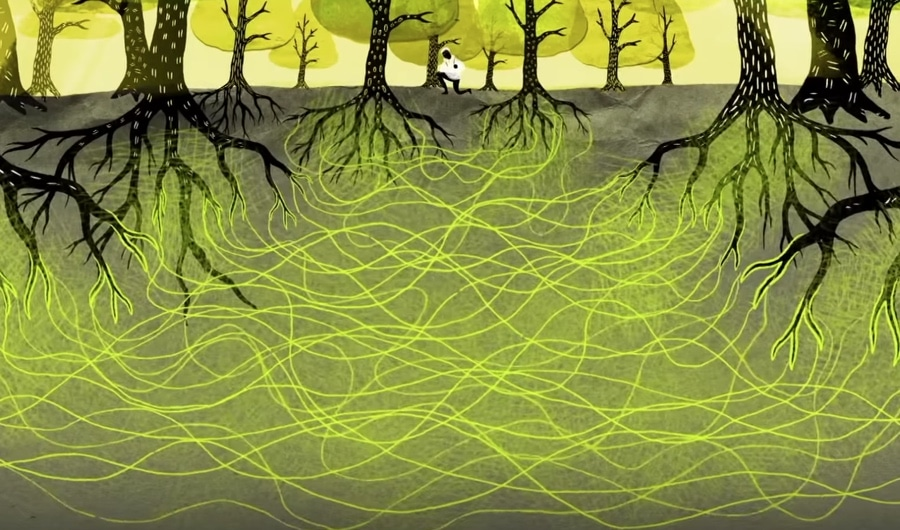

## Mycorrhizal fungi: sharing with plants

 
 

* **~80-90% of plants have association with fungus**
    + fungi grown in/around plant roots
    + share resources
    + one of the most widespread mutualisms

 

* **2 main types:**
    + Ecto- and Endo- mycorrhizae
    + diverse array of species for each

 

* **Association now key for plants to thrive**
    + fungi more efficient @ nutrient uptake
    

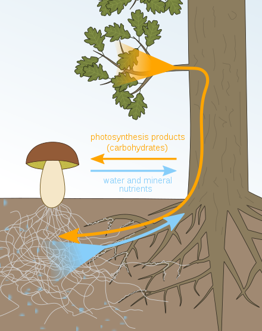

## All Fungi share traits related to nutrition

 
 
 

* **Use enzymes to break down compounds**
    + diverse enzymes for diverse food sources
    
 
 
 

* **Heterotrophs: absorb nutrients from environment**
    + decomposers: break down dead things
    + parasites: absorb from host
    + mutualist: absorb/share with host

 
 
 
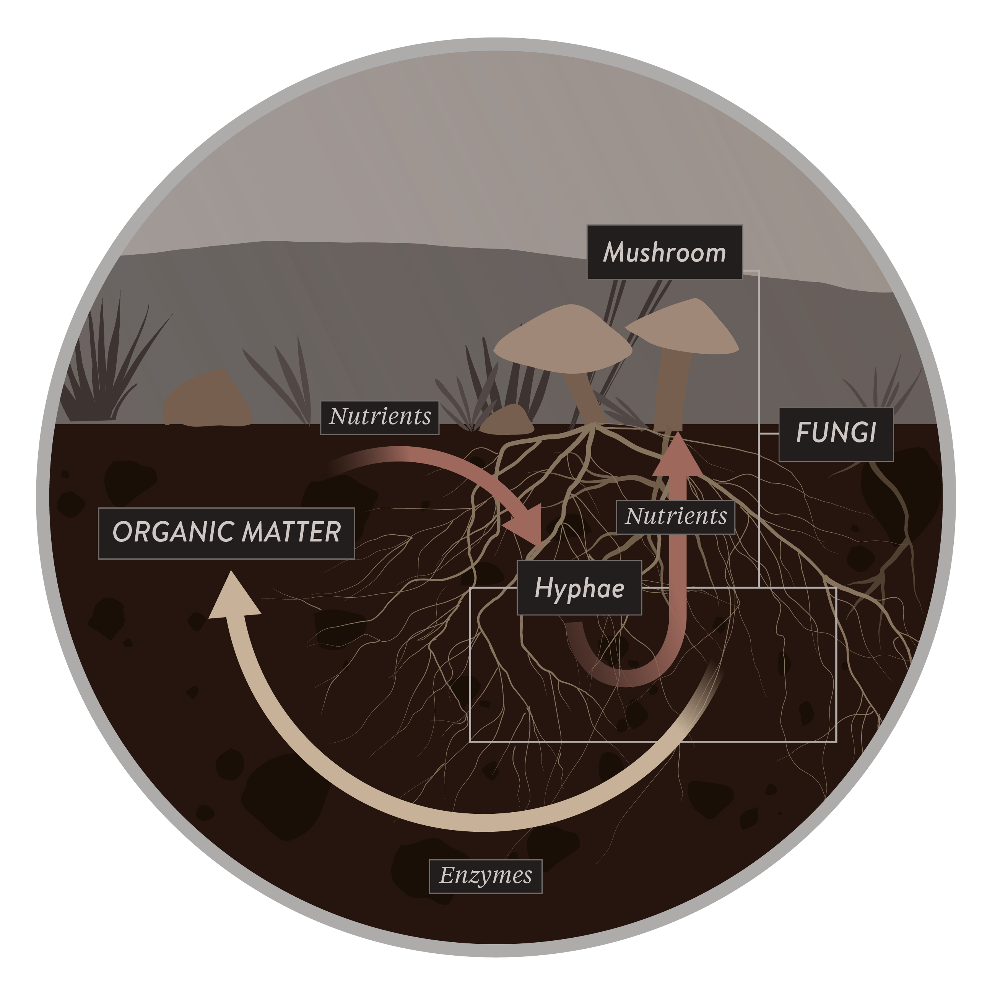

## Fungal body plan: Not-motile

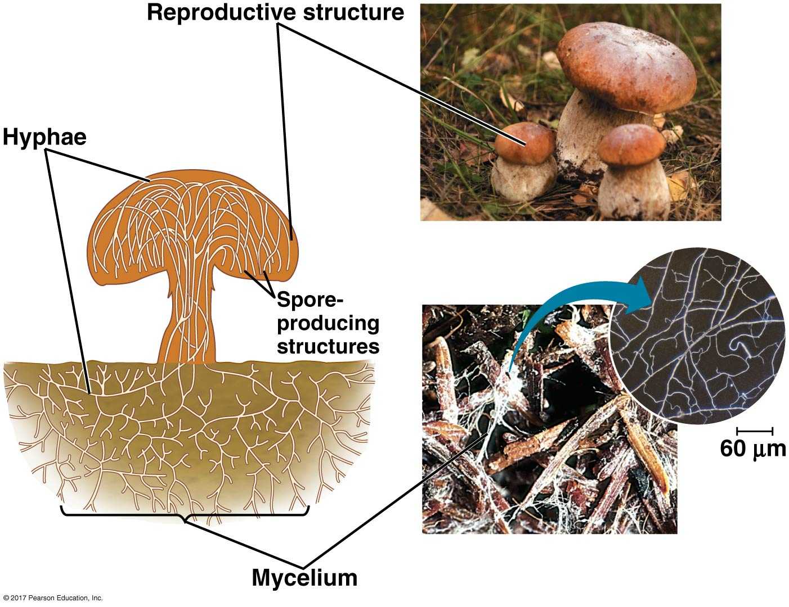

## Most *hyphae* divided into cells by *septa*

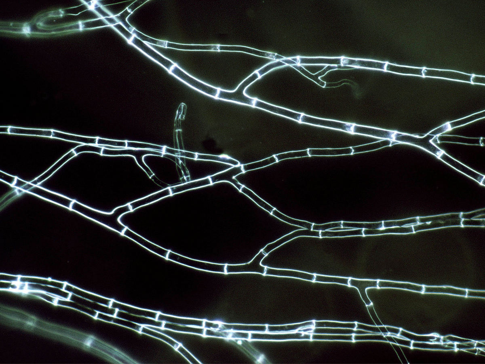

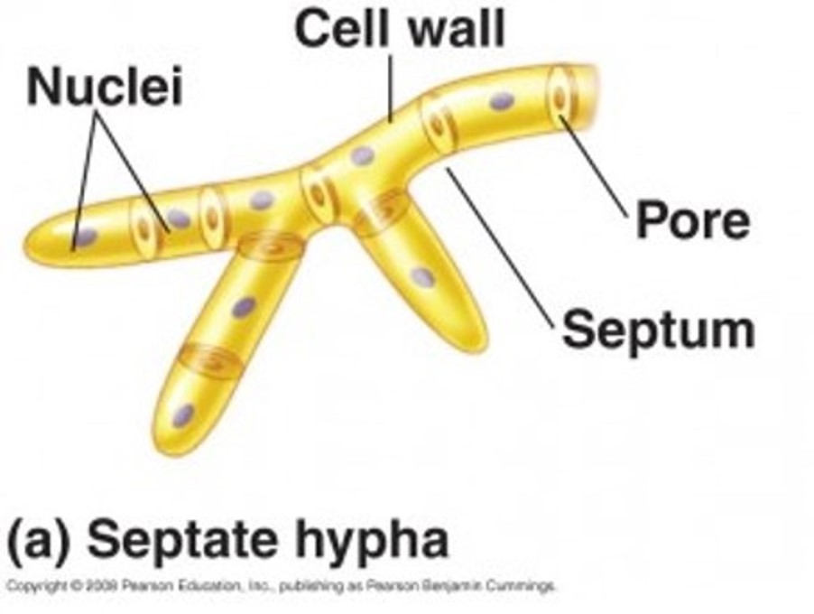

## Mycelium: huge surface and volume for absorption

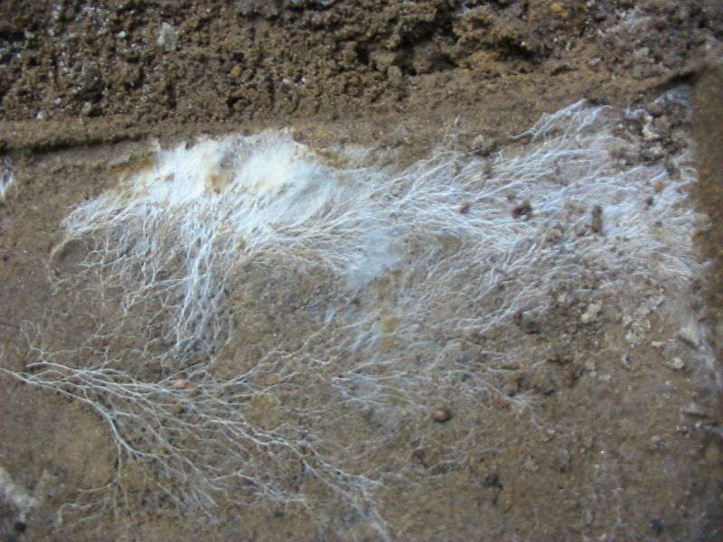

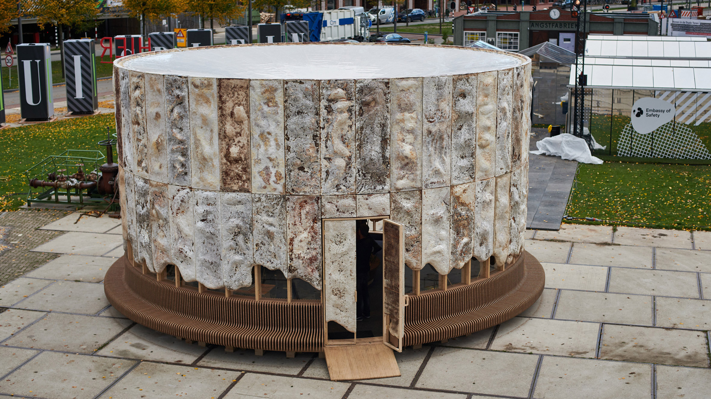

## Specialized hypae in many types of fungi

 

* **Specialized hyphae for feeding on live animals**
    + hoops
    
 
   

* **Specialized hyphae that allow them to extract nutrients from plants**

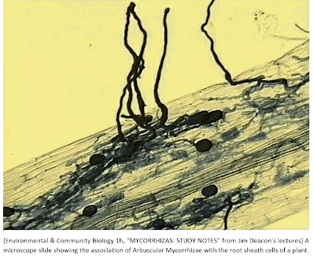

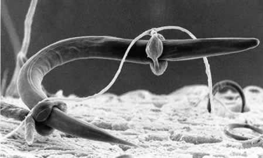

## 
 
 
 

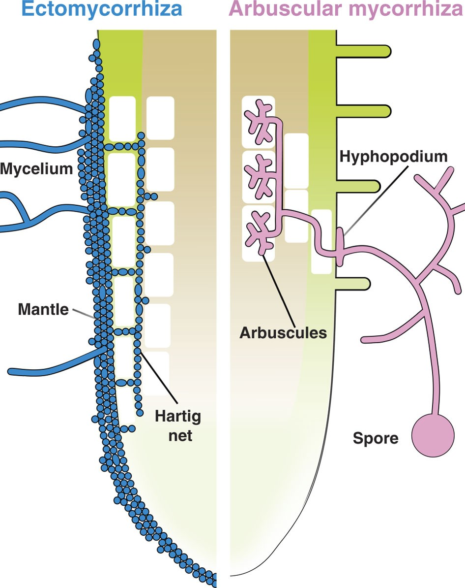

* **Branching hyphae used to exchange nutrients with plant hosts**

 

* **Ectomycorrhizal fungi sheath cell walls**
    + *Hartig net* surrounds epidermal cells

 

* **Endomycorrhizal fungi invade cell walls**
    + *Arbuscules*: highly branched hyphae inside cells
    + often called 'arbuscular' mycorrhizae

## 

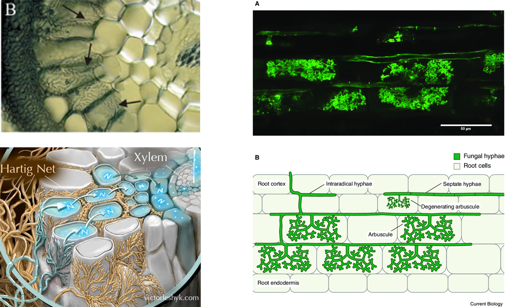

## Nutrient Exchange: Sharing is caring

 
 
 

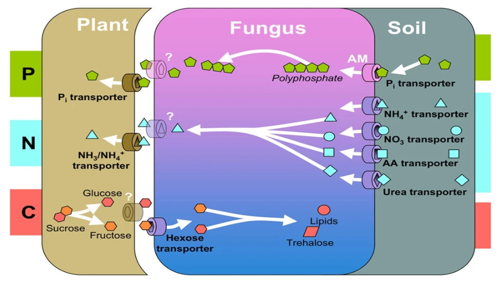

* **Inorganic nutrients imported to plant**
    + N, P and amino acids
    
 

* **Carbon imported to fungus**
    + sugars from photosynthesis

 

* **Possibly active & passive transport**

## Soil Life: Plant Roots, Fungi & *Microbes*

 

* **Free-living microbial communities in soils breakdown organic matter**
    + plants cannot uptake organic compounds
    + fungi lost breakdown enzymes via evolution

 

* **Microbial communities are carbon limited**
    + plants exude carbon (simple sugars) from root tips
    + exudates increases microbial activity

 

* **Fungi are great at uptake and transport**
    + decomposers of *some* things
    + carbon limited
 
 

 
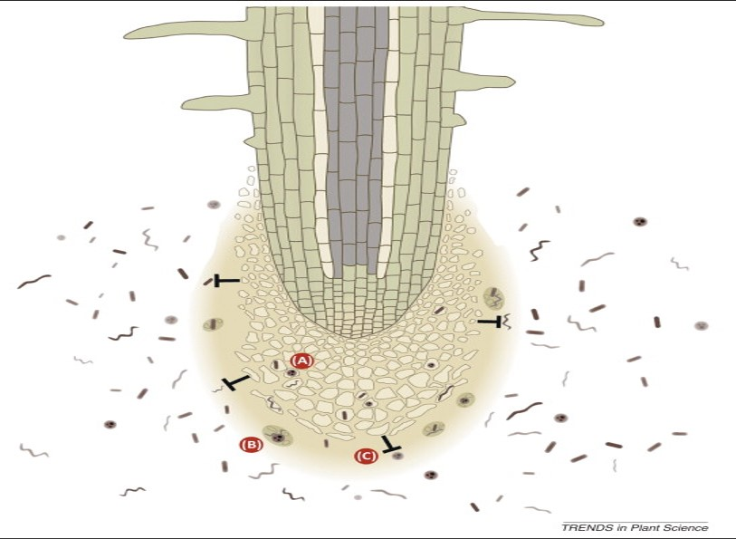

## Timing matters: Land plant evolution & fungi

 

* **Fungal phyla associated with mycorrhizae diverged prior to the divergence of land plants**
    + Oldest fungal fossils appear ~900 mya
    + First terrestrial fungus ~ 460 mya
    
 

* **What was the land like for first plants?**
* **What were early plants like?**

 

* **Plant land colonization likely facilitated by interactions with symbiotic fungi**
    + fossil evidence shows similarity in timing
    + needs of both groups still relevant

 

 
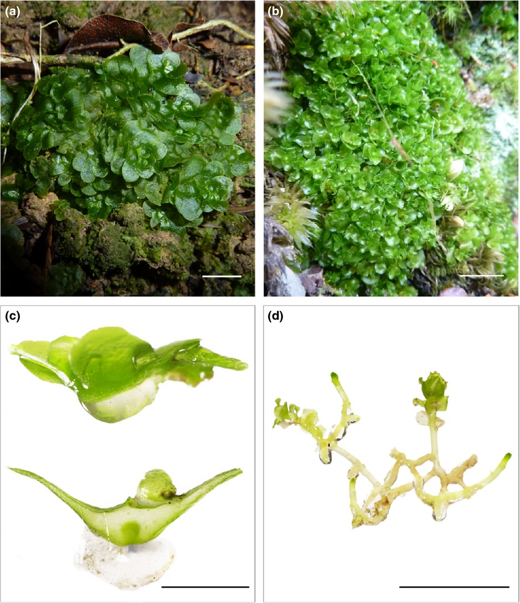

<!-- ## Early lineage plant experiments with fungi: byrophytes -->
<!-- 
 -->
<!-- **Humphreys et al. 2010** -->

<!-- 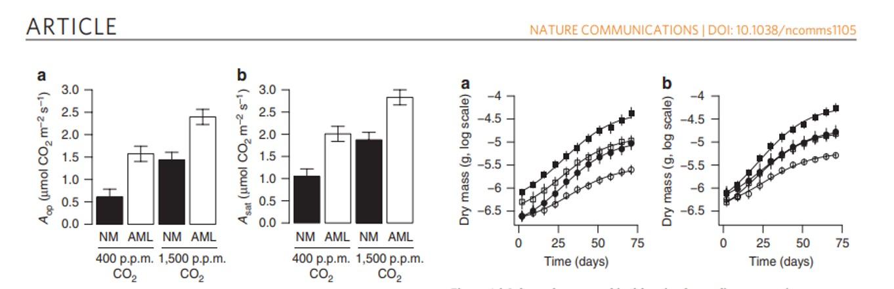 -->

## Timing matters: Fossil forests and fungi

 

* **Vascular plants evolved secondary growth (wood), with lots of lignin**
    + lignin is hard to break down

 

* **~100 million years of trees sinking into swamps and not decaying**
    + carboniferous period = coal deposits

 

* **Specialized phyla of fungi evolved as wood decay specialist**
    + ~295 mya (aka 'white rot' fungus)
    + lignin and cellulose

 

* **What would the world look like today, without these evolutionary steps?**

 

 
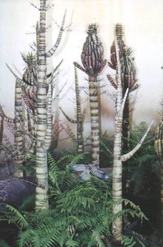

## The current state of agriculture: Role of fungi

 

* **Dramatic &uarr; in crop productivity last century**
    + development of pesticides, fertilizers
    + plant breeding and genetic technologies

 

* **Now, crop yields have plateaued & fertilizer production unsustainable**
    + climate change
    + over population
    + nutrient depletion
    + energy prices

 

* **High levels of fertilizer reduces fungal-root association**

 

* **Big challenges to global food security**

 

 
 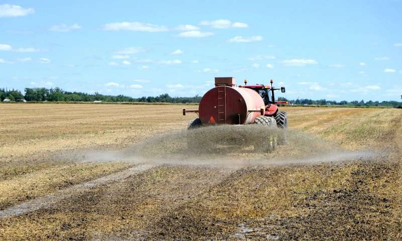
 
<!-- ##  -->

<!-- 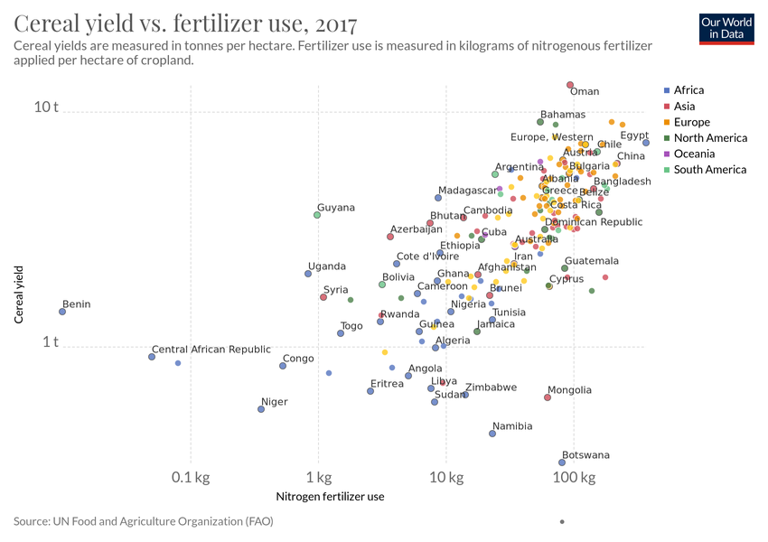 -->

## Role of mycorrhizae in agrosystems: Nutrients

 

* **Crop species are breed to be hyper-productive**
    + fast growing with high yields

 

* **Roots will rapidly deplete soil nutrients**
    + creates depletion zones around root

 

* **Mycorrhizae extend the reach of roots**
    + widening the depletion zone

 

* **Mycorrhizae access nutrients in forms plants cannot**
    + phosphorus from DNA or bound to minerals

 

 
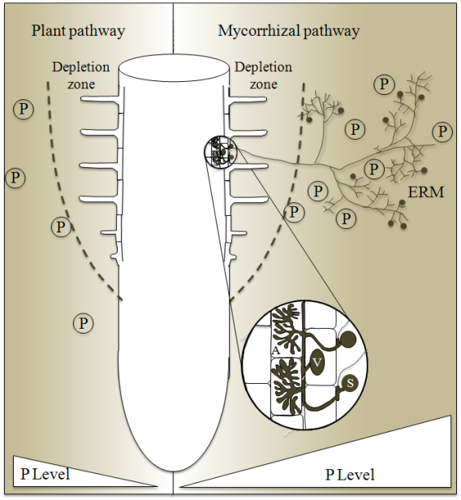
    
<!-- ## Role of fungi in agrosystems: Stress, Disease -->
<!-- 
 -->
<!--   -->

<!-- 
 -->

<!-- * **Pesticides hinder plant's natural immune response** -->
<!--     + fungicides are toxic to mycorrhizal fungi -->

<!--   -->

<!-- * **Fungi colonizing roots physically exclude and protect from pathogens** -->
<!--     + fungi release antibiotic substances -->

<!--   -->

<!-- * **Communication through fungi allows neighboring plants to know of pest attacks** -->

<!--   -->

<!-- * **Mycorrhizal inoculation enhanced enzyme response to tomato blight infection** -->
<!--     + Song et al. 2015 -->

<!-- 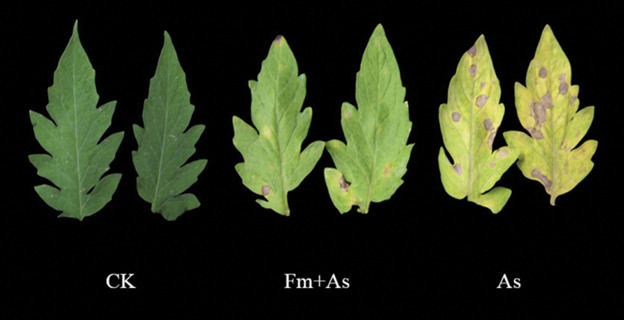 -->

<!-- 
 -->

## Sustainable agriculure with mycorrhizae

 

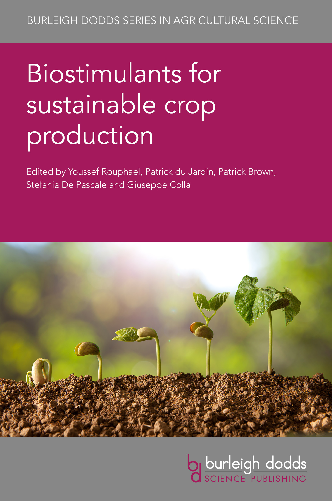

* **Plant herbivory signals through fungal network between plants**
    + neighbors can turn on chemical defenses
    + fungi help induce these chemical defenses (VOC's)

 

* **Nutrients benefits of symbiosis mean more flowers & nectar**
    + increases pollination

 

* **Fungal hypae release polysaccrides that bind soil particles**
    + holds more water
    + stores more carbon
    + reduces  erosion & leaching
    + improves microbial biodiversity
    
<!-- ## Should we also innoculate crops? -->
<!-- 
 -->
<!--   -->

<!-- 
 -->

<!-- * **Commercial fertilizers (NPK) are water-soluble** -->
<!--     + short term availability -->
<!--     + requires heavy fertilizer application -->

<!--   -->

<!-- * **Natural abundances of soil nutrients exist, just not readily/easily accessible to plants** -->

<!--   -->

<!-- * **Tilling soil reduces natural mycorrhizal associations** -->

<!--   -->

<!-- * **Commercial inoculates add fungal spores, which are activated by root exudates** -->

<!--  
 -->

<!-- 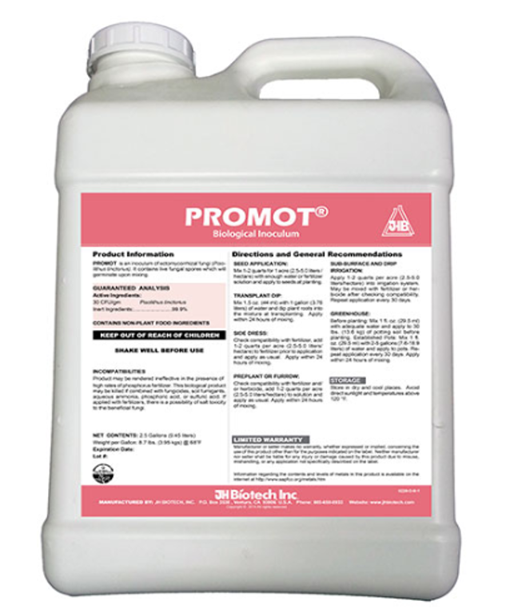 -->

## Are fungi always a good thing?

 

* **Fungal pathogens exist (non-mycorrhizal)**

 

* **Not all crops have fungal symbioses**
    + broccoli, mustard,  spinach, beets
    + does this create competition?

     

* **Dependency on mycorrhizae varies greatly**
    +  wheat and corn varieties

 

* **How far does 'sharing is caring' go?**
    + can the relationship become parasitic?

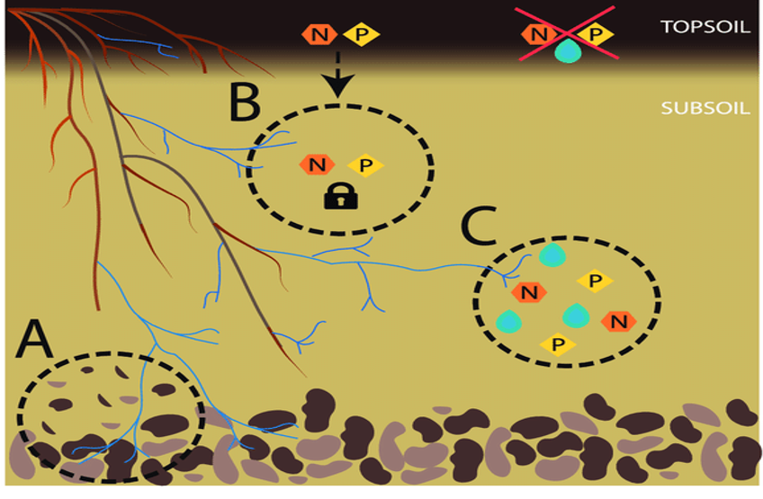

