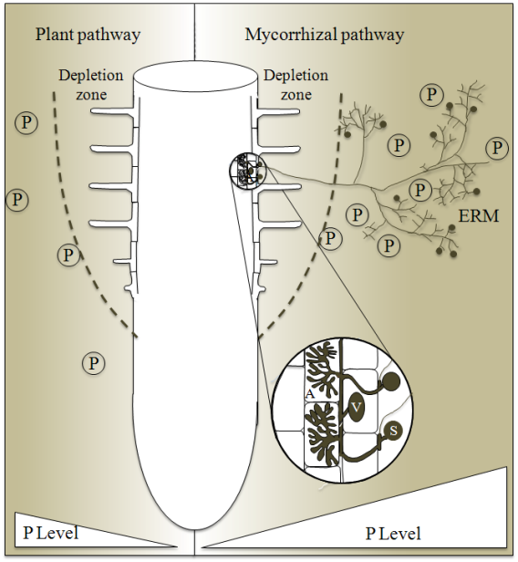

## The big picture: Fungi play a role in plant function

* **100,000 species described**
    + estimated 1.5 millions species
    + diverse size, morphology and habitats

 

* **Heterotrophic: eat via absorption**
    + parasites, decomposers, mutualists
    + cycle nutrients via decomposition

 

* **Cell walls made of chitin**
    + mushrooms are only a part of the body
    + filaments belowground absorb things

 

* **Wild reproduction**
    

## All Fungi share traits related to nutrition

 
 
 

* **Use enzymes to break down compounds**
    + diverse enzymes for diverse food sources
    
 
 
 

* **Heterotrophs: absorb nutrients from environment**
    + decomposers: break down dead things
    + parasites: absorb from host
    + mutualist: absorb/share with host
    

## Fungal body plan: Not-motile

## Most *hyphae* divided into cells by *septa*

## Mycelium: huge surface and volume for absorption

## Specialized hypae in many types of fungi

 

* **Specialized hyphae for feeding on live animals**
    + hoops
 
   

* **Specialized hyphae that allow them to extract nutrients from plants**

## Mycorrhizal fungi: sharing with plants

 
 

* **~80-90% of plants have association with fungus**
    + fungi grown in/around plant roots
    + share resources
    + one of the most widespread mutualisms

 

* **2 main types:**
    + Ecto- and Endo- mycorrhizae
    + diverse array of species for each

 

* **Association now key for plants to thrive**
    + fungi more efficient @ nutrient uptake
    

## 
 
 
 

* **Branching hyphae used to exchange nutrients with plant hosts**

 

* **Ectomycorrhizal fungi sheath cell walls**
    + *Hartig net* surrounds epidermal cells

 

* **Endomycorrhizal fungi invade cell walls**
    + *Arbuscules*: highly branched hypae inside cells
    + often called 'arbuscular' mycorrhizae

## 

## Nutrient Exchange: Sharing is caring

 
 
 

* **Inorganic nutrients imported to plant**
    + N, P and amino acids
    
 

* **Carbon imported to fungus**
    + sugars from photosynthesis

 

* **Possibly active & passive transport**

## Soil Life: Plant Roots, Fungi & *Microbes*

 

* **Free-living microbial communities in soils breakdown organic matter**
    + plants cannot uptake organic compounds
    + fungi lost breakdown enzymes via evolution

 

* **Microbial communities are carbon limited**
    + plants exude carbon (simple sugars) from root tips
    + exudates increases microbial activity

 

* **Fungi are great at uptake and transport**
    + decomposers of *some* things
    + carbon limited
 
 

 

## Timing matters: Land plant evolution & fungi

 

* **Fungal phyla associated with mycorrhizae diverged prior to the divergence of land plants**
    + Oldest fungal fossils appear ~900 mya
    + First terrestrial fungus ~ 460 mya
    
 

* **What was the land like for first plants?**
* **What were early plants like?**

 

* **Plant land colonization likely facilitated by interactions with symbiotic fungi**
    + fossil evidence shows similarity in timing
    + needs of both groups still relevant

 

 

## Early lineage plant experiments with fungi: byrophytes

**Humphreys et al. 2010**

## Timing matters: Fossil forests and fungi

 

* **Vascular plants evolved secondary growth (wood), with lots of lignin**
    + lignin is hard to break down

 

* **~100 million years of trees sinking into swamps and not decaying**
    + carboniferous period = coal deposits

 

* **Specialized phyla of fungi evolved as wood decay specialist**
    + ~295 mya (aka 'white rot' fungus)
    + lignin and cellulose

 

* **What would the world look like today, without these evolutionary steps?**

 

 

## The current state of agriculture: Role of fungi

 

* **Dramatic &uarr; in crop productivity last century**
    + development of pesticides, fertilizers
    + plant breeding and genetic technologies

 

* **Now, crop yields have plateaued & fertilizer production unsustainable**
    + climate change
    + over population
    + nutrient depletion
    + energy prices

 

* **High levels of fertilizer reduces fungal-root association**

 

* **Big challenges to global food security**

 

 
 
 
## 
 

## Role of mycorrhizae in agrosystems: Nutrients

 

* **Crop species are breed to be hyper-productive**
    + fast growing with high yields

 

* **Roots will rapidly deplete soil nutrients**
    + creates depletion zones around root

 

* **Mycorrhizae extend the reach of roots**
    + widening the depletion zone

 

* **Mycorrhizae access nutrients in forms plants cannot**
    + phosphorus from DNA or bound to minerals

 

 

    
## Role of fungi in agrosystems: Stress, Disease

 

* **Pesticides hinder plant's natural immune response**
    + fungicides are toxic to mycorrhizal fungi
    
 

* **Fungi colonizing roots physically exclude and protect from pathogens**
    + fungi release antibiotic substances

 

* **Communication through fungi allows neighboring plants to know of pest attacks**

 

* **Mycorrhizal inoculation enhanced enzyme response to tomato blight infection**
    + Song et al. 2015

## Sustainable agriculure with mycorrhizae

 

* **Plant herbivory signals through fungal network between plants**
    + neighbors can turn on chemical defenses
    + fungi help induce these chemical defenses (VOC's)

 

* **Nutrients benefits of symbiosis mean more flowers & nectar**
    + increases pollination

 

* **Fungal hypae release polysaccrides that bind soil particles**
    + holds more water
    + stores more carbon
    + reduces  erosion & leaching
    + improves microbial biodiversity
    
## Should we also innoculate crops?

 

* **Commercial fertilizers (NPK) are water-soluble**
    + short term availability
    + requires heavy fertilizer application

 

* **Natural abundances of soil nutrients exist, just not readily/easily accessible to plants**

 

* **Tilling soil reduces natural mycorrhizal associations**

 

* **Commercial inoculates add fungal spores, which are activated by root exudates**

 

 

    
## Are fungi always a good thing?

 

* **Fungal pathogens exist (non-mycorrhizal)**

 

* **Not all crops have fungal symbioses**
    + broccoli, mustard,  spinach, beets
    + does this create competition?

     

* **Dependency on mycorrhizae varies greatly**
    +  wheat and corn varieties

 

* **How far does 'sharing is caring' go?**
    + can the relationship become parasitic?

