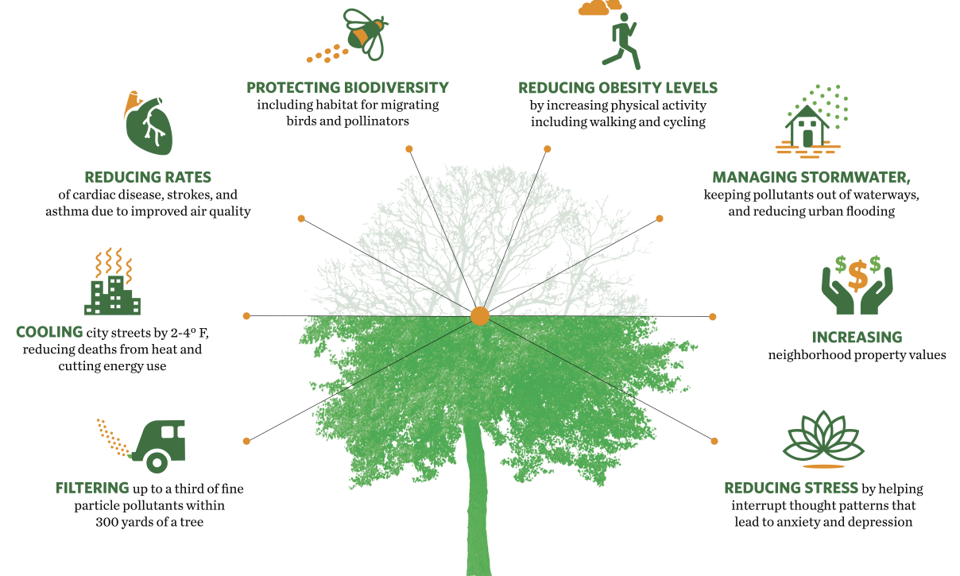
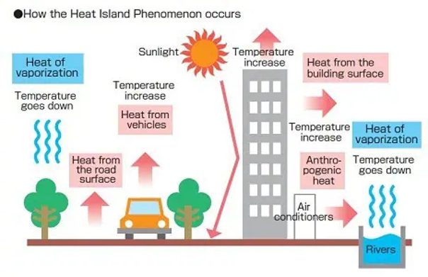
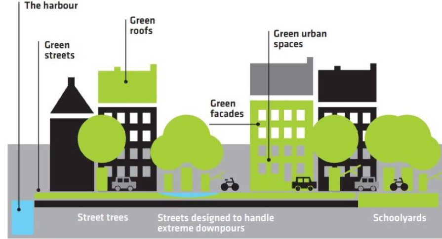
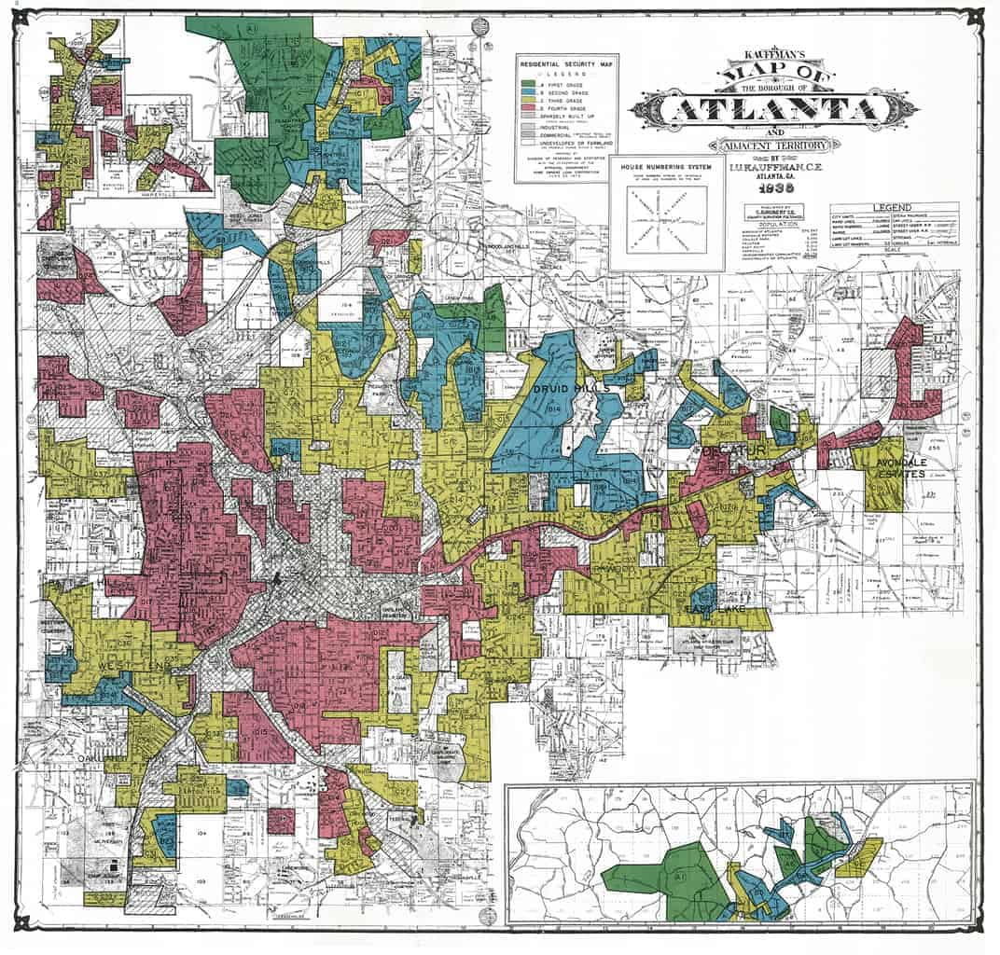
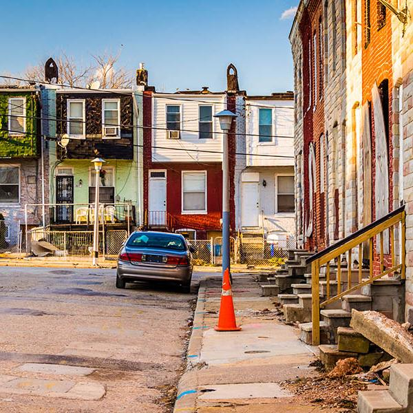
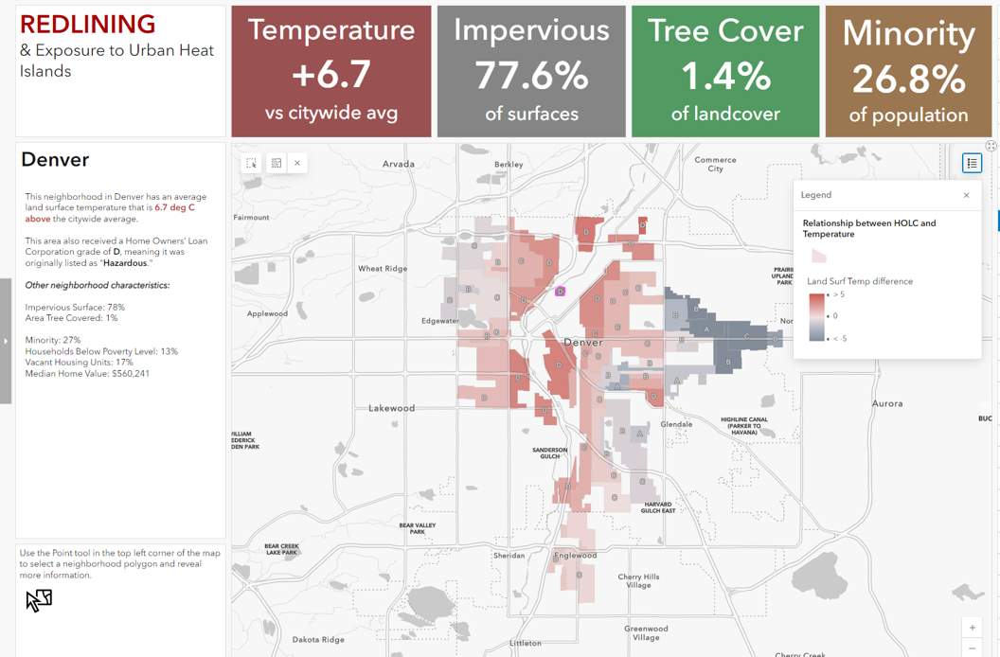
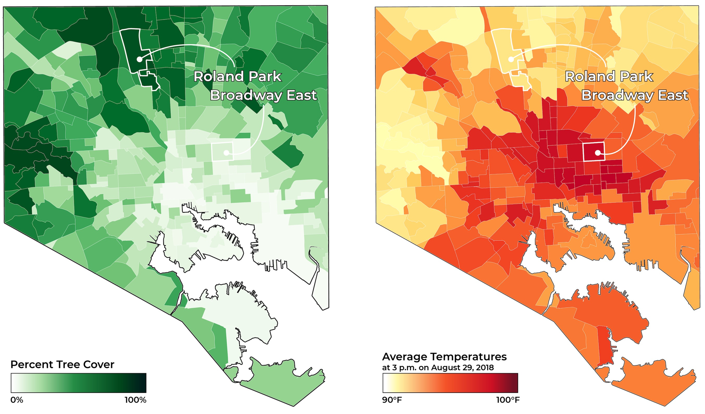

## The Vital Role of Urban Vegetation

## Why Green Space Matters: Urban Heat Island

**Urban areas are hotter than surrounding rural areas due to concrete, asphalt, and buildings absorbing and re-radiating heat**

 

**Lack of vegetation and tree canopy reduces shade and evapotranspiration, intensifying heat**

 
 

* **Surface temperatures in UHI zones can be 10°F (5.5°C) or more above nearby green areas**

 

* **UHI effects are most severe in neighborhoods with fewer trees**
    + Heat-related deaths, respiratory illnesses, and mental stress linked to lack of vegetation
    

## Who Gets the Green?

* **Green space access is unequal across urban areas**
    + less vegetation = more heat, more illness, less well-being
    + green space is linked to property values and public investment

 
 

* **Climate resilience efforts must prioritize vulnerable communities**
    
 

* **Tree equity is a tangible frontline infrastructure**
    + formerly redlined neighborhoods often have fewer trees
    + structural racism manifests in ecological form
    + community involvement is key to equitable greening
    

## What is Redlining?

* **Originated in the 1930s through the Home Owners' Loan Corporation (HOLC)**
    + Green (Grade A): “Best” – Wealthy, white, new suburbs
    + Blue (Grade B): “Still Desirable” – Middle-class, mostly white
    + Yellow (Grade C): “Declining” – Working-class, more racial/ethnic diversity
    + Red (Grade D): “Hazardous” – High Black/immigrant populations

 

* **Areas in red and labeled “hazardous” for investment**
    + lone requests were denied, investment into communities (e.g., parks) was negligible

 

* **Redlining led to decades of disinvestment in housing, infrastructure, schools, and green space.**

 

* **Maps created shaped urban development and environmental inequality across the U.S.**

## Legacies of Redlining in the Urban Environment

 

* **Redlined neighborhoods have significantly fewer parks and trees**

 

* **Higher exposure to urban heat island effect, flooding, and pollution**
    + lower air quality and access to nature negatively impact physical and mental health
    + increased heat-related illness and death

 

* **Lack of vegetation loss affects aesthetics and urban ecosystem functions (e.g., shade, carbon uptake, stormwater filtration, wildlife)**

## 

<!-- ## Its time for: Story Quest -->
<!-- 
 -->

<!--  -->

