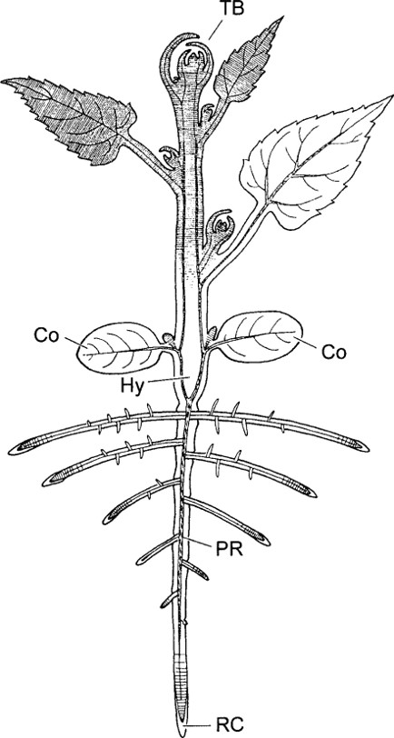

```{r setup, include=FALSE}
knitr::opts_chunk$set(echo = FALSE)
```

##  What is a Plant? A Traditional View
<hr>
<br/>

<div style="float: left; width: 50%;">

* **Plants are characterized by their characters & character states**
    + green
    + non-motile
    + eukaryotic & multi-cellular
    + walls of cellulose
    + alternation of generations

<br/>

* **Diversity: There are many kinds of plants and hundreds of thousands of species**
    + But the basic lineages of plants are farily easy
    + new characters define the evolution of these lineages

</div>


    
## Taxonomy
<hr>
<br/>

* **Classification is putting objects into groups**  
    + requires naming, describing, and identifying species
    +  "science of documenting biodiversity" (Keogh, 1995)

<br/>

* **Linnaeus founded binomial system and classification hierarchy**  
    + King Phillip Came Over From Germany Stones
    + each level or unit is called a taxon w/ standardized endings

<br/>

* **Kingdom is most inclusive group, species is least inclusive** 
    + in your generation these hierarchy may become obsolute via molecular markers

## Taxonomy has predictive value...
<hr>
<br/>

* **Question:  If two plants are related (i.e., in the same genus) and one of the plants is a source of food or drug, what can we assume about the second plant?**

<br/>

* **Case Study: Pacific yew (*Taxus brevifolia*)**
    + Taxol: alkaloid first isolated from the bark and used to treat breast cancer. 
    + FDA approval in 1994 but the bark of 3 trees is needed for 1 patient. 
    + 16,000 pounds of bark is used to produce 2.2 pounds of taxol. 

<br/>

* **Search for taxol was successul in other members of the genus**
    + has made drug more available


## Nomenclature
<hr>
<br/>

<div style="float: left; width: 50%;">

**"Must a name mean something?
"Of course it must," Humpty Dumpty said with a short laugh.
"My name means the shape I am - and a good handsome shape it is, too. With a name like yours, you might be any shape, almost."

Through the Looking Glass - Lewis Carroll

</div>

<div style="float: right; width: 50%;">

"tis but thy name this is my enemy;
Thou art thyself, though not a Montague.
What's a Montague? it is nor hand, nor foot,
Nor arm, nor face, nor any other part
Belonging to a man. O! be some other name:
What's in a name? that which we call a rose
By any other name would smell as sweet;
So Romeo would, were he not Romeo call'd.

William Shakespeare

</div>

## Common names vs Scienitific nomenclature
<hr>
<br/>

* **Common names have the following advantages:**
    + often descriptive (i.e., describe some  important feature)
    + easy to pronounce & remember (more familiar to people)
    + more pleasing to ear & some are fun
    
<br/>

* **Why bother with scientific names?**
    + not governed by rules, so little consistency
    + applied indiscriminately to various taxonomic levels (i.e. 'Oak')
    + some plants have more than one common name.
    + may not exists for rare species
    + may reflect language barriers
    + may be botanically incorrect (e.g. Jerusalem artichoke)
    


## Common names vs Scienitific nomenclature
<hr>
<br/>

<div style="float: left; width: 50%;">

* **The rule book for botanical nomenclature is the International Code of Botanical Nomenclature (ICBN)**
    + every plant gets 1 binomial name
    + Binomials are combos of genus name specific epithet (e.g. *Quercus rubra*)

<br/>

* **Genus names are nouns that may commemorate a place, person, person, habitat, culture**
* **Epithets are adjectives that can also be commemorative (except for you!)**

<br/>
    
* **Taxonomic ranks have standardized endings**

</div>


## Identifying a species usually requires a dichotmous key
<hr>
<br/>


<div style="float: right; width: 50%;">

* **Keys consists of paired questions ('couplets')**
    + resembles a choose your own adventure book!
    + choose the statement that fits your specimin, guiding you forward

<br/>

* **We will need to bypass this process in this class**
    + we will utilize online tools that cut out the work
    + phone apps and interactive keys
    
<br/>
    
* **I still want you to learn the major diagnostic characters!!**

</div>

## Iowa State interactive Tree key
<hr>
<br/>

https://naturalresources.extension.iastate.edu/forestry/iowa_trees/key/key.html

## Web Resources and Plant ID apps
<hr>
<br/>

https://dendro.cnre.vt.edu/dendrology/factsheets.cfm

<br/>

https://gobotany.nativeplanttrust.org/simple/

<br/>

http://www.southeasternflora.com/

<br/>

https://dendro.cnre.vt.edu/dendrology/leafkey.htm

<br/>

https://www.inaturalist.org/pages/seek_app

<br/>

https://www.inaturalist.org/

## We must learn vegetative terminology!!
<hr>
<br/>

* **The amount of terminology used in Plant Taxonomy may, at times, seem overwhelming**

<br/>

* **A feature of a plant is called a *character* and the specific form of the character is  a *state*.**

<br/>

* **First, we focus on vegetative (non-reproductive) parts**
    + includes the 3 primary organs - leaf, root, stem
    + you will need many states to ID a plant!
    


## Life span/Duration: 
<hr>
<br/>

<div style="float: left; width: 50%;"

* **annual: completes life cycle in a single year**
* **biennial: completes life cycle in two years**
* **perennial: lives more than two seasons**

<br/>

* **evergreen: keeps its leaves year-round**
* **deciduous: looses its leaves at the end of the growing season**

<br/>

* **It is difficult to determine if a herbaceous plant is an annual, perennial or biennial**
    + annuals have small slender taproots, while biennials/perennials are larger. 
    + biennials and perennials often have storage structures (bulbs)
    + plants with woody stems are perennials

</div>


## Plant vegetative organs (only 3! plants are easy!)
<hr>
<br/>


<div style="float: right; width: 50%;"

* **Root:  anchor and absorbs, underground, develop from radicle in seed**

<br/>

* **Leaf:  photosynthetic organ, attached to stem, has a bud at its base**

<br/>

* **Stem - leaf-bearing organ, with buds**

<br/>

* **Some plants lack one or more of these structures**
    + aquatic plants often lack roots and cacti lack leaves.

</div>

## Leaf parts
<hr>
<br/>

* **Blade - main photosynthetic part**

<br/>


* **Petiole - a fancy term for the stalk**

<br/>

* **Stipules - appendage at base of petiole in some leaves**
    + Stipules can be glandular, leafy, spiny, or scale-like
    + Often,  stipules fall off  after the leaf expands
    


##  Leaf structure
<hr>
<br/>

* **simple - leaf blade all one section**

<br/>

* **compound - leaf blade divided into smaller sections called leaflets**
    + leaflet - section of a compound leaf
<br/>

* **rachis - stalk that supports leaflets in a compound leaf; central axis**
    + rachilla - stalk that supports lateral leaflets

<br/>

* **pinnately compound - like a feather**

<br/>

* **palmately compound - like the fingers on your hand**


## Leaf Arrangement
<hr>
<br/>  
    
* **Leaves may be found at  base(e.g. dandelion), along the stem, or both**  

<br/>

* **Leaves are attached at nodes:**
1. alternate - one leaf per node
2. opposite - two leaves per node
3. whorled - more than two leaves per node; not common in temperate woody plants


## Trees with opposite leaves = MADCAP HORSE
<hr>
<br/>  

* **M=maple; A=ash; D=dogwood** 

<br/>  

* **CAP=Caprifoliaceae or Honeysuckle family**

<br/>  

* **Horse = Horsechestnut and buckeye**


## Leaf Venation
<hr>
<br/>

* **pinnate: single main vein with secondary veins branching from it like a feather**

<br/>

* **palmate: several primary veins arising from a common point**

<br/>

* **parallel:  primary and secondary veins parallel to one another**


## Leaf margin
<hr>
<br/>

* **entire: margin smooth**

<br/>

* **lobed: margin with indentations**

<br/>

* **serrate: margin toothed**
    + Singly or doubly (each tooth has a tooth) toothed


## Surface features
<hr>
<br/>


<div style="float: right; width: 50%;"

* **glabrous - no hairs, smooth surface**

<br/>

* **pubescent - hairy; due to trichomes**

<br/>

* **glaucous - powdery covering**

<br/>

* **scabrous - rough to the touch like sandpaper**

</div>

## Leaf shape: There are sooooo many
<hr>
<br/>


## Quiz: Diagnose the characters of these leaves
<hr>
<br/>


## Stem features
<hr>
<br/>

* **node:  region to which a leaf is attached**
    + internode - region between nodes
    + axil - junction of leaf and stem

<br/>

* **bud - embryonic shoot and/or flowers**
    + found in the leaf axil; at the base of leaf
    + axillary/lateral:  buds along stem
    + terminal: buds at the end of the stem
    + scales:  protective covering over bud

<br/>

* **terminal bud scale scar: left on stem where the terminal bud scales fell off**
    + count to determine age of twig)

<br/>

* **leaf scar: left on stem where leaf detached**


## Know your bark!
<hr>
<br/>


## Get collecting!!
<hr>
<br/>

* **20 pressed specimens**
    + plant presses must stay in SS 303
    
<br/>

* **30 digital collections**
    + use.....
    
<br/>

* **30 field guide drawings in your sketchbook**
    + sketch each leaf and other characters
    + list the diagnostic characters
    + 2-3 ecological/cultural facts