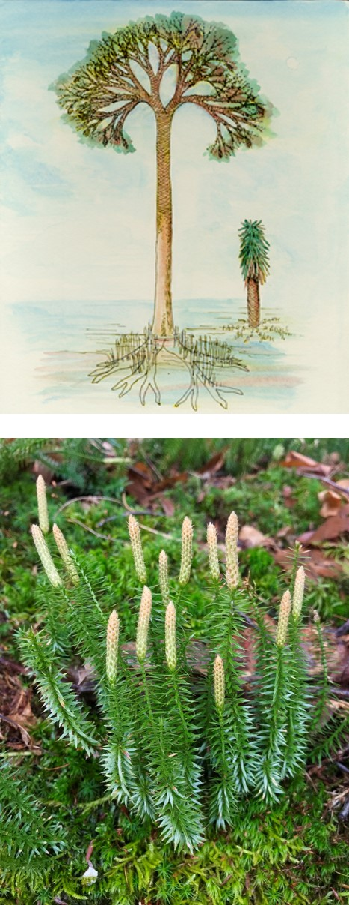
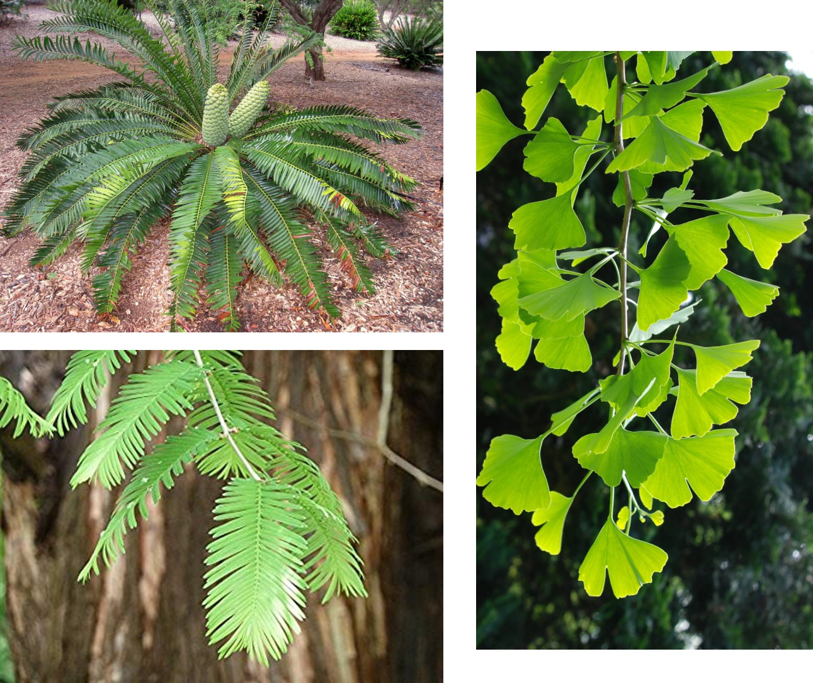

## The big picture: Vascular plants now dominate Earth

 
 

* **Bryophytes ruled for <100 million years**
    + vascular plants show up ~425mya

 

* **First vascular plants lacked seeds**
    + sperm still needed to swim 
    + ferns and lycophytes

 

* **Developed a vascular system**
    + grow taller than bryophytes
    + leaves & roots
    

## The big picture: We now live in a seed plant world

 

* **Seeds changed the course of plant evolution**
    + Seed plants show up ~360 mya
    + climate became drier
    
 

* **Seeds consists of embryo & nutrients**
    + surrounded by protective coat
    + seeds can be dispersed long distances
    + less dependence on water

 

* **2 living seed lineages**
    + gymnosperms (naked seed)
    + angiosperms (covered seed = fruits)
    

## Vascular system: the basics

 
 

* **Vascular tissue allows establishment without freestanding water**	
    + xylem, phleom
    + evolved independently several times

 

* **Conducting cells evolved structural support**
    + *lignin* in cell walls
    + does not rot easily
    + does not collapse easily
    + think bundles of rigid straws or pipes
    
 

* **First 2 groups are spore-bearing plants, then came seed plants**	

## Evolution of roots

 

* **Vascular tissues belowground**
    + bryophytes have no 'true' roots

 

* **Absorb water and nutrients**
    + explore

 

* **Anchor the plant in place**
    + support vertical growth

 

* **Fossils show roots in lycophytes ~400mya**
    + possible convergent evolution

## Evolution of leaves

 
 
 

* **Microphylls: single unbranched vein**
    + unique to lycophytes

 

* **Megaphylls: leaves with branched veins**
    + almost all existing plants
  
 

* **Why does this matter?** 

## Evolution of leaves: sporophylls

 

* **Sporophyll: modified leaf with sporangium**
    + vastly different looks
    + seed plants have male/female versions

 

* **Sporagnium:  spore container**
    + ferns: clusters of sporagnia called 'sori'
    + lycophytes: stobilus holds many sporogania (like a cone)

 

* **Spore mother cell: cell inside sporagnium**
    + undergoes meiosis to make spores

 

* **What is the ploidy of each cell type?**

## Lycophytes: First vascular plants

 
 

* **Independent,	branched	sporophyte**
    + sporophyte dominant
    
 

* **Lignified	vascular	tissue,	tracheids & roots**

 

* **Leaves are microphylls**
    + Some	with	strobili	(evolved	multiple times)

 

* **Homosporous or Heterosporous**
    

## Ferns

 
 

* **Whisk Ferns, Equisetum & Ferns**
    + mostly homosporous
    + sporophyte dominant (**Why?**)
    
 

* **Leaves are megaphylls**
    + whisk ferns lost leaf
    + Equistem has simplified megaphylls

  

* **Independent gametophyte**
    + heart-shaped, small

## Homosphorous life cycle (mostly) with dominant sporophytes

## The consequences of homospory

 
 

* **One	spore	&rarr; one	gametophyte	&rarr; bisexual gametophyte**
    + everything is haploid (1N)

 

* **Produces	both	sperm	and	egg	via mitosis**

 

* **A lot of self fertilization**
    + What is good/bad about this?

 

* **Antheridiogens used to manipulate sex**
    + girl power rocks!
    

## Seed plants were the next evolutionary step

## Why seeds matter so much...

 

* **Before seeds, spore was only protective structure** 
    + super small so spread all over Earth

 

* **Seeds are multi-cellular**
    + what does this add?

 

* **Seeds can remain dormant for a long time**

 

* **Gymnosperms: seeds exposed on sporophylls, form cones**
* **Angiosperms: seeds enclosed inside fruits**

## Seed plants further adapt to life on land

* **Reduction of gametophyte**
    + mosses &rarr; ferns &rarr; seed plants
    + gametophytes become microscopic

 

* **Heterosporous life cycle**
    + *2 kinds of spores*
    + form male/female gametopytes

 

* **Ovules**
    + megasporangium kept inside sporophyte
    + ovule contains megaspore
    
 

* **Pollen**
    + microspore develops into pollen grain

## 

##

## Gymnosperms take over in Carboniferous period

 

* **~300-250 mya climate become drier**
    + Carboniferous &rarr; Permian
    + gymnosperms replaced lycophytes
    + seed plant ancestors now extinct

 

* **Gymnosperms w/ needles thrived till ~60 mya**

 

* **4 living lineages of gymnosperms: **
    + *Cycads**: 300 living species
    + *Gnteophytes*: small group w/ flowering traits
    + *Ginkos*: *Ginkgo biloba* is only species left!
    + *Conifers*: ~600 species w/ needle/scale leaves

## Gymnosperm reproduction: basics

 
 

* **Male and female cones on same plant**
    + sporophyll &rarr; sporangia &rarr; spores
    + scales &rarr; modified leaves &rarr; sporophyll
    + pollen and ovulate cones

 

* **Male cones house microsporangium**
    + microsporangium produces microspores
    + microspores develop into pollen grains
    + male gametophyte inside pollen grain
    + pollen dispersed by wind

## Gymnosperm reproduction: basics

 

* **Female cones have 2 ovules per scale**
    + each ovule has megasproangium
    + megasporangium produce 4 megaspores
    + 1 megaspore survives

 

* **Pollen grain reaches ovule and germinates**
    + pollen tube grows toward megaspore
    + megaspore develops gametophyte with egg
    + sperm &rarr; pollen tube &rarr; egg
    + seed forms, dispersed by wind
    
 

* **Draw the basics on a heterospory life cycle**

<!-- ## Gymnosperms seeds -->
<!-- 
 -->

<!--  -->

## Flowering plant diversity

* **Most diverse living group of plants**
    + 14,000 genera, 250,000 species
    + newest group (~100 mya)

* **2 classes: Moncots and Dicots**
    + monocots = one seed leaf in embryo
    + dicots = two seed leaf in embryo

<!-- ## Angiosperm evolution: Bugs and animals -->
<!-- 
 -->

<!--  -->

<!--  -->

## Angiosperm reproduction: Flowers

 

* **Flower is a modified stem for reproduction**
    + with 4 types of modified leaves

 

* **Sepals: leaves at base which enclose flower**
    + usually green

 

* **Petals: colored leaves to attract pollinators**
    + less colored if wind pollinated
    
 

* **Two types of fertile organs to make spores**
    + sporophylls
    

## Angiosperm and insect evolution tied together

 

