## Without plants, most life would not exist!

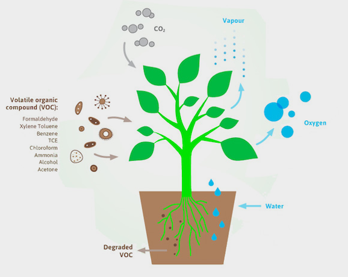

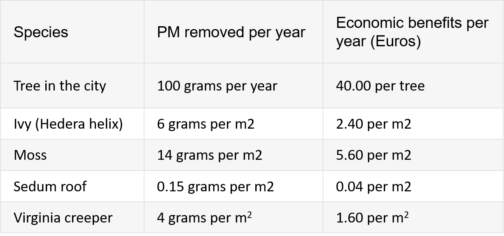

## Photosynthesis has provided O~2~ for billions of years

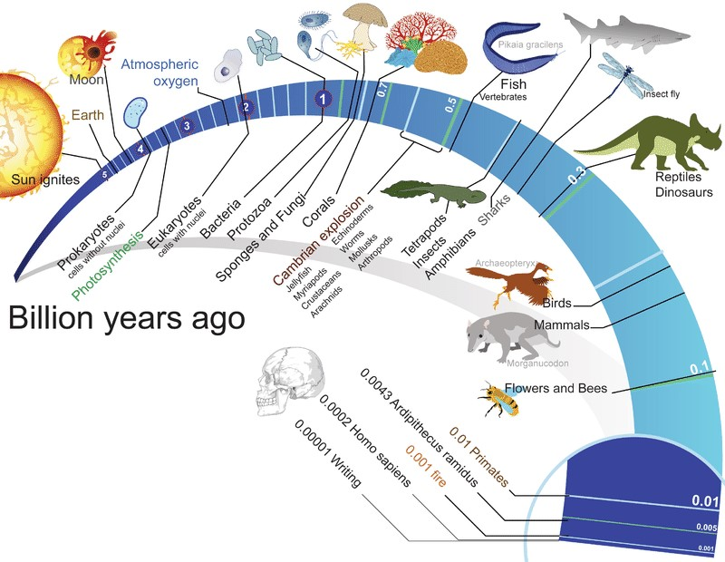

## Photosynthesis has provided O~2~ for billions of years

 
 
 

* **&uarr; [O~2~]  provided a new metabolic opportunity for biological diversification**

 

* **&uarr; [O~2~] promotes changes in chemical interactions between rocks, sand, clay, air, oceans, etc.**

 

* **Allows plants to be the base of every food chain**
    + starch storage in plants is major human food source

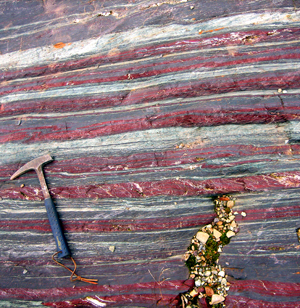

## Almost every living thing interacts with plants in some way

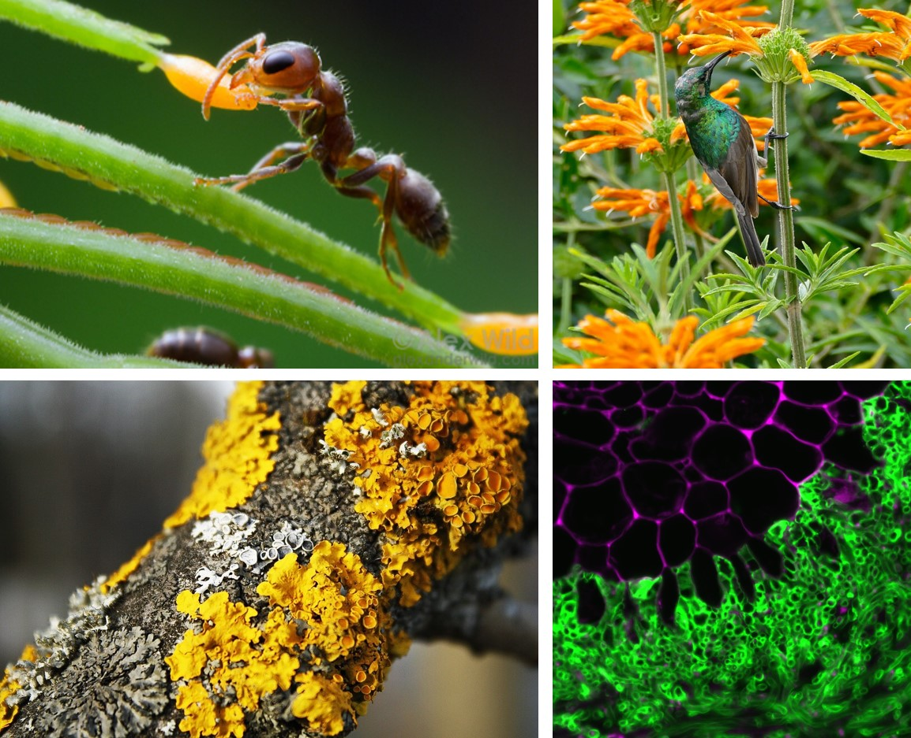

## Plants conditioned the land for animals

 
 

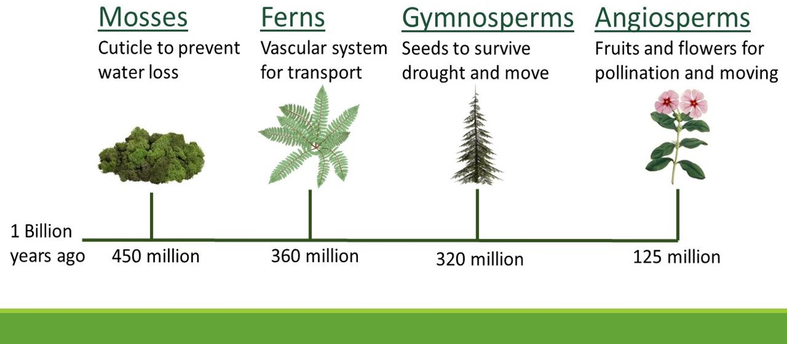

* **400 MYA: oldest know insects**

 

* **397 MYA: tetrapods evolve in shallow water**

 

* **340 MYA: amphibians evolve**

 

* **310 MYA: reptiles evolve**

 

* **Also... many mass extinctions**

## Plants are responsible for the products *WE* rely on

 
 

* **Vegetable and animal matter via agriculture and pasture lands allows us to live**

 

* **Textiles, lumber and medicine provide us quality of life**

 

* **Spices, perfumes, dyes,  food stabilizers, emulsifiers, Starbucks, etc. allow us to live our best life**

 

* **Just based on this, can you imagine a life without plants??**
    + this semester we will try to live that life, for one day
    

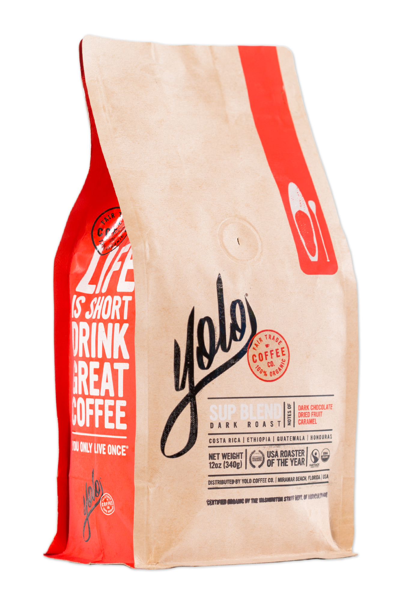

## Plants may be responsible for the *future* products we rely on

 

**Photosynthetic organisms (plants, algae, marine phytoplankton) may be the future of energy and/or solutions to global change**
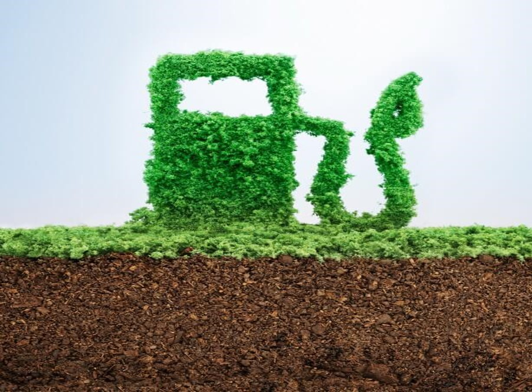

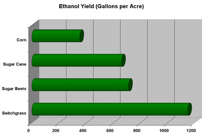

## In a time of uncertainty, plants still provide jobs

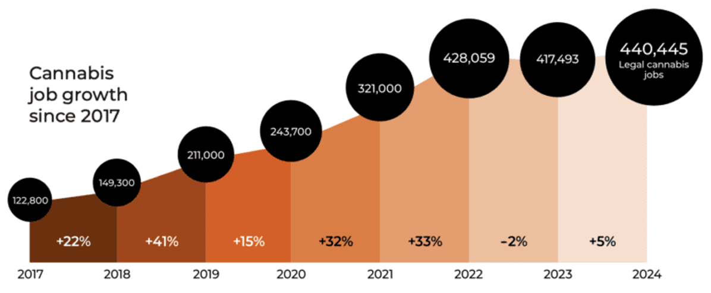

## Angiosperms are most important for humans

 
 
 

* **Flowering plants are most diverse and abundant group**
    + ~350,000 species
    + relatively new in terms of evolution
    
 

* **Most plant products utilized by society are angiosperms**
    + nearly all food staples
    
 

* **Irish potato famine nearly destroyed a society that was dependent on a single species of flowering plant**

## This semester, we will.....

 

* **Learn to identify plants in the wild**
    + and create plant collections
    + learn the value of plants in the wild

 

* **Understand how plants function**
    + identify how these processes affect humans

 

* **Explore the past, present and future of agriculture**

 

* **Dig into the various ways plants define our culture**

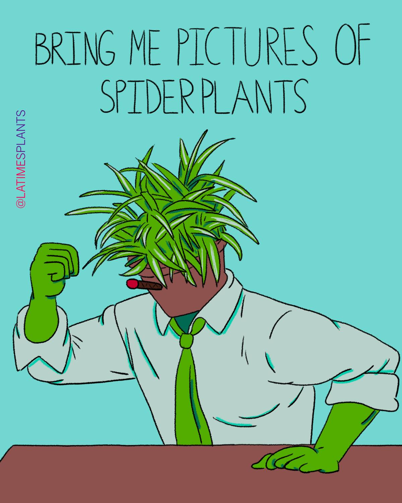

## Today....Why do people think plants are boring???

 
 
 
 

**Are plants considered boring because of how they are shown/portrayed to us in media, storytelling, education, etc.?**

 

**Or is it simply because they don't move?**

 

**How do we ignore...BREAD, BEER, WINE, OXYGEN so easily?**

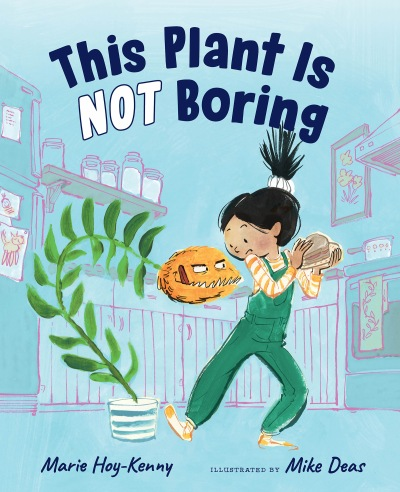