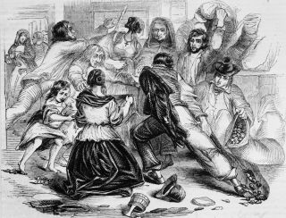

## Why should we care about the study of plants

## Without plants, most life would not exist!

## Photosynthesis has provided O~2~ for billions of years

## Photosynthesis has provided O~2~ for billions of years

 
 
 

* **&uarr; [O~2~]  provided a new metabolic opportunity for biological diversification**

 

* **&uarr; [O~2~] promotes changes in chemical interactions between rocks, sand, clay, air, oceans, etc.**

 

* **Allows plants to be the base of every food chain**
    + starch storage in plants is major human food source

## Almost every living thing interacts with plants in some way

## Plants conditioned the land for animals

 
 

* **400 MYA: oldest know insects**

 

* **397 MYA: tetrapods evolve in shallow water**

 

* **340 MYA: amphibians evolve**

 

* **310 MYA: reptiles evolve**

 

* **Then... many mass extinctions**

## Plants are responsible for the products *WE* rely on

 
 
 
 

* **Vegetable and animal matter via agriculture and pasture lands**

 

* **Textiles, lumber and medicine provide us quality of life**

 

* **Spices, perfumes, dyes,  food stabilizers, emulsifiers, Starbucks, etc. allow us to live our best life**

## Plants may be respsible for the *future* products we rely on

## Plants may be respsible for the *future* products we rely on

## Angiosperms are most important for humans

 
 
 

* **Flowering plants are most diverse and abundant group**
    + ~350,000 species
    + relatively new in terms of evolution
    
 

* **Most plant products utilized by society from angiosperms**
    + nearly all food staples
    
 

* **Irish potato famine nearly destroyed a society that was dependent on a single species of flowering plant**

## This semester, we will.....

 

* **Learn to identify plants in the wild**
    + build real and virtual plant collections
    + learn the value of plants in the wild

 

* **Understand how plants function**
    + identify how these processes affect humans

 

* **Explore the past, present and future of agriculture**

 

* **Dig into the various ways plants define our culture**

* **Start downloading some cool phone Apps**
    + inaturalist
    + seek (by inaturlist)
    + itree

 

* **We will embrace tech, and use them all semester!**

## Journal Club next week

 
 
 
 

* **Read the Bar-On paper as a scientist**
    + unpack the components of biomass on Earth
    + unpack the proportionate impact of humans 

 

* **Evaluate your findings and 'plant blindness'**
    + be prepared to discuss
    
